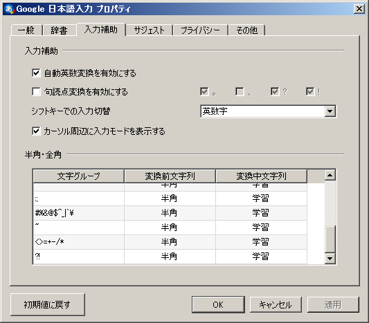

※グダグダ注意報発令中

前回から間が空いてしまいましたが、ちまちま書いていきます。

こんにちはmikuta0407です。Photoshop CCのフルバージョンがiPadに来るというニュースが有りましたね。面白いと思います。iPadにそれほどの性能があるということでもありますし、実際iPadでフルバージョンのPhotoshopが使えたら便利なのでしょう。(ごめんなさいAdobe系のソフトをほとんど使っていないので、そこらへんは詳しくないです)

さて、言いたいことはPhotoshopの話ではなく、OSの話です。あ、なんか専門的な意見でもなく、話の柱がブレまくっていく感じの、グダグダな感じです。<strong>Twitterの延長線上みたいなノリで書いていきます</strong>ので、ねこですよろしくおねがいします。

Photoshopはもともと、WindowsやmacOS(OS X)向けのソフトです。つまり｢パソコン向け｣のソフトですね。

で、今回、パソコンではなく、｢スマホが発展した｣に近い存在であるiPadに、パソコン出身のソフトが来ることになったわけです。

そうすると、以前Microsoft OfficeがiOS/Androidに来るときも言われた、｢パソコンいらなくなるじゃん｣という意見が当然出てきます。

私はこれに反論したい。

が、反論できる確固たる持論がない。

･･････ということで、Photoshopのことはわからないけど、それ以外の面(文字入力)で｢パソコンはいらないよ｣ということはないという反論を考えていこうと思います。シリーズ化するかもしれません。そしたら多分次回は音楽制作かな?なにかな?とりあえずグダグダな展開しか予想できない。

ちなみにスマホのOSの話はおいておきます。それについてはまた後日書こうかなって思ってます。今回はタブレット/パソコンに関するお話です。
<h3>iOS</h3>
iPad ProにSmart Keyboardとかが出てきて、Officeもあって、さらに今回Photoshop。いよいよiPad単体でなんでもできる?とか思うあなた。実際にiPadでOffice使ったりしたことありますか?キーボードつないで文字打ってみたことありますか?

はっきり言ってしまうと、iPadはOfficeや文字打ちなど、そういう作業には絶対向いてません。

まずOffice。これはMicrosoftのせいとも言えなくはないですが、正直あの量の機能があると、マウスが必要です。指でポチポチなんて無理です。さらにはただでさえ上部ツールバーで画面の面積を食われた上に、スクリーンキーボードです。作業エリアがどんどん見えなくなっていきます。これはひどい。実はここまではWindowsタブレットでも同じなんですが、幸いWindowsタブレットは簡単に好きなキーボードや好きなマウスがつけられるので問題ありません。

ところがiPadはキーボードはApple製やメーカーがしっかりとiOS対応を謳っていないキーボードだと、JIS配列のキーボードでもUS配列として認識されるので、物理キーボードを使った作業がまともにできません。これは致命的です。Shift+2で@がでてくるんです。US配列のキーボード買えばいいって?USの記号配列は理解できないのでその話は置いておきましょう。

この時点でだめですほんと。これに悩まされたらもう、｢iPadはキーボードつないで使う機種じゃない｣って思ったほうがいいです。一番使いたいキーボードがiOSフル対応ならいいんですけどね。

あと、キーボードそのものの問題が解決したとしても、予測変換を"タッチして"使うことを前提として作られたIMEなので、画面上に現れている予測変換の文字列を使おうと、スペースバーを押したら普通に変換されちゃうんです。いやぁ違和感。

あと長い間WindowsでMS-IMEやGoogle日本語入力を使ってきた人間からすると、変換時の挙動がちょっと謎なので違和感ありまくりです。この操作性に慣れようとするくらいなら、諦めてWindowsやmacOSで作業したほうがいいかもしれません。

やはり、物理キーボードを使って行う作業は、タッチ前提のスマホ出身OSであるiOSには難しいんでしょうね。

さてここまではiOSの物理キーボードに関するお話でした。

じゃあ、比較的PC的な要素のあるAndroidはどうでしょうか?次行ってみましょう。
<h3>Android</h3>
Androidは、もともと物理QWERTYがついた端末もいくつか存在し、AndroidタブレットとBluetoothキーボードという組み合わせも珍しくありません。

ただ私は声を大にして言いたい。

<strong>Google日本語入力よ、なぜ物理キーボードの挙動をPCと同じにしない!!!!!</strong>

これほんと糞なんです。

半角/全角を押したとき、日本語入力と英語入力は切り替わるが、直接入力にはならないので、そのまま英語を打っても、最後にEnterを押す必要がある。

これほんとクソです。なんでですか。半角/全角押したらIMEオフになったっていいじゃないですか。タッチキーボードなら、予測変換とかもあるからわかるんですよ。でも物理キーボードじゃないですか。なんでですか。ねぇ。なんで?

毎回毎回Enterを押す。なんでなんでねぇなんで。理解ができないです。

あともう一つ。記号を最初から半角入力にする設定をさせてください。全角記号使いたくないんです。*/\+-[]#%&amp;を半角で一発で入力させてくださいおねがいします。

PC版の設定にはありますよね。そのへんの設定。↓

数字もそうです。日本語入力モード時にShiftキー押しながら打った英単語もそうです。半角にする設定をさせろおおおお

確かに細かいですよ。でもこういうのって大事だと思うんです。だってPC版と同じ｢Google日本語入力｣って名前使ってるんですもの。物理キーボードつないだときの挙動くらい同じにしてくれ･･･。
<h3>結論?</h3>
上に上げた2つのOSのことは、些細なことかもしれません。でも、文字入力ってスムーズに行いたいじゃないですか。自分の一番ラクに打てる方法で。

慣れという意見もあると思います。確かにそうですね。慣れれば大丈夫かもしれません。でも何年もPCを使ってきた人間からすると、ソフトウェアで解決できるようなことを、なぜできないんだ!って思うわけです。特にAndroid、Google。お前のことだよ。

ちなみにmacOSのGoogle日本語入力にも不満あるんですよ?Shiftキー押したままだとBackSpaceできないとか。そういう感じの。

今まで何度も、カバンを軽くしたいと思ってAndroid+Bluetoothキーボードの可能性を探ってきたのですが、やっぱり駄目ですね。我慢ができない。

ちなみにただ一度だけ解決したこともあります。Fire(にCM12をいれたもの)にDebian Norootを入れて、Mozcをインストールしたら、思い通りにできました。ただ、エディタもあまりいいものが動きませんし、却下になってます。Nexus7とかだと、Android8のせいでDebian norootが動かないですし、7で動かしたとしても何故かFireではできたDebian上での半角全角でのIME切り替えができないんですよね。

結局AndroidやiOSでは自分の納得の行く文字入力環境が整えられず、断念しました。エディタ自体はどうにでもなるんですけど、IMEに関してはどうにもなりませんからね･･･。

ここ二年くらいいろいろと試して、結局Windowsっていうのは強いなぁってなりました。Windows10、言いたいことはいろいろありますけどね。このこともいつか書きましょうか。

AndroidやiOSでガッツリ文字入力をする人っていないのかなぁ･･･というかこのこと(IME挙動)に異を唱えてる人あんまりいないんですよねぇ･･･なんでだろう。

&nbsp;

思ったとおり論点がずれてきました。

とりあえず今回はこのへんで終わらせたいと思います。

OS間の得意不得意、Windows10のこと、シリーズ化してみますかね。需要は置いといて、書くとスッキリしますし。

では、また次の投稿でお会いしましょう。
