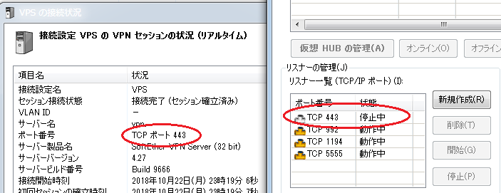

(この記事はQiitaからのコピーです。 本記事の投稿日はQiitaでの投稿日としています。)


Apache2でのWebサーバーをLet's EncryptでSSL化したところ､SoftEther VPN Serverで443番を使った通信が､当然ながら通らなくなってしまいました。

SoftEther自体は443を使わなくても通信ができるのですが､とあるクライアント側のネットワークが443以外使えないということもあり､なんとか443を使ったVPNと､HTTPSを両立させようと､必死になって調べてみましたが､大半が｢OpenVPNとSSLHつかって分離!｣とかそういう感じで､一切Apache2+SoftEtherの両立に関する情報がありませんでした。

いろいろと調べたり､友人に相談したりした結果､うまく行ったので､やり方を書いておきます。

## 環境
Debian 9 Stretch
Apacheバージョン:2.4.25
SoftEtherVPNインストール済み

## 1. SoftEther VPN Serverで443のListenを止める


443はApacheに明け渡してしまい､SoftEtherからは443を止めてしまいましょう

## 2. ApacheにproxyのMODを読ませる
```shell
sudo /usr/sbin/a2enmod proxy
```

## 3. Apacheにバーチャルホストの設定をする

/etc/apache2/sites-available/ に､適当に名前をつけてconfファイルを置きます。
ここではvpn.confとします。

```conf {name="vpn.conf"}

<VirtualHost *:443>
    ServerName vpn.example.com # 適当にサブドメインかなんかでやっちゃいましょう
    ProxyPreserveHost On
    ProxyPass / vpn.example.com:5555 timeout=3600 # 5555番に転送
</VirtualHost>
```

これで設定は完了です。

```
sudo systemctl restart apache2
```
で再起動

## 4. 確認


実際に繋いでみると､サーバー側では443を止めていても､クライアントからは443でつながっていることがわかります。

実際セキュリティがどうなのかはわかりませんが､Apache2でのHTTPS接続と､443番を使わざるを得ない状況でのSoftEtherVPN Serverの両立ができました。

もし同じことで悩んでいる方に役立てば嬉しいです。


