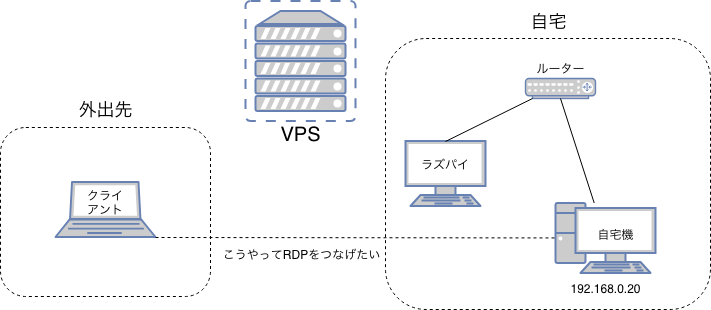
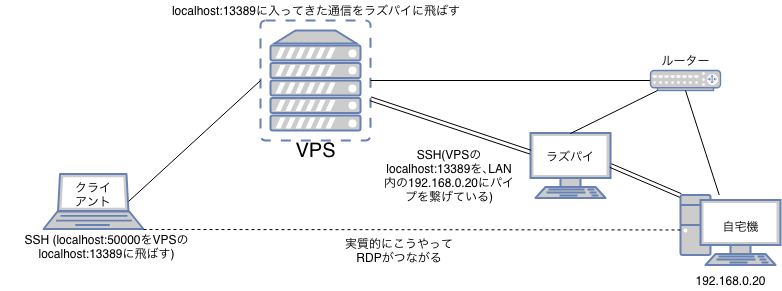

(この記事はQiitaからのコピーです。 本記事の投稿日はQiitaでの投稿日としています。)


いろいろあってVPNクライアントを使えない環境で、インターネット経由で自宅のマシンにRDPで接続したいということになりました。
TeamViewerとかChromeRDとかもありますけど､RDPです。

そこで、VPSとラズベリーパイを使って、VPNを使わずに、自宅のポート解放もせずにある程度セキュアな方法で実現したいと思います。
(ちなみにラズパイを使わずにやる方法もありますが､自宅機に一切手を加えることなく実現でき､再起動にも容易に対応できるのでラズパイでやります。もちろんラズパイじゃなくてもいいです。)

## 環境(やりたいこと)
- VPSが一個ある
- 自宅はポート開放したくない
- 家にラズパイなりなんなりのそういう機器がある

つまりこういうことです。



## ラズパイからVPSにSSH接続をする
通常のSSHコマンドに､`-N -R 任意のポート番号:自宅マシンのIP:3389`を付属させます。

```
ssh -N -R 13389:<自宅マシンのIPアドレス>:3389 <ユーザー名>@<VPSのアドレス> 
```

## クライアントからVPSにSSH接続する
普通にポートフォワードです。通常のSSHコマンドに､`-L 13389:localhost:13389`を付属させます

例:

```
ssh <ユーザー名>@<VPSのアドレス> -L 50000:localhost:13389
```

ちなみに両方共13389っていうところも､もちろん空いていればなんでもいいです。

## RDPでつなぐ

アドレスは`localhost:<1で決めた任意のポート番号(例だと50000)>`です
これだけで繋がります。


## まとめ
つまりこういうことをしたわけです


これをすることで､SHARPのNetWalkerみたいにVPNつなぐのにも一苦労みたいな端末でも､簡単にポート開放せずにRDPで自宅マシンを操作することが出来ます。

また､管理者権限がなかったりしてVPNを繋げることは出来ないけどSSHはできるという環境でも使えますね。

参考URL:
http://toshtone.hatenablog.jp/entry/2018/03/21/232245
