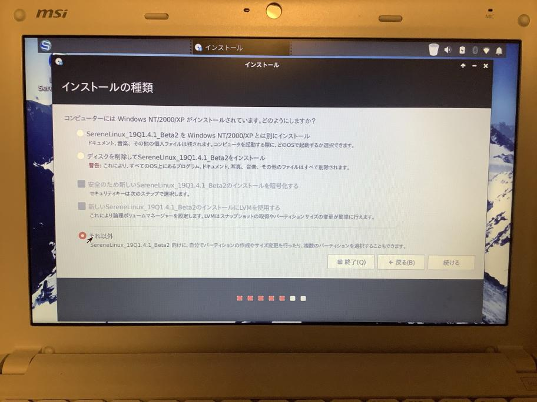
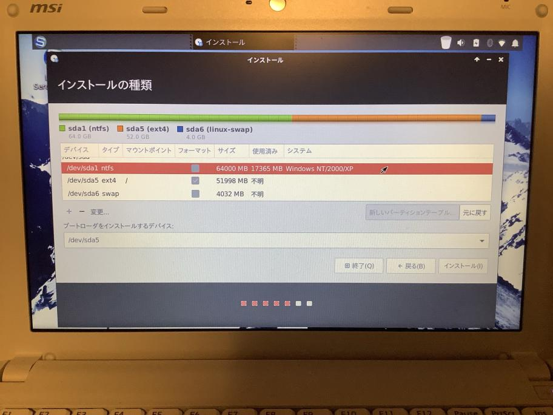
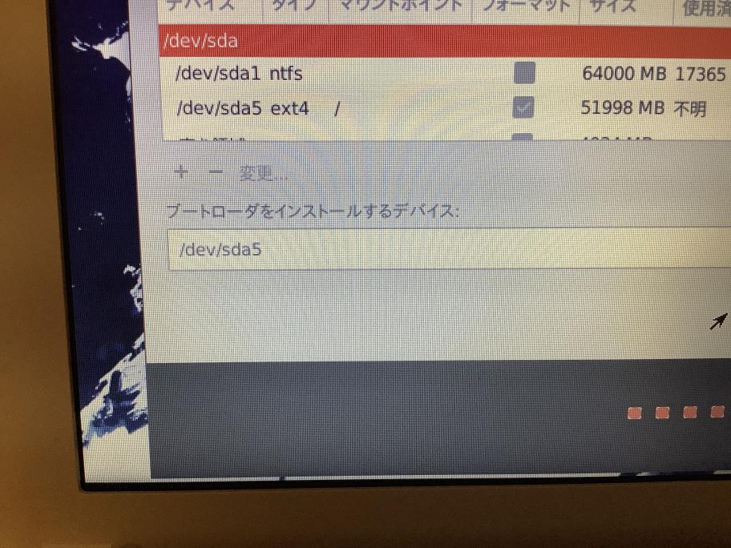
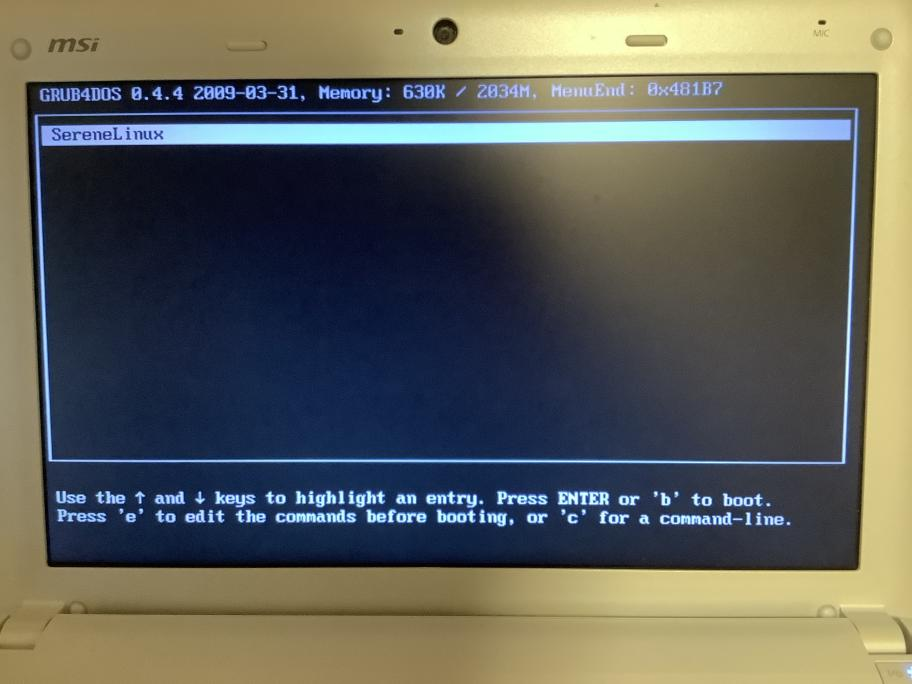
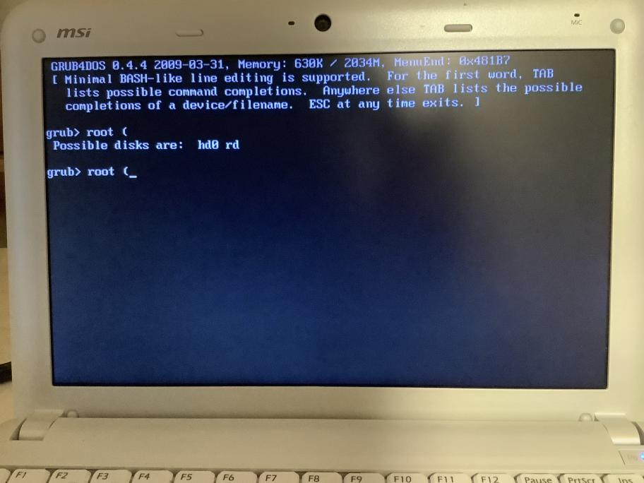
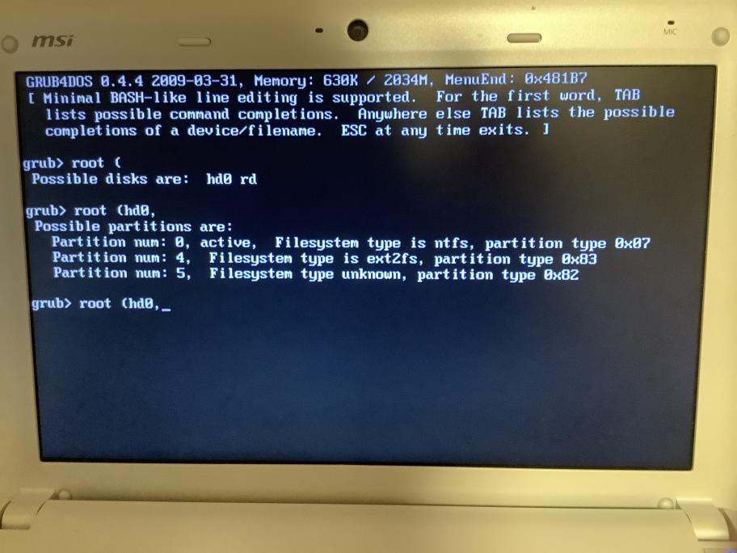
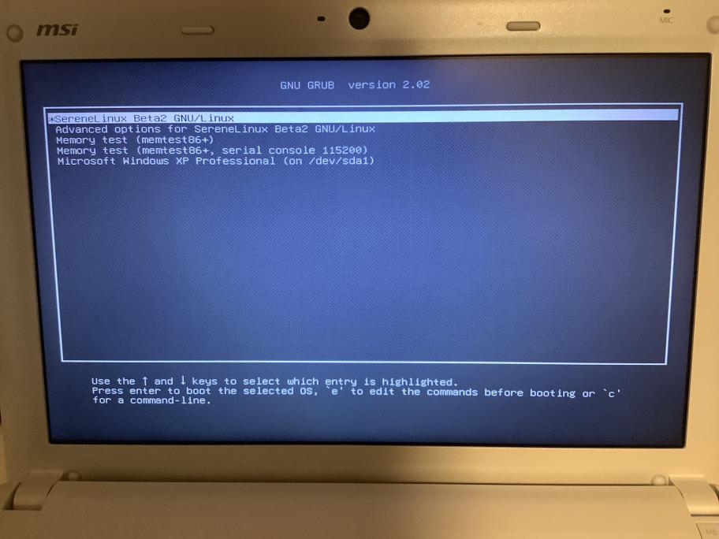
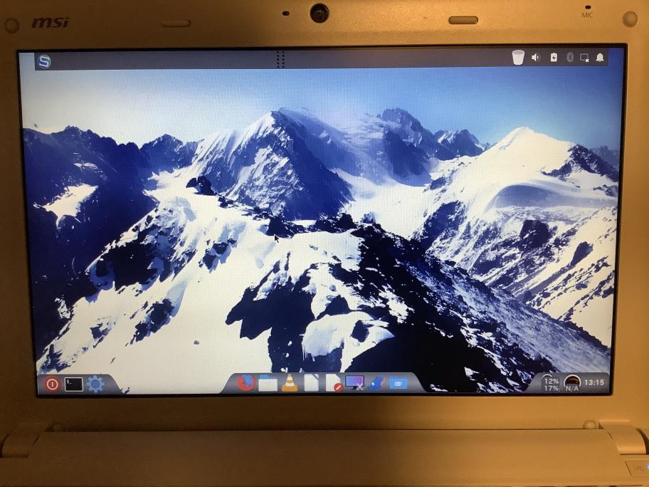

(この記事はQiitaからのコピーです。 本記事の投稿日はQiitaでの投稿日としています。)


Atom N450のWindowsXPの入っているネットブックに、最近流行りのSereneLinuxをインストールしようと思ったのですが、SereneLinuxに限らず、Linux全般においてブートローダをNTLDR/WindowsBootManagerからGrubに変えてしまうと、機種によってはWindowsで休止状態ができなくなってしまうことがあるので、それを防いだり、簡単にLinux側を吹き飛ばせるように、NTLDR/WindowsBootManager経由で起動できるようにします。

これを簡単にやるにはWubiが便利なのですが、SereneLinuxなどといったWubiが扱えないディストリを入れる際にはGrub4DOSを使えば解決できるので、今回はそれをやってみます。

試した環境
- 機種 : MSI U130
  - 今入っているOS : WindowsXP
- 機種 : デスクトップ機(Sandy世代)
  - 今入っているOS : Windows7(LegacyBoot) 

## OSのインストーラを作る
CDやDVDに焼いたり、LiveUSBを作ったりで、各自お好きな方法で作ってください。私はUnetbootinでつくりました。

## Liveディスクで起動する
今回はUnetbootinで試したので、起動時に「Default」を選んで通常のLiveモードで起動させました。

## インストーラを起動する
SereneLinuxの場合はデスクトップにある「Install SereneLinux_ほげほげ」を起動です。  
ちなみにこの段階でWiFiなどでネットワークにつないでおくと、インストール時にアップデートやその他ドライバとかが自動でインストールされて便利ですね。

その後、言語やキーボード、アップデート周りの項目を進めていきます

## パーティションを構成する

どのようにインストールするかを聞かれた際、一番下の「**それ以外**」を選択します。



パーティションの分割については人それぞれあると思うので、ここで詳しくは触れませんが、今回はこのようにしました。  
先頭のWindowsXPのパーティションは基本パーティション、後ろは全て一つの論理(拡張)パーティションです。  
メモリが2GBあるので、Swapに4GBとりました。「/」には52GBもあれば大丈夫でしょう。



そして大事なのが一番下の項目の「ブートローダをインストールするデバイス」です。  
これを/dev/sdaにしてしまうと、ブートローダがNTLDRやWindowsBootManagerからGrubに書き変わってしまいます。  
今回の場合はLinuxをインストールする領域が/dev/sda5なので、プルダウンメニューから「/dev/sda5」に切り替えます。



その後は画面に従ってタイムゾーンやユーザー名を設定し、ファイルコピーを開始させます。

## WindowsVista以降の場合
~~WindowsVista以降(NT6.x以降)の場合は、EasyBCDが利用できるので、この先の作業は適用できません。  
再起動後、WindowsにEasyBCDをインストールし、ブートメニューに/dev/sda5(今回の場合)にインストールしたGrub2を追加してください。  
参考URL→http://www7b.biglobe.ne.jp/~shinou/ubuntu/ubuntu001.html~~

2019/04/16追記  
Windows7でやってみましたが､EasyBCD付属のGrub4DOSの使い勝手がよくわからず､起動できなかったので､下にWindowsBootManagerでの手順も追加しました。

## Grub4DOSを導入する

画面の指示に従って再起動します。  
おそらく今インストールしたLinuxではなく、Windowsが立ち上がってくるはずです。  
(場合によってはチェックディスクが走ることがあります。時間はかかりますが、走らせておくとよいでしょう。EaseUS Partition Masterとかで事前にWindows側でパーティションを切っておけばチェックディスクは走らないかもしれません。)

### Grub4DOSのダウンロードと配置
https://sourceforge.net/projects/grub4dos/files/GRUB4DOS/

ここからGrub4DOSをダウンロードしてきます(20190409現在のファイル: grub4dos-0.4.4.zip)

展開したあと､  
WindowsXP以前の場合は「grldr」(拡張子なし)をCドライブ直下にコピーします。  
WindowsVista以降の場合は｢grldr.mbr｣をコピーします。

### ブートエントリの追加
#### NTLDRの場合: boot.iniの編集
C:\boot.iniを編集します。  
この後の作業で改行がLFだけのファイル作成が必要になるので、この段階からnotepad++やgPad、TeraPadといったLF改行コード対応のエディタを使いましょう。  
隠しファイルが表示される設定になっていない場合は、設定変更で見れるようにしておいてください。

boot.iniの最終行に、

```ini {name="boot.ini"}
C:\grldr="SereneLinux"
```

と追記します。(念のためですが、boot.iniはCRLFです）  
「SereneLinux」の部分は、NTLDRに表示される名前ですので、好きにどうぞ。

### WindowsBootManagerの場合: BCDエントリの追加
(下記の参考リンクのUbuntu Wiki見たほうがわかりやすいかも)  
コマンドプロンプトにて､

```cmd
bcdedit /create /d "SereneLinux" /application BOOTSECTOR
```

「SereneLinux」の部分は、WBMに表示される名前ですので、好きにどうぞ。

```cmd
エントリ {~~~~~} は正常に作成されました。
```

とでるので､{~~~~~}をコピーします。

```cmd
bcdedit /set {~~~~~} device partition=C:
bcdedit /set {~~~~~} path \grldr.mbr
bcdedit /displayorder {~~~~~} /addlast
```

でGrub4DOSをWindowsBootManagerに追加できます。

### menu.lstの作成

C:\に、Grubに「ここにLinuxがありますよー」と教えてあげるための”menu.lst”を作成します。  
このファイルは改行コードがLFである必要があります。  
ファイルの新規作成で行ってください。

``` {name="menu.lst"}
title SereneLinux
root (hd0,4)
chainloader +1
```

例によってtitleのあとの文字列は名前なので自由です。

ここで注意してほしいのが、「(hd0,4)」です。  
この0と4はそれぞれドライブの番号とパーティションの番号を示しています。  
で、この番号に関してはいろいろ規則などがあるのですが、調べてもそれがうまく動かなかったので、次の章で説明します。  
とりあえずmenu.lstを作った状態で、再起動してみましょう。

### Grub4DOSを起動する
再起動すると、ブートメニューに「SereneLinux(さっきboot.ini/cmdで打った名前）」が出てくるはずです。  
それを選択し、Enterで起動させると、Grubが表示されます。  
  
ここでEnterで起動させたとき、うまくいけば起動するのですが、おそらく起動しない場合がほとんどのはず？です。  
本来は5-3の段階で正しく記載していればいいのですが、私の場合ダメでした(以下の方法で調べた結果がhd0,4です)

1. grubメニューが出ている段階で「c」を押す(コマンドラインの起動)
2. 「root (」まで打ってTabキー  
    **注意** JISキーボードの場合"("はShift+8ですが、GrubではUSキーボード判定なので、Shift+**9**です。  
    これで候補におそらく「hd0 rd」といった表示が出てくるはずです。(読み込んでいるドライブの番号を確認。ドライブが一個しかなければ0のはず)  
      
3. 「root (hd0,」まで打ってTabキー  
    
4. ext2fsと表示されている番号を確認
    ↑この写真の場合はFilesystem type is ext2fsと表示されているのが”Partition num: 4”なので、4番ということになります。
    もし4であれば、変更の必要はないのでEscを押し、9.に飛んでください。
5. Escでメニューに戻る
6. root (hd0,4)にカーソルを合わせ、「e」を押す
7. hd0,4の4を消し、4.で調べた番号にする
8. Enterでメニューに戻る
9. 「b」を押す

これで/dev/sda5に入ったGrubが起動するはずです。(ちょっとややこしいですね)  
その後、一番上の項目をEnterで起動すれば、無事にインストールしたLinuxが起動します。  



### menu.lstを編集する
前項で番号を編集した場合、その編集はmenu.lstに書き込まれてはいないので、menu.lstを編集する必要があります。  
これはLinuxやWindowsどちらからでもできますので、変えておきましょう。  
( `root (hd0,4)`の**4**のところ )

**2019/12/25追記**
ちなみに無理やり強引でな方法ではありますが､Grub4DosとGrub2のタイムアウト時間を無くすことで､一発でLinuxをNTLDR/WindowsBootManagerから起動させることができます。  
もし環境構築が終わって問題なさそうならやってみてもいいかもしれません。  
ですが､Grub4Dosはいいとして､Grub2になんらかの変更が必要になった場合は､一度ライブ起動でLinuxを立ち上げ､Grub2の設定ファイルを書き換えるなど､若干面倒な作業が必要になることも頭に入れておいてください。

## インストールしたLinuxで遊ぶ
お疲れ様でした。  
これでWubiを使わないでも、Windowsのブート周りに大きな改変を加えないでLinuxを起動させることができます。  
今回はUbuntu系ディストリ(SereneLinux)でしたが、Grub2を使うLinuxディストリであればほとんど使うことができるはずです。  
良いLinuxライフをお過ごしください。  



## 参考にしたURL
- 大まかな流れ(Windows10のWBMを使ってUbuntu16.10?をインストールしている。今回の場合のWBM版)
  - [Windows10 に Ubuntu16を足す | ろっひー](https://ameblo.jp/yoshihirow/entry-12211040971.html)
- Ubuntu Japanese Team WikiのGrub4DOSに関するページ
  - [grub4dos を利用するための準備](https://wiki.ubuntulinux.jp/UbuntuTips/UsbInstall/BootUbuntuInUsbWithBiosWithoutSupportForUsb/Grub4dos)
- Grub4DOSの使い方
  - [GRUB for DOS めも](http://www10.plala.or.jp/palm84/grub4dos.html)

