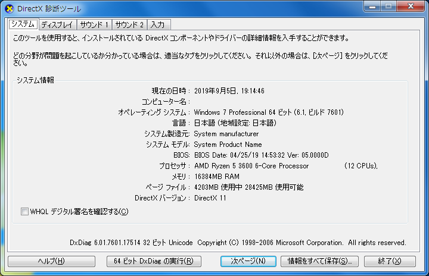

(この記事はQiitaからのコピーです。 本記事の投稿日はQiitaでの投稿日としています。)

Sandyおじさんがいきなり第3世代Ryzenお兄さんに圧倒的成長する物語。

SandyBridge(Core i5-2400)を使い続けていたのですが､グラフィックボード更新を機に一気にアップグレードしました。
備忘録というかやり方を書いておきます。

## 環境紹介
### 元環境
* ベースマシン: Dell Optiplex 990DT
* CPU: Core i5-2400
* GPU: GeForce GTX750Ti
* OS: Windows7 Professional 64bit

### 新環境
* CPU: Ryzen 5 3600
* GPU: GPU: GeForce RTX2060
* OS: Windows7 Professional 64bit

注: OSは再インストールせず､ストレージ差し替えだけで環境移行する

## 手順

### Windows7でWindowsUpdateをとりあえず全部当てる
一応抜け道はあるのですが､RyzenはWindows7がサポート対象外ということもあり､普通にしてるとWindowsUpdateが拒否られます。念の為に最新にしておきましょう。

### チップセットドライバを準備

amd_chipset_drivers_v1.8.19.0915.zipという名前のものが､2019/9/3の段階では公式にあったのですが､9/5に見たところ消えていました。
https://jp.msi.com/Motherboard/support/B450-GAMING-PLUS#down-driver&Win7%2064
まだMSIのサイトにあるので欲しい人は今のうちに。

これを展開し､実行ファイルをCドライブ直下かなんかに入れておきましょう。

### レジストリエディタで普段読み込んでないドライバも読ませるようにする
これはRyzenに限らず､Windows7でマザーボードを変更するときに行う作業です。
Windows8以上は確か自動で環境変更認識しますが､Win7はしないので普通にBSoD吐く気がします。


レジストリエディタ(regedit)で､
```
HKEY_LOCAL_MACHINE\System\CurrentControlSet\Services\
HKEY_LOCAL_MACHINE\System\ControlSet001\Services\
HKEY_LOCAL_MACHINE\System\ControlSet001\Services\
```
の､以下の項目で**start**の値を**3**から**0**に変更します。

* Aliide.sys
* Amdide.sys
* Atapi.sys
* Ataport.sys
* Cmdide.sys
* Intelide.sys
* Msahci.sys
* Pciide.sys
* Pciidex.sys
* Viaide.sys

存在しない項目があった場合は無視して下さい。
一応書き換えたあと再起動し､ちゃんと起動することを確認してください。

### 環境を移行する
ここは割愛します。普通に新マシンを組み上げ､今まで使ってたストレージをつなぎます。

### 起動とチップセットドライバのインストール
注意点として､初回起動の現段階では**PS/2キーボード･マウスしか認識しません。**
USBしかもってない人は詰みます。マウスはいらないかもしれませんが､キーボードは必須です。
おそらく普通に起動します。 グラフィックドライバが当たってなかったりしますが､とりあえずログオンしてデスクトップは出るはずです。
そうしましたら､Winキー+Rから"ファイル名を指定して実行"を開いてコマンドプロンプトを起動(cmdでEnter)し､先程展開したチップセットドライバのインストーラを起動しましょう。(エクスプローラー開いてTabキーを使って格闘してもいいですけど)

指示通り再起動したら､チップセット由来のUSBポートが使えるようになっているはずです。(CPU直結の端子は使えませんが､それでも何個か使えるのでセーフ。)

ちなみにNICが認識されていないなどの問題は､各自クリアしてください。特に工夫するところはないです。

### グラフィックボードドライバのインストール
最近のドライバを入れている人は大丈夫という話もありますが､当環境ではグラフィックボードが認識されなかったので､ドライバのインストールをします。
https://www.nvidia.co.jp/Download/driverResults.aspx/150587/jp
ここで落とせる`436.15-desktop-win8-win7-64bit-international-whql.exe`を利用しました。
Windows7/8用のドライバなのに､中のファイル見てみるとRTX系の記載がちゃんとあり､インストーラにも認識されました。
特段工夫するところもなく､普通にウィザードに従ってインストールを進めていけば､再起動後にちゃんと認識されているはずです。
注意点として､DX12は使えません。DX11までです。レイトレはもちろん無理です。 ですが､普通にゲームする分には問題ないです。

作業は以上です。お疲れさまでした!

### 残りの5ヶ月をエンジョイする



Win7は御存知の通り2020年の1月にサポートが切れます。
それまでの期間､めいいっぱい第3世代RyzenとRTX20系のグラボで楽しみましょう!

※ちなみに環境変更されたこともあり､ライセンス認証しろと言われますが､当環境ではオンライン認証で普通に通りました。

## あとがき
SandyBridgeからマザボ変更の手順だけで普通に動くとは思いませんでした。
Win7を使いたいけどRyzen使いたい･･･そんな人(いるかな)に役立てば幸いです。

## 参考サイト
https://pcrepair.w-pickup.com/post-3295/
https://17inch.blog.so-net.ne.jp/2019-07-23

