(この記事はQiitaからのコピーです。 本記事の投稿日はQiitaでの投稿日としています。)

**この記事は[Tokyo City University Advent Calendar 2019](https://adventar.org/calendars/4282)の4日目の記事です**

C言語の開発環境、たくさんありますよね。一番手軽なところだと、Windows用のgccとメモ帳があればとりあえずできます。また、VisualStudioやCLionなどのIDEを使う方法もあります。
それらのやり方はいちいち今からQiitaに書かなくてもいくらでも情報が転がっています。ところが、なかなかポータブルな環境構築というのは見かけません。大学の備え付けPCやネカフェのPCなど手持ち以外のPCで使おうとしても、パスを通したりエディタの設定を云々したりが必要で、なかなかポータブルな環境構築というのも難しいものです。
そこで、今回は**ポータブルなC言語開発環境を**(ものすごい遠回りして(結局実用性があまりない状態で))作っていきましょう! ~~100%ネタです~~

## 必要なもの
- **MS-DOS 6.2**のインストールイメージ(今回はPC-9801用を使用しました)
- NP21/W (普通のNekoProject2でもいいですけどね)
    - PC9821エミュレータ(LinuxのWineだと動いた。macだとキーボードが動かない場合がある)
    - リンク:https://sites.google.com/site/np21win/download
- LSI C-86 Ver.3.30 試食版
    - Cコンパイラ
    - https://www.vector.co.jp/soft/maker/lsi/se001169.html
- DiskExplorer
    - 仮想HDDイメージやFDイメージを開くためのソフト
    - https://hp.vector.co.jp/authors/VA013937/editdisk/index.html
- (DOS用テキストエディタは載せてません。各自お好きなものを探してみてください。)

## PC-98(NP21/W)を起動する
環境にMS-DOSを使うため、PC-98シリーズの仮想マシンを使います。
先述のサイトからNP21/WのZIPファイルをダウンロードし、展開しましょう。
「9801」「language」「np2.chm」「np21w.exe」「np21x64w.exe」の5つが展開されたはずです。
まずは、「np21x64w.exe」を起動します(x86なOSならnp21w.exe)

Windows10だとSmartScreenに引っかかりますが、「詳細情報」→「実行する」で起動ます。

起動すると、「ﾋﾟﾎﾟｯ!」と起動音が流れながら、メモリチェックが行われます  
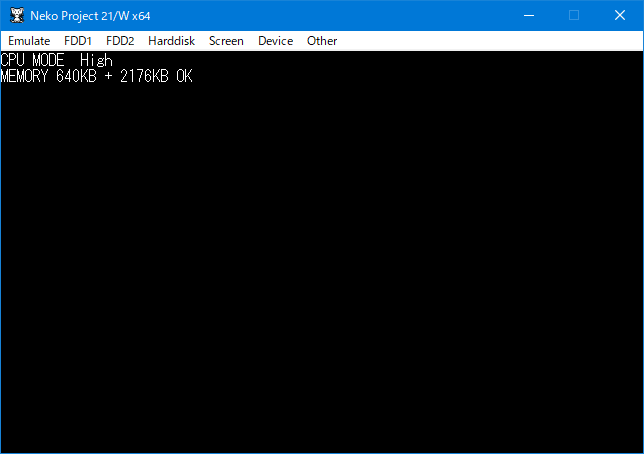

なにもイメージを割り当ててないので、「システムディスクをセットしてください」となります。  
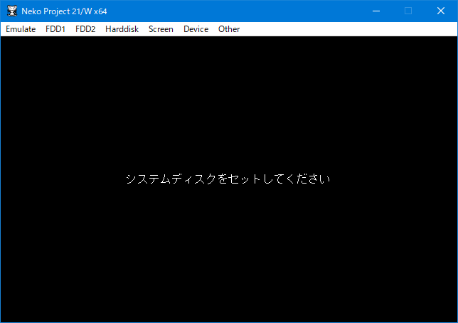

### CPUの速度を変える
せっかく実機PC-9801/21よりはるかに早いコンピュータを使っていますので、夢の爆速マシンにしましょう。
「Emulate」メニュー→「Configure...」より、CPUの欄のプルダウンメニューで、20→42にしましょう。
次起動するときは「ﾋﾟﾎﾟｯ」が一瞬しか聞こえません。  
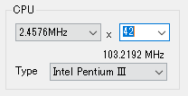


## 2. HDDイメージを作成する
左上の「Emulate」メニュー→「New disk」→「Hard disk image...」  
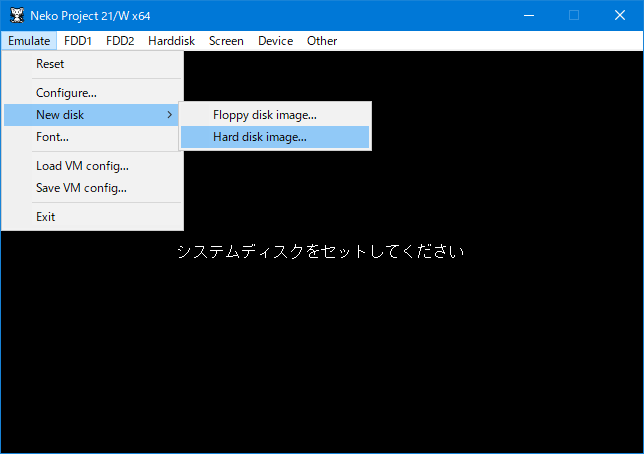

ファイル保存ダイアログが出るので、好きな名前を付けて保存しましょう。
この時、ファイルの種類が決められますが、「.nhd」で良いと思います。

次にファイルサイズを決めます。MS-DOS 6.2がとりあえず読める最大サイズが2047MBバイトなので、精神衛生的に2048MBにしました。(容量固定式なので、指定したサイズのファイルがいきなり生成されます。ご注意ください)  
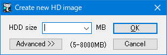

「OK」を押すと、HDイメージが作成されます。

次に、作成したイメージを割り当てます。
「Harddisk」メニュー→「IDE #0」→「Open」より、先ほど作成したファイルを選択します。

これで最初の作業は終了です。

## 3. MS-DOSをインストールする
一番めんどくさい作業です。
「FDD1」メニュー→「Open」より、インストールフロッピィイメージの1枚目を開きます。
(以下、MS-DOS側に合わせ、フロッピーではなくフロッピィ表記を使用します)  
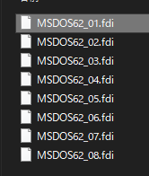

「Emulate」メニュー→「Reset」で再起動します。

再起動すると、インストール先を聞かれます。  
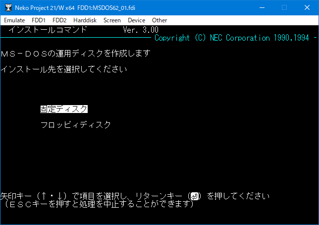
固定ディスクを選択します

ディスクの初期化をします。  
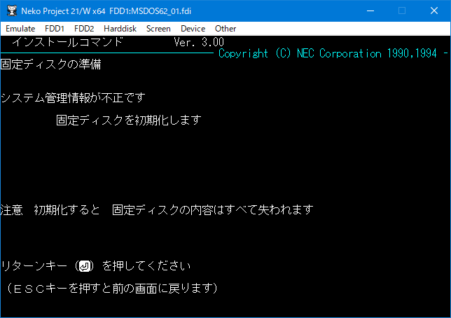

勝手に初期化してくれます。便利ですね。  
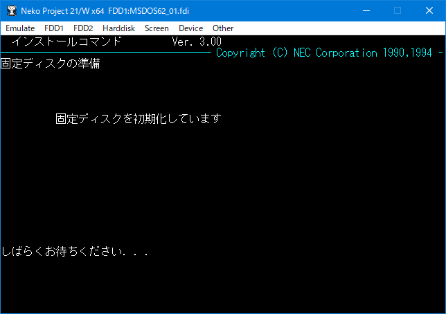

完了すると、MS-DOS領域の作成です。何も考えずEnter押して大丈夫です。  
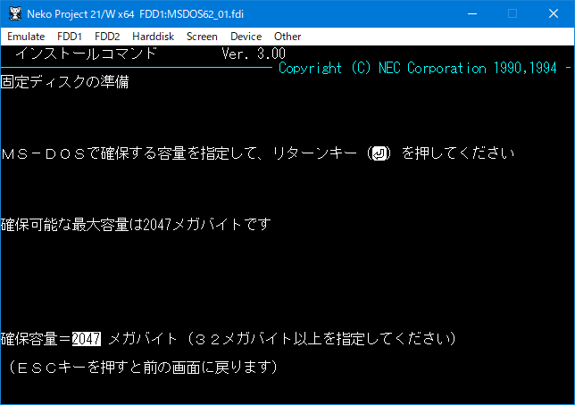

確認されるので、「はい」で続行します。  
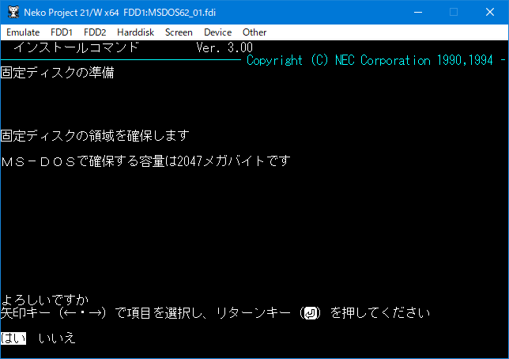

何やらすごいプログレスバーが出てきます。  
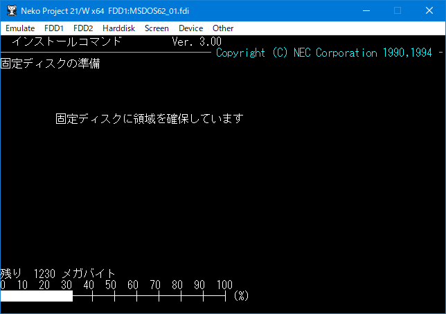

勝手に再起動して、インストールが続行されます。まず、インストール先のディレクトリの指定です。このままEnterを押します。  
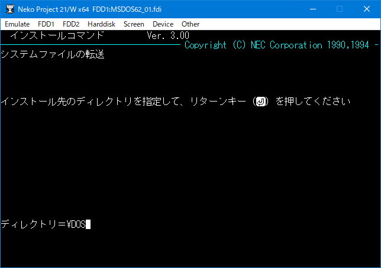  
先程のように確認されるので、「はい」で続行します

二枚目のフロッピィディスクを入れろと言われるので、先程と同じ様に「FDD1」メニューより、2枚目のフロッピィディスクを入れます。  
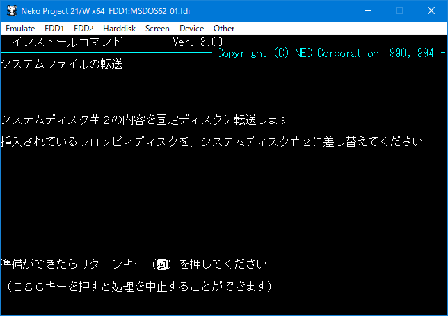

入れたらEnterキーを押します。自動でファイルコピーが行われます。これを8枚目まで行います。(仮想だから転送早いですけど、実機だとものすごい時間かかるんだろうなと)

8枚目まで終わると、環境設定が出てきます。特に変更は必要ないので、このままEnterキーを押します。  
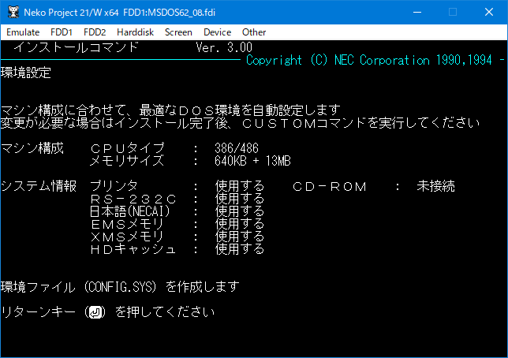

インストールが終わりました。速いのか面倒なのかわかりません。  
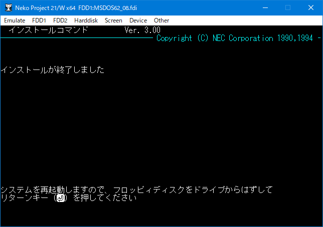  
「FDD1」メニューより、「Eject」でフロッピィディスクを抜き、Enterキーを押しましょう。

再起動すると、MS-DOS Shellが起動してきます。  
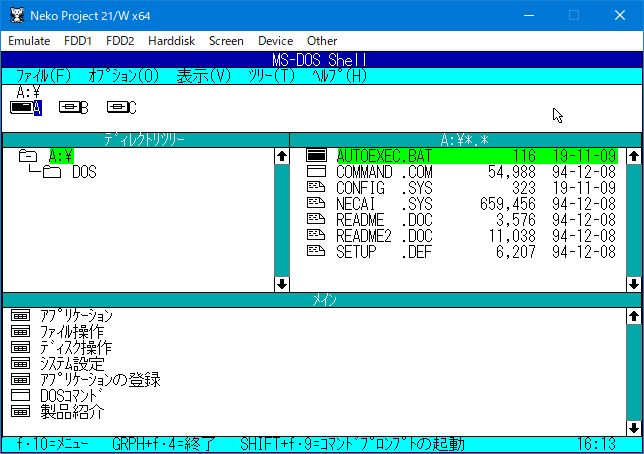  
F12キーを押せば、マウスも使えます(ホスト/仮想のマウス切り替えがF12)

## 4. LSI C-86 Ver.3.30 試食版を展開する
lsic330c.lzhを普通に展開します。"lsic86"というフォルダにBINフォルダ等が入ってる感じで展開してください。

## 5. DiskExplorerを使ってフロッピィイメージにファイルを転送する
### 1. 空フロッピィイメージの用意
本当は"超遠回り"なので、本来はここでDiskExplorerを使ってHDDイメージ内にファイル転送すれば良いものを、わざわざフロッピィディスクイメージを作って転送してみます。  
と言いたいところなのですが、NP21/Wで作ったものがなぜかDOSでフォーマット出来ず、VirtualBoxで作ったimgなフロッピィイメージもそのままでは読めないので、空のイメージを置いておきます。  
[Floppy.fdi](https://mikuta0407.net/files/Floppy.fdi)  
(確実に自作するには**VirtualBoxの標準機能で作ったフォーマット済みなimg形式のイメージを[Virtual Floppy Image Converter](https://www.vector.co.jp/soft/win95/util/se151106.html)でFDIに変換すればいい**のですが、さすがに記事が長くなるのと、説明が面倒くさいので書きません。)

### 2. フォーマットする
「FDD1」より、↑のFloppy.fdiを開きます。今までの手順で行っていた場合、Cドライブにフロッピィディスクが入ります。

Shift+F9でDOSのｺﾏﾝﾄﾞﾌﾟﾛﾝﾌﾟﾄを起動します。  
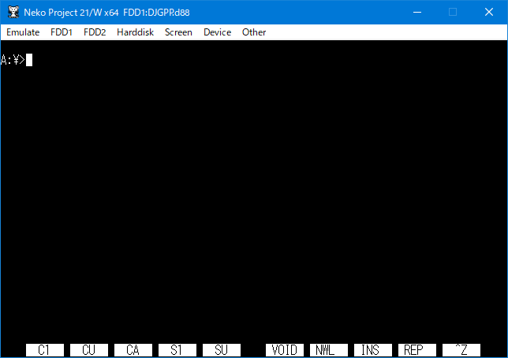

`format b: `と入力し、実行します。  
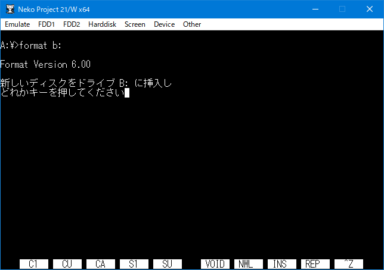  
挿入してあるのでこのままEnterキーを押します。

フォーマットされました。  
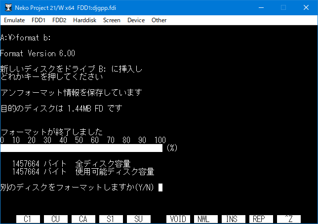

別に他のイメージはフォーマットしないので、Nで抜けます。抜けたら、「FDD1」メニューからEjectします。

exitでｺﾏﾝﾄﾞﾌﾟﾛﾝﾌﾟﾄからMS-DOS Shellに戻れます。

### 3. フロッピィイメージ内に書き込む

DiskExplorer(先程ダウンロードしたもの。editdisk.exe)を起動し、今フォーマットしたフロッピィイメージを開きます。  
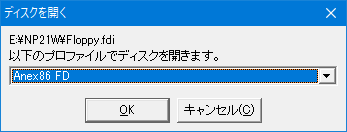  
このままOKで開きます。

フロッピィイメージの中を読み書きできるようになりました。  
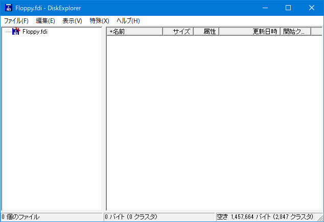  
ここに、先程展開されたlsic86のフォルダをドラッグアンドドロップで入れます。(フォルダごと入れてください)  
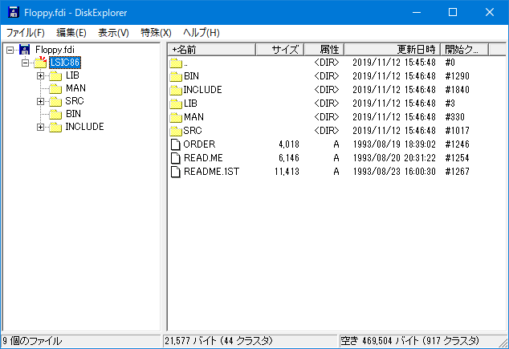

書き込んだら、DiskExplorerは閉じ、再びNP21/Wを起動し、FDD1に今のフロッピィイメージを挿入します。  
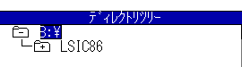  
ちゃんと認識されていますね

## 6. コンパイラのデータをAドライブ内にコピーする
Shift+F9でｺﾏﾝﾄﾞﾌﾟﾛﾝﾌﾟﾄに入ったら、

```batch {name="ｺﾏﾝﾄﾞﾌﾟﾛﾝﾌﾟﾄ"}
mkdir a:\lsic86
xcopy b:\lsic86 a:\lsic86 /e
```
でコピーが出来ます。  
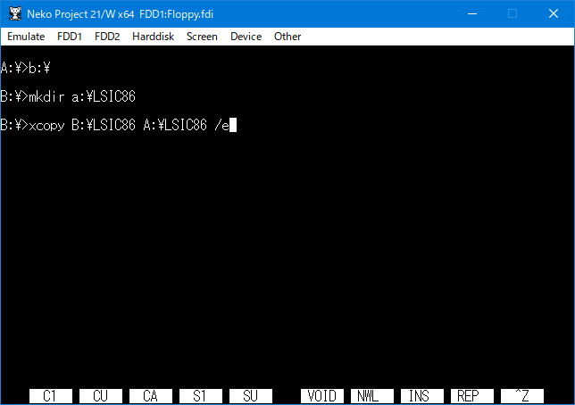

コピーが終わったら、メニューよりEjectしてください。これをしないと再起動時フロッピィディスクから起動しようとして、MS-DOSが起動しません。

## 7. コンパイラのパスを通すためにAUTOEXEC.BATを編集する

画面下部「ﾒｲﾝ」より、「ﾌｧｲﾙ操作」を開きます。(マウスまたはTabキー+矢印キー+Enterキーで選択)  
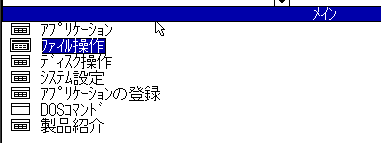

スクロールし、「ﾃｷｽﾄﾌｧｲﾙの内容変更」を起動します  
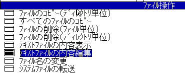

どのドライブにあるファイルか聞かれるので、`a:`と入力しEnter/OKします  
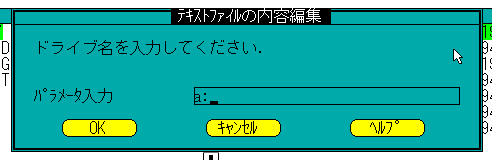  
どのファイルを編集するか聞かれるので、`autoexec.bat`と入力し、Enter/OKで開きます。  
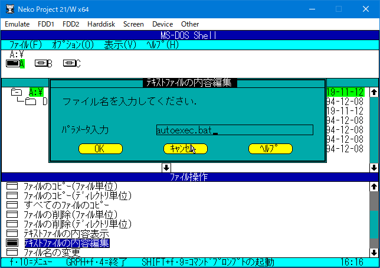

テキストエディタが開き、autoexec.batの編集ができるようになったので、追記をしていきます。  
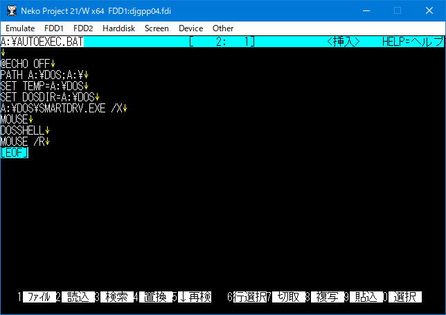

`SET DOSDIR=A:\DOS`と`A:\DOS\SMARTDRV.EXE /X`の間に、以下を追記します。

```batch {name="AUTOEXEC.BAT"}
SET PATH=A:\LSIC86\BIN;%PATH%
```

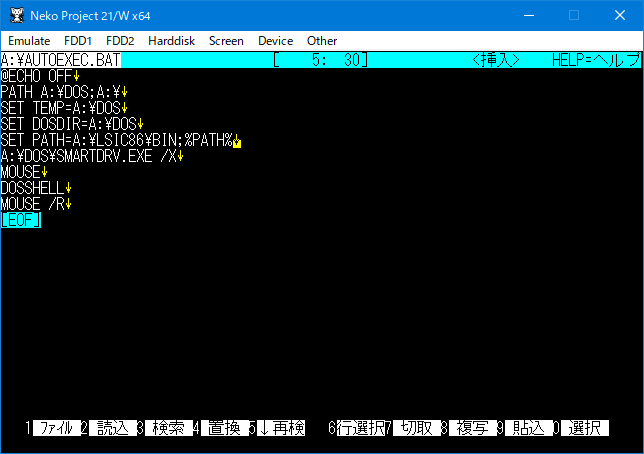  
追記したら、F1→"E"で保存、終了します

MS-DOS Shellに戻ってきたら、EmulateメニューよりResetで再起動します。

ｺﾏﾝﾄﾞﾌﾟﾛﾝﾌﾟﾄを起動して、`lcc`と入力後、以下の表示になれば、コンパイラのインストール成功です。  
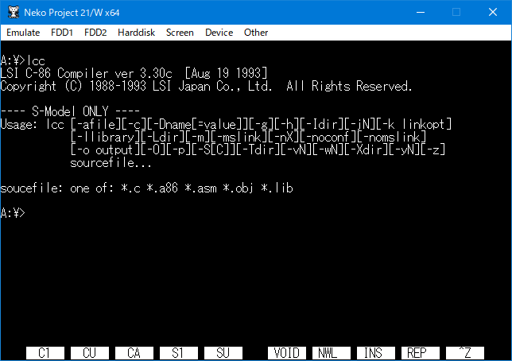

## 8. Hello Worldしてみる
さきほどautoexec.batを編集したときと同じ方法で、テキストエディタを起動させ、ファイル名を入力するところで`test.c`と入力してみます。(存在しないファイル名を入力することで新規作成)  
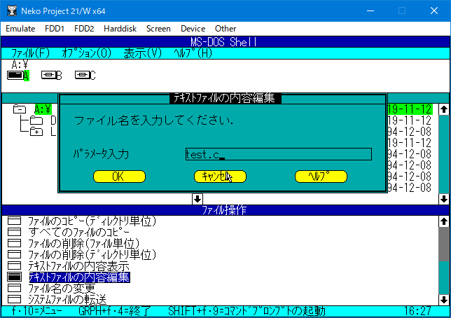

これで先程のようにテキストエディタが起動しますので、以下のHello World + αなテストコードを書いてみます。

```c {name="test.c"}
#include <stdio.h>

int main (){
	int i;
	printf("Hello World\n");
	for (i=1; i<=5; i++){
		printf("%d\n" , i);
	}
	
	return 0;
}
```

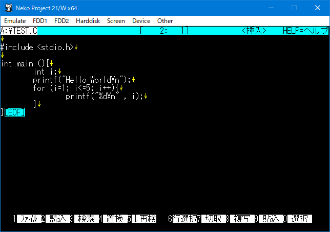  
(デフォルトだとTabがスペース8文字分になりました)

書き終わったら先程のようにF1→Eで保存します。

Shift+F9でｺﾏﾝﾄﾞﾌﾟﾛﾝﾌﾟﾄに入ったら、
```
lcc test.c -o test.exe
```
でコンパイルしてみましょう

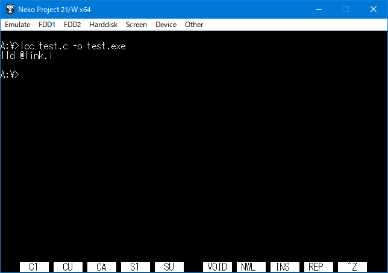  
コンパイルされました。

`test.exe`と実行し、きちんと動作してることを確認します  
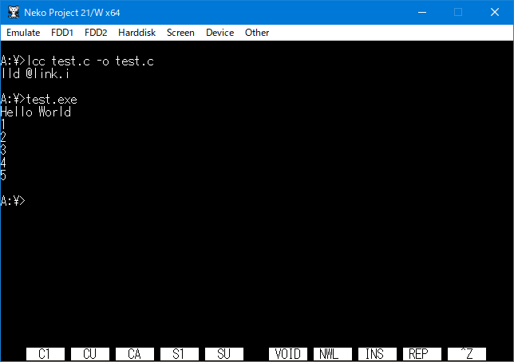

お疲れさまでした...! ポータブルなC言語開発環境の構築の完成です...!!!  
別PCで起動するときは、NP21/WでHDDを再指定するだけで大丈夫です。  
動作が動作なのでUSBメモリなどに入れて気軽に持ち歩きましょう!

## あとがき
疲れます。  
sudo apt install build-essentialで実質環境構築が済む時代にはあまりに遠回りすぎるので...  
でも、こういうの、楽しいよね!  
え? 作ったプログラムが64bitなWindowsで動かない? こういう神ソフトを作ってくれてる人がいますよ?  
[MS-DOS Player for Win32-x64](http://takeda-toshiya.my.coocan.jp/msdos/)

## あとがき2
アドベントカレンダーというものに今回初参加させていただきました。  
よくTwitterに流れてくるアドベントカレンダーはっょぃ人がたくさんいてビビるのですが、今回は身内の多いアドベントカレンダーなので、気軽に参加できました。と思ったら初日から強すぎてハゲそうです。  
何を書いてもいいAdvent Calendarなので全力でネタに走ってみました。  
今年も残り少なくなってきましたが、皆様体調にはお気をつけください...  
14日目にまたお会いしましょう。

次の記事: mak1aさん

