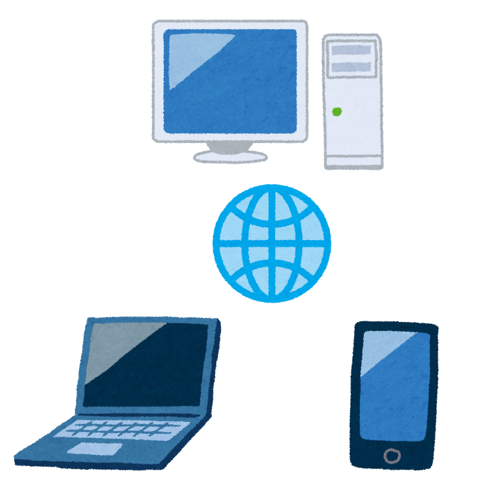

**この記事は[Tokyo City University Advent Calendar 2019](https://adventar.org/calendars/4282)の10日目の記事です**



昨日はらぴーとさんの[SKKを使おう！](https://rapit.hatenablog.jp/entry/2019/12/09/000000)でした。GoogleIMEの挙動に指が慣れすぎてるのでなかなかIMEを変えるという発想にはならないのですが、今度仮想のWindows2000かなんかに入れて、ちょっと試してみようかなってなりました。

さて、アドベントカレンダー、なんかまだ空きがあるようなのでやってみます。ただそこまで技術系でもないので、放置しまくっていたこのブログに書いてみようと思います。

(関係ないですがWordPressにMarkdownでかけるプラグインを入れたところすごい書きやすくなりました。みなさんもぜひ。)

さて、今回の記事は、個人シンクライアント運用のすゝめということで、なにかと最近話題になっているシンクライアントをネタにしてみました。

みんなもぜひ、やってみてね!

## シンクライアントって?
なんか最近某所で話題になってる"シンクライアント"ですが、じゃあそれは何だというと、「処理はすべてリモート先のコンピュータで行い、手元の端末は表示と入力転送に徹するよ」っていう状態のマシン構成のことです。

一般的に、(正しく運用すれば)セキュリティを高められるため、NTTなどの企業でも利用されていることが有名ですね。

政府もそうだったそうですが。

## 個人シンクライアント運用って?
今回の記事のために作った言葉ですが、そのまんまです。個人でシンクライアント運用をするんです。

もうちょっと詳しく言うと、自宅にそれなりに高性能なマシンを置いておき、普段の作業は持ち運びに全振りしたマシンで行うということです。

じゃあそうすることで何が嬉しいのか、ご説明します。

## メリット
### どの端末からでもいつも同じ環境が使える
基本的に家にある母艦機を操作するので、母艦機の環境がどこからでも使えることになります。たとえば、大きな画面が使いたいので15インチのラップトップを使ったとしても、あまり大きなマシンが使えないので12インチくらいのモバイルノートを使っても、はたまたGPD PocketのようなUMPCでも、iPadのようなタブレット端末でも、すべてに置いて同じ環境が使えるわけです。「このマシンにはこのデータが入ってないからコピーしないと」とか、「このマシンにはこのソフトが入ってないから家に帰るまで使えない」とか、そういうことがないわけです。

キーボードや画面などの理由で実際に母艦機の前に座って作業を行うこともありますが、その途中で外出することになっても、「やってた作業を、電車の中や大学でそのまま引き継いで作業」なんで事もできるわけです。

他にも、ベッドでごろ寝しながら作業の続きをしたり、ソファにゆっくり座って、作業の続きをしたりなんてこともできます。

これは実際にやってみないとなかなかわからないのですが、一度やると便利さに惚れて手放せなくなります。

### 端末の性能を選ばない
先程書いたように、どの端末からでも結果的に母艦機を操作するので、端末側の性能を選びません。最低限の性能(後述)さえあればいいわけです。

もちろんMacBook Proや他のゲーミングノートのような高性能なマシンでもいいですが、ラズベリーパイのような弱いマシンでも、2010年くらいのAtom N450くらいのネットブックでもいいのです(バッテリーさえ持てば現役復帰)。Netwalkerだってできます。

そんな感じで、全て母艦機で処理をすることで、古い端末や性能的に弱い端末を有効活用する、なんてこともできるわけです。

### 端末の性能を一点集中にできる
一つ前の項と似たような感じですが、性能を選ばないということは、端末の性能を、「バッテリーも性能も持ち運びやすさも・・・」と欲張らなくていいのです。

外出先で作業をすることを考えたとき、持ち運びやすさやバッテリーの持ちが大切になります。そんなとき、シンクライアント運用をすると、(最初の方にも書きましたが、)性能のために持ち運びやすさを犠牲にすることなく、持ち運びやすさに全振りしたマシンを使うことができます。

だから例えば、"バッテリーがすごい持つけど性能の低いAtomのマシン"とか、"ストレージがすごい少ないけど薄くて軽いChromebook"、"5VのUSB電源で動くPORTABOOK"といった、ローカルで作業するには力不足を感じるマシンでいいのです。

これは毎日の荷物が楽になりますよね。

## デメリット
ここまでメリットを書いてきましたが、じゃあデメリットはあるのかと聞かれると、あります。

地味に痛かったりします。

### 回線が命
シンクライアントということは、絶対にネットワーク接続が必要です。これがなければどうにもなりません。大学であれば大学のネットワークを利用することができますが、それ以外の場所ではモバイルネットワークに頼ることになります。モバイルネットワークは固定回線に比べると遅延やパケ詰まりもあり、なかなか満足な速度が出ないこともあります。後述しますが、リモートソフトによってはモバイルネットワークでは通信量が気になることになる場合も・・・

### 遅延(描画のラグ)はやっぱり気になる
どうしてもネットワークで画面情報を転送するため、実機よりもスクロールや、動きのあるものに遅延を感じます。  
文字を入力する分には、(回線さえ問題なければ)ほぼ遅延を感じないのですが、ウィンドウの移動やファイルのドラッグアンドドロップ、CSSアニメーション等があると、遅延やｶｸｶｸを感じてしまいます。  
動きのあるゲームなんて以ての外といった感じです(ソリティアとかマインスイーパーは余裕ですけど)

回線の問題とラグは、シンクライアントの宿命でもありますので、そこさえ我慢できれば・・・といったところですね。授業のノート取りといったものでは一切回線とラグを気にしなくていいかなと思っています。

## デメリット2と、回線問題の対応策
ちょっと話が違うので分けました。実はもう一個デメリットがあります。

### VPNが切れた時ちょっと面倒くさい
これは後述するRDPやVNCを使う場合に発生するのですが、VPN接続を使用して接続した場合、回線が安定していないとVPNが切れることがあります。これが地味に面倒で、普通にRDPやVNCが切れただけならすぐに再接続できますが、VPNが切れると、一度VPNを繋ぎ直したり、再接続を待って、それからRDP/VNCを再接続することになります。

大学で作業してると、調子がいいときは何も思わないのですが、調子が悪いときはイライラしていまいますね・・・

### 対応策
VPNとさっきの回線問題は、やはり何かあったときのために対策が必要となります。

企業が導入している本当のシンクライアント運用とは違って、普通に汎用OSが走ってるマシンを使うのでできる技でもあります。

#### 端末は最低限とはいえ、ブラウザは使えるスペックにしておく
ラズパイのように電源が必要なものは自宅運用だと思うのであまり気にしませんが、ノートパソコン系の場合は、最低限ブラウザがそれなりに動くマシンにしておいたほうがいいです。それくらいのスペックなら、本当に緊急時でも単独でそれなりに作業ができますからね。

例えば、Atom N450のマシンは化石スペックではあるものの、PaleMoonを使うことでギリギリHackMDのようなノート取るサイトが使えますし、MicrosoftOfficeも2007くらいまでなら動きます。

Z3735F搭載のWindowsタブレットやChromebookでも一応はそういうことはできますし、いくら性能を無視できるといっても、非常用にそういうスペックにしておくことは大切です。

## 環境構築
さて、ここまで個人シンクライアント運用のメリット・デメリットを書いてきましたが、じゃあどうやるのか、ということになります。

リモートソフトにはいくつか種類がありますよね。でもどれを選ぶのがいいのかよくわからないというのをよく聞きます。ではどの環境の時にどのソフトがいいのかを、状態に分けてみましょう

### 候補
(前提:接続先母艦機がWindowsの場合。Linuxの場合は適宜調べてください。でもまぁだいたい一緒です)

####  Microsoft Remote Desktop (以下MSRDP)
- 概要
	Windowsに最初から入っているやつです。Windows7だとProfessional以上、Win8以降だとPro以上でないと使えません(~パッチを当てて・・・~)
- メリット
	- (すでに使えるエディションの場合、)余計なソフトを**入れずに**使える
	- Windowsの標準機能なので、**軽い**
	- 他ソフトに比べてかなり**通信量が少ない**
	- 文字入力に関しては**ほぼ遅延を感じない**
	- 他サービスと違って全部自分の環境で組めるので、**安全(企業サービスを通さないという意味で)**
	- ドライブやプリンタのリダイレクト機能がある
- デメリット
	- 外から使う場合には設定が少々複雑。かつ(基本的に)ルーターのFWに穴を開けることになるので、適切に管理をしないと危険(ココに関しては、いくつか他に存在するLAN内用リモートソフトにも共通します)
	- 動きのある動作に弱い

#### TeamViewer
- 概要
	個人は無料で使える、かなり有名なリモートソフト
- メリット
	- Windowsの**エディションを気にしなくていい**
	- ルータの**FWに穴を開けなくていい**
	- 443番を使うので、串を通してる環境や、ポート**制限をしてる環境でも結構使える**(企業によってはこれのせいでブロックしてるが)
	- 比較的**動きのある画面に強い**
	- サポート的に人のPCを触ることができる(あくまでもログイン中の画面にアクセスする形。RDPは基本的に接続中は実機側で操作できない)
	- **VPNが要らない**
	- 母艦側がデュアルスクリーンで、クライアントがシングルでも、**両方の画面を切り替えて使う**ことができる(MSRDPはクライアント側のモニタ数に依存する)
	- **解像度の調節が簡単**(MSRDPはほぼ自動だが、こちらは手動。その分母艦側に合わせられるし、こちら側にも合わせられるし、その中間も簡単に可能)
- デメリット
	- MSRDPと比べるとだいぶ通信量が増える
	- 企業サーバー経由なので、安全性は(気にするほどではないとは思うが)気になる人は気になる
	- 気にならない気はするが、文字入力でもMSRDP比で遅延を感じることがある
	- アカウントを作成し、母艦機にソフトをインストールする必要がある(基本クライアントにも)
	- **クライアントがLinuxの場合、Windowsキーが使えない。**

#### Chromeリモートデスクトップ
- メリット
	- Google製(だからどうした感はある)
	- Chromeの拡張機能扱いなので、クライアントには**Chromeさえ入ってればいい**
	- 他のメリットはほぼTeamViewerと一緒(なおデメリットとして**相違部があるので注意**)
- デメリット
	- 解像度の調節が母艦機のモニタ設定からじゃないとできない(TeamViewerは接続中のみ一時的に切り替えることができる。切断後は自動で戻る)
	- Chromeということは、クライアント側のリソースを食うことになる。バッテリーがちょっと心配。

#### VNC
(RealVNCとかUltraVNCとかです)
- メリット
	- Windowsのエディションを気にしなくていい
	- おそらくTeamViewerやChromeリモートデスクトップよりはホスト/クライアント共に軽い
- デメリット
	- MSRDPとほぼ同様。

### どれを選べばいいんですか!!
ここで大事なのは、まずのネットワーク環境が重要になってきます。

まず、MSRDPやVNCは、基本IPアドレス指定で使うもののため、主にLAN内で使うことが前提となって(と思って)います。そのため、外から使う場合には直接自宅ルーターへIPアドレスで指定してアクセスできることが条件となります。もしそれができない環境の場合は、VPS等を借りて、そこにVPNサーバーを建てる必要があります。また、自宅IPにアクセスする場合でも自宅ルーターのFWを突破する必要がありますので、慎重に行う必要があります。

そのため、**自宅IPがグローバルIPではない場合** かつ **VPS等を契約していない**場合は、無条件でMSRDP/VNCは候補から外れます。

MSRDPやVNCはどうすればいいんだと言う話はあとにするとして、じゃあTeamViewerとChromeリモートデスクトップはどっちがいいんだという話ですが、個人的にはTeamViewerかなと思っています。たまに商用の誤判定を食らうことがあって面倒ですが、Chromeリモートデスクトップより便利なので。

もしMSRDP等が使えない場合は、ほぼ無条件でTeamViewerでいいと思います。

### おすすめの運用方法
まず、私がどういう環境で使っているかをご紹介しましょう(というかこれが一番オススメの運用方法です)

私は基本的にはMSRDPをメインに利用しています。VPSはあるのですが、幸い自宅にグローバルIPが降ってきてるおかげで、VPSを通さずに利用できています。  
ですが、いきなりルーターに穴開けるのも怖いですので、ラズベリーパイにSoftetherVPN Serverを立ち上げておいて、そこにVPN接続し、クライアントを自宅LANに入らせたあと、RDPをしています。  
こうすることで、ルーターのFWに穴をあけるものの、Softether VPNによってLAN内が守られているということになるわけです。  
ですが、短時間の利用のためいちいちVPNつなぐのが面倒くさかったり、頻繁に途切れる場合、また(主に自宅作業中ですが)iTunesがUSB-ODDをRDP中に読んでくれないなどありますので、そういうときはTeamViewerを使用しています。RDPもTeamViewerも一長一短ありますからね。  
MSRDPが使用できる方も、TeamViewerと併用することをおすすめしたいです。  
ただ先程も書きましたが、TeamViewerは443番を使用して通信するため、ポート制限による通信制御を突破できてしまうことがあります。それ故禁止している企業もあるレベルですので、くれぐれも自宅マシン等以外のリモートに安易に使うのはご注意ください。

#### クライアントはどういう準備をすればいいんですか
Windowsタブレット系はそのままWindowsを使うことをおすすめします。もちろんLinuxを使うこともできますが、機種によって不具合もありますしね。

では普通のPCの場合ですが、個人的にはLubuntuをインストールすることをおすすめします。なぜかと言えば単純に動作中にWindowsと比べて圧倒的にリソースを食わないということなのですが、リモート中はVPNクライアントやリモートソフト以外を使わないため、Windowsである必要がありません。起動も早いですし、Lubuntuなどの軽量Linuxを使うことをおすすめします。

上記に"後述"と丸投げして、その後最低限ブラウザが動けばいいと書いた端末の最低限の性能ですが、  
本当の意味での最低限は「**FreeRDPとSoftether VPN Clientが動く**」です。  
つまりAtom Z520のようなマシンですね。VAIO TypePとか、LooxUとか、F-07Cとか、WILLCOM D4とかそういうやつです。~(そうじゃない)~

ではLinuxの場合どうやってMSRDPを使うのかということですが、RDPクライアントとして、`FreeRDP`という便利なソフトがあります。

```shell
sudo apt install freerdp2-x11
```
でインストールして使うことができます。

コマンドの使い方ですが、

```shell
xfreerdp /w:1366 /h:768 /v:<IPアドレス> /u:ユーザー名 /p:パスワード /rfx /sound:sys:alsa +clipboard
```
と言ったように、解像度指定やIPアドレス、ユーザ名パスワード等をコマンドラインで指定して起動することで、アクセスできます。

コマンドラインが面倒だってい人は、`Remmina`というGUIフロントエンドがありますので、そちらをお使いください。

ちなみにTeamViewerに関しては普通に公式サイトから落とせます。

Softether VPN Clientに関しては、Linuxの場合は基本コマンドラインからの設定となります。ただ、Atom N450くらいの性能があればギリギリWineをそこそこに使えますので、GUIのクライアント設定ツールが使えますね。

ちなみにAtom N450くらいにもなると(しつこい)、TeamViewerもちゃんと動きます。いいですね。

Softether VPN ClientのことやMSRDP/FreeRDP、TeamViewerについては、ここではこれを使えばいいんだよという紹介程度にしておきます。詳しい構築方法はGoogle先生にお聞きください。

#### じゃあホストは?
MSRDPの場合は、まずMSRDPサーバーが動くエディションにする必要があります。まぁもちろんHomeでもやり方はありますけど。

MSRDPの有効化等は例によってGoogle先生にお聞きください。たくさんあります。 TeamViewerも同様ですが、TeamViewerはインストーラ落としてウィザードに従ってればまぁできます。

### もう一つ大事なこと
ここまでリモート方法をご紹介してきましたが、もう一つ大切なことがあります。

**母艦機の起動**です。

母艦機をつけっぱなしにしてる場合は別にいいんですが、そうも行かないこともあります。タイマー起動をしてもいいですが、しばらく使わなくても起動してることになるので、やはり少し無駄に感じる場合もありますね。

そういう場合にどうやって遠隔で起動するかという話です。

#### 脳筋解決: 物理的にボタンを遠隔で押す
SwitchBotとそのHubを使って、スマホから遠隔でボタンを押せば遠隔で起動します。**パワーで解決。**

ところが、実はこれは自宅にグローバルIPが降ってきてないような環境でも使える方法で、結構いいかもしれません。

中古で買ったBIOSパスワードかかってて(後述する)Wake on Lanが有効化できないPCでも使える方法だったり。

あとHub使うと音声アシスタントと簡単に連携できるため、(持ってないので分かりませんが)「Alexa、パソコンの電源つけて」みたいなこともできますね。

#### Wake on Lanを使う
LAN経由で"マジックパケット"と呼ばれるパケットを対象MACアドレスに投げると、対象PCの電源が入るという本当にマジックみたいな機能です。

構築方法はいくらでもネットにあるので詳しく書きませんが、いくつか構築するにあたって便利なことを。

1. Atermのルーターならルーター内蔵のWebツールでマジックパケットが飛ばせる(他のメーカーは知らない)
2. 母艦機が無線LAN運用だとしても、Aterm WG1200CRのように無線→有線のコンバータを使うことで、Wake on Lanができる(これを今使って運用中) (ちなみにこれするとOS側で無線LANの設定が要らなくなるので結構便利です)
3. ラズベリーパイとか使えばAlexa連携もできそう。

ちなみにこれら２つの方法ですが、注意点として、起動して放置したときに起動するOSが立ち上がります。

つまり、LiveUSB/CD等が繋がったままだったり、Windowsで作業したいのにブートの順番的に違うOSが・・・!みたいなことが起きないように気をつけないといけません。

## 〆
さて、ここまで個人でのシンクライアント運用のメリットデメリットの紹介、その方法のご紹介をしてきました。(いろいろと突っ込み所もある人もいるかとも思いますが)

シンクライアント運用、かなり便利で楽なので、一応構築しておくと、例え普段シンクライアント運用してなくても、「あっこのファイルクラウドに上げてねぇ!!」っていうときにも自宅PCにアクセスして云々できますので、便利です。

アドベントカレンダー、まさかの3記事になりました。14日目にもう一個あります。

そして4日目に[C言語開発環境を構築しよう! ～超遠回り編～](https://qiita.com/mikuta0407/items/e659b0d5101464aba071)がありますので、そちらもぜひ。

明日はSoraY677(Ten)さんの[ゼミ長という立場と変なプライドからどうしても優勝しなければならなかった俺の進化計算コンペ2019夏]()です。
