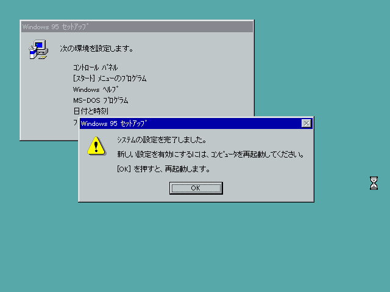

(この記事はQiitaからのコピーです。 本記事の投稿日はQiitaでの投稿日としています。)

この記事は[Tokyo City University Advent Calendar 2019](https://adventar.org/calendars/4282)の14日目の記事です。

13日目は[軍事基地に行こう(提案)](https://bob563.hatenablog.com/entry/2019/12/13/000000)でした。自衛隊のイベントとか、｢おーやるんだ｣と思ってもなかなか行かないことが多いのですが、たしかに最近はTwitter等でも情報が回ってくるので、来年は一度くらい行ってみたいですね。

## はじめに
今年はWindows10 1903、1909が出て、WSL2なども出ましたね。一昔前とはぜんぜん違う方向でのWindowsの進化をひしひしと感じます。そして数カ月後にはついにWindows7のサポートが終わってしまいます・・・(そんなWindows7をRyzen 5 3600とRTX2060で使おうとしてる記事はこちら→ https://blog.mikuta0407.net/posts/2019/20190905-windows7-with-ryzen3thgen-and-rtx2000-series/)

そんな年の瀬ですが、ここであえて、"今の"Windowsの原点とも言えるWindows95を触って、懐かしさに浸ってみるのも面白いなと思い(？)、VirtualBoxへのWindows95のインストールにチャレンジしてみました。

思っていたより~~めんどくさかったです~~時代を感じる罠があるので驚きました。

ちなみに~~実際にやらなくても体験できるように~~VirtualBoxをほとんど触ったことのない人でもできるようにスクリーンショット多めです。

## 必要なもの
- VirtualBox(6.xを使用しました)
- Windows95~WindowsMeの起動ディスクイメージ(またはFreeDOS)
- Windows95のインストールイメージ(今回はCDイメージです)

## 1. 400MBくらいのVHDを作る
人によってはこの工程を行いませんが、確実性を考慮し、この手順を行いました。  
作成するVHDには、このあとWindows95のCDイメージをコピーします(詳しいことは後述)  
今回は"ディスクの管理"を使って行いましたが、VHDが作れるなら何でも良いです。(Diskpartでも)

1. Win+X→「ディスクの管理」→「操作」タブ→「VHDの作成」から、VHD作成画面を呼び出す  

2. 200MBの容量可変VHDを作成する  
CDの内容を書き込むだけなので、400MBで良いです。
ちなみに画像では1000MBで作ってしまっています  

3. 自動でマウントされたVHDを初期化する  

4. GPTなんてDOSは読めないので、MBRにします。  

5. 普通にFAT32でフォーマットする  
  

これで、フォーマット時に指定したドライブレターに、作成したVHDがマウントされました。

## 2. Windows95のCD内のデータをすべてVHDにコピー
さて、なんでいちいちCDのデータをVHDにコピーするかというと、Windows95の起動ディスクが**CD-ROMを読まない**からです。ドライバがないんですね。  
ちなみにWindows98の起動ディスクであったり、FreeDOSを使う場合にはCDの認識が可能なんですが、どちらにせよCDではなくHDDにデータを入れたほうが成功率があがる(気がする)ので、HDD経由でのインストールをします。データ転送方法ですが、わざわざCDの読めるDOSの起動ディスクを使ってxcopy駆使するくらいならホストマシン側で楽をしましょうということで、

コピーしました。

VHDはこのあと仮想マシンで使うので、切り離しておきましょう。切り離さないとVirtualBoxに怒られます。  
「ディスクの管理」→画面下部から対象ドライブ(青いやつ)を右クリック→「VHDの切断」→「OK」

## 3. VirtualBoxで仮想マシンを作成

メモリは贅沢に256MB割り当てちゃいましょう。  
ハードディスクは新規作成で8GBくらいで作っておきましょう。(仮想イメージ形式はVHDがおすすめです。ホスト側Windowsでも特別なソフトを使わずに簡単に読み書きできるので。)

## 4. 仮想マシンの設定
作った仮想マシンを起動する前に、設定→ストレージより、IDEプライマリスレーブに先程作ったVHDを割り当てます。  
「既存のディスクを選択」→「追加」→ファイル選択ダイアログから選ぶ→一覧に追加されているので「選択」  

そしてHDDと同じ要領でフロッピードライブに、起動ディスクを割り当てます。  
「ディスクを選択」→「追加」→ファイル選択ダイアログから選択→「選択」

最終的にこうなります。  

次に、USBを切ります。  
Windows95の頃にはUSBなんて普及してなかったので、インストール時にコケたりしないように切ります。  
設定→USBより、「USBコントローラを有効化」のチェックを外します。  

これでひとまず設定は終了です。  
仮想マシンを起動しましょう。

## 5. Cドライブをフォーマットする
仮想マシンを起動すると、「Starting Windows 95...」の表示のあと、(日本語版の起動ディスクなので)キーボード配列の選択が出てきました。「半角/全角」キーを押すことでJISと認識させます。(FreeDOS等ではこの画面は出なかったはずです)  

選択後はDOSが使えます。ここから、fdiskを利用して、先程OS用に作成したハードディスクのフォーマットを行います。(FreeDOSでも、表記は英語ですが手順はほぼ同じです)

1. FDISKの実行  
fdiskコマンドでFDISKを起動させます。  
  
ここではYキー→Enterで、大容量ディスクのサポートをオンにします。  
  
1番で「MS-DOS領域または論理MS-DOSドライブを作成」を選択します。  
  
1番で「基本MS-DOS領域を作成」を選択します。  
MBRで初期化してくれます。  
  
最大サイズを割り当てましょう。  
終了後はEscキーを2回押してFDISKを終了しようとすると、再起動しろとのメッセージが表示されます。  
  
もう一度EscキーでDOSでに戻り、仮想マシンを再起動させます。(仮想マシン→リセット)

2. ドライブをフォーマット
もう一度半角/全角キーでJIS認識させ、プロンプトになったら、今度は  
`format c:`  
を実行します。  
(もしJIS認識されていない場合は、「:」はShift+「;」です。)  

ファイルなんてなにもないので、y→Enterでフォーマットします。  
  
ボリュームラベルを決められます。安直にWindows95にしました。  
  
フォーマットが完了し、使えるようになりました。

## 6. インストーラを起動、インストール開始
先程、CDの内容が入っているHDDをプライマリスレーブに割り当てたので、そのHDDはDドライブになっているはずです。`d:`でドライブを変更しましょう。  
変更後、`SETUP`と打ち込んでインストーラを起動しましょう。

実行するとこうなります  
  
チェックをしてくれるらしいのでお願いしましょう。  
  

ScanDiskが実行されました。Xキーを押してScanDiskを終了させます。  
すると、以下のようにWindows 95のGUIインストーラが起動してきます。  
  
普段のWindowsのインストールのようにライセンスに同意したら、セットアップウィザードです。ここらへんは昔から変わってません。どんどん進めていきましょう。  

ドライバは全部入れちゃいましょう  

起動ディスクの項目は、FreeDOSからインストールしている場合は念の為に作っておきましょう。「はい」を選び、VirtualBoxで「デバイス」→「新規フロッピーディスクの作成」からイメージを作っておきましょう。  

ファイルコピーの進捗度に合わせてスライドが変わるのですが、速くてなんにも読めません。  

ファイルのコピーが終わり、マシンの再起動を求められます。まずフロッピーを抜きましょう。(デバイス→フロッピーディスク→仮想ドライブからディスクを除去)  

そうしたら、**OKを押した瞬間からF12を連打** します。(VirtualBoxのブートメニューを表示させる)  

表示されたら、**一切ブートせず**、仮想マシンの電源を切ります。(画面を閉じます)

## 7. 高速CPU対応用のパッチを当てる
実はここが今のPCの仮想マシンにWindows95を入れるときの罠です。  
仮想マシンなんだから古いOSが簡単に動いてもいいのですが、Windows95は(今に比べたら)遥かに遅いCPUを前提に作られているOSです。今のPCのCPUは速すぎるのです。それゆえ、このまま再起動してしまうとこうなります。  

これでは何も出来ません。なので、高速CPUに対応させるためのパッチを当てます。(作った人すごいですね)  
http://www.tmeeco.eu/9X4EVER/GOODIES/FIX95CPU_V3_FINAL.ZIP  
↑これをダウンロードすると、中にISOが入っているZIPが手に入りますので、展開してISOを取り出しておきます。

次に、仮想マシンの設定を開き、「ストレージ」→光学ドライブからイメージ割当→先程手に入った「FIX95CPU.ISO」を割り当てます。  
  

ついでに、「ディスプレイ」→「ビデオメモリ」を贅沢に128MBにしちゃいましょう。(しなくてもいい)  

では、改めて仮想マシンを起動しましょう。

起動すると、こんな真っ赤な画面が出てきます。  
  
High-Speed Processor Support、直球ですね。

指示通り、なにかキーを押します。  
すると、README読むか聞かれますが、読まなくても別にいいのでNキーで飛ばします。  

また何かキーを押すと、パッチが当たります  

これで高速CPU対応が出来ました。何かキーを押し、「デバイス」→「光学ドライブ」→「仮想マシンからディスクを除去」でCDを抜いて再起動しましょう  

## 8. セットアップ続行
もし、Startup Menuが出てきたら、Safe ModeではなくNormalを押して通常起動させます。  

コンピュータ名などの入力が始まります。  
ひとまずコンピュータ名を入力し、ワークグループも入力(WORKGROUPで良いと思います)したら、左側のタブ「ﾈｯﾄﾜｰｸの設定」に行きます。

このままではTCP/IPが使えないので、「追加」を押し、  

「プロトコル」をクリックしてから「追加」を押します。  

「Microsoft」から「TCP/IP」を選択し、「OK」で決定します。  

ネットワーク構成欄にTCP/IPがあることを確認したら、「閉じる」で続行します。  

バージョンの競合とか言ってくることがありますが、コピー元はどうせ一緒なので「現在のファイルをそのまま使う」にしましょう。

すると、今のPCでもたまに見かけるような画面が出てきます。  

このあとはタイムゾーンやプリンタ等の設定ですが、タイムゾーンは別に弄らなくていいので「閉じる」で続行します。  
プリンタも仮想マシンには必要無い(と思っている)ので、「ｷｬﾝｾﾙ」します。

セットアップが完了し、再起動を求められます。再起動しましょう。  

ログイン画面が出てきました。ユーザー名は先程入力したものを、パスワードは今考えたものを入力しましょう。  

  
お疲れ様でした。Windows95がインストールできました。  
最後に、グラフィックドライバを入れましょう。

## 9. グラフィックドライバを当てる
このままだと16色しか使えないので、  

↓を落としてきます。  
https://web.archive.org/web/20190210203844/http://bearwindows.boot-land.net/140214.zip  
(出典:https://web.archive.org/web/20190210203844/http://bearwindows.boot-land.net/vbe9x.htm)

展開するとこんな感じです。  

次に、仮想マシンのメニューから、「デバイス」→「光学ドライブ」→「新規アドホックVISOの作成」に行きます。  
これは、ホストマシンからゲストマシンへ、拡張機能等入れずにも仮想マシンのCDドライブ経由でデータが渡せるｽｯｺﾞｲ便利な機能です。(本当にありがたい)  
上部のファイラーから、先程展開したフォルダを下部にドラッグします。  

OKを押せば、今下側に入れたファイルが入った(ように見える)仮想ディスクが仮想マシンに挿入されます。  

デスクトップ→右クリック→「画面のﾌﾟﾛﾊﾟﾃｨ」→「ﾃﾞｨｽﾌﾟﾚｲの詳細」→「詳細ﾌﾟﾛﾊﾟﾃｨ」→「変更」でアダプタの変更ができます。  
現在は「ｽﾀﾝﾀﾞｰﾄﾞ PCI ｸﾞﾗﾌｨｯｸｽ ｱﾀﾞﾌﾟﾀ(VGA)」になってるはずです。

右下の「ﾃﾞｨｽｸ使用」から、  

「参照」をクリックし、ドライブ欄から先程のディスクを選択、`140214\128mb`を選択し「OK」を押します。  
  
もう一度OKを押すと、このようなダイアログが出てくるので、また「OK」を押します。  

ディスプレイアダプタが変更されました。  

このままOKをするとこんなのが出てきますが、閉じて、  

閉じましょう  

このままだとRundll32がエラー吐いたせいで何も出来ないのでスタートメニューから再起動します。  

再起動したのに勝手に電源が落ちた場合は、手動で起動し、セーフモードではなくNormalで起動します。

再起動すると、色がたくさん選べるように。どうせなので「~~TRUE COLORS~~ True Color (32ﾋﾞｯﾄ)」を選択しましょう。  

右下の「詳細ﾌﾟﾛﾊﾟﾃｨ」から、「ﾓﾆﾀｰ」→「変更」に行きます。  
  
「Super VGA」の中から好きな解像度を選びましょう。  
ダイアログを閉じるとリフレッシュレートの云々がですが、指示に従いましょう。

解像度が800x600や、それ以外にも自分で今選んだモニタの解像度までの解像度がいくつか選択できるようになっています。  

好きな解像度にして、「OK」を押して再起動すれば・・・  
  
きれいなフルカラーの表示、1024x768の広大な画面領域が手に入ります!

あとはFirefox1.0を入れてブラウジングするなりして、Windows95を楽しみましょう!!

## あとがき
さて、この記事需要あるんでしょうか・・・  
まぁ作業記録でもありますので、価値は0じゃないと信じています。  
ちなみに25日にらぴーとさんによる、VMwareにWindows98を入れてみる回もあるそうなので、そちらもぜひ。

### 宣伝
4日目に[C言語開発環境を構築しよう! ～超遠回り編～](https://blog.mikuta0407.net/posts/2019/20191204-c-dev-env-for-msdos/)
10日目に[個人シンクライアント運用のすゝめ](https://blog.mikuta0407.net/posts/2019/20191210-recommendations-for-thin-client/)
も書いてます。そちらもぜひ
次の記事: @ke9000による[スマホに音楽データ入れるとストレージ食うけど家にあるCDを持ち運びたくない？解決法、あります！]() です!お楽しみに!(僕はGooglePlayMusicのロッカー機能派)

