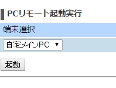
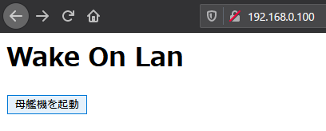
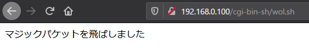

(この記事はQiitaからのコピーです。 本記事の投稿日はQiitaでの投稿日としています。)

WiFiルーターを買い替えたら、発売日的に6年後のモデルなのに、以前の機種にあった"PCリモート起動"(ルーターのWebツールでWoLのマジックパケットを飛ばせる機能)が消え失せました。(WR8750N→WG1200HS3)

ブラウザでWoL飛ばせるのがすごい便利だったのですが、無くなったものは仕方ない。自分でどうにかせねばということで、可能な限り手間を掛けずに今までと同じような機能を作ってみます。

## 必要なもの

- 家のLANとインターネットに繋がっているRaspberry Pi的なやつ(お好きなものをどうぞ)

## どんな感じにするかを考える

"PCリモート起動"とはどういう画面だったかを思い出すと……

こんな感じでした(実機をしまってしまったので、 https://michisugara.jp/archives/2015/home_ip.html からお借りしました。)  
  
題名と端末選択と起動ボタンですね。  
自宅LANで使うだけの無くなった機能を復活させたいだけなので、プルダウンメニューは再現せずに行きます。

## 方針
- ラズパイ側はこれだけのためにphpとかPerlとか入れるの面倒なので、シェルスクリプトをCGIとして起動してマジックパケットを飛ばす
- JavaScriptは使わない
- HTML5なんて知らん

## やることを3行でいうと・・・
- Apache入れてCGIとしてシェルスクリプト実行できるようにする
- HTML書く
- シェルスクリプト書く

## Raspberry Piにapacheとetherwake(WoL飛ばせるソフト)を入れる

```
$ sudo apt install apache2 etherwake
```

## Apacheの設定
apacheに.shファイルもCGIとして動かしてねってお願いします。

/etc/apache2/sites-available/wol.conf というファイルで以下の内容を作成します(ファイル名はわかりやすければ良い)
```
ScriptAlias /cgi-bin/ "/var/www/cgi-bin/"
<Directory "/var/www/cgi-bin">
  AllowOverride None
  Require all granted
  Options +ExecCGI -MultiViews +SymLinksIfOwnerMatch
  Order allow,deny
  Allow from all
</Directory>

AddHandler cgi-script .sh
```

保存したら今書いた設定を有効化します

```
$ sudo a2ensite wol.conf
$ sudo service apache2 reload
```

apacheがcgiを実行できるようにします

```
$ sudo a2enmod cgid
```

apacheを再起動します

```
$ sudo service apache2 restart
```


## HTMLを書く
こんなのを書きました。最低限ですね。  
/var/www/cgi-bin/に、wol.shというファイルを作成する前提です。

```html {name="/var/www/html/index.html"}
<html>
    <head>
        <meta charset="utf-8"/>
        <title>Wake On Lan</title>
    </head>
    <body>
        <h1>Wake On Lan</h1>
        <button onclick="location.href='http://192.168.0.100/cgi-bin/wol.sh'">母艦機を起動</button>
        <!-- 二台以上ある場合は、指定するシェルスクリプトの名前を適宜個別に変更して必要数作って羅列しましょう。-->
    </body>
</html>
```

こんな感じになります  



## シェルスクリプトを書く

/var/www/cgi-binに、wol.shという名前で書きました。

```shell {name="/var/www/cgi-bin/wol.sh"}
#!/bin/sh -xv

echo "Content-Type: text/html; charset=UTF-8"

wakeonlan 0a:1b:2c:3d:4e:5f > /dev/null

echo ""
echo マジックパケットを飛ばしました
```

-xvというオプションは、実行した文をそのまま出力するオプションらしいです。書いておいたらapacheのログにコマンド等が残りました。なくてもいいかな?

`echo "Content-Type: text/html; charset=UTF-8"`はHTMLヘッダです。これがないと結果の画面を表示してくれないので、HTMLヘッダをechoで吐き出してもらいます。

`wakeonlan 0a:1b:2c:3d:4e:5f > /dev/null`は、WoLのマジックパケットを飛ばしてくれる部分です。MACアドレスは適宜変更してくださいね。 ただ、どうもIPアドレス指定がなかったりすると、CGIとして実行時にエラーを吐き、Internal Server Errorが出ちゃうので、エラーメッセージを/dev/nullに投げてもみ消します。(動けばいいんです。)

最後はブラウザに文字を表示するための部分です。表示さえしてもらえればいいので特にタグとかつけませんでした。

次にシェルスクリプトを実行できるようにします。

```
$ sudo chmod +x wol.sh
```


## 試す


これで対象のマシンが起動してきたら成功です。

## 〆
元の機能よりだいぶ簡略化されましたけど、これで目的が果たされたので満足です。  
ただ元のやつと違って、w3mでボタンが押せなくなったのでHTMLの編集が必要そうです・・・(inputタグでやればいいのか?)

Apache経由でシェルスクリプトの実行という部分を応用すれば、色々といろんなことが出来そうな気がします。

## 参考にしたサイト
- CGI用のシェルスクリプトの書き方
  - 「UEC - usp engineers' community - UECジャーナル」
  - https://uec.usp-lab.com/JOURNAL/CGI/JOURNAL.CGI?POMPA=KAIGAN_journal19
- etherwakeについて
  - 「Raspberry Piで自宅内のWindows機を起動させる (Wake-on-LAN) - たねやつの木」
  - https://www.taneyats.com/entry/raspi-wake-on-lan#Raspberry-Pi%E3%81%AE%E8%A8%AD%E5%AE%9A
- confファイルの書き方
  - 「ubuntu16.04のApache2設定/cgi設定 - Qiita」
  - https://qiita.com/kummn/items/f6bd0f3e643595ed077a
