この記事は[Tokyo City University Advent Calendar 2020](https://adventar.org/calendars/5110)の2日目の記事です。

昨日の記事は [@920OJ](https://twitter.com/920OJ) さんによる [TCU-vRSAとは何だったのか](https://b.920oj.net/what-is-vrsa/) でした!

1日目との落差が激しいですがよろしくお願いします。 

**突然ですが、フロッピーディスクの容量、ご存知ですか?**

かなりの人はこの質問に対して「1.44MB」と答えるかと思います。1.44MBも正しい解答です。ですが、実はフロッピーディスク(一般的な3.5インチのもの)は、2つの種類があります。

1.44MBと言われるものは、1985年に開発された、「2HD」という種類のものです。実は、それよりも前、1980年に初めて開発された3.5インチのフロッピーディスクは、2DDと呼ばれるもので、なんと容量が半分の720KBです。(2DDの倍の容量ということで2HDが1.44MB)  
720KBは、もう一般的な写真一枚ですら入りません。技術の進歩ってすごいですね。(ストレージの進化の意味で)

今回の記事の題名は「2DDのフロッピーディスクに"聴ける"音楽を入れる」です。ということは、720KBの容量に音楽ファイルを入れるということになります。一般的に320kbpsの音楽が10MB前後ですので、720KBそれの1/10以下のファイルサイズです。  
そして720KBのファイルサイズで、とりあえずそれなりにちゃんと音楽として認識できるほどの音質を実現します。

・・・と壮大なことを言っていますが、やることは以下です。
- 音楽ファイルをffmpegでビットレートを指定して圧縮する
- 容量限界のサイズまで調整をがんばる

それではやっていきましょう。

## 2DDのフロッピーディスクの容量

730,112byte先程から720KBと言っていますが、この規模だともはやバイト単位で調整が始まります。2DDのフロッピーディスクは、未フォーマット状態で730,112B入ります。これをFATでフォーマットするので、2048Bを管理領域に食われます。なので、実際は728,064Bが最大容量です。

ということで、ファイルのサイズ<=728,064Bになるように調整をしていきます。

## 音源の準備をする
本当は素材として東京都市大学の学園歌である「夢に翼を」を使おうと思ったのですが、完成したデータをこのサイトで公開できないという問題が発生するため、別のフリー音源を使います。

と、丁度いいフリー音源を探す旅に出てみたのですが、時間が膨大にかかってしまうということもあり、「それなりにいろんな楽器が鳴っている」「ボーカルがある」「("インターネット"上で)ある程度知名度がある」「勝手にアップロードしても(たぶん)怒られない」という3つの特徴を兼ね揃えているということで、コンギョでやってみることにしました。  
なんかもうちょっといい音源があるはずなんですが、時間の都合もあるため、ごめんなさい。

事前準備として、エンコの時間を短縮(と言ってもそんなじゃないですが)するため、公式サイトから落としてきた`music.mp3`をwavにします。

```
ffmpeg -i music.mp3 orig.wav
```

このあと、Mp3TagでWAVにひっついてるタグを消し去りました。1Bでも音源の方に容量を振りたい。

ちなみに、元の`music.mp3`は、128kbpsのMP3で、2,626,564Bです。  
そして変換後のWAVは28,947,792Bです。

```bash
$ du -b orig.wav
28947792        orig.wav
```

## おことわり
実は試している最中に、WSL1でのffmpegを使ったエンコードと、VPSのUbuntuでのffmpegを使ったエンコードで、容量や音質に若干の違いがありました。おそらくffmpegのバージョンの問題かと思われます。  
どちらを使ったかに関しては、記事内に記載してあるので許してください。  
正直このレベルでのエンコーダのことは考えたくないのでこれ以上追求しません。

使用バージョン:
- WSL1: ffmpeg version 4.2.4-1ubuntu0.1
- VPS: ffmpeg version 3.4.8-0ubuntu0.2

## まずはAACでやってみる
最初はMP3でやってみようとしたのですが、ffmpegのオプション的にどうやら720KB以下に収めるのがかなり難しそうなので、AACでやってみます。  
HE-AACのほうが本当は低ビットレートに対応しやすく、今回の目的に適しているのですが、ffmpegを自分でコンパイルする必要があり、こんな目的のためにやるには、非常にめんどくさいので普通のAACでやります。

先程"おことわり"に書いたのですが、AACでのエンコードをWSL1のUbuntu20.04とVPSのUbuntu18.04でやってみたところ、VPSのほうでやったほうが小容量で音質が良かったため、このAACの部分では**VPSの方**を使っています。

とやる前に、毎回ffmpeg叩いてからduでバイト数を出すのも面倒なので、簡単なシェルスクリプトを書きます。引数にビットレートを渡せばそのビットレートでエンコードし、duまで出してくれるやつです。

```bash {name="aac.sh"}
#!/bin/bash
ffmpeg -loglevel quiet -i orig.wav -ab ${1}k -ac 2 -f mp4 aac${1}.m4a
du -b aac${1}.m4a
```

まずは32kbps。

```bash
$ ./aac.sh 32
688985  aac32.m4a
```

一気に小さくなり、688,985Bになりました。とりあえず聴く前に、可能な限り容量を上げていこうと思います。

では一旦大きく上げて40kbps  

```bash
$ ./aac.sh 40
854093  aac40.m4a
```

飛び越えてしまいました。では35kbps。  
```bash
$ ./aac.sh 35
751057  aac35.m4a
```

まだ大きいです。次に34kbps  
```bash
$ ./aac.sh 34
#729530  aac34.m4a
729802  aac34.m4a
```

惜しい! では小数の領域に入りまして、33.5kbps。  
```bash
$ ./aac.sh 33.5
718983  aac33.5.m4a
```

もうちょっと上げられそうです。  
```bash
$ ./aac.sh 33.6
721600  aac33.6.m4a
$ ./aac.sh 33.7
723394  aac33.7.m4a
$ ./aac.sh 33.8
725143  aac33.8.m4a
$ ./aac.sh 33.9
728005  aac33.9.m4a
```

728,005Bとなり、残りあと59Bのようです。これが限界です。

それでは完成を聴いてみましょう

<figure>
    <figcaption>AAC 33.9kbps</figcaption>
    <audio
        controls
        src="https://mikuta0407.net/files/tcuac2020/aac33.9.m4a">
            Your browser does not support the
            <code>audio</code> element.
    </audio>
</figure>
聴けない場合: [AAC 33.9kbps](https://mikuta0407.net/files/tcuac2020/aac33.9.m4a)

・・・なんでしょう、すごい質の悪いラジオみたいな感じですね・・・。  
これでは"聴ける"とは言えません。ではAACは諦めて、次に行ってみましょう。


## Opusでやってみる
なんかAACのほうでグダグダになってしまいましたが、本命Opusをやります。  
Opusは、DiscordのVCでも使われていますが、遅延の少ないオーディオコーデックです。(詳細は[Wikipedia](https://ja.wikipedia.org/wiki/Opus_(%E9%9F%B3%E5%A3%B0%E5%9C%A7%E7%B8%AE))で)  
本来はリアルタイム伝送等のためのフォーマットですが、普通に音声ファイルとして扱うこともできます。後発ということもあって、ビットレートあたりの音質がかなり良くなっています。  
また、OpusファイルはWindows10のGrooveミュージックやiOSでも簡単に再生できるので、音楽ファイルとしての扱いも簡単です。(ただしフロッピーディスク時代のパソコンでは対応ソフトが無くてほぼ再生できない)  
opusも、AAC同様ffmpegで簡単に変換できます。

シェルスクリプトはこんな感じです。
```
#!/bin/bash
ffmpeg -loglevel quiet -i orig.wav -acodec libopus -b:a ${1}k opus${1}.opus
du -b opus${1}.opus
```

今回はVBR有効で行います。

ちなみに、こちらは**WSL1**でやっています。ちょっとだけ理由を。  
先程AACでやったときに34kbpsがちょっとオーバーするくらいだったので、34kbpsでエンコードをしてみました。すると・・・

まずはWSL(Ubuntu20.04)。  
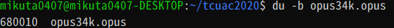

次にVPS(Ubuntu18.04)。  
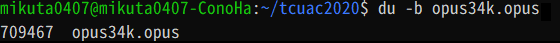

結構違うんですよね・・・。Opusの場合はWSL1(Ubuntu20.04)のほうが圧縮が良さそうなのと、聴き比べたときに元音源の雰囲気率が高かったのがこちらなので、WSL1の方でやってみます。

本題に戻りますが、↑の比較画像を見てわかるかと思いますが、同じ34kbpsでもAACとOPUSで全然容量が違うことがわかります。この段階で一度再生してみると、全然雰囲気が違うので驚くのですが、とりあえず先に進みます。

先ほどと同じ用に試していきます。34kbpsでは入ることがわかったので、一旦40kbpsにしてみます。

```bash
$ ./opus.sh 40
799542  opus40.opus
```

さすがに飛び越えました。このあと、35kbps, 36kbps, 37kbpsを試していたところ、36kbps~37kbpsの間に壁がある事がわかりました。

```bash
$ ./opus.sh 35
699827  opus35.opus
$ ./opus.sh 36
720576  opus36.opus
$ ./opus.sh 37
740493  opus37.opus
```

頑張って下げていきましょう。

```bash
$ ./opus.sh 36.5
730518  opus36.5.opus
$ ./opus.sh 36.4
728548  opus36.4.opus
$ ./opus.sh 36.3
726547  opus36.3.opus
$ ./opus.sh 36.39
728274  opus36.39.opus
$ ./opus.sh 36.38
728165  opus36.38.opus
$ ./opus.sh 36.37
727926  opus36.37.opus
$ ./opus.sh 36.375
728051  opus36.375.opus
```

・・・! 残り13B・・・! もうこれ以上上げることは出来ないでしょう・・・  
(ちなみにタグを消してみたりしましたが、36.375kbpsが限界でした)

それでは聴いていただきましょう。

<figure>
    <figcaption>OPUS 36.375kbps</figcaption>
    <audio
        controls
        src="https://mikuta0407.net/files/tcuac2020/opus36.375.opus">
            Your browser does not support the
            <code>audio</code> element.
    </audio>
</figure>
聴けない場合: [OPUS 36.375kbps](https://mikuta0407.net/files/tcuac2020/opus36.375.opus)

どうですか? AACと全然違い、「多少圧縮は感じるけど710KBにしては良く聴ける音」じゃないですか・・・?

ということで、いろいろと脱線したりしましたが、無事2DDのフロッピーに入る、かつそれなりに良い音質の音源の作成に成功しました!
　
<br><br><br><br><br><br><br><br><br><br><br>

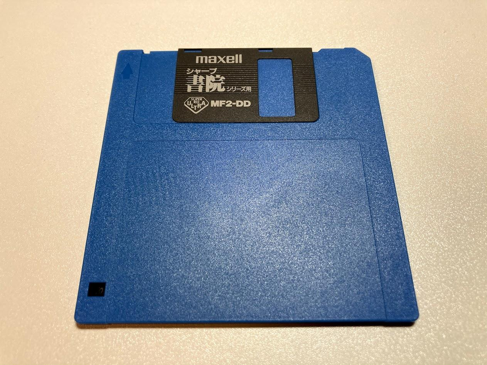

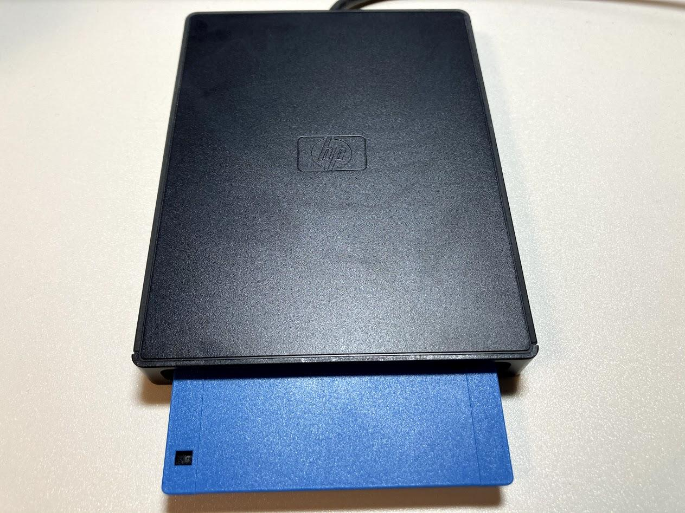

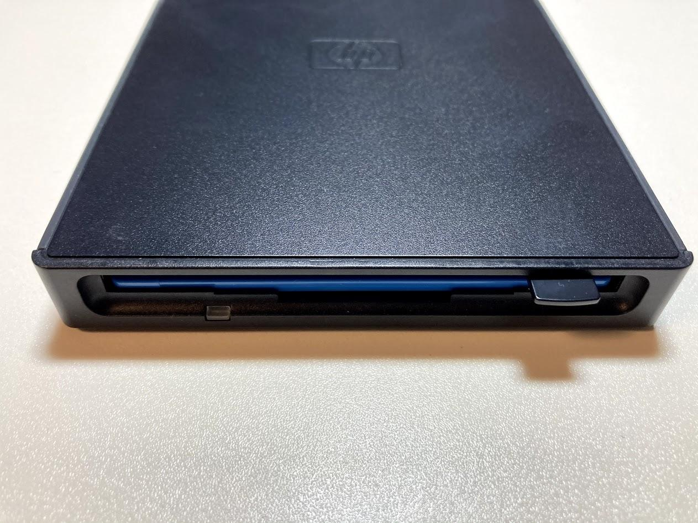

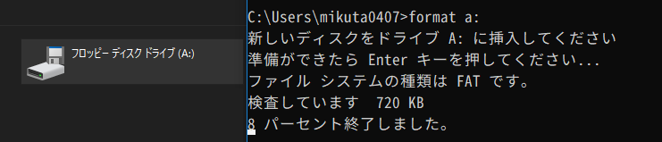

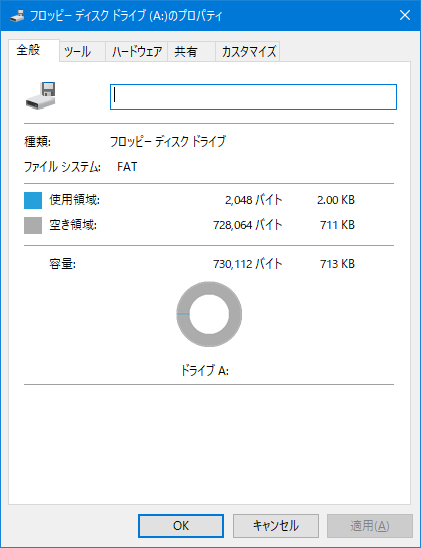

ここまでやったら実際に2DDのフロッピーディスクに入れて再生しなきゃ意味がないですよね。というわけで実際に入れていきます。

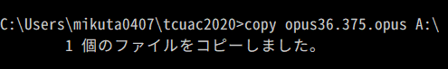

コピーが終わると、残り0クラスタとなり、空き容量が0Bになりました。  
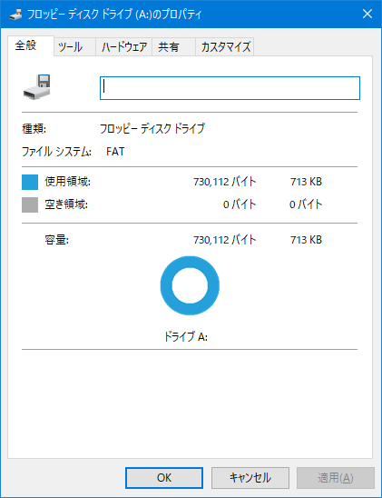

2DDのフロッピーディスク、容量いっぱいいっぱいまで使っています。  
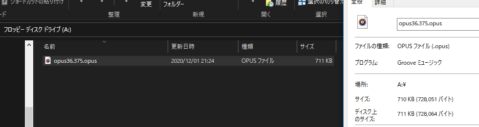

ではVLCで再生してみましょう・・・  
転送レートが微妙に足りない・・・!!!!!!!!!!!!!!!  
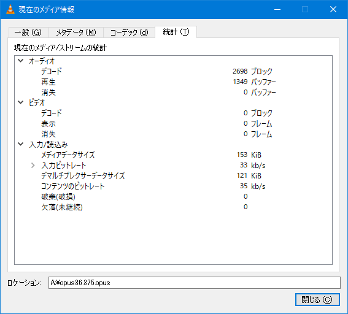

ある程度止まらず流れるのですが、たまにバッファが足りず止まります・・・。  
リアルタイム再生は流石にギリギリ無理ですね・・・。
　
<br><br><br><br><br><br><br><br><br><br><br><br><br><br><br><br><br><br>

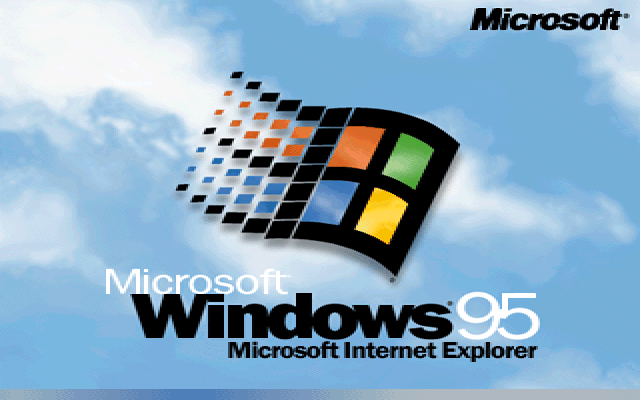

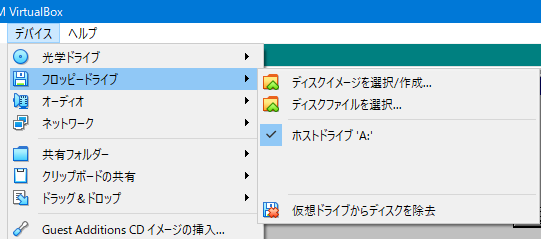

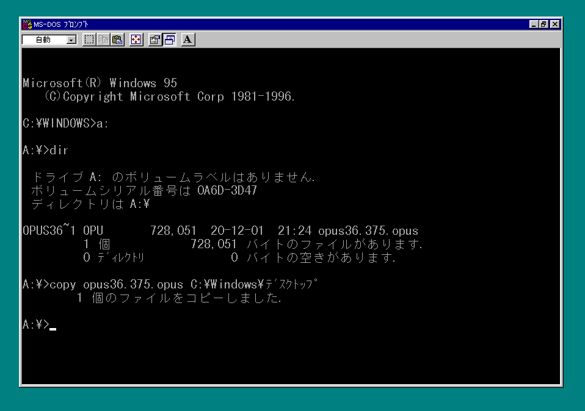

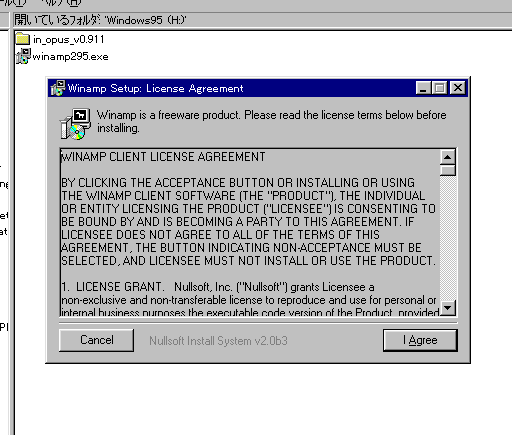

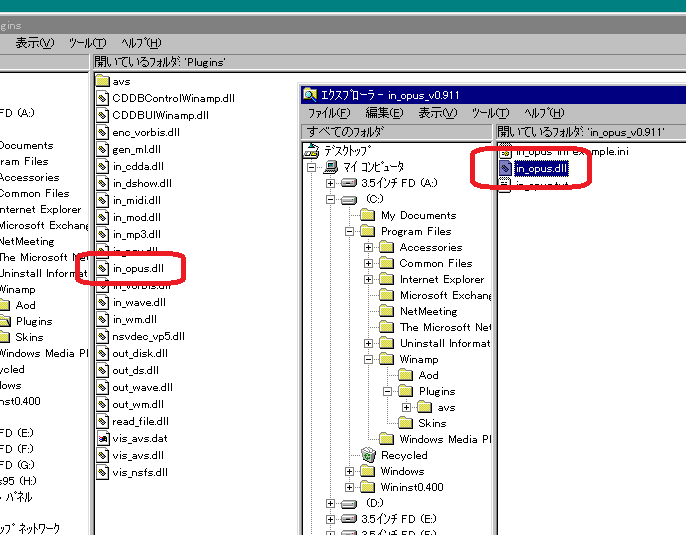
(http://forums.winamp.com/showthread.php?t=452974)

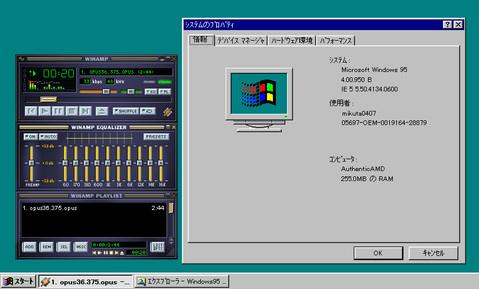

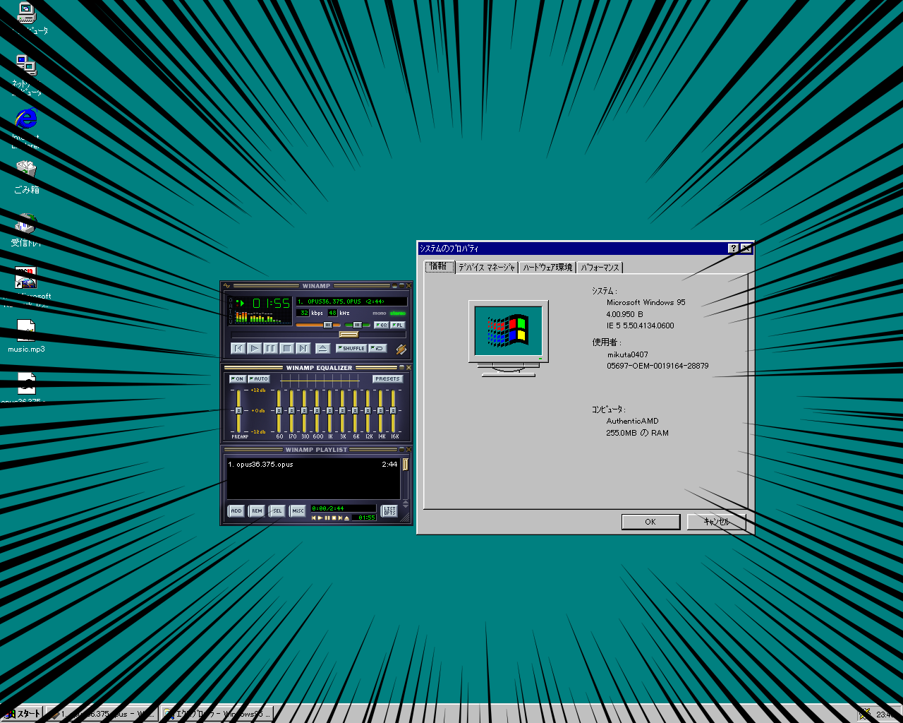

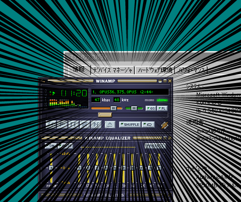


以上! #tcuac2020 二日目の記事でした!

明日はらぴーとさんの「2HDのフロッピーに動画を入れないか？」です。連続のフロピネタ、お楽しみください。
