この記事は[Tokyo City University Advent Calendar 2020](https://adventar.org/calendars/5110)の9日目の記事です。

昨日の記事は [@aqp_nmu](https://twitter.com/aqp_nmu) さんによる ["それっぽい"配信環境を整えてきもちよくなろう - ふとんのなか](https://yurufuwa-atelier.hatenablog.jp/entry/2020/12/08/000000) でした!

よく見かけるあの配信画面はこんな感じで作るのか・・・と勉強になりました。  
特に2560x1440にしておけばFHDがそのまま置けるしサイズ感もいい感じ、というのが驚きで・・・。確かにそうなんですが、すごい発想ですよね。

さて、今日の記事はフロッピーでもMS-DOSでもWindows95でもなく、シェルスクリプトを使ったお話です。 [ケーさんの好きなJSじゃないよ!](https://ke9000.hatenablog.com/entry/nativeJS_01) Shell Scriptだよ!

構成としては説明→配布→内容解説なので、是非内容解説まで読んでいただけると幸いです(長いですけど)

## はじめに

都市大生のみなさんはいつも~~使わされてる~~お世話になっている都市大の出席確認システムですが、毎回

1. アクセスしてログイン
2. 番号を選ぶ
3. 教科を選ぶ
4. 登録
5. 登録完了!

という、地味に手数の多い作業を行います。別に構わないといえば構わないのですが、少ない手数で出席確認の登録ができれば、非常に楽になります。

そこで、今回は出席確認を

- ページにアクセス
- 数字をクリック
- 登録完了!

のように非常にかんたんな手順で済むようなシステムの構築をしてみました。

タイトルに2クリックとありますが、これはChrome拡張化することで、拡張のボタンクリック→数字クリックの2回にできるものとなっています。もちろんChrome拡張にしなくてもブックマークでも同じですので、ぜひ試してみてください。(**Chrome拡張配布もあるよ!**)

## まずは動作サンプル

サイトにアクセスするとこうなります  
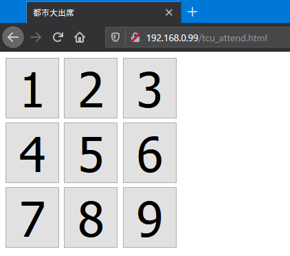

数字ボタンを押すだけで出席登録できますので、このページをブックマークに登録しておけば、「ブックマーククリック→番号ボタンクリック」の2クリックになりますね。(ブラウザが変わった? 気にしないでください・・。)  
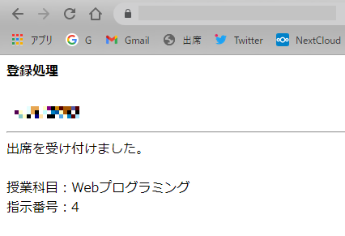

時間外にアクセスすると、ちゃんとエラーが出ます。  
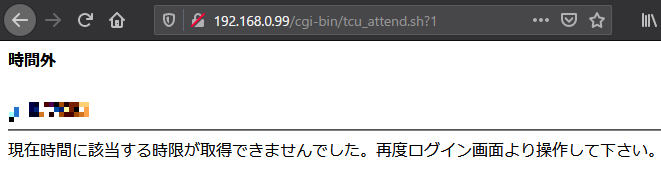


## 特徴
- puppeteerなどの重いソフトを使用していないので、サーバリソースが小規模で済む
- シェルスクリプトかつ使用コマンドは基本ツールだらけなので、アーキテクチャ依存は一切ない(ただしshじゃなくbash依存です。zshはわかりません)

## ブラウザとかを使うマシン以外に必要なもの

- Bashが使えてインターネットに出れるLinux機
  - VPSのように、どこからでもアクセスできるほうが便利ですが、URLが漏れると誰でも出席確認登録が行えてしまうので、そこは注意してください。(とはいえ誰がやろうが設置した人の出席確認になってしまうだけなのでリスクは微妙)
    - 適切に設置すればパスワードが漏れることはほぼ無いです
    - WindowsならWSLでやるというスタンドアロンな手段もあります。
    - もちろんLinuxをメイン機として使ってる人はその中でもどうぞ

## Webサーバーの準備
今回は説明用環境にRaspberry Pi Zero+Raspbianを利用していますので、もろもろのパスとかコマンドはDebian系になっています。  
違うディストリを使う場合は適宜変更してください。  
また、説明に使用しているアドレスは`http://example.com/`です。ここも適宜読み替えてください。

### Apache2とnkfのインストール
WebサーバーとなるApacheと、SJISで送られてくるサイトをUTF-8で処理するための文字コード変換のためのnkfを入れます。

```bash
sudo apt update
sudo apt upgrade
sudo apt install apache2 nkf
```

### 疎通確認

アクセスしてみて、デフォルトページが表示されていればOKです。  
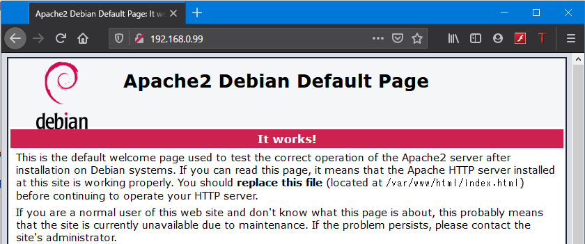

### cgidの有効化
CGIを使えるように、モジュールの有効化をします

```bash
sudo a2enmod cgid
```

Apache2を再起動します

```bash
sudo systemctl restart apache2
```

### cgi-binのディレクトリの変更+シェルスクリプトをCGIとして動かせるようにする

デフォルトだと、CGIのディレクトリが`/usr/lib/cgi-bin`のため、コンソールからのアクセス性が悪くなっています(HTMLファイルは`/var/www/html`なので)。  
そこで、ディレクトリを`/var/www/cgi-bin`に変更した上で、ついでにシェルスクリプト(`.sh`)もCGIだよって教えてあげます。そうしないとCGIとしてシェルスクリプトが動かないので・・・。

まず、以下がデフォルトの設定(抜粋)です。Directoryが`/usr/lib/cgi-bin`になっていますね。

```xml {name="/etc/apache2/conf-available/serve-cgi-bin.conf"}
ScriptAlias /cgi-bin/ /usr/lib/cgi-bin/
<Directory "/usr/lib/cgi-bin">
	AllowOverride None
	Options +ExecCGI -MultiViews +SymLinksIfOwnerMatch
	Require all granted
</Directory>
```

これを、以下のように変更します

```xml {name="/etc/apache2/conf-available/serve-cgi-bin.conf"}
ScriptAlias /cgi-bin/ /var/www/cgi-bin/
<Directory "/var/www/cgi-bin">
	AllowOverride None
	Options +ExecCGI -MultiViews +SymLinksIfOwnerMatch
	Require all granted
</Directory>

# .shもCGI
AddHandler cgi-script .sh
```

変更を適用するために、Apache2を再起動します。

```bash
sudo systemctl restart apache2
```

### 動作確認

本当にCGIとしてシェルスクリプトが動くのか実験します。

以下のシェルスクリプトを`/var/www/cgi-bin/test.sh`として保存します。(cgi-binフォルダは多分無いので作ってください)

```bash {name="/var/www/cgi-bin/test.sh"}
#!/bin/bash
#↑ bashで動いてもらいます。bash依存してなければ#!/bin/shでもOK

# レスポンスヘッダ(なにかサイトで文字を返す前にはこれが必要です)
echo "Content-Type: text/html; charset=UTF-8"
echo ""

# 以下自由
echo "Hello World!"
```

実行権限を付与します。個人サーバーでユーザーは一人しかいないので、めんどくさいので777にします。(複数人で使用してたりする場合は適宜適切に設定してください。)

```bash
sudo chmod 777 test.sh
```

これでアクセスすると、Hello Worldが表示されるはずです。(アドレスは`http://サーバーアドレス/cgi-bin/test.sh`)  
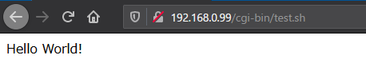

## 実プログラムの配置
どうやって作ったかはいらん! 早く中身をよこせ!っていう人もいる(かもしれない)ので、まずは設置と使い方を書きます。

### ディレクトリ作成

HTMLを取得して保存して作業をするので、その作業ディレクトリの作成と、www-dataがそのフォルダを読み書きできるようにchownで所有者を変更します。

```bash
sudo mkdir /var/www/cgi-bin/htmlcache
sudo chown www-data:www-data /var/www/cgi-bin/htmlcache
```

### シェルスクリプト
このシェルスクリプトが処理の全てです。内容は後で説明します。

以下を**uidとpassを自分のものに置き換えてから**保存したあと、ちゃんと実行権限の付与をしてあげてください。  
(この平文保存部分に関して、文句言いたい人がいるかも知れませんが、まぁCGIなのでそう簡単に漏れないのと、後述する方法でギリギリ対策(?)ができますので許してください。)

Gist: https://gist.github.com/mikuta0407/9464d86a597b9a08660387e3a9dcdff1

```bash {name="/var/www/cgi-bin/tcu_attend.sh"}
#!/bin/bash

# ログイン処理
curl -X POST https://call.off.tcu.ac.jp/index.php -d "uid=ログインID" -d "pass=パスワード" -d "menuname=%8Fo%90%C8" -d "module=Default" -d "action=Login" | nkf > /var/www/cgi-bin/htmlcache/selectkamoku.html
# selectkamoku.htmlがログイン後のページ全てなので、以下はすべてこれを利用して処理

# ログイン可否判定
cat /var/www/cgi-bin/htmlcache/selectkamoku.html | grep パスワード > /dev/null
if [ $? = 0 ]; then
	# ログイン失敗
	echo "Content-Type: text/html; charset=UTF-8"
	echo ""
	cat /var/www/cgi-bin/htmlcache/selectkamoku.html
	exit
	
else
	# ログイン成功のとき
	
	# 時間外かどうかを判定
	cat /var/www/cgi-bin/htmlcache/selectkamoku.html | grep 現在時間に > /dev/null
	if [ $? = 0 ]; then
		# 時間外のとき
		echo "Content-Type: text/html; charset=UTF-8"
		echo ""
		echo "<b>時間外</b><br><br>"
		cat /var/www/cgi-bin/htmlcache/selectkamoku.html
		
	else
		# 時間内で登録ができるとき
		
		# セッションID持ってくる
		sessid=`cat /var/www/cgi-bin/htmlcache/selectkamoku.html | grep "PHPSESSID" | sed -e 's/<form action="index.php" method="post"><input type="hidden" name="PHPSESSID" value="//g' | sed -e 's/" \/>//g'`

		# 科目の番号
		selkamoku=`cat /var/www/cgi-bin/htmlcache/selectkamoku.html | grep '[0-9]\{4\},[0-9]\{8\}' | sed -e 's/<option value="//g' | sed -e 's/">.*//g' | sed -n 1p`

		# 出席登録
		curl -X POST https://call.off.tcu.ac.jp/index.php --cookie "PHPSESSID=${sessid}" -d "module=Sk" -d "action=ProcedureAcc" -d  "SelKamoku=${selkamoku}" -d "InpNo=${1}" -d "submitButtonName=%8Fo%90%C8%93o%98%5E" | nkf > /var/www/cgi-bin/htmlcache/success.html
		
		# 最終結果表示
		echo "Content-Type: text/html; charset=UTF-8"
		echo ""
		echo "<b>登録処理</b><br><br>"
		cat /var/www/cgi-bin/htmlcache/success.html
	fi
fi
```

### HTML

CGIへのリンクボタンを表示してあげるHTMLです。
例によってリンクは適宜置き換えてください。

Gist: https://gist.github.com/mikuta0407/5cda31aaf49789deaf3dcb1c95363921

```html {name="/var/www/html/tcu_attend.html"}
<!DOCTYPE html>
	<head> 
		<meta charset="utf-8"> <title>都市大出席</title>
	</head> 
	<body>
		<input type="button" value="1" style="width:80px; font-size:70px; margin-bottom:4px;" onclick="location.href='http://example.com/cgi-bin/tcu_attend.sh?1'">
		<input type="button" value="2" style="width:80px; font-size:70px; margin-bottom:4px;" onclick="location.href='http://example.com/cgi-bin/tcu_attend.sh?2'">
		<input type="button" value="3" style="width:80px; font-size:70px; margin-bottom:4px;" onclick="location.href='http://example.com/cgi-bin/tcu_attend.sh?3'">
		<br>
		<input type="button" value="4" style="width:80px; font-size:70px; margin-bottom:4px;" onclick="location.href='http://example.com/cgi-bin/tcu_attend.sh?4'">
		<input type="button" value="5" style="width:80px; font-size:70px; margin-bottom:4px;" onclick="location.href='http://example.com/cgi-bin/tcu_attend.sh?5'">
		<input type="button" value="6" style="width:80px; font-size:70px; margin-bottom:4px;" onclick="location.href='http://example.com/cgi-bin/tcu_attend.sh?6'">
		<br>
		<input type="button" value="7" style="width:80px; font-size:70px;" onclick="location.href='http://example.com/cgi-bin/tcu_attend.sh?7'">
		<input type="button" value="8" style="width:80px; font-size:70px;" onclick="location.href='http://example.com/cgi-bin/tcu_attend.sh?8'">
		<input type="button" value="9" style="width:80px; font-size:70px;" onclick="location.href='http://example.com/cgi-bin/tcu_attend.sh?9'">

	</body>
</html>
```

## Chrome拡張化する
拡張化といっても、単純に拡張機能で小さいウィンドウ内でページを表示するようにするだけです。iframeで実装しています。

実際に使用すると、こんな感じになります。  
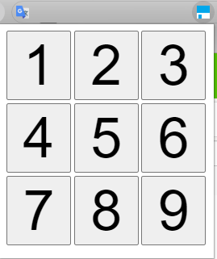  
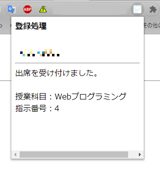  
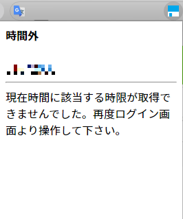

どのページにいても一瞬で「右上のボタンクリック→番号ボタンクリック」の2クリックで登録できるようになるので便利です。

一旦完成版としてChrome拡張のファイルを置いておきます。 [tcuattend_chex.zip](https://mikuta0407.net/files/tcuattend_chex.zip)

使い方:
1. Zip内を展開(フォルダ付きで)
2. index.htmlにあるiframeで表示するリンクを書き換える
3. manifest.jsonのpermissionsを表示するリンクのトップページのようなリンクに**書き換える**(http://hoge.com/attend/index.html だったら、http://hoge.com/ にしておけばOK(本当のところこれでいいのかはわからない))
4. 同梱のアイコンが著作権を回避?したやつなので、お好きに変える
5. Chromeの拡張でデベロッパーモードをオンにして、「パッケージ化されていない拡張機能を読み込む」から拡張機能を読ませる

(こんな感じで崩れる場合は、iframeとbody自体のwidthをいじってあげてください。)  
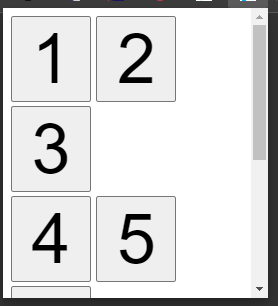

一応Chrome拡張内のコードを載せておきます。(アイコンは自由ですよ)  
hoge.hogeとかは適宜置き換えてください。

```json {name="manifest.json"}
{
    "manifest_version":2,
    "name":"TCU_Attend_ChromeExtension",
    "version":"1.0.0",
    
    "description":"Chrome拡張でTCU出席管理システムを2クリックでやるやつ",
    "icons": {
        "16":"icon_16x16.ico"
        },
    
    "browser_action": {
            "default_icon":"icon_400x400.png",
            "default_title":"",
            "default_popup":"index.html"
    },
    
    "permissions":["tabs","https://example.com/*"]
    
}
```

```html {name="index.html"}
<!DOCTYPE html>
<html>
    <head>
        <meta charset="utf-8">
        <title>TCU_Attend_ChromeExtention</title>
        <style>
            body {
                width: 270px;
                height: 290px;
                margin: 0px;
            }
            iframe {
                border: 0px;
            }
        </style>
    </head>

    <body>
    <iframe width="270px" height="290px" src="https://example.com/tcu_attend.html"></iframe>
    </body>
</html>
```

## プログラム構築までの道のり

さて、アドカレなのでただ単純にプログラムを配布するだけではなく、どうやって作ったかを紹介します。

注: シェルコマンドは改行をしたものを記載していますが、見やすくするためだけなので、実際の処理は改行無しで問題ありません。

### めんどくさかったところ
**授業時間じゃないと、実際の登録処理の仕様が調べられないしデバッグもできない**

これが最大の難所でした。

幸いログインそのものとログイン失敗は時間外でも行えるので、それは授業時間外でゆっくり行えましたが、本番処理に関してはそれができないので、演習授業系で自分の作業が終了し、少し時間が空いたときにPOSTログを収集する、といった作業をしていました。

### ログイン処理
Puppeteerなどであれば、実際に要素で叩けばいいのですが、今回はシェルスクリプトでやっているので、POSTを行うためにcurlを使用するようにします。

#### 動作を調べる
まずはChromeの検証画面を開きながら、ログインをしてみます。ログインをすると、Networkタブの`index.php`に、何をForm Dataとして送ったのかが記載されているので確認をします。  
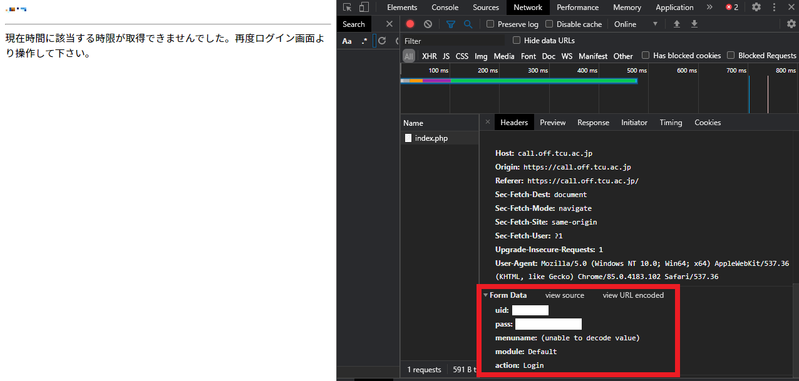

Form Dataの欄に、いろいろと記載されています。どうやら、uid, pass, menuname, module, actionの5つを送信しているようです。

そして、menunameはデコードできないと言っていますが、**実は「出席」のSJISコードをURLエンコードされたものです。**あまりにもひどい。~~SJISをやめろ~~  
Form Data欄の上部にある`view URL encoded`をクリックすると、生の値が見れます。  
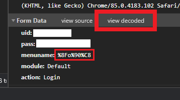

#### curlでやってみる

ここまでで「https://call.off.tcu.ac.jp/index.php に対して、POSTでForm Dataとして5つのデータを投げればログインができる」ことがわかりました。  
ではこれを実際にcurlでやってみます。

```bash
curl -X POST https://call.off.tcu.ac.jp/index.php \
 -d "uid=ログインID" \
 -d "pass=パスワード" \
 -d "menuname=%8Fo%90%8" \
 -d "module=Default" \
 -d "action=Login"
```

`-d`をつけるとFormDataとして付属させることができます。

実際に実行すると、このようになります。  
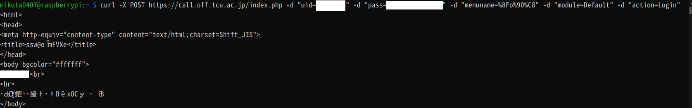

HTMLがShift-JISで書かれているので、UTF-8で表示しているコンソールでは化けてしまっています。シェルスクリプトでも文字列を扱っているので、UTF-8で扱えるよう、nkfを通してあげます。

```bash
curl -X POST https://call.off.tcu.ac.jp/index.php \
 -d "uid=ログインID" \
 -d "pass=パスワード" \
 -d "menuname=%8Fo%90%C8" \
 -d "module=Default" \
 -d "action=Login" \
 | nkf
```

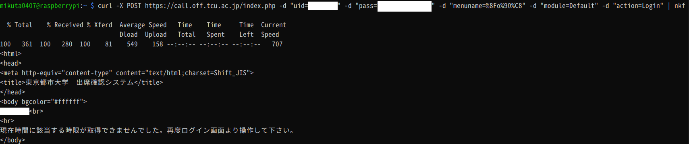

無事にきれいに表示できるようになりました。  
時間外のエラーが出ていますが、これが出ているということはログインに成功しているということです。
本番処理ではこのページに数字を選んだりする要素があるので、このHTMLデータを保存できるようにします。

注: シェルスクリプト作成段階ではsudoなしでシェルスクリプトを叩きたいので、ディレクトリをホームディレクトリ内で行っています。

```bash
curl -X POST https://call.off.tcu.ac.jp/index.php \
 -d "uid=ログインID" \
 -d "pass=パスワード" \
 -d "menuname=%8Fo%90%8" \
 -d "module=Default" \
 -d "action=Login" \
 | nkf > selectkamoku.html
```

### ログイン失敗処理
#### 動作を調べる

とりあえず適当に間違っているユーザー名とパスワードでログインしてみます。  
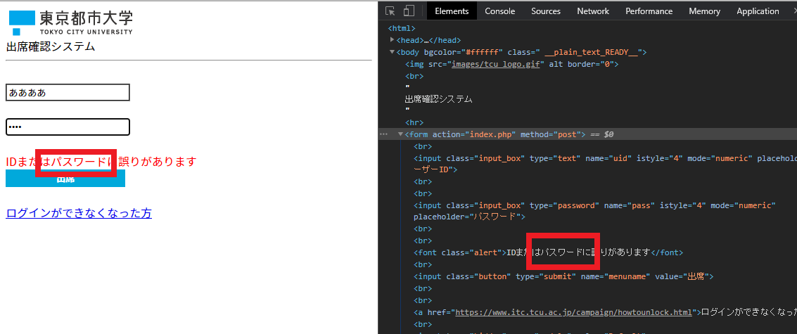

「IDまたはパスワードに誤りがあります」という表記がありますね。  
そして、「パスワード」という単語は、ログイン画面以外ではログイン失敗のときにしか表示されません。  
つまり、htmlに「パスワード」という文字が含まれていれば、ログイン失敗という判定ができるわけです。

#### curlとgrepでやってみる

まず、上記のcurlコマンドを使用して、誤ったログインID/パスワードを入力した時の返答を保存します。  
catするとこうなります。  
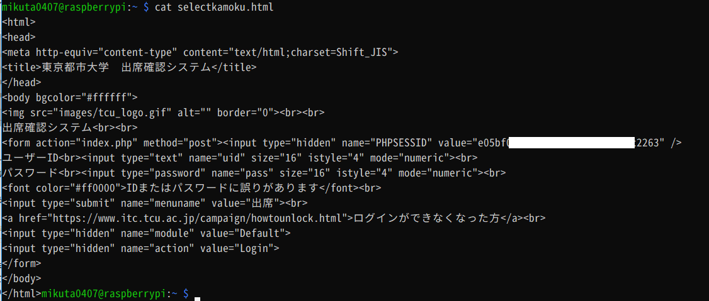  
(ちなみにこの段階で、「セッション管理はPHPSESSIDを使えばいいんだな」という事もわかってしまいますね。(どうして時間外にはPHPSESSIDがなくて、失敗ではSESSIDが出てくるんでしょうね)

このselectkamoku.htmlをgrepして、「パスワード」という文字があった場合には・・・という処理をできるようにします。

まずは単純にgrepしてみます。  
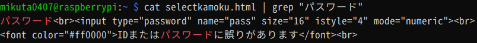  
出てきますね。

grepは、検索結果の有無で、ちゃんと戻り値があります。  
戻り値は`$?`にありますので、確認をしてみます。  
($?は、`?`という変数に戻り値が入っている・・・とでも思ってください。変数名の頭に$を付けてあげると変数として呼び出せます。)  
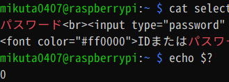  
grepは、「検索結果があれば**0**」「検索結果がなければ**1**」というように**結果があることが前提の戻り値**を返してきます。

なので、以下のようなスクリプトを利用すれば、「あった場合はある、ない場合はないと表示する」などができます。(grepが吐き出す標準出力は/dev/nullに投げて闇に葬っています)

```bash
cat selectkamoku.html | grep パスワード > /dev/null
if [ $? = 0 ]; then
	echo "あった"
else
	echo "なかった"
fi
```

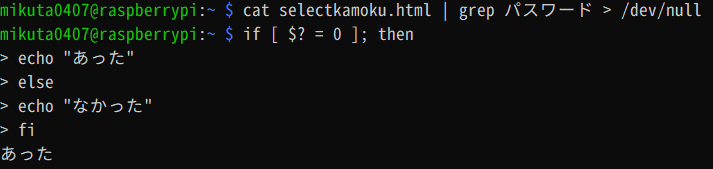  
これを実際にログインに成功した状態のHTMLでやると、  
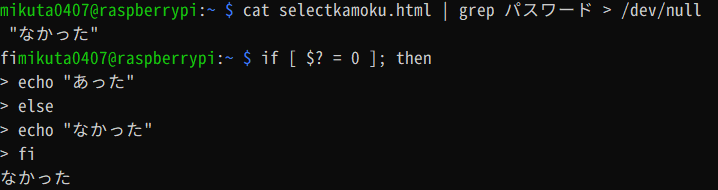

無い方の処理が走ります。

### 時間外処理

#### 動作を調べる

これはログイン失敗の処理とほぼ似たようなことをやります。今回はログインできるIDとパスワードでログインします。  
ログイン失敗のときしか現れない単語として「パスワード」がありましたが、時間外のときには  
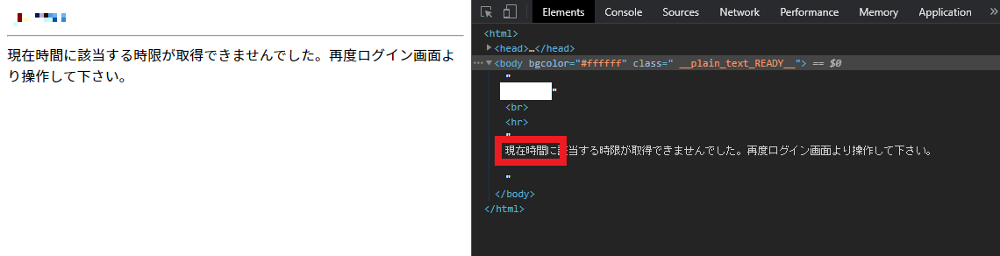  
「現在時間」がキーワードになります。(なんとなく確実性を求めるために「現在時間に」まで使ってみています)

ちなみに時間外のページにたどり着ければ、ログインは成功していますので、本番処理でも同様に行ってください。

#### ifで判定してみる

```bash
cat selectkamoku.html | grep 現在時間に > /dev/null
if [ $? = 0 ]; then
	echo "あった"
else
	echo "なかった"
fi
```

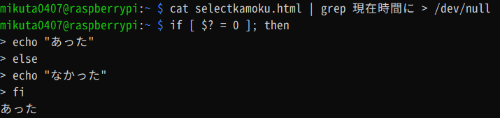  
ちゃんと処理ができていますね。

### 本番処理
#### 動作を調べる
先程と同様、調べていきます。まずHTMLを眺めてみます。  
これはChromeの開発者ツールでは欲しい情報がすべては表示されないため、curlで落としてきます。

コマンドを再掲します。

```shell
curl -X POST https://call.off.tcu.ac.jp/index.php \
 -d "uid=ログインID" \
 -d "pass=パスワード" \
 -d "menuname=%8Fo%90%C8" \
 -d "module=Default" \
 -d "action=Login" \
 | nkf > selectkamoku.html
```

実行すると、selectkamoku.htmlに登録時の番号選択の画面のHTMLが入っているはずです。  
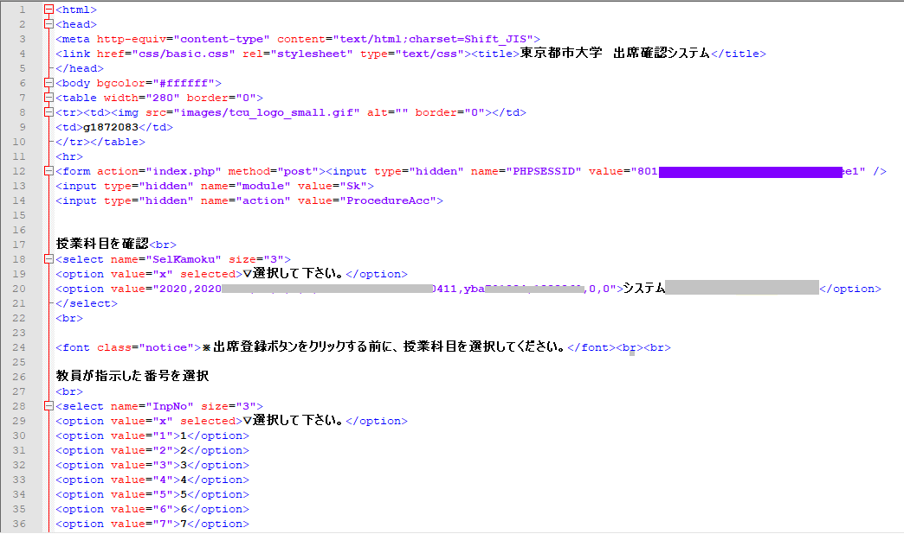

HTMLが取得できたところで、次に出席登録時にはどんなデータが送られているかを見てみます。  
先程までと同様、Chromeの開発者ツールを出して、出席登録を実際に行ったときにどんなForm dataが送られているかを見てみます。

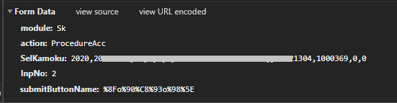

このForm dataと、先程落としてきた番号選択の画面のHTMLを見比べてわかることとして、まずform内のhiddenとしての項目がいくつかあります。  
まずは`PHPSESSID`ですが、これはセッションIDですね。これはcookie扱いなので、Form dataにはありませんでした。

他の項目はすべてForm dataとして送られるデータです。  
まず`module`が`Sk`となっています。これはおそらく**S**elect **k**amokuの意味でしょう。

`action`は`ProcedureAcc`となっています。手順アクセサリでしょうか。

プルダウンメニューの`SelKamoku`には、option内に講義選択内容があります。これは普通に履修登録をしていれば一つしか表示されないはずです。このvalue値で授業名を判定しているのでしょう。  
普段授業名を選んでいるここの中身ですね。  
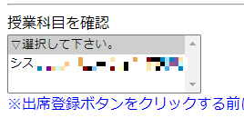


次に`InpNo`です。これはInputNumberでしょう。出席番号ですね。単純に1~9です。

最後に`submitButtonName`ですが、さっきログインのときもやったように、SJISエンコードされた文字を送ります。`出席登録`のSJISコードがURLエンコードされて`%8Fo%90%C8%93o%98%5E`となります。どうしてボタンのvalueで日本語を送信するんですか?

#### curlでやってみる

ではこれまで同様、curlでやってみましょう。やってることは簡単です。-dで投げるデータを変えるだけです。

なお、PHPSESSIDはForm dataではなくCookieとなるので、-dではなく--cookieを利用します。

```shell
curl -X POST \
https://call.off.tcu.ac.jp/index.php \
--cookie "PHPSESSID=8012d■■■■■■■■■■■■■■■■■■■■f154ee1" \
-d "module=Sk" \
-d "action=ProcedureAcc" \
-d "SelKamoku=2020,20■■■■■■■■■■■■■■■■■■■■■■■■■■■■■■■3041■■■■■■■■■■■■■■■■■■■■0,0" \
-d "InpNo=1" \
-d "submitButtonName=%8Fo%90%C8%93o%98%5E" \
| nkf

```

うまくいくと、コンソールに出席確認ができたことがわかるHTMLが流れてきます。

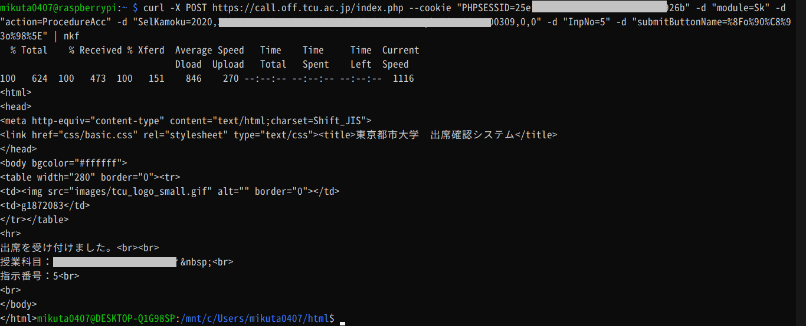

以上がCLIでやってみる出席登録です。  
では、実際にこれを使って、2クリックシステムを作っていきましょう。

### 実環境用ファイル作成

#### シェルスクリプト

さて、ここまでの作業を組み合わせると、以下のようなシェルスクリプトを書けばいいことになります。

```
ログイン処理

ログイン判定
  ログイン失敗処理
  ログイン成功処理
    時間外処理
    本番処理
      セッションIDの取得
      科目番号取得
      セッションIDと科目番号と、指示番号で登録
      結果表示
```

(「2. 実プログラムの配置」に貼ったソースを小分けにして解説していきます。各処理部分の調査部分の再掲みたいになってしまっていますが・・・)

#### ログイン処理

まず、ログイン処理は以下のようになりますね。(最後のファイル保存場所が絶対パスで`/var/www/cgi-bin/htmlcache/`になっています)

```bash {name="/var/www/cgi-bin/tcu_attend.sh"}
curl -X POST https://call.off.tcu.ac.jp/index.php \
 -d "uid=ログインID" \
 -d "pass=パスワード" \
 -d "menuname=%8Fo%90%C8" \
 -d "module=Default" \
 -d "action=Login" \
 | nkf > /var/www/cgi-bin/htmlcache/selectkamoku.html
```

#### ログイン失敗処理
次にログイン判定はgrepで「パスワード」を検索した結果を利用します。  
失敗だったらレスポンスヘッダを吐いたあとに、selectkamoku.htmlの中身(エラー内容もある)をそのまんま吐くようにしています。

```bash {name="/var/www/cgi-bin/tcu_attend.sh"}
cat /var/www/cgi-bin/htmlcache/selectkamoku.html | grep パスワード > /dev/null
if [ $? = 0 ]; then
	# ログイン失敗
	echo "Content-Type: text/html; charset=UTF-8"
	echo ""
	cat /var/www/cgi-bin/htmlcache/selectkamoku.html
	exit
```

#### ログイン成功→時間外処理

ログインに成功している場合は、時間外かどうかを見に行きます。

「現在時間に」という文字があったら、レスポンスヘッダと「時間外」という文字とともに、元のHTMLを吐いています。(この動作が、上記「3. 動作確認」のスクショ3枚目の時間外のときのものになります)

```bash {name="/var/www/cgi-bin/tcu_attend.sh"}
else
	# ログイン成功のとき
	
	# 時間外かどうかを判定
	cat /var/www/cgi-bin/htmlcache/selectkamoku.html | grep 現在時間に > /dev/null
	if [ $? = 0 ]; then
		# 時間外のとき
		echo "Content-Type: text/html; charset=UTF-8"
		echo ""
		echo "<b>時間外</b><br><br>"
		cat /var/www/cgi-bin/htmlcache/selectkamoku.html
```

#### 本番処理

ログイン成功かつ時間外でもない場合は、いよいよ本番処理です。

##### セッションID取得

まずはセッションIDを取得・変数代入します。

```bash {name="/var/www/cgi-bin/tcu_attend.sh"}
else
# セッションID
sessid=`cat /var/www/cgi-bin/htmlcache/selectkamoku.html \
| grep "PHPSESSID" \
| sed -e 's/<form action="index.php" method="post"><input type="hidden" name="PHPSESSID" value="//g' \
| sed -e 's/" \/>//g'`

##### 科目番号取得

次に科目の情報です

# 科目の番号
selkamoku=`cat /var/www/cgi-bin/htmlcache/selectkamoku.html \
| grep '[0-9]\{4\},[0-9]\{8\}' \
| sed -e 's/<option value="//g' \
| sed -e 's/">.*//g'`
```

##### 出席登録+結果表示

最後に、出席登録を行います。出席登録では毎回番号が変わります。そのたびにシェルスクリプトを書き換えるわけにも行かないため、シェルスクリプト自体の引数で番号を受け取れるようにし、その番号を利用します。

すこし脱線しますが、シェルスクリプトでの引数は、第1引数から順番に`${1} ${2} ...`といったように呼び出せます。  
シンプルな例だと、こんな感じになります。

```bash {name="test.sh"}
echo "第1引数: ${1}"
echo "第2引数: ${2}"
```

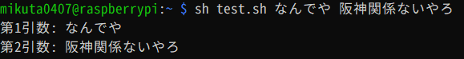

今回のツールでは、出席番号以外はすべて自動で取得します。つまり、今回の場合はシェルスクリプトの第1引数に指示番号が与えられれば、それを元に全てを実行できることになります。  
なので、スクリプト内ではInpNoの指定部分を`InpNo=${1}`とするだけで、引数を指示番号として利用できます。

(最後に結果を返せるように、登録結果をsuccess.htmlとして保存し、吐き出しています。)

```bash {name="/var/www/cgi-bin/tcu_attend.sh"}
# 出席登録
curl -X POST https://call.off.tcu.ac.jp/index.php \
--cookie "PHPSESSID=${sessid}" \
-d "module=Sk" \
-d "action=ProcedureAcc" \
-d  "SelKamoku=${selkamoku}" \
-d "InpNo=${1}" \
-d "submitButtonName=%8Fo%90%C8%93o%98%5E" \
| nkf > /var/www/cgi-bin/htmlcache/success.html

# 最終結果表示
echo "Content-Type: text/html; charset=UTF-8"
echo ""
echo "<b>登録処理</b><br><br>"
cat /var/www/cgi-bin/htmlcache/success.html
```

最後に、if文を閉じれば、

```bash {name="/var/www/cgi-bin/tcu_attend.sh"}
	fi
fi
```

シェルスクリプトは完成となります。

この段階でコンソールから直接引数ありで叩くと、実際に挙動を確かめることができます。(shコマンド無しでいきなり叩けてるのは権限が777のため)

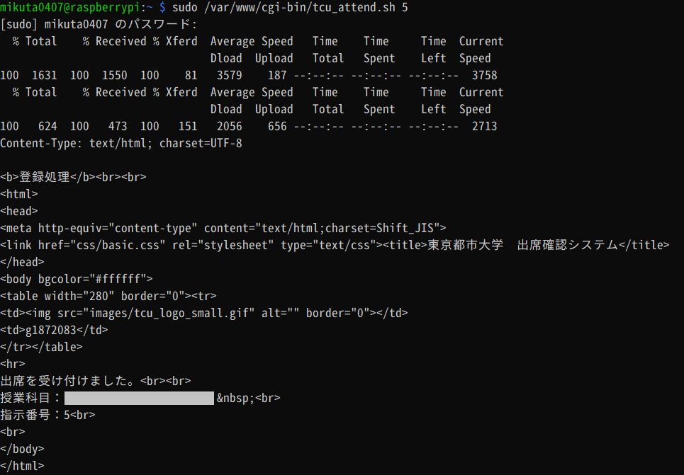


#### HTMLファイル

上記のシェルスクリプトにより、`http://サーバーアドレス/cgi-bin/tcu_attend.sh`を呼び出せば出席登録ができるわけですが、このままでは引数が与えられず、意味がありません。  
CGIでは、コマンドライン引数を与える方法として、URLの最後に`?`を付けると、その後がコマンドライン引数として使えるようになります。  
今回の場合は引数が1つで、かつ単純に番号だけなので、以下のようなリンクにすれば、「1番で登録」用のリンクになります。

```
http://サーバーアドレス/cgi-bin/tcu_attend.sh?1
```

つまり、

```html
<!DOCTYPE html>
	<head> 
		<meta charset="utf-8"></a><br> <title>都市大出席</title>
	</head> 
	<body>
		<a href="http://example.com/cgi-bin/tcu_attend.sh?1">1</a><br>
		<a href="http://example.com/cgi-bin/tcu_attend.sh?2">2</a><br>
		<a href="http://example.com/cgi-bin/tcu_attend.sh?3">3</a><br>
		<a href="http://example.com/cgi-bin/tcu_attend.sh?4">4</a><br>
		<a href="http://example.com/cgi-bin/tcu_attend.sh?5">5</a><br>
		<a href="http://example.com/cgi-bin/tcu_attend.sh?6">6</a><br>
		<a href="http://example.com/cgi-bin/tcu_attend.sh?7">7</a><br>
		<a href="http://example.com/cgi-bin/tcu_attend.sh?8">8</a><br>
		<a href="http://example.com/cgi-bin/tcu_attend.sh?9">9</a><br>
	</body>
</html>
```

のようなシンプルなHTMLで、  
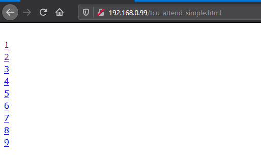

最低限の実装ができます。

ただ、これだとあまりにも見た目が貧相なのと、スマホフレンドリーでもなく、使い勝手も地獄なので、ボタン化して使いやすくします。

実HTMLはすでに貼ってあるので、抜粋すると、

```html
<input type="button" value="1" style="width:80px; font-size:70px; margin-bottom:4px;" onclick="location.href='http://example.com/cgi-bin/tcu_attend.sh?1'">
```

のようにinputでボタンを書けば、  
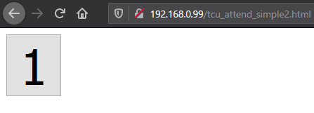

こんな感じでボタン化することができます。  
これを9個にして、間隔とかを整えたものが「3. 動作確認」に貼ったような画面になります。  
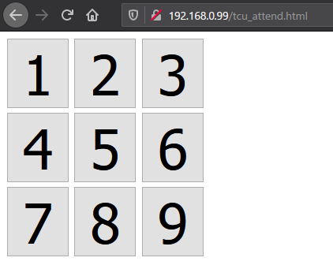

以上でシェルスクリプトとHTMLの完成です!

## おまけ1: IDとパスワードをシェルスクリプトから分離して保存する

一応、CGIとして動作しているので、shファイルを直接読まれることは無く、パスワード漏洩もしにくいとは思いますが、それでも/var/www/cgi-binというApache2管理下の内にあるファイルなので、万が一のことがあるかもしれません。

そこで、IDとパスワードは別ファイルに保管し、実行されるたびにそこから情報を拾ってきて使うようにしてみます。

(「2. 実プログラムの配置」で記載したソースにはこれは書いていません。それも含めて書くのは面倒だったので...。 ただやるとしても簡単に改変できるので、もし心配だったらやってみてください。)

まずは、ファイルを置くための場所を作ります。とりあえず`/var/www/cgi-bin`じゃなければいいので、適当に`/var/www/tcuattenddata/`とかを作ります。(いろいろとアレですが、ここらへんはお好きなように・・・)

```bash
sudo mkdir /var/www/tcuattenddata/
```

そしてここに`id_pass.txt`を作り、**1行目にID**、**2行目にパスワード**を記述した本当に単純なファイルを作成します。(複数ユーザーがいないからできるような運用方法ですねホントに)  
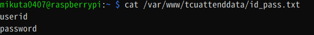

次に、これらをシェルスクリプトで変数に代入するようにします。

引っ張り出し方は、

```bash
# ID
sed -n 1p /var/www/tcuattenddata/id_pass.txt
# パスワード
sed -n 2p /var/www/tcuattenddata/id_pass.txt
```

のように、sedで行数指定で取り出して行います。

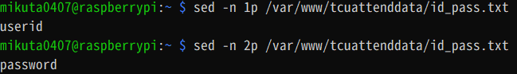

これを変数に入れられればいいので、シェルスクリプトの最上位(#!/bin/bashの次)に以下のような行を追記します

```bash {name="/var/www/cgi-bin/tcu_attend.sh"}
# ID
USERID=`sed -n 1p /var/www/tcuattenddata/id_pass.txt`
# パスワード
PASSWORD=`sed -n 2p /var/www/tcuattenddata/id_pass.txt`
```

これで`USERID`にIDが、`PASSWORD`にパスワードが入ります。

次に、これをcurlの引数内で呼べるようにします。  
本番処理のところでも書きましたが、Form Dataに与える部分はダブルクオーテーションで囲まれているので、単純に`${USERID}`や`${PASSWORD}`とするだけで呼び出せます。(シングルクオートだとエスケープが必要になる) (一応`{ }`がなくても良い)

(ダブルクオーテーションがあるので実験も含めてダブルクオーテーション込みで出しています)  
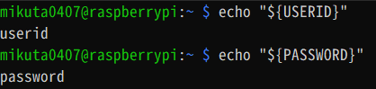


幸いにも、都市大のパスワードレギュレーションはダブルクオートとシングルクオートを弾いているので、このあたりのエスケープは無視することができます。

最後に、シェルスクリプトのユーザー名とパスワードの部分を`${USERID}`と`${PASSWORD}`に変更してあげれば、完成となります。

```bash {name="/var/www/cgi-bin/tcu_attend.sh"}
curl -X POST https://call.off.tcu.ac.jp/index.php -d "uid=${USERID}" -d "pass=${PASSWORD}" -d "menuname=%8Fo%90%C8" -d "module=Default" -d "action=Login" | nkf > /var/www/cgi-bin/htmlcache/selectkamoku.html
```

(もちろん動作確認はしてあげてくださいね!)

## おまけ2(公開鯖向け): 一応robots.txtを書く

なんかの拍子にクローラに見つかっても困るので、robots.txtを書いておきます。(この手の対策ってお行儀の良いクローラにしか意味ないですけどね)

```txt {name="robots.txt"}
User-Agent: *
Disallow: /tcu_attend.html
```

## おまけ3: DiscordのBotにしてみる

DiscordのBotにして、Discordのチャットから出席登録できたら便利かもしれません。  
こんな感じに。(brとか残ってるのは許してくださいガバガバ処理なだけです)  
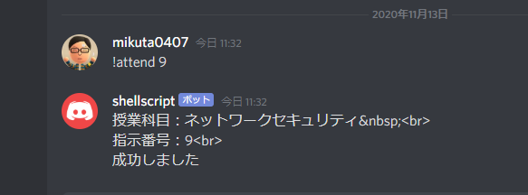

Discordは、シェルスクリプトだけでは(おそらく)文字を受け取るBotは流石に無理があります。Webhookで一方通行ならできますが。

ということで、文字を受け取るBotはNodejsを使うことになります。でも、ここまで作ってきたものはシェルスクリプトです。JavaScriptじゃありません。**じゃあシェルスクリプトをNodejsから叩いてしまいましょう!** (アドカレ主催に怒られそう)

ということでソースです。と言いたいこところですが、その前に説明です。

せっかくここまでWebからできる出席登録を作ったので、Botで呼ばれたらそこにアクセスすればいいわけです。それこそJSで出来ます。

できるんですが・・・ここまでシェルスクリプトでやってきてるので、ここもやっぱりシェルスクリプトとcurlでがんばります。

つまり、動作概要としては、  
Discord →(文字列)→ Nodejs(文字列処理) → bash(ここまで作ったやつをcurlで叩くシェルスクリプト実行) → Web鯖(出席登録のシェルスクリプト) → bash(帰ってきた結果を若干加工してstdout) → Nodejs(Discordにsend) → Discord

というすごい遠回りをします。完全にNodejsはDiscordとbashを繋ぐためのやつになります。

まずは、ここまで作った「CGIとしてのシェルスクリプト」を叩くシェルスクリプトです。

```shell {name="attendbot.sh"}
curl -sS https://hoge.hoge/cgi-bin/attend.sh?$1 | nkf >  /tmp/attendtmp.html
cat /tmp/attendtmp.html | grep 現在時間に > /dev/null
if [ $? = 0 ]; then
    echo "時間外です"
else

    cat /tmp/attendtmp.html | grep 受け付けました > /dev/null
    if [ $? = 0 ]; then
        cat /tmp/attendtmp.html | grep 授業科目
        cat /tmp/attendtmp.html | grep 指示番号
        echo "成功しました"
    else
        echo "error!"
    fi
    
fi
```

HTML側でボタンクリックしたときのリンクを直接叩いています。シェルスクリプト実行時の引数に番号だけ入れればいいので、あとでJS側から引数ありで叩いてあげればいいわけですね。

~~なんかJSって言ってるとケーを思い出しますね~~

このシェルスクリプトが呼ばれると、さっきつくったCGIをcurlで叩いて、落ちてきたやつをgrepなりで処理してechoします。ここは別になにかForm dataとかを送るわけでもないので、-sSでログを出さないようにするだけで、後はただ叩くだけです。後一応nkfを通しています。

落ちてきたHTMLの中の授業科目/指示番号が書いてある行だけgrepで取り出しています。そのあとにsedでタグを取り除いてあげれば、先程の画像のようなことは起きませんね。

次にNodejsで動かすJavaScriptのソースです。discord.jsはインストールしてくださいね。

```javascript {name="app.js"}
//ログイン処理
const Discord = require('discord.js');
const client = new Discord.Client();
const token = 'BotToken';
client.on('ready', () => {
    console.log('ready...');
});

client.on('message', message =>{
    if(message.author.bot){
        return;
   }

//出席登録
    if (message.content.match(/!attend/)) {

    var str = message.content;

    str=str.substr(8);
    
    var execstr='bash /path/to/attendbot.sh '+ str;
    
    const execSync = require('child_process').execSync;
    const result =  execSync(execstr).toString();
    
    if (!result){
        message.channel.send("エラーが発生しました");
    } else {
        message.channel.send(result);    
    }
}


});
client.login(token);
```

受け取って、!attendから始まる場合だけ処理して、数字を取り出してシェルスクリプトにぶん投げる感じです。

参考: 
- [Discord.jsで簡単にbotを作成する【基礎編】](https://qiita.com/cryptocoin_harumaki/items/5d8c503e02093eca1f9b)
- [シェルコマンドを実行する方法(child_process)](https://www.wakuwakubank.com/posts/728-nodejs-child-process/)

あとはNodejsで回してあげれば、Discordから出席登録ができるようになります。

## 〆

いかがだったでしょうか。  
こんな感じで、シェルスクリプトだけでもいろいろとWebツールは作れます。そしてそれをNodejsから叩く方法を確立させれば、シェルスクリプトだけで何でもできます(?)

JavaScriptもいいですけど、ShellScriptもいいんですからね・・・?

これを読んだ都市大生の皆様は、1から作らなくてもいいので、今回のプログラムをぜひ使ってみて下さい!! WSLでもいいですしmなんなら家に一個くらいラズパイ転がってますよね!(???)

ということで、明日は[うめ](https://twitter.com/vividrabbit_net)さんの「どうすりゃいいの～♪」です。どうなるんですかね? (あと[このアドカレはなんですか?](https://adventar.org/calendars/5925))

## 宣伝

[フロピネタもよろしく!](https://blog.mikuta0407.net/posts/2020/20201202-music-on-2dd-fd/)
