(この記事は、諸事情により2つのサイトに掲載しています)

個人運用できる音楽ストリーミングサービスソフトであるSubsonic(やそのフォーク)と、GoogleDriveを組み合わせて使うお話です。

Subsonic系は、NextCloudのようにGoogleDriveをツール側でマウントすることが出来ません。基本的にサーバー内のディレクトリを指定する必要があります。  
この場合、GoogleDriveを何らかの形で通常のディレクトリと同じように扱えるようにしてあげる必要が出てきます。

ということで、今回はSubsonicのストレージとしてgoogle-drive-ocamlfuseでGoogleDriveを使うお話です。

## 構成概要図

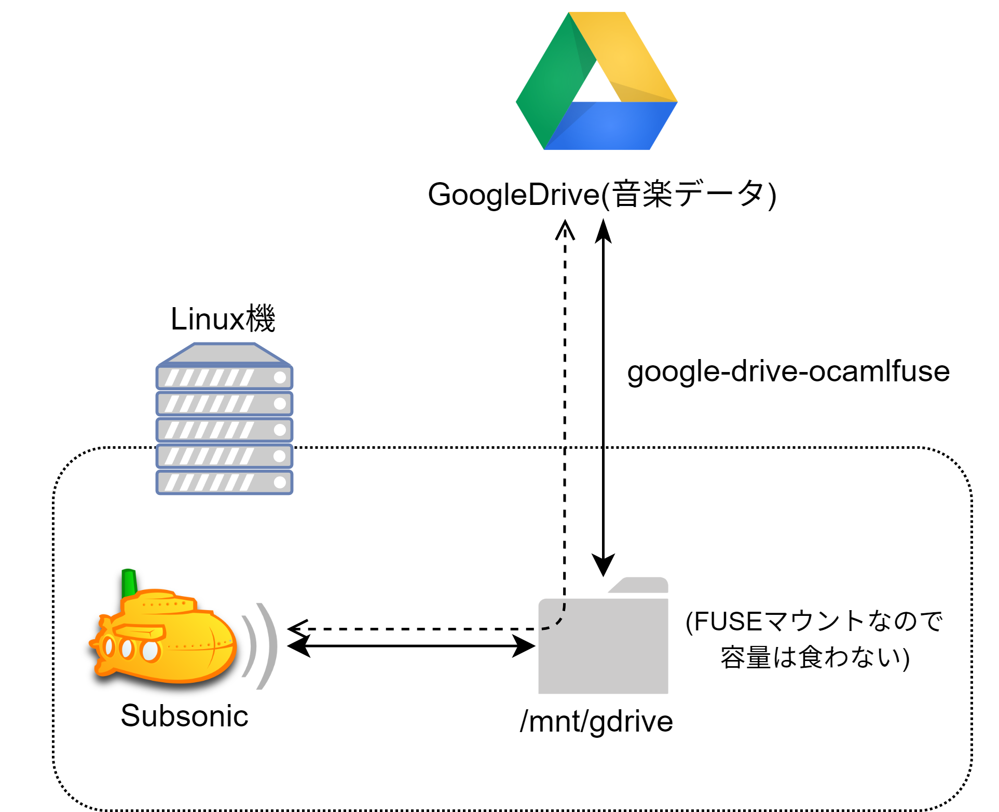

よくわからない図ですが、まぁネットワークドライブをマウントして、という感じですね。

毎回インターネットからデータを引っ張ってくるということはその分曲の再生までに時間がかかることにはなりますが、FLACの曲でも一曲十数MBだったりするので、思ったより再生までには時間かからないです。ここはサーバー側の下り回線速度依存ですね。

今回はサーバーとして使うLinux機はUbuntu 18.04を使っています。ソフトウェアのインストール系とかは適宜読み替えてください。

## Subsonicのインストール
基本的に公式サイト (http://www.subsonic.org/pages/installation.jsp#debian)の方法で十分ですが、一応触れます

まずJavaをインストールします

```bash
sudo apt install openjdk-8-jre
```

ffmpegを入れていない場合は入れます

```bash
sudo apt install ffmpeg
```

Subsonicのダウンロードをします。 http://www.subsonic.org/pages/download.jsp からdebを拾ってきます。

インストールします

```bash
sudo dpkg -i subsonic-x.x.deb
```

起動します

```bash
sudo service subsonic start
```

subsonicをrootで実行するのかどうかという問題はあるのですが、まぁそこは今回はスルーします。

ブラウザからアクセスします ( `http://サーバアドレス:4040` )  
(Apache2の場合VirtualHostでProxyさせると、443でSSL通信できて便利です。その話はいつか書きます。)

Subsonicの設定方法は割愛しますが、設定→音楽フォルダのところを後で触ります。

## GoogleDriveへの接続(google-drive-ocamlfuseの設定)

**注: 多分なにか方法はある気がするんですが、面倒なのでGUIが使える環境にして行うと良いです。X11の転送でも良いかもしれませんが、こちらでは未検証です。LXDE入れてChromiumがある環境で作業しました。**

**注: これから行う作業は、ユーザーが自分ひとりしかいないような環境を想定しています。GoogleDriveマウント時の権限設定さえちゃんとすればもちろん他のユーザーがいても大丈夫にはなりますが、そこは触れません。**

### インストール

```bash
sudo add-apt-repository ppa:alessandro-strada/ppa
sudo apt update
sudo apt install google-drive-ocamlfuse
```
 
### 認証
Firefoxでやったらうまく行かなかったのでChromiumのほうが良いです。  
また、なんとなくGoogleDriveへの認証をrootで行いたくはないので、ここは通常ユーザーで行います。

```bash
google-drive-ocamlfuse
```

を単独で叩くと、ブラウザが立ち上がってGoogleアカウントの認証が行われます。指示に従うだけでOKです、これといって特別な操作は必要ありません。

### /etc/fuse.confの編集

google-drive-ocamlfuseでマウントしたディレクトリは、権限がすべて「?」になり、他のユーザーからはアクセスできなくなります。共有するときにオプションを付けると回避できますが、そのために/etc/fuse.confを編集する必要があります。

```conf {name="/etc/fuse.conf"}
# user_allow_other
```
↓(コメントアウト)
```
user_allow_other
```

### ディレクトリの作成

今回は`/mnt/gdrive`にマウントしてみます。

```bash
# ディレクトリの作成
sudo mkdir /mnt/gdrive

# マウントするのはsudoではないので一旦所有者等を渡す
sudo chown $USER:$USER /mnt/gdrive

# マウント
google-drive-ocamlfuse -o allow_other /mnt/gdrive
```

これで、`/mnt/gdrive`にアクセスすると、レスポンスは少し遅いですがGoogleDriveの中身が見れるようになったはずです。

### Subsonicでディレクトリの指定+初回スキャン

こんな感じでディレクトリの指定をしてあげます。  


保存ボタンを押した後勝手にスキャンが始まれば良いのですが、始まらない場合は手動でスキャン開始させてあげます。ネットワークドライブということもあって、初回スキャンはまぁまぁ時間がかかってしまいます。

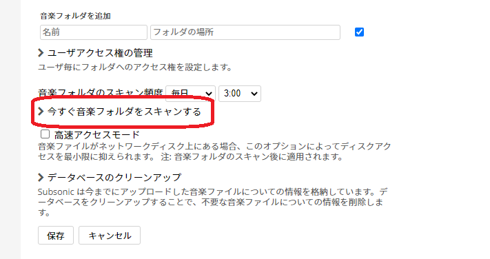

高速アクセスモードに関しては、設定すればサーバー内にキャッシュをしてくれるようになるのですが、容量を食わせたくない場合やラズパイのように容量が少ない場合はオフにしといても良いです。一度再生された曲を再び再生するときにGoogleDriveから引っ張ってこないだけです。

スキャンが終わると、一覧に曲が表示されます。再生するとちょっと待ちはありますが、許容範囲の時間で曲が表示されます。

おめでとうございます!環境構築成功です!  
・・・と簡単には終わらないのがGoogleDrive連携です。

## 更新を検知してtouchさせるようにする

さて、先程までの設定だけだと何が問題か、というと、

**GoogleDriveに新しくフォルダや曲を追加してもスキャンで反映されない**

という致命的な問題が発生します。初回スキャンで読み込んだファイル以外の認識を一切しません。

これSubsonicだけでなく、フォークであるJpsonicでも同様に発生します。

さて、なんでこのようなことが起こるかというと、Subsonicのスキャンシステムの話と、GoogleDriveのタイムスタンプシステムの話が出てきます。

どういうことなのか、先にタイムスタンプの話について、画像を交えながらご説明します。

### 通常のLinuxのディレクトリの場合
例として、こんなディレクトリ構造があったとします。  
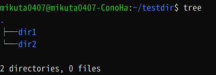

この時、dir1とdir2のタイムスタンプは00:21になっています。  
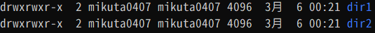

では、この後の00:25に、dir1にaというディレクトリと、dir1/a/test.txtを作成したとします。  
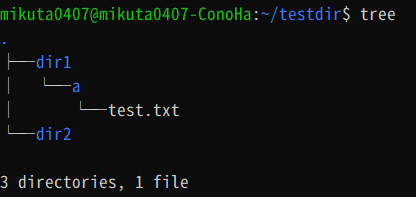

そうすると、dir1のタイムスタンプが00:25に変わります。  
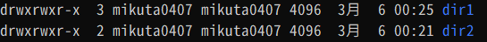

これは純粋に、ディレクトリの中が書き換わったのでタイムスタンプも変わったということになります。

### GoogleDriveの場合

同様の操作を行ってみます。まず、GoogleDrive内にdir1とdir2を作成しました。  
タイムスタンプは00:27になっています。  
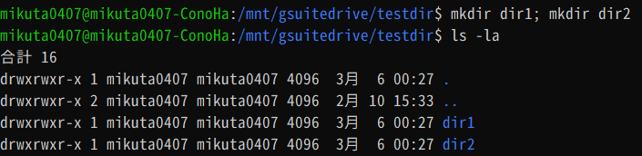

そして00:30にdir1/aとdir1/a/test.txtを作成します。  
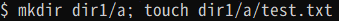

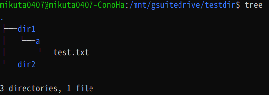

この場合、通常のLinuxのファイルシステムであれば、先程記載したようにdir1のタイムスタンプが00:30になっているはずです。  
ところが、ls -laをしてみると、00:27のままになっています(念の為dir1の中もls -la)

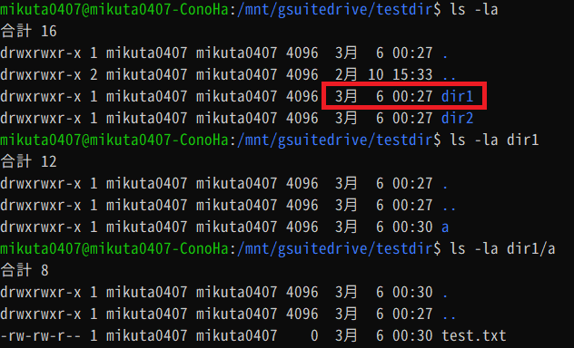

つまり、GoogleDriveのタイムスタンプのシステムは、「**追加・更新されたものに対してだけタイムスタンプが変更され、そのファイル/ディレクトリがある親ディレクトリのタイムスタンプは更新されない**」ということになります。

これがSubsonicにとっては非常に厄介な問題です。

https://sourceforge.net/p/subsonic/bugs/222/ でも指摘されていますが、どうやらSubsonicはタイムスタンプをベースにファイルスキャンを行っているようなのです。  
タイムスタンプベースでのファイルスキャンをしてしまうと、タイムスタンプが変更されてないディレクトリに対しては、「以前と同じ」とみなし、新規ファイルを探しに行かなくなってしまいます。

上記の例で言えば、
1. 初回スキャンの時にはdir1というディレクトリは存在するものの、中にaというディレクトリはない
2. この状態でaというディレクトリとtest.txtを作成
3. 2回目のスキャンを行う
4. dir1はタイムスタンプがかわっていない
5. 削除されてないか確認するため、一応各ディレクトリの中に前回スキャンしたときと同じデータがあるかを見に行く(このとき新規ファイルは見てない)

という現象が発生します。(5番の動作に関しては、ソースは読んでないので挙動からの推測です。)

このSubsonicのスキャンシステムだと、GoogleDriveに新しくデータを置いたときも一切反映されないため、曲を追加するたびにフォルダ設定をやり直して初回スキャンをかける必要が出てしまいます。

さすがにそれは非現実的なので、どうにか回避しなければなりませんが、Subsonic側のソースを触るのはあまりにも面倒です。(本家SubsonicはOSSじゃないですし)

そしてGoogleDriveの仕組みはユーザーがどうにかできる問題でもありません。

さてどうするか、となると、ユーザーには唯一の手段が残されています。タイムスタンプの更新です。

幸い、google-drive-ocamlfuseは、touchコマンドでタイムスタンプだけの更新が行えます。  
上記例の場合、aというディレクトリを追加した親ディレクトリ(本来勝手にタイムスタンプが更新されるディレクトリ)であるdir1のタイムスタンプを、touchで更新してあげれば良くなります。
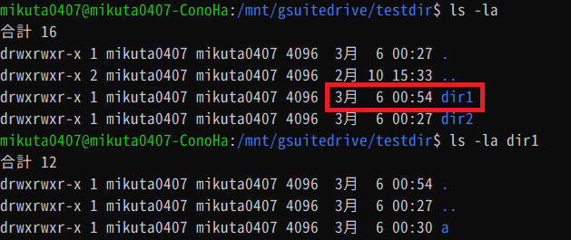

### シェルスクリプトを書く
シェルスクリプトといっても大層なものではありませんが、

- 音楽フォルダ内のディレクトリ一覧を書き出し
- 新規追加があった場合はその親ディレクトリのタイムスタンプをtouchで更新する

というシェルスクリプトを書いて、これをcronでSubsonicの自動スキャンの前に叩いてあげるようにすれば改善します。


#### 完成形
とりあえず完成形です。  
(txtを書き出すフォルダは適宜変えてください。)   
(また、findする先のフォルダも適宜読み替えてください)

**注意: このシェルスクリプトをcronに登録する前に、findしてる行(リストのtxt書き出し)を一度単独で実行してください。そうしないと後述するdiff処理時にすべて新規追加扱いになり、シェルスクリプト実行時に音楽フォルダ内の別に更新しなくても良いはずの対象ディレクトリがすべてtouchされます。**

```bash
#!/bin/bash

# 前回の更新差分をoldにする
mv /subsonicdir/musicdir_new.txt /subsonicdir/musicdir_old.txt

# findかける (初回準備として必要
find /mnt/gsuitedrive/Musics -type d | sort > /subsonicdir/musicdir_new.txt

# touchする
# もし差分がなかったらtouchにオペランドが無いっていうエラーが出るだけなのでヨシッ!
diff /subsonicdir/musicdir_old.txt /subsonicdir/musicdir_new.txt | grep ">" | sed -e 's/> //g' | sed -e 's/\/[^\/]*$//g' | sort | uniq | sed -e 's/ /\\ /g' | xargs touch
```

#### 何をしているのか
このシェルスクリプトでは、
1. 前回のディレクトリ一覧をoldにリネーム
2. 新しくリストを作成(new)
3. oldとnewでdiffする
4. diffした結果新規追加されたものを抽出
5. 余計な文字を消してパスだけの文字列に
6. 新規追加されたディレクトリの親ディレクトリのパスに変更
7. 念の為sort
8. 重複を削除
9. touchに渡すために半角スペースにエスケープ

という処理をしています。

##### mv(今回はリネーム)
これは単純にリネームです。古いoldはこれで上書きされます。

##### find(音楽フォルダ内のディレクトリ一覧を書き出し)
これは単純にfindでディレクトリ一覧を出しています。

```bash
find /mnt/gdrive/Musics -type d | sort > ~/musicdir_new.txt
```

なぜsortしてるかというと、findはやるたびに順番がぐちゃぐちゃになることがあるからです。統一させないと毎回関係ないフォルダをどこかしら更新することになります。

##### diff ～ sed -e 's/> //g'

まずdiffでoldとnewの差分を取ります。  
そして `grep ">"` で新規追加行だけを抽出します。  
その結果から `> `  を取り除いて、パスだけにします(これをしないと `> /mnt/gdrive/....` みたいになったままなので)

##### sed -e 's/\/[^\/]*$//g'

詳細は http://erax.blog.fc2.com/blog-entry-69.html で。  
追加ディレクトリそのものではなくその上のディレクトリに対してtouchするため、最後の `/` 以降を削除します。

(例: /hoge/fuga/neko → /hoge/fuga)

##### sort | uniq

sortは後述のuniqのために改めて念の為のためにやっています。

uniqは(オプションを使わない場合)重複行を取り除いて出力してくれるコマンドです。

たとえば、ディレクトリ内が  
```
/hoge/fuga/neko
/hoge/fuga/inu
```
となっていたとき、これを先程のsedで処理すると
```
/hoge/fuga
/hoge/fuga
```

のように、 `/hoge/fuga` が2回出てきてしまいます。これをuniqに通すことで、一回だけに変えられます。


##### sed -e 's/ /\\ /g'

これは半角スペースをエスケープしています。なぜ必要かというと、  
たとえば `/hoge/foo bar/neko` というディレクトリがあったとして、ここまでの処理(uniqまで)を通すと、 `/hoge/foo bar` になります。  
これをこの後のtouchに渡すと、コマンドが`touch /hoge/foo bar` となってしまい、 `/hoge/foo` と `bar` がそれぞれtouchされます。これでは `foo bar` というディレクトリにはtouchされません。これを対策するために半角スペースにエスケープをさせています。( `touch /hoge/foo\ bar` にする)

##### xargs touch

最後に、diffから色々処理を加えて出来上がった「touchする必要のあるディレクトリ一覧」に対してtouchをしてあげます。xargsを使うことで一括で行なえますね。

以上で新規追加されたディレクトリの親ディレクトリのタイムスタンプを更新できます。そしてSubsonicに見つけてもらえるようになります。

## 〆

Subsonicのスキャンシステム、どうにかならないかなぁ・・・。