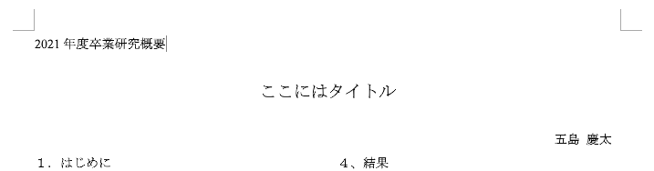
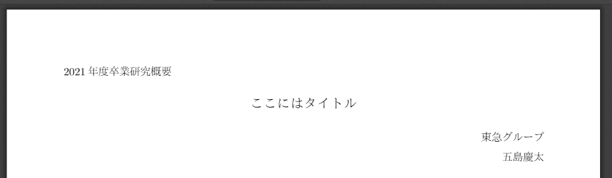
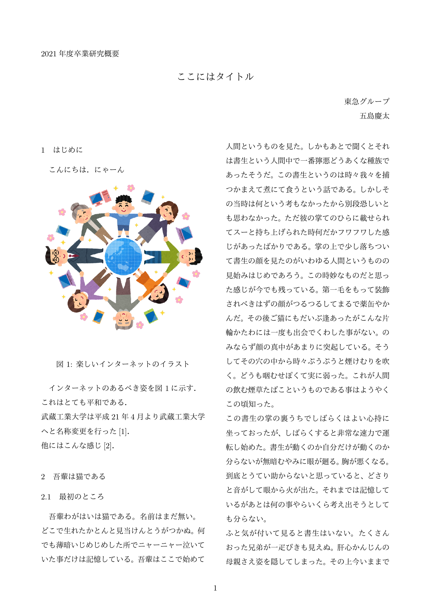
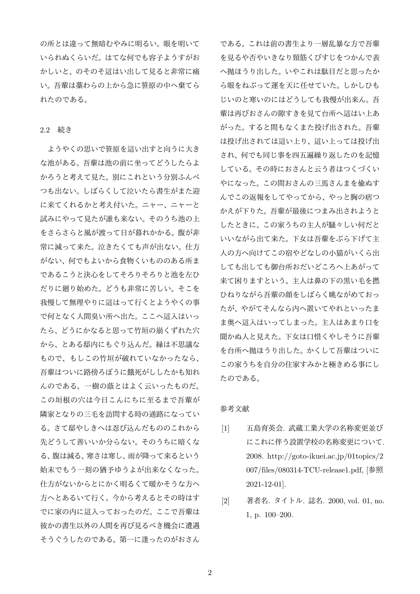

この記事は[Tokyo City University Advent Calendar 2021](https://adventar.org/calendars/6738)の3日目の記事です。

昨日の記事は [@BOB](https://twitter.com/bob510634) さんによる [辻堂にバーガーキングができたらしい - bob563’s diary](https://bob563.hatenablog.com/entry/2021/12/02/000431) でした!

弘前の人のテンションと同じ感じで好きです。

## はじめに

4年生の皆様は絶賛卒業研究中かと思われます。お疲れ様です。

さて、論文や概要集を書くにあたって、Wordで書いていくのはなんとなく嫌な人、いると思います。
Markdownで書いて、いい感じにしてくれれば・・・

そんなときにはPandocを使って変換していくのですが、環境構築がなかなかに面倒です。

とりあえず1月に提出するYC用フォーマットの卒業研究概要集を出力できるように整ってきたので、備忘録としてセットアップについて記載してきます。

(いろいろなところからの寄せ集め情報です。)

<div style="padding: 10px; margin-bottom: 10px; border: 1px solid #faebcc; background-color: #fcf8e3;">
<b>割と勘の状態でやっており、詳しい人からのツッコミがすごそうな記事なので、むしろそういう方からのツッコミをお待ちしています。よろしくおねがいします。</b><br>
設定を複数箇所に渡って指定したりしていますが、何故かそうしないと動かなかったりするんです。助けてください。
</div>

## 環境について

本記事ではLinux(Debian/Ubuntu)環境を想定しています。(筆者が実際に使っている環境はWSL1のUbuntu 20.04です。)  
Windowsユーザーの人はこの記事通りに行いたい場合はWSL1で良いのでLinux環境を用意してください。多分Windowsネイティブでも出来るとは思いますが、なんにもわかりません。

macOS(M1, Monterey)でも試していますが、フォントの問題のみ解決できませんでした。ヒラギノでいいなら行けると思います。

## 環境構築

### Linux/WSL(Debian/Ubuntu)

#### pandocのインストール

ここから最新版のpandocのdebを落としてきます。  
執筆時は`pandoc-2.16.2-1-amd64.deb`です。  
[Releases · jgm/pandoc](https://github.com/jgm/pandoc/releases)

```bash
wget https://github.com/jgm/pandoc/releases/download/2.16.2/pandoc-2.16.2-1-amd64.deb
sudo dpkg -i pandoc-2.16.2-1-amd64.deb
```

#### その他必要なパッケージを入れる

```bash
sudo apt install texlive texlive-luatex texlive-latex-extra texlive-lang-cjk fonts-ipaexfont  
```

(フォントはとりあえずIPAexにしています。)

#### もろもろのテンプレデータ的物を入れるディレクトリを作る

```bash
mkdir ~/markdown
```

このあたりは適宜好きなようにしてください

#### pandoc-crossrefを落とす

ここから`pandoc-crossref-Linux.tar.xz`を落として展開します。  
[Releases · lierdakil/pandoc-crossref](https://github.com/lierdakil/pandoc-crossref/releases)

執筆時は0.3.12.1aでした。

```bash
cd ~/markdown
wget https://github.com/lierdakil/pandoc-crossref/releases/download/v0.3.12.1a/pandoc-crossref-Linux.tar.xz
xz -dc pandoc-crossref-Linux.tar.xz | tar xfv -
```

これで~/markdownに`pandoc-crossref`という実行ファイルが展開されます。

### macOS(M1 + Montereyでテスト)

#### pandocのインストール

最新版のpandocのpkgを落としてインストールします(全てのユーザーに対してで良いかと)。  
執筆時は`pandoc-2.16.2-macOS.pkg`です。  
[Releases · jgm/pandoc](https://github.com/jgm/pandoc/releases)


#### その他必要なパッケージを入れる

texlive系のインストールはbrewだと思ったよりめんどくさそうなので、MacPortsを使います。

```bash
sudo port install texlive-lang-japanese texlive-luatex texlive texlive-latex-extra
```

フォントを入れていきますが、macOSだとIPAex明朝ではレンダリングがコケる気がします。まぁインストールすると普通にIPAexフォントがインストールされるだけなのでとりあえず。

```bash
brew install homebrew/cask-fonts/font-ipaexfont
```

#### もろもろのテンプレデータ的物を入れるディレクトリを作る

```bash
mkdir ~/markdown
```

このあたりは適宜好きなようにしてください

#### pandoc-crossrefを落とす

ここから`pandoc-crossref-Linux.tar.xz`を落として展開します。  
[Releases · lierdakil/pandoc-crossref](https://github.com/lierdakil/pandoc-crossref/releases)

執筆時は0.3.12.1aでした。

```bash
cd ~/markdown
curl -LO https://github.com/lierdakil/pandoc-crossref/releases/download/v0.3.12.1a/pandoc-crossref-macOS.tar.xz
xz -dc pandoc-crossref-macOS.tar.xz | tar xfv -
```

これで~/markdownに`pandoc-crossref`という実行ファイルが展開されます。

### (以下Linux/macOS共通)pandocとpandoc-crossrefのバージョンを確認する
pandocとpandoc-crossrefのビルド元pandocバージョンは一致していないと動作しません。

```bash
$ pandoc -v
pandoc 2.16.2
Compiled with pandoc-types 1.22.1, texmath 0.12.3.2, skylighting 0.12.1,
...
```

```bash
$ ./pandoc-crossref -v
pandoc-crossref v0.3.12.1 git commit 0a47293d7d47aa763e82204e13deabc8f1a041c4 (HEAD) built with Pandoc v2.16.2, pandoc-types v1.22.1 and GHC 8.10.7
```

上記の場合、pandocが2.16.2、pandoc-crossrefが「built with Pandoc v2.16.2」となっており、一致しています。

### metadata.yamlの用意

図や表、コードなどのPrefixを設定したり、二段組を使う場合に設定したりします。  
`~/markdown/metadata.yaml`として保存します。

なぜここにTitleやAuthorが入っていないのか、という点については、冒頭部分のレイアウトを自分で制御したいからというのがあります(テンプレートを弄る気力がないので)。後述します。

```yaml
figureTitle: "図 "
tableTitle: "表 "
listingTitle: "コード "
figPrefix: "図"
eqnPrefix: "式"
tblPrefix: "表"
lstPrefix: "コード"
codeBlockCaptions: true
listings: true
# 見出し番号自動で付ける
numbersections: true

# 左右に段組みにする場合
header-includes:
  - \documentclass[twocolumn, a4j]{jarticle}

```

### make.yamlの用意

生成するときのオプションをまとめて書いておいたyamlファイルを用意して、生成コマンドが長くならないようにします。

**macOSの場合、CJKmainfontをIPAexMinchoにしても読み込まれないことがあるので、`luatexjapresetoptions`と`CJKmainfont`をコメントアウトしてデフォルトのヒラギノ明朝にしたほうが良いかも知れません**

フォントサイズが11ptになっていますが、だいたいこれで10.5ptと同じくらいです。  
[TeX を使った論文作成のノウハウ](http://denki.nara-edu.ac.jp/~yabu/soft/tex/tex.html#:~:text=%E4%BE%8B%E3%81%88%E3%81%B0%E3%80%81MS%2DWord%20%E3%81%A7%E3%81%AF%E3%83%87%E3%83%95%E3%82%A9%E3%83%AB%E3%83%88%E3%81%AE%E5%92%8C%E6%96%87%E6%96%87%E5%AD%97%E3%82%B5%E3%82%A4%E3%82%BA%E3%81%AF%2010.5%20pt%20%E3%81%A7%E3%81%99%E3%80%82%20%E3%81%93%E3%82%8C%E3%81%AB%E5%AF%BE%E5%BF%9C%E3%81%99%E3%82%8B%E3%81%AE%E3%81%AF%20TeX%20%E3%81%A7%E3%81%AF%20%5Cdocumentstyle%5B11pt%5D%7Bjarticle%7D%20%E3%81%A7%E3%81%99%E3%80%82%2011%20pt%20%E3%81%AE%E3%81%A8%E3%81%8D%E3%81%A0%E3%81%91%E3%80%81%20%E5%92%8C%E6%96%87%E3%83%95%E3%82%A9%E3%83%B3%E3%83%88%E3%81%A8%E8%8B%B1%E6%96%87%E3%83%95%E3%82%A9%E3%83%B3%E3%83%88%E3%81%AE%E5%A4%A7%E3%81%8D%E3%81%95%E3%81%AE%E6%AF%94%E7%8E%87%E3%81%8C%20%E7%95%B0%E3%81%AA%E3%81%A3%E3%81%A6%E3%81%84%E3%82%8B%E3%81%93%E3%81%A8%E3%81%AB%E6%B3%A8%E6%84%8F%E3%81%97%E3%81%A6%E3%81%8F%E3%81%A0%E3%81%95%E3%81%84%E3%80%82)


```yaml
filters:
  - pandoc-crossref

pdf-engine: lualatex

standalone: true

metadata-files:
  - metadata.yaml

variables:
  documentclass: ltjarticle
  classoption: pandoc

  # 上下左右余白
  geometry:
    - top=2cm
    - bottom=2cm
    - left=2cm
    - right=2cm

  # 11pt≒10.5pt
  fontsize: 11pt

  # フォント設定
  luatexjapresetoptions: IPAexMincho
  CJKmainfont: IPAexMincho

  # 行間設定 これで縦を37行に
  linestretch: 1.28

  # 字下げ設定
  indent: true

include-in-header:
  - header.tex

listings: true

csl: sist02
```

### header.texの用意

以下の内容を記載した`~/markdown/header.tex`を用意します

コードブロックがない場合はコードブロックの色設定は必要ないですが、最後のrenewcommandの行が無いと、図などのキャプションが英語のままになります。(さっきyamlで設定したのになんで?)

色設定等は[Pandocを使ってMarkdownでレポートを書いてみる - 屋根裏](https://yurkth.hateblo.jp/entry/pandoc-markdown) より拝借しました。

図の位置については [R Markdownでpdf出力する時の図の位置設定 | Nylog](https://nyarrix.com/blog/2019/09/09/rmarkdown-to-pdf/) より拝借しました。

```tex
\usepackage{listings}
\usepackage{xcolor}
\usepackage{url} % 参考文献用
\usepackage{titlesec}

% 見出しのフォント設定を特に大きくせず他と同じにする
\titleformat*{\section}{\selectfont\rmfamily}
\titleformat*{\subsection}{\selectfont\rmfamily}

% 二段組の間の間隔 これで横を22文字に
\setlength{\columnsep}{1cm}

% コードブロックの色設定
\lstset{
    basicstyle=\ttfamily,
    keywordstyle=\color[rgb]{0,0,0.6}\bfseries,
    stringstyle=\color[rgb]{0,0.6,0},
    commentstyle=\color[rgb]{0.4,0.4,0.4}\itshape,
    numberstyle=\ttfamily,
    numbers=none,
    stepnumber=1,
    numbersep=15pt,
    numberstyle=\color[rgb]{0.6,0.6,0.6},
    tabsize=4,
    breaklines=true,
    captionpos=t,
    frame=single,
    rulecolor=\color[rgb]{0.8,0.8,0.8}, 
    backgroundcolor=\color[rgb]{0.95,0.95,0.95},
    showspaces=false,
    showtabs=false,
    showstringspaces=false
}

\renewcommand{\lstlistingname}{コード}

% 図の位置を書いた位置にする
\usepackage{float}
\let\origfigure\figure
\let\endorigfigure\endfigure
\renewenvironment{figure}[1][2] {
    \expandafter\origfigure\expandafter[H]
} {
    \endorigfigure
}
```

### references.bibの用意

これは実際のMarkdownファイルがある場所に作ります。

参考文献を突っ込んでいくファイルです。

BiBTeX形式で記載します。  
どんなものか、については [BiBTeXとは - Qiita](https://qiita.com/SUZUKI_Masaya/items/14f9727845e020f8e7e9#web%E3%83%9A%E3%83%BC%E3%82%B8%E3%82%92%E5%8F%82%E8%80%83%E6%96%87%E7%8C%AE%E3%81%A8%E3%81%97%E3%81%A6%E8%BF%BD%E5%8A%A0%E3%81%99%E3%82%8B%E5%A0%B4%E5%90%88) を参考にして下さい。

### sist02.cslの用意

[Zotero Style Repository](https://www.zotero.org/styles?q=id%3Asist02) から`sist02.csl`をダウンロードします(「SIST02 (日本語)」

```bash
wget https://www.zotero.org/styles/sist02 -O sist02.csl
```

これは参考文献のスタイルをいい感じにしてくれるものなのですが、リスト表記時や文章内の参照番号が「(1)」のように普通のカッコになってしまうので、これを`[1]`のようになるよう、書き換えます。

```bash
sed -i -e 's/prefix="("/prefix="["/g' sist02.csl
sed -i -e 's/suffix=")"/suffix="]"/g' sist02.csl
```

## 生成コマンド

hoge.mdをhoge.pdfにする、というものなのですが、実はPandocのバージョンの諸々で、参考文献が入っていると  
`\vadjust pre`というコマンドが挿入され、lualatexがエラーを吐きます。  
( [Error with \vadjust when loading luatexja package - Jgm/Pandoc](https://issueexplorer.com/issue/jgm/pandoc/7534) )

色々検証してみたところ、一度pandocでPDFではなくtexファイルを出力し、当該部分を削除してlualatexでコンパイルするのが良さそうです。

ということで、いきなりですが生成関数を.bashrcや.zshrcに記載します。

(なんでtex出力なのにmake.yamlでpdf-engineを書いたんだ、という話になりそうですが、別に存在してても構わなそうなので許してください)

### bash/zsh用function

```bash
function mdtopdf () {

    # 終了後にもとのディレクトリに戻れるように現在のディレクトリを取得
	origdir=`pwd`

    # ファイル名から拡張子を取り除いたものを取得
	file=`echo $1 | sed -e 's/\.md//'`

    # 指定されたmarkdownがあるディレクトリの絶対パスを取得
	dirpath=$(cd $(dirname $1); pwd)

    # いろいろな設定ファイルがある~/markdownに移動
	cd ~/markdown

    # pandocでtexファイルを生成
	pandoc -d make.yaml \
	--bibliography=${dirpath}/references.bib \
	--resource-path=${dirpath} \
	--cite \
	--csl=sist02 \
	-f markdown+hard_line_breaks \
	${dirpath}/${file}.md \
	-o ${dirpath}/${file}.tex

    # もとのディレクトリに戻る
	cd $origdir

    # texファイルからいらない部分を消す
	sed -i -e 's/\\vadjust pre{\(.*\)}%/\1/' ${file}.tex

    # コンパイルする
	lualatex ${file}.tex
}
```

### 使い方

- 準備:
    上記コマンドを.bashrcや、.bashrcでsourceを使って読み込ませる別ファイル等に記載し、読み込ませます。
- mdファイル、references.bib、画像等のディレクトリについて:
    どこでも構いませんが、
    - hoge.md
    - references.bib
    - 画像または画像が入ったディレクトリ
    は同じ位置に置いてください(画像に関してはresource-pathでmdファイルと同じ階層以下を指定しているので)
- 実行方法
    1. `mdtopdf hoge.md`と実行します
    2. hoge.mdと同じ場所にhoge.pdfが生成されます。

## Markdownの書き方

基本はMarkdownなのですが、一部専用の書き方を行います。

### 冒頭について

PandocでTitleやAuthorをつけると自動でいい感じにタイトルや著者名をやってくれるのですが、

  
(これはWord)

こういうことをしたいので、自作します。

yamlで二段組を指定していますが、ここは一段組になるため、`\twocolumn[]`で囲って一段組にします。

```tex
\twocolumn[
\begin{flushleft}
2021年度卒業研究概要\\
\vskip\baselineskip
\end{flushleft}

\begin{center}
\fontsize{14pt}{11pt}\selectfont
ここにタイトル
\vskip\baselineskip
\end{center}

\begin{flushright}
美しい時代へ 研究室\\
0000000 五島 慶太\\
\end{flushright}
\vskip\baselineskip
]
```



(出力したPDF)

こんな感じです。

### キャプション・参照について

#### 画像
画像に関しては、

```markdown
{#fig:識別名}
```

と挿入し、参照するときは

```markdown
〇〇を[@fig:識別名]に示す。
```

と記述することで行なえます。

#### 参考文献参照

references.bibには以下のように記入します。(これはURLの例です。BibTex形式なので調べるとたくさん出てきます。)

```bib
@misc{tcu-namechange:online,
author = {学校法人 五島育英会},
title = {武蔵工業大学の名称変更並びにこれに伴う設置学校の名称変更について},
url = {http://goto-ikuei.ac.jp/01topics/2007/files/080314-TCU-release1.pdf},
year = {2008},
month = {3},
language = {ja},
urldate = {2021-12-01},
}
```

Markdownにはこのように参照させます。

```markdown
武蔵工業大学は平成21年4月より武蔵工業大学へと名称変更を行った[@tcu-namechange:online].

```

## 実演

### Markdown 

```markdown
\twocolumn[
\begin{flushleft}
2021年度卒業研究概要\\
\vskip\baselineskip
\end{flushleft}

\begin{center}
\fontsize{14pt}{10.5pt}\selectfont
ここにはタイトル
\vskip\baselineskip
\end{center}

\begin{flushright}
東急グループ\\
五島慶太\\
\end{flushright}
\vskip\baselineskip
]

# はじめに

こんにちは．にゃーん

{#fig:インターネット平和}

インターネットのあるべき姿を[@fig:インターネット平和]に示す．
これはとても平和である．
武蔵工業大学は平成21年4月より武蔵工業大学へと名称変更を行った[@tcu-namechange:online]．
他にはこんな感じ[@kizi-rei]．

# 吾輩は猫である

## 最初のところ

吾輩わがはいは猫である。名前はまだ無い。
(略)

## 続き

ようやくの思いで笹原を這い出すと向うに大きな池がある。
(略)

# 参考文献
```

### PDF





## 〆

YCの卒業研究概要集をMarkdown+Pandocで書くセットアップについて書きましたが、セットアップに割いた時間をおとなしくWordで書くことに費やしていれば今頃7割位完成していたような気がします。

慣れない作業でめちゃくちゃ疲れましたが、いつか誰かの役に立てば・・・。

明日は[@gitercccahuud](https://twitter.com/gitercccahuud)さんによる「老害大学院生ツイッタラーが教える情報システム学科完全攻略法」です!


## 参考文献

[Markdownで相互参照を使うならpandoc-crossref - DiaryException](https://laclefyoshi.hatenablog.com/entry/20150616/crossref)

[Pandocを使ってMarkdownでレポートを書いてみる - 屋根裏](https://yurkth.hateblo.jp/entry/pandoc-markdown)

[Pandocの比較的簡単なインストール方法 - Qiita](https://qiita.com/sky_y/items/3c5c46ebd319490907e8#linux--win2-wslubuntu%E3%82%A2%E3%83%97%E3%83%AA%E3%81%AA%E3%81%A9)

[学位論文を書く準備 - プらチナの日記](https://blog.8tak4.com/post/168232661994/know-how-writing-thesis-markdown)

[TeX書式ノート - Qiita](https://qiita.com/nmxi/items/2179a3da442bdf8f74a6)

[TeX文書で, 本文は2段, 概要は1段で表示させたい - 300億円欲しい](https://gg-hogehoge.hatenablog.com/entry/2013/08/13/145138)

[Pandoc User’s Guide 日本語版 — 日本Pandocユーザ会](https://pandoc-doc-ja.readthedocs.io/ja/latest/users-guide.html)

[[Pandoc 2.8 新機能] 長いオプションをファイルにまとめるDefault file - Qiita](https://qiita.com/sky_y/items/b243c2618706605e5fdd)

[まだ Word で消耗してるの？ 大学のレポートを Markdown で書こう - Qiita](https://qiita.com/Kumassy/items/5b6ae6b99df08fb434d9)

[Pandocで参考文献リストを処理する扱う方法 (PandocとZoteroで参考文献：後編)](https://zenn.dev/sky_y/articles/pandoc-advent-2020-bib2)

[BiBTeXとは - Qiita](https://qiita.com/SUZUKI_Masaya/items/14f9727845e020f8e7e9#web%E3%83%9A%E3%83%BC%E3%82%B8%E3%82%92%E5%8F%82%E8%80%83%E6%96%87%E7%8C%AE%E3%81%A8%E3%81%97%E3%81%A6%E8%BF%BD%E5%8A%A0%E3%81%99%E3%82%8B%E5%A0%B4%E5%90%88)

[BibtexでURLを参考文献にする方法 - 日々の報告書](https://stakizawa.hatenablog.com/entry/20070608/t1)

[6.2 LaTeX 出力の Pandoc オプション | R Markdown クックブック](https://gedevan-aleksizde.github.io/rmarkdown-cookbook/latex-variables.html)

[メモ: Pandoc+LaTeXで気軽に日本語PDFを出力する - Qiita](https://qiita.com/sky_y/items/15bf7737f4b37da50372)

[TeXのセクションの大きさを変更する - Qiita](https://qiita.com/roaming_south/items/ea39b9554167fcaba882)

[TeX を使った論文作成のノウハウ](http://denki.nara-edu.ac.jp/~yabu/soft/tex/tex.html#:~:text=%E4%BE%8B%E3%81%88%E3%81%B0%E3%80%81MS%2DWord%20%E3%81%A7%E3%81%AF%E3%83%87%E3%83%95%E3%82%A9%E3%83%AB%E3%83%88%E3%81%AE%E5%92%8C%E6%96%87%E6%96%87%E5%AD%97%E3%82%B5%E3%82%A4%E3%82%BA%E3%81%AF%2010.5%20pt%20%E3%81%A7%E3%81%99%E3%80%82%20%E3%81%93%E3%82%8C%E3%81%AB%E5%AF%BE%E5%BF%9C%E3%81%99%E3%82%8B%E3%81%AE%E3%81%AF%20TeX%20%E3%81%A7%E3%81%AF%20%5Cdocumentstyle%5B11pt%5D%7Bjarticle%7D%20%E3%81%A7%E3%81%99%E3%80%82%2011%20pt%20%E3%81%AE%E3%81%A8%E3%81%8D%E3%81%A0%E3%81%91%E3%80%81%20%E5%92%8C%E6%96%87%E3%83%95%E3%82%A9%E3%83%B3%E3%83%88%E3%81%A8%E8%8B%B1%E6%96%87%E3%83%95%E3%82%A9%E3%83%B3%E3%83%88%E3%81%AE%E5%A4%A7%E3%81%8D%E3%81%95%E3%81%AE%E6%AF%94%E7%8E%87%E3%81%8C%20%E7%95%B0%E3%81%AA%E3%81%A3%E3%81%A6%E3%81%84%E3%82%8B%E3%81%93%E3%81%A8%E3%81%AB%E6%B3%A8%E6%84%8F%E3%81%97%E3%81%A6%E3%81%8F%E3%81%A0%E3%81%95%E3%81%84%E3%80%82)

[(1) 角 征典／Masanori KadoさんはTwitterを使っています 「この変更でコンパイルが通らなくなったんだけど、何をしてるのかわからん。。。 https://t.co/8BUh8s84xm」 / Twitter](https://twitter.com/kdmsnr/status/1395652667444133892)

[Error with \vadjust when loading luatexja package - Jgm/Pandoc](https://issueexplorer.com/issue/jgm/pandoc/7534)

[R Markdownでpdf出力する時の図の位置設定 | Nylog](https://nyarrix.com/blog/2019/09/09/rmarkdown-to-pdf/)

