この記事はTokyo City University Advent Calendar 2021の7日目の記事です。

昨日の記事は [@gitercccahuud](https://twitter.com/gitercccahuud) さんによる 「この構文解析器はお前が実装することで始めて完成する」 でした!(リンクなし)

---

こんにちは。2枠目です。

去年のアドカレはフロッピーネタでしたが、今年は方向性を全力で変えてみます。

ちょっと長い記事ですが、是非お付き合いください。

---

## プレゼンリモコンとしてのWiiリモコン

さて、この記事を見に来てくださる方々はWiiというゲーム機はご存知かと思います。あの白かったり黒かったり(青かったり赤かったり)したゲーム機です。  
そのゲーム機で使うコントローラであるWiiリモコンは、Bluetoothコントローラとして非常に高い品質を持っています。

ご存じの方も多いかと思いますが、Wiiが登場した直後から、Wiiリモコンはパソコンとペアリング出来ることが判明し、有志の方々によって色々なソフトが生まれ、Wiiリモコンをパソコンで使えるようになりました。加速度センサーやジャイロセンサーを使ったマウスになったり、普通にキー割り当てをしたプレゼンリモコンになったり。

そこで、この記事の前半では、「Wiiリモコンはプレゼンリモコンとしていいよ」という紹介をしようと思います。

## プレゼンリモコンは高い

プレゼンリモコンとは、PowerPointなどでプレゼン資料を出しているときのリモコンをよく指しますが、専門の製品は思ったより価格が高いです。

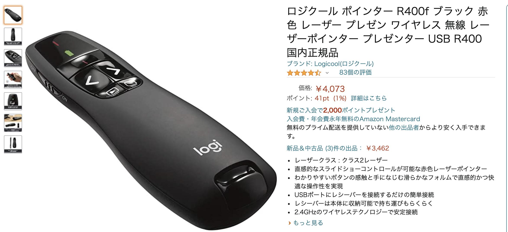

もちろんこれはレーザーポインターが付いてるからなんですが、レーザーポインターが必要ない純粋なページ送りをするには高いです。  
(もちろんもっと安い製品はいろいろありますが)

そこで活躍するのがWiiリモコンです。  
家に数本ある方もいらっしゃるのではないでしょうか。  
持っていなくても、Wiiリモコンはいまや中古で数百円で完動品が買えます。

## WiiリモコンとWindowsPCはすごい簡単に接続できる

### Bluetoothでペアリングする

とりあえず、PCとWiiリモコンを接続してみましょう。  
Wiiリモコンのペアリングは設定アプリからだと行えません。次の手順で行ってください。(パスコードが無いのに強制的に入力させられてしまうので)

1. タスクバーのBluetoothアイコンを右クリックして、「パーソナルエリアネットワークへ接続」をクリックします(厳密に言うと、コントロールパネルの「デバイスとプリンター」が開ければOKです。)  
    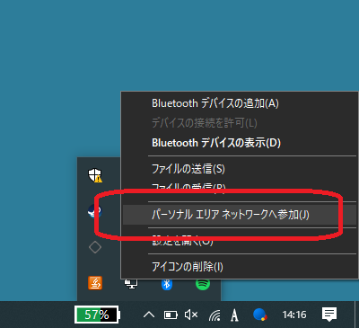
2. 左上の「デバイスの追加」をクリックします  
    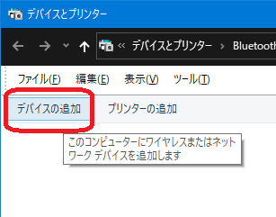
3. WiiリモコンのSyncボタンを押し、「デバイスの追加」画面に「入力デバイス」や「Nintendo RVL-CNT-01」等が出てきたらクリックして「次へ」をクリックします  
    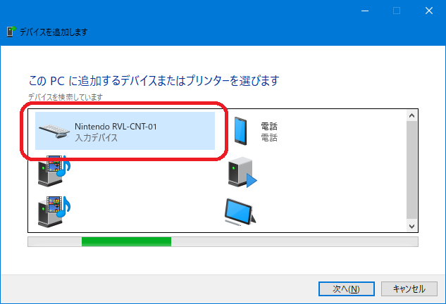
4. パスコードはないので「次へ」をクリックします  
    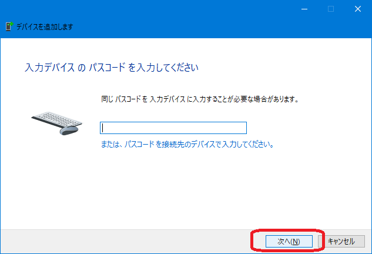
5. ペアリングが行われます  
    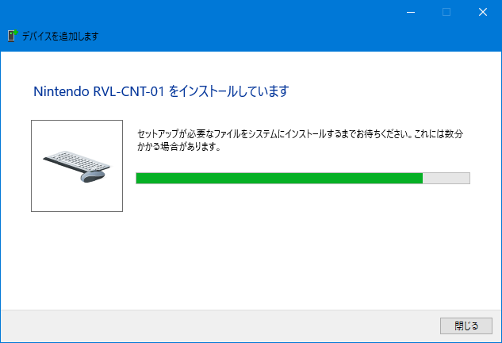
6. 成功すると設定アプリに「接続済み」と表示されるほか、WiiリモコンのLEDが点滅し続けます。  
    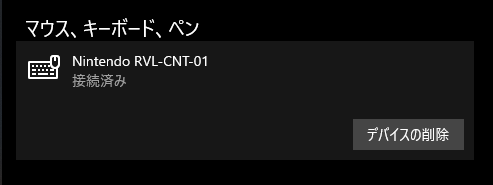

### キーとして利用する

ペアリングが出来たらあとはキーボードとして認識させるソフトを利用します。

#### Wey

純粋にボタンをキーとして認識させるには、Weyがおすすめです。  
全部のキーに何かを割り当てられるので、ゲームにも使えます。(ヌンチャクやクラシックコントローラも割り当てられます)

[Weyの詳細情報 : Vector ソフトを探す！](https://www.vector.co.jp/soft/winnt/util/se482864.html)

Weyを起動させると、Wiiリモコンが接続されているということで青枠が表示されるほか、WiiリモコンのLEDが1Pで点灯します。  
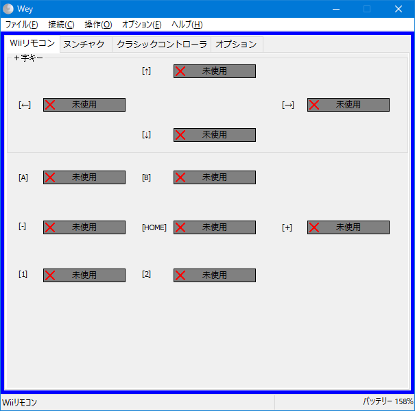

そしてこの各ボタンにキーを割り当てていきます  
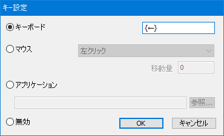

プレゼンリモコンという使い方だとこんな感じになりますね  
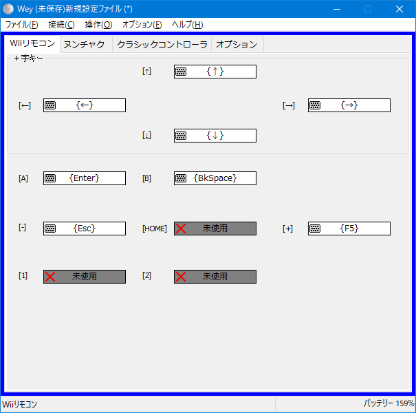

#### WiinRemote

WiinRemoteを使用してもプレゼンリモコンとして使えます。  
WiinRemoteはボタンを利用するだけでなく、マウスポインタとして使う事もできるソフトです。(その代わりWeyと異なり、各キーに好きなキーを割り当てる、ということはあまり出来ません)

[WiinRemote](http://onakasuita.org/wii/)

こちらのサイトから WiinRemote_v2007.1.13.zip をダウンロードし、展開、起動します。

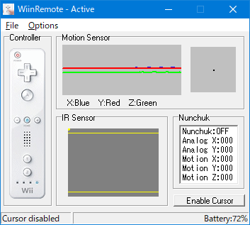

これだけで十字キーがすでに矢印キーとして割り当てられているので、プレゼンリモコンとして利用できます。

Bボタンを押すと加速度センサーを利用したマウスポインタが利用できます。(Bボタンでマウス機能のオンオフ)

(他にもセンサーバーを利用したマウスポインタ機能も利用できます)

### あとはPowerPoint等で利用するだけ

もうキーは上下左右キーとして認識されているので、あとは純粋にプレゼンリモコンとして利用するだけです。  
低い位置にあるノートパソコンのキーを腰をかがめて押す必要もありません。  
Wiiリモコンを持って発表する姿はちょっと面白いかもしれませんが、実用性は完璧です。  
学生の皆さんはスライド発表等のタイミングもあるかと思いますので、ぜひお試しください。

## 【本編】Wiiリモコンとセンサーバー

さて、ここまでWiiリモコンをプレゼンリモコンとして使う方法についてご紹介しましたが、Wiiリモコンはモーションセンサー以外にも赤外線を利用したポインタ操作が可能です。

これはある意味当然でもありますが、世の中にはちゃんとそれをPCでも実装しているソフトがあります。先程も書きましたが、[WiinRemote](http://onakasuita.org/wii/)にもその機能が実装されています。

他にも、WiiのエミュレータであるDolphinはWiiリモコンを直接ゲームに使用する際に実機同様ポインタ操作も可能になっています。

しかしそれらの機能を使うにはセンサーバーが必要です。もちろん実機のセンサーバーを利用してもいいですし、サードパーティから出ているUSB給電式、充電式、乾電池式など色々ありますが、とにかくセンサーバーなしにはあのポインタ操作はできません。

そもそもセンサーバーというのは名前こそ「センサー」ですが、別にセンサーバー自体がなにか情報を取得しているわけではなく、純粋に**両端に赤外線LEDを搭載してそれを光らせるだけ**、というシンプルデバイスです。(赤外線LEDが光っているだけ、というのを利用して、テレビの友チャンネル Gガイド for Wiiとかはテレビ操作を実装していたりしましたね。懐かしい。)

2006年の記事です。もう15年前かぁ  
[【続報：Wii分解】「センサーバー」にはセンサがなかった | 日経クロステック（xTECH）](https://xtech.nikkei.com/dm/article/NEWS/20061127/124506/)

赤外線が2点から出てればいいので、ろうそくで代用、なんてのもありましたね。  
[Wiiのセンサーバーはろうそくで代用可能 - Engadget 日本版](https://japanese.engadget.com/jp-2006-11-28-wii-candlelight.html)

脱線しましたが、つまりセンサーバーをパソコンの前に持ってきてやれば、ポインタ操作が出来るわけです。ところが、純正や互換センサーバーはテレビ用です。机の上にあるディスプレイで使うには**距離が短すぎる**のです。

どうにか机やノートパソコンで使えないか・・・そう考えていると、とあるものを思い出しました。

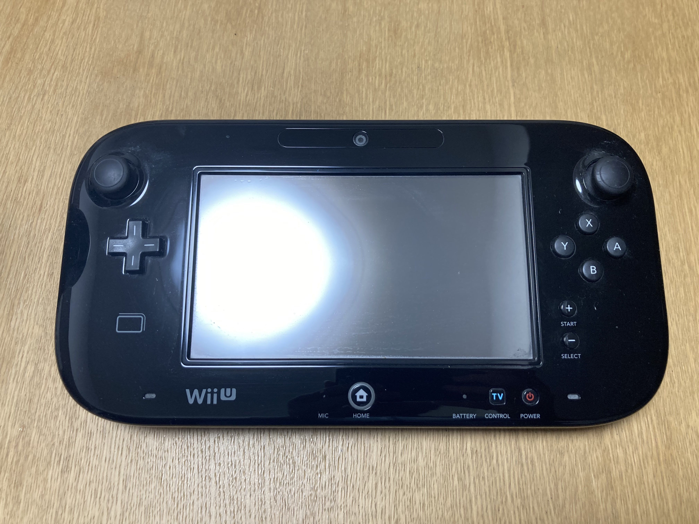

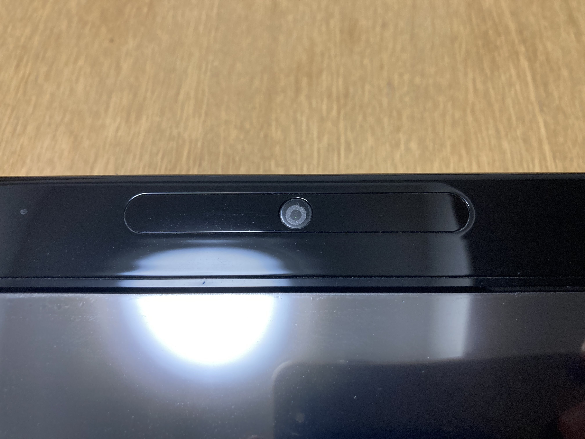

そう、WiiUゲームパッドです。  
WiiUゲームパッドは上部にセンサーバーがついていて、これを使うことでテレビとセンサーバーがなくてもWiiのゲームが遊べるようになっています。

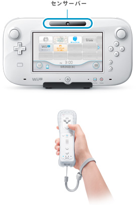  
出典: [Wiiのソフトで遊ぶ | Wii U｜任天堂](https://www.nintendo.co.jp/hardware/wiiu/features/index.html)

ゲームパッドの画面は小さいので、当然Wiiリモコンとセンサーバーが至近距離になります。それでもちゃんと動くわけです。  
つまり、めちゃくちゃ当然な話ですが、間隔を狭めたセンサーバーを使えばセンサーバーからの距離を短くできます。(テレビから離れればセンサーバーの両端間の距離は発光点しか見てない赤外線カメラから見れば狭まりますからね)

もちろんこの発想は任天堂がWiiUを発売する前から存在しており、  
[USB IRセンサーバー - imaginglabo.web.fc2.com/wii-ir-sensor.htm](http://imaginglabo.web.fc2.com/wii-ir-sensor.htm)  
や  
[http://www.kako.com/neta/2006-019/2006-019.html](http://www.kako.com/neta/2006-019/2006-019.html#:~:text=%E5%B0%8F%E5%9E%8B%E3%81%AEUSB%20HUB%E3%82%92%E6%94%B9%E9%80%A0%E3%81%97%E3%81%A6%E3%80%81%E8%87%AA%E4%BD%9C%E3%82%BB%E3%83%B3%E3%82%B5%E3%83%BC%E3%83%90%E3%83%BC%E3%82%92%E5%86%85%E8%94%B5%E3%81%97%E3%81%9F%E3%82%82%E3%81%AE%E3%82%92%E4%BD%9C%E3%81%A3%E3%81%A6%E3%81%BF%E3%81%9F%E3%80%82HUB%E3%81%A8%E3%81%97%E3%81%A6%E3%82%82%E3%81%A1%E3%82%83%E3%82%93%E3%81%A8%E4%BD%BF%E3%81%88%E3%82%8B%E3%80%82%E3%83%8E%E3%83%BC%E3%83%88PC%E3%81%A8%E4%B8%80%E7%B7%92%E3%81%AB%E6%8C%81%E3%81%A1%E9%81%8B%E3%81%B3%E7%94%A8%E3%81%AB%E4%BD%BF%E3%81%A3%E3%81%9F%E3%82%8A%E3%81%99%E3%82%8B%E3%80%82)

など、USBハブに埋め込んで持ち運び型にするといった工夫が凝らされたものが生まれていたりしました。

**じゃあ僕もほしい!!!!**

ということで、電子工作の経験が高校の技術の授業以外存在していない僕が、全力の技術提供を受けながら小さい持ち運び型のセンサーバーを作るお話です。

## 構想を練る

まず生まれた図です。

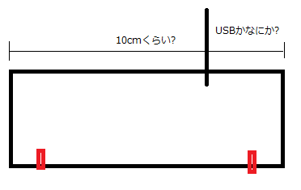

そして次に生まれた図がこちらです。

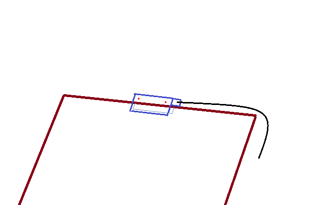

ノートパソコンの上にクリップ的に固定されてる図ですね。我ながら酷い図だ。

このあたりの構想を練っている最中、[ましま](https://twitter.com/mewl_msh)さんにより、

> LEDが光ってればいいだけか
ブレッドボードにLED二個つけて置いとけば？

> USBの5VラインをとってLEDくっつけてダンボールに挿せば完成するかもしれない()

という助言を受けます。

僕はハンダゴテも半田も持っていませんし、電子工作もしたことがないですし、ましてや筐体制作なんてしたことがありません。でもこの言葉で、動けば良いものを作ろう、と前向きになります。

## どうやって固定するか

デスクトップPCならモニタの足あたりに置いておけばいいですが、ノートパソコンでも使いたいとなると固定方法を考えなければいけません。

ノートパソコン上部にメモをクリップで止められる製品を使う・・・?3Dプリンタで引っかかりを作る・・・? といろいろ考えました。

ふと机を見ると、こんなものがあります。

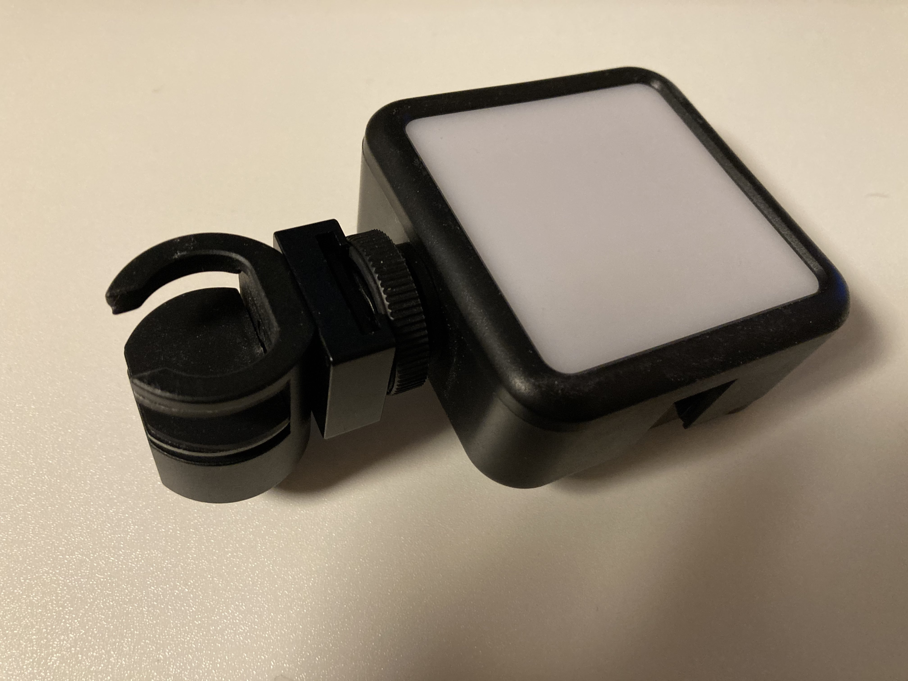

これは昨今のオンライン会議用にと売られているライトです。(後ろにあるダイヤルを回すとめちゃくちゃ強く光ります。TypeC充電なので便利。)

で、これのクランプ部分を取り外すと、

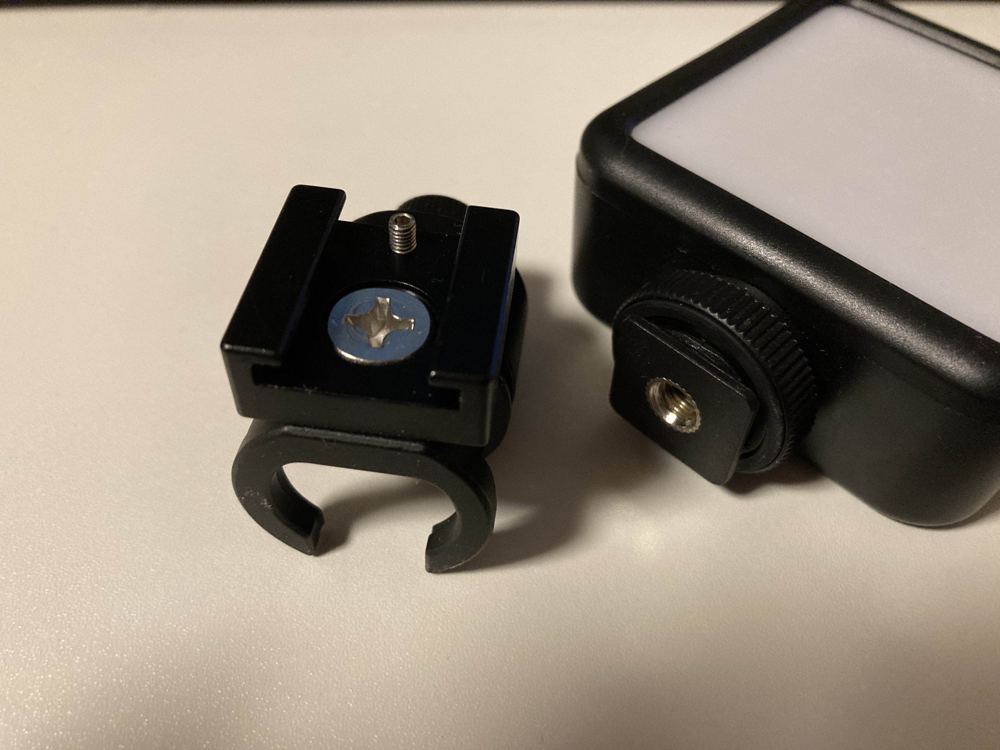

カメラでよく見るアクセサリーシューのやつになります。つまり、スマホやノートパソコンの上部にそういったアクセサリを固定できるアダプタになるわけです。(今全く同じものが売ってるかは知りませんが、似たようなものは売ってるはずです。)

これを固定具にして、なにかいい感じの台座となる幅があるもの・・・

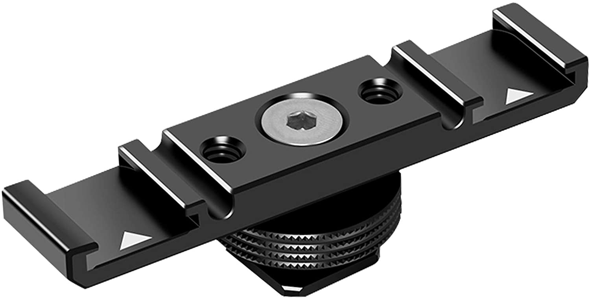  
出典:[Amazon | MOSHUSOデュアルコールドシューベースアダプターマウントエクステンションブラケットマイクLEDライトフラッシュ用 | MOSHUSO | シューマウント](https://www.amazon.co.jp/gp/product/B08LSXZD3H/ref=ppx_yo_dt_b_asin_title_o00_s00?ie=UTF8&psc=1)

**ありました**

よくマイクを2つ取り付けたりするのに使われるやつですね。

これのそれぞれ左右にLEDを置いて云々すれば、それっぽいものができそう! ということで、筐体が決まりました。

## 実装パーツを買う

自発的電子工作はしたことがないため、何もわかりません。LEDは抵抗が必要ということくらいしかわかりません。  
ということで、[Wiiのセンサーバーを自作しよう！！ | 痕跡 -traceback-](https://traceback.mydns.jp/articles/2019/09/01/b/)を参考にさせていただき、パーツを買いました。

- [５ｍｍ赤外線ＬＥＤ　９４０ｎｍ　ＯＳＩ５ＦＵ５１１１Ｃ－４０　（５個入）: LED(発光ダイオード) 秋月電子通商-電子部品・ネット通販](https://akizukidenshi.com/catalog/g/gI-03261/)
- [カーボン抵抗（炭素皮膜抵抗）　１／４Ｗ１００Ω　（１００本入）: パーツ一般 秋月電子通商-電子部品・ネット通販](https://akizukidenshi.com/catalog/g/gR-25101/)
- [電源用マイクロＵＳＢコネクタＤＩＰ化キット: 組立キット(モジュール) 秋月電子通商-電子部品・ネット通販](https://akizukidenshi.com/catalog/g/gK-10972/)

この3つです。注文した後に線材を買っていないことに気が付きましたが、譲っていただいたりしてどうにかしました。

基板は・・・とりあえずミニブレッドボードを譲っていただいたのでそれでやっていくことにします。

## 試しにパーツを配線してみる
回路はこういう感じですね。(Tinkercadで適当にやってみました)  
電源と抵抗とLEDが並列で接続されている、シンプルなものです。  
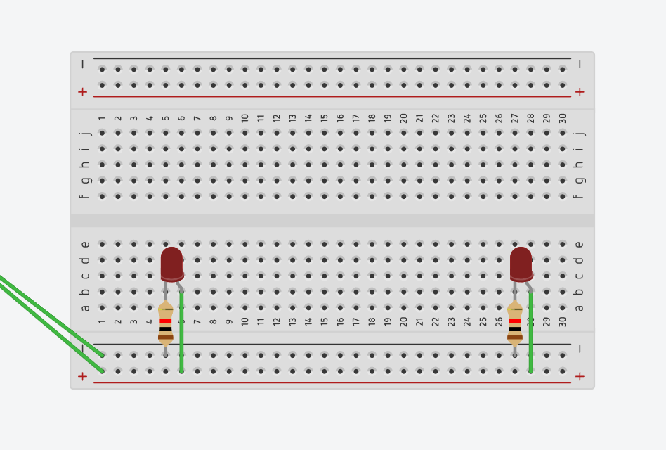

これを実際に組み立ててみます。  
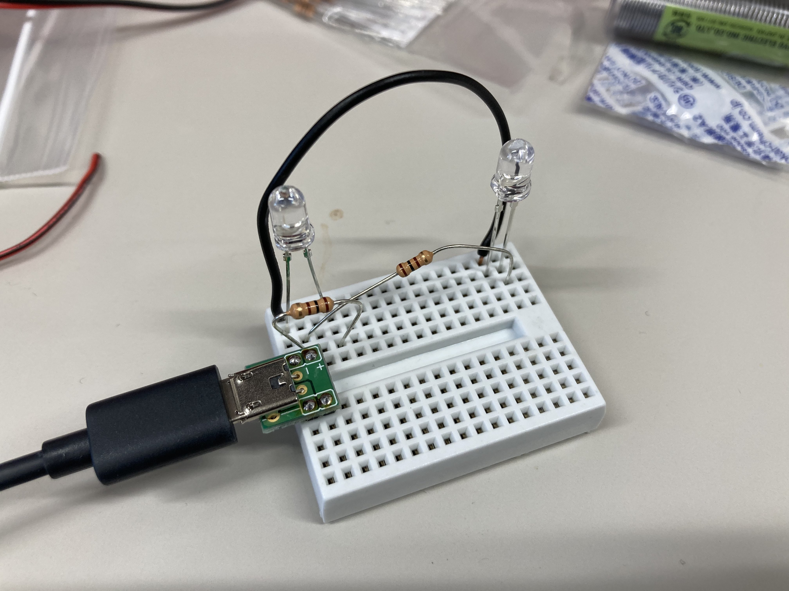

とりあえずこういうことになりますね。DIPのはんだ付けは[ましま](https://twitter.com/mewl_msh)さんにやっていただきました。

この状態で動作確認をしてみました。ちゃんと点灯しています。うれしい。  
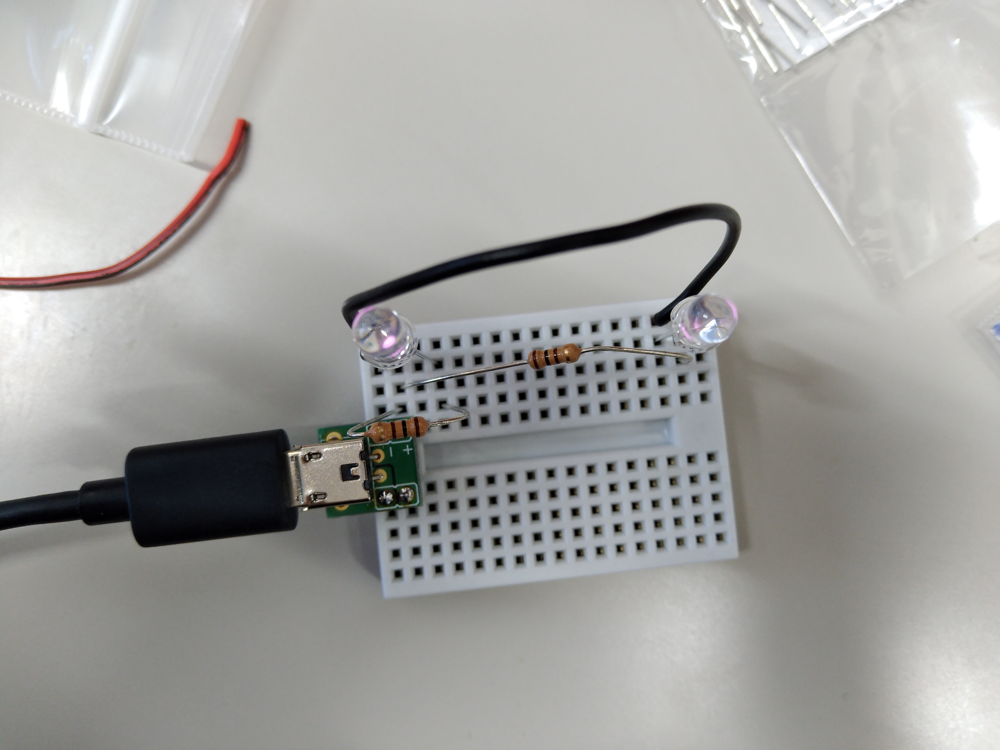

ちなみにこの状態でWiinremoteを使ってIRセンサーが認識していることを確認しました。

## 組み立てていく

とりあえずそれっぽい感じにしてみました。まだはんだ付けは指定ない状態です。  
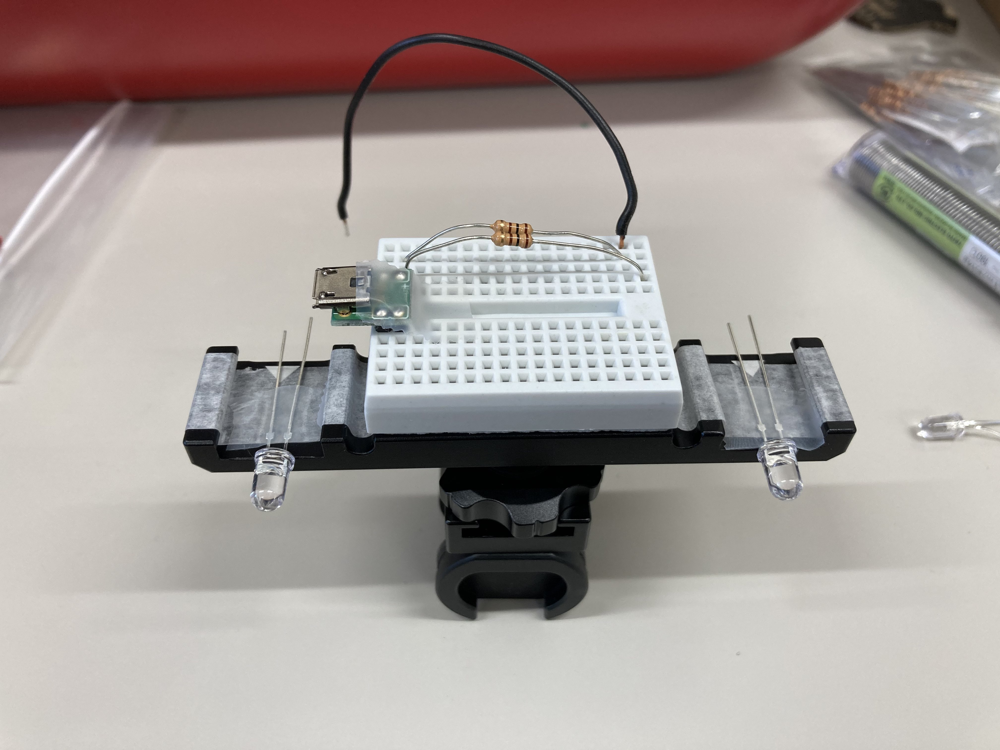

LEDと電源の配線をテープで固定する訳にも行かないので、みの虫クリップで配線しようかと思ったのですが、流石にグチャグチャしてしまうので、お力を借りつつそこははんだ付けしていくことにしました。

ここまでやって、しばらくしていると**ミニブレッドボードがマスキングテープもろとも剥がれる**事がわかったので、この段階でマスキングテープを剥がしました。

## 完成・・・?

そして、LEDと線材を [ましま](https://twitter.com/mewl_msh)さんにハンダ付けしてもらい、配線が完了しました。ありがとうございます。構想だけ考えて実装を全部やってもらっていますね()  
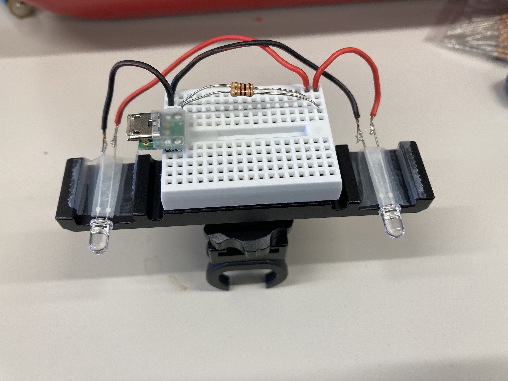

なんというか、テープが汚かったりするのでどうにか3Dプリンタで筐体をどうにかしたいところではありますが、ひとまず完成!

・・・完成したので、大学の研究室から持ち帰ろうと、その辺にあった箱に入れて持ち帰ったところ、

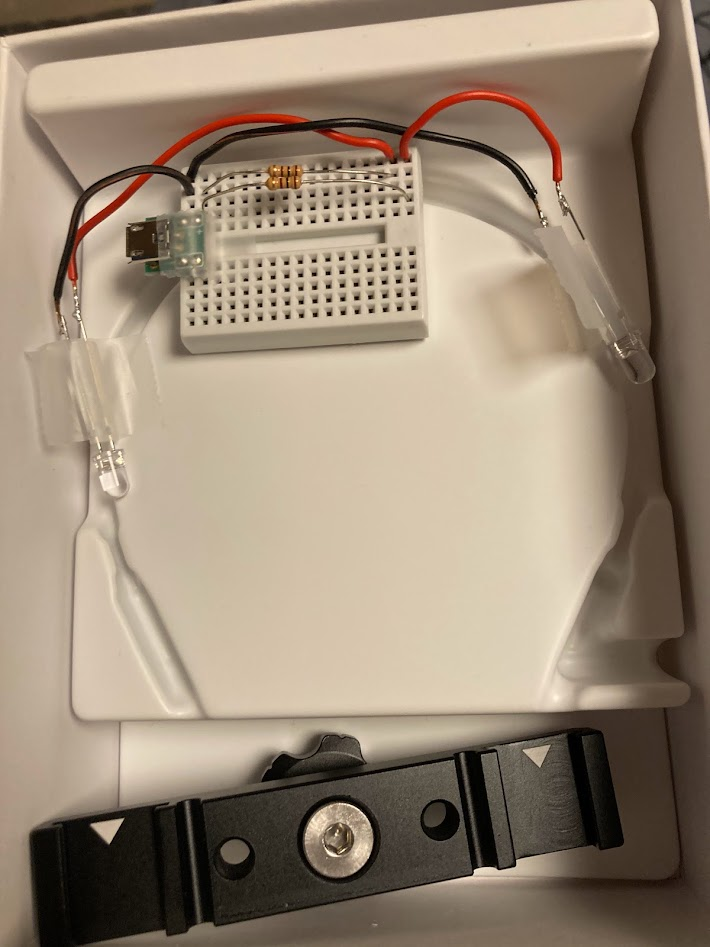

分離しました。

## 完成

ということで、グルーガンで固めてしまうことにしました。とりあえずこれでいいでしょう。

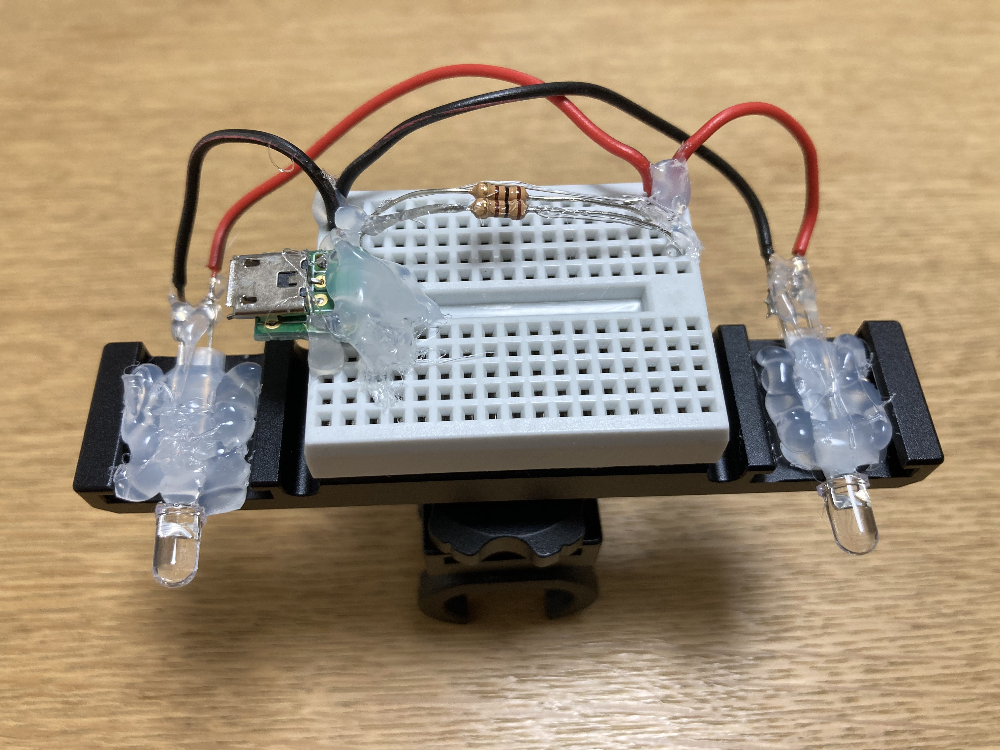

~~**汚ねぇ**~~

## 動かしてみる

まずはノートパソコンに取り付けます。

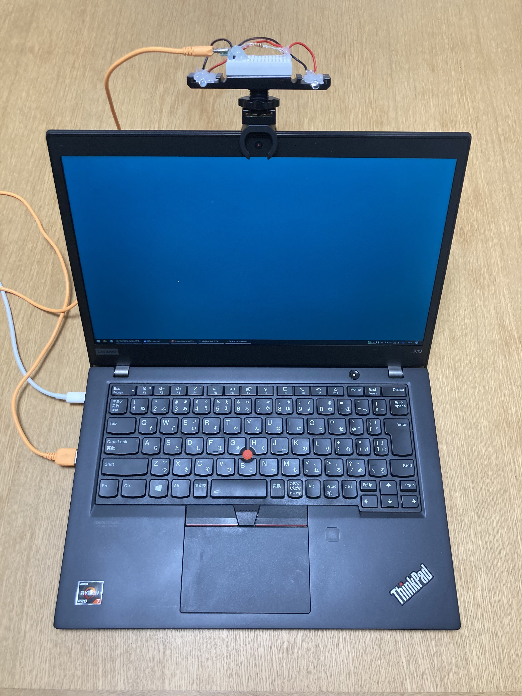

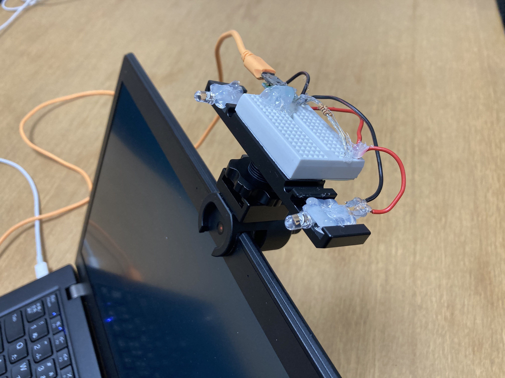

・・・予想図に近いのではないでしょうか。

さて、WiinRemoteで動作を見てみましょう。

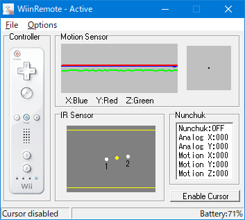



認識しています! マウスとして動いています!

次にWiiのゲームを・・・



ちゃんとポインタとして動いています・・・!

無事に、ノートパソコン用センサーバーが完成しました。

## おわりに

設計というか、構想だけ僕が考え、それ以外の大事な部分をすべて[ましま](https://twitter.com/mewl_msh)さんにやってもらったような感じでした(本当にありがとうございました)が、とりあえずノートパソコン用のセンサーバーを作ることが出来ました。

ハードオフに行けば数百円で転がっているお手頃Bluetoothコントローラ、みなさんも遊んでみてはいかがでしょうか。

明日の記事は Inami さんの「2021年 第92回世田谷祭配信の裏側」です。