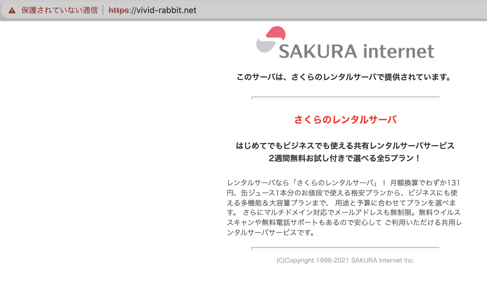

みなさんこんにちは。

この記事は[Tokyo City University Advent Calendar 2021](https://adventar.org/calendars/6738)の26日目?の記事です。

まずは参加をしてくださったみなさん、そして各記事を読んでくださったみなさん、本当にありがとうございました。

今年も都市大アドカレが開催できて本当に良かったです。

この記事では、各記事への(かなり簡単ではありますが)コメントを含めた簡単な総括をしていきます。

年の瀬ですが、よろしくお願い致します。

## 12/1 京都楽しかったな | ポン酢
[京都楽しかったな｜ポン酢｜note](https://note.com/pon_s_1999/n/n1cec4d3edd20)

<blockquote class="twitter-tweet">
京都楽しかったな｜ポン酢 <a href="https://twitter.com/ksr_t_1999?ref_src=twsrc%5Etfw">@ksr_t_1999</a> <a href="https://twitter.com/hashtag/note?src=hash&amp;ref_src=twsrc%5Etfw">#note</a> <a href="https://t.co/RRXcByBJSZ">https://t.co/RRXcByBJSZ</a> <a href="https://twitter.com/hashtag/tcuac2021?src=hash&amp;ref_src=twsrc%5Etfw">#tcuac2021</a>
&mdash; ポン酢 (@ksr_t_1999) <a href="https://twitter.com/ksr_t_1999/status/1465703816569843714?ref_src=twsrc%5Etfw">November 30, 2021</a></blockquote> 

初日はポン酢さんの記事でした。 休学を含め、2020年後期からの"怒涛の1年間"の振り返り記事でした。 記事タイトルの予告からは想像できなかった内容に驚きつつ、Twitterで生存報告がなくて心配だったこともあり、とりあえずお元気そうでよかったです。

## 12/2 辻堂にバーガーキングができたらしい | BOB

[辻堂にバーガーキングができたらしい - bob563’s diary](https://bob563.hatenablog.com/entry/2021/12/02/000431)

<blockquote class="twitter-tweet">
アドカレ!!!!!!!!!!!!!!!  はてなブログに投稿しました <a href="https://twitter.com/hashtag/%E3%81%AF%E3%81%A6%E3%81%AA%E3%83%96%E3%83%AD%E3%82%B0?src=hash&amp;ref_src=twsrc%5Etfw">#はてなブログ</a> 辻堂にバーガーキングができたらしい - bob563’s diary <a href="https://t.co/cOxtC8eo8H">https://t.co/cOxtC8eo8H</a>
&mdash; BOB (@bob510634) <a href="https://twitter.com/bob510634/status/1466060730935828480?ref_src=twsrc%5Etfw">December 1, 2021</a></blockquote>

これのオマージュで大好きです。本当におめでとうございます。

<blockquote class="twitter-tweet">
ウオオオオオオオオオオオオオオオオオオオオオオオオオオオオオ（至って真面目な文章）  はてなブログに投稿しました <a href="https://twitter.com/hashtag/%E3%81%AF%E3%81%A6%E3%81%AA%E3%83%96%E3%83%AD%E3%82%B0?src=hash&amp;ref_src=twsrc%5Etfw">#はてなブログ</a> 弘前に松屋ができるらしい - キュウリの血と肉<a href="https://t.co/2iiE5oEp4M">https://t.co/2iiE5oEp4M</a>
&mdash; 水(みくまり)分/2日目東ハ-15ab (@_39ML_) <a href="https://twitter.com/_39ML_/status/1433770384420061190?ref_src=twsrc%5Etfw">September 3, 2021</a></blockquote>

ちなみに

<blockquote class="twitter-tweet">
バーがーｷンㇰ゛すき
&mdash; 水(みくまり)分/2日目東ハ-15ab (@_39ML_) <a href="https://twitter.com/_39ML_/status/1472270146047995905?ref_src=twsrc%5Etfw">December 18, 2021</a></blockquote>
<blockquote class="twitter-tweet">
弘前松屋神話前日譚の「えーッ！○○が＊＊にできるんですか」のコラージュが広まりを見せてて笑ってる
&mdash; 【供・給・過・多】もちづき (@sideMochidzuki) <a href="https://twitter.com/sideMochidzuki/status/1472272396652810240?ref_src=twsrc%5Etfw">December 18, 2021</a></blockquote>
<blockquote class="twitter-tweet">
こんど聖地巡礼しようとおもいます
&mdash; 水(みくまり)分/2日目東ハ-15ab (@_39ML_) <a href="https://twitter.com/_39ML_/status/1472273659004080128?ref_src=twsrc%5Etfw">December 18, 2021</a></blockquote>
<blockquote class="twitter-tweet">
バーガーキング、たまたま同乗したことがあるだけで実店舗の襲撃は達成していないため、これを機に行く必要がある
&mdash; 水(みくまり)分/2日目東ハ-15ab (@_39ML_) <a href="https://twitter.com/_39ML_/status/1472274199708598272?ref_src=twsrc%5Etfw">December 18, 2021</a></blockquote>

ご本人に認知されていました。おめでとうございます。(みくまりさんも松屋開店おめでとうございます)

## 12/3 都市大YCの卒業研究概要集をMarkdownで快適に書くためのPandoc環境セットアップ備忘録 | たっくん

[都市大YCの卒業研究概要集をMarkdownで快適に書くためのPandoc環境セットアップ備忘録 - 平和に生きたい](https://blog.mikuta0407.net/posts/2021/20211203-tcu-yc-summary-in-md-and-pandoc/)

<blockquote class="twitter-tweet">
都市大YCの卒業研究概要集をMarkdownで快適に書くためのPandoc環境セットアップ備忘録 - 平和に生きたい <a href="https://t.co/qPabtPTsOd">https://t.co/qPabtPTsOd</a> <a href="https://twitter.com/hashtag/tcuac2021?src=hash&amp;ref_src=twsrc%5Etfw">#tcuac2021</a> 都市大アドカレ3日目です。よろしくおねがいします。
&mdash; たっくん (@mikuta0407) <a href="https://twitter.com/mikuta0407/status/1466423909759213568?ref_src=twsrc%5Etfw">December 2, 2021</a></blockquote>

私です。

Wordで書くのが嫌で、Pandocで戦う記事を書きました。

ちなみにこのあとの後日談ですが、 「教授への添削は編集が必要で、結局Wordで渡さざるを得ないので、すべてを諦めてWordで書く」 ということになりました。

申し訳ございません。

## 12/4 老害大学院生ツイッタラーが教える情報システム学科完全攻略法 | 111111111

記事が・・・記事が・・・

## 12/5 無題 | あいう
記事が・・・記事が・・・

## 12/6 この構文解析器はお前が実装することで始めて完成する | 111111111

<blockquote class="twitter-tweet">
スプラせずにAC記事RTAしてください♡
&mdash; ❄ましま❄ (@mewl_msh) <a href="https://twitter.com/mewl_msh/status/1474416972264009729?ref_src=twsrc%5Etfw">December 24, 2021</a></blockquote>

<blockquote class="twitter-tweet">
........すぞ.....................
&mdash; .&quot;__&quot;. (@gitercccahuud) <a href="https://twitter.com/gitercccahuud/status/1474418165560254466?ref_src=twsrc%5Etfw">December 24, 2021</a></blockquote>

## 12/7 【Wiiリモコンは良いぞ】プレゼンリモコンとしてのすゝめ + ノートパソコン用センサーバー作ってみた | たっくん

[【Wiiリモコンは良いぞ】プレゼンリモコンとしてのすゝめ + ノートパソコン用センサーバー作ってみた - 平和に生きたい](https://blog.mikuta0407.net/posts/2021/20211207-making-wii-sensorbar-for-notepc/)

<blockquote class="twitter-tweet">
【Wiiリモコンは良いぞ】プレゼンリモコンとしてのすゝめ + ノートパソコン用センサーバー作ってみた - 平和に生きたい <a href="https://t.co/PvTBSbnLfq">https://t.co/PvTBSbnLfq</a> <a href="https://twitter.com/hashtag/tcuac2021?src=hash&amp;ref_src=twsrc%5Etfw">#tcuac2021</a> 都市大アドカレ7日目です。よろしくおねがいします。
&mdash; たっくん (@mikuta0407) <a href="https://twitter.com/mikuta0407/status/1467872792419135491?ref_src=twsrc%5Etfw">December 6, 2021</a></blockquote>

私の記事です。

Wiiリモコンをプレゼンリモコンとして使うの、本当に良いので、ぜひ。実際に卒論発表本番でも(対面なら)やる予定です。 センサーバーも先日自室のモニタで一人で遊んでいました。

## 12/8 2021年 第92回世田谷祭配信の裏側 | Inami

[2021年 第92回世田谷祭配信の裏側｜Inami｜note](https://note.com/root3tatsu/n/n3cc80abd9dcd)

<blockquote class="twitter-tweet">
都市大アドカレ8日目、投稿しました！ よかったら読んでみてください。<a href="https://twitter.com/hashtag/tcuac2021?src=hash&amp;ref_src=twsrc%5Etfw">#tcuac2021</a>  2021年 第92回世田谷祭配信の裏側｜Inami <a href="https://twitter.com/hashtag/note?src=hash&amp;ref_src=twsrc%5Etfw">#note</a> <a href="https://t.co/knoaTytX6s">https://t.co/knoaTytX6s</a>
&mdash; いなみ (@17tatsu_tba) <a href="https://twitter.com/17tatsu_tba/status/1468384837622845440?ref_src=twsrc%5Etfw">December 8, 2021</a></blockquote>

放送会のみなさまお疲れ様です・・・ 読んでいるだけでも胃が痛くなるような恐ろしい内容でした。

> 放送会に与えられたミッション 　「2つの会場の音響をそれぞれ繋ぎ、かつ映像も繋ぎ、切り替えながら配信を行え。」

もうこれだけできついです。 本当にお疲れ様でした。

ちなみに翌日の記事からの引用ですが、

<blockquote class="twitter-tweet">
<a href="https://twitter.com/hashtag/SC14%E5%8F%B7%E9%A4%A8%E6%94%B9%E7%AF%89%E3%82%92%E6%B1%82%E3%82%81%E3%81%BE%E3%81%99?src=hash&amp;ref_src=twsrc%5Etfw">#SC14号館改築を求めます</a> <a href="https://t.co/nVTo1uhst9">pic.twitter.com/nVTo1uhst9</a>
&mdash; さくらぴ (@saku_Rapit) <a href="https://twitter.com/saku_Rapit/status/1468601687099441154?ref_src=twsrc%5Etfw">December 8, 2021</a></blockquote>

放送会って本当になんなんですか

## 12/9 南武線将棋 +α　| おほーつく

[南武線将棋 +α - Okhotsk1583のブログ](https://okhotsk1583.hateblo.jp/entry/Charlemagne)

<blockquote class="twitter-tweet">
アドカレ9日目！よろしくお願いします！<a href="https://twitter.com/hashtag/tcuac2021?src=hash&amp;ref_src=twsrc%5Etfw">#tcuac2021</a>  はてなブログに投稿しました <a href="https://twitter.com/hashtag/%E3%81%AF%E3%81%A6%E3%81%AA%E3%83%96%E3%83%AD%E3%82%B0?src=hash&amp;ref_src=twsrc%5Etfw">#はてなブログ</a> 南武線将棋 +α - Okhotsk1583のブログ <a href="https://t.co/vEXnSSUXyT">https://t.co/vEXnSSUXyT</a>
&mdash; おほーつく (@Okhotsk1583) <a href="https://twitter.com/Okhotsk1583/status/1468599921385558016?ref_src=twsrc%5Etfw">December 8, 2021</a></blockquote>

狂気なんですよね。 読み終わったあともどういうことかわかりませんでした。 狂気です。

## 12/10 怪レい才ーディオの話 | らぴーと

[怪レい才ーディオの話 - らぴーとの書き溜め](https://rapit.hatenablog.jp/entry/hanayagikaoruko)

<blockquote class="twitter-tweet">
ということでEST 00:00に公開です．アドカレ10日目の記事です．<a href="https://twitter.com/hashtag/tcuac2021?src=hash&amp;ref_src=twsrc%5Etfw">#tcuac2021</a> <a href="https://twitter.com/hashtag/%E3%81%AF%E3%81%A6%E3%81%AA%E3%83%96%E3%83%AD%E3%82%B0?src=hash&amp;ref_src=twsrc%5Etfw">#はてなブログ</a> 怪レい才ーディオの話 - らぴーとの書き溜め<a href="https://t.co/l5YaNO2Of8">https://t.co/l5YaNO2Of8</a>
&mdash; さくらぴ (@saku_Rapit) <a href="https://twitter.com/saku_Rapit/status/1469170013110415361?ref_src=twsrc%5Etfw">December 10, 2021</a></blockquote>

音楽データの各種圧縮方式の比較について、基本的なことがまとめられており、良い記事です。

## 12/11 アニクラの思い出、語ります。 | アキヅキ

[アニクラの思い出、語ります。｜アキヅキ｜note](https://note.com/prinzpudding/n/n9335f211cfd0)

<blockquote class="twitter-tweet">
アドカレ11日目の記事になります 拙い文章ですがよろしくお願いします<a href="https://twitter.com/hashtag/tcuac2021?src=hash&amp;ref_src=twsrc%5Etfw">#tcuac2021</a><a href="https://t.co/CERTSH06k9">https://t.co/CERTSH06k9</a>
&mdash; アキヅキ (@prinz_yuru01) <a href="https://twitter.com/prinz_yuru01/status/1469321517872066560?ref_src=twsrc%5Etfw">December 10, 2021</a></blockquote>

アニクラは[都市大水没アニクラ1周忌](https://twipla.jp/events/447059)や他の大学の文化祭でのアニクラを見に行くという形でリアルイベントに行ったことがあったのですが、そのときに自分が目にしただけでなく、自分が行ってないイベントでの他の方のツイート等を見ていると、

> DJブースまで高まりダッシュする方、オタ芸する方、ずっと多動している方、何より会場にいる方々がとても楽しそうだった

というのは本当に思います。 私は2020年に数回オンラインDJイベントに参加させていただいたのですが、オンラインでも

> 「楽しい」に真剣になって、楽しい時間を過ごす

ということが実感できました。

ここすき↓

> きっかけは、所属していたサークルの元先輩に誘われたこと

元先輩・・・

## 12/12 2021年買っちゃいました大賞！ | おーじぇい

[2021年買っちゃいました大賞！ - OJ Blog](https://b.920oj.net/2021-gadget/)

<blockquote class="twitter-tweet">
2021年買っちゃいました大賞！ - OJ Blog <a href="https://t.co/7ilreYM3WD">https://t.co/7ilreYM3WD</a><a href="https://twitter.com/hashtag/tcuac2021?src=hash&amp;ref_src=twsrc%5Etfw">#tcuac2021</a> 12日目の記事です！！！（遅刻） みんな読んでね！
&mdash; おーじぇい (@920OJ) <a href="https://twitter.com/920OJ/status/1469705108305100804?ref_src=twsrc%5Etfw">December 11, 2021</a></blockquote>

One-Netbook A1、実機を触らせてもらいましたが、質感もよく、キーボード配列も0の横にハイフンがあるので良いなぁとなっています。願わくばもっとJISに寄ってほしい・・・

ちなみに私の買ってよかったものは、Let's note CF-RZ4、M1 MacBook Air、Amazfit Bip S Liteです。

## 12/13 【初心者必見！】生涯収支マイナス20万円君の競馬予想法を大公開！【#ドラ息子ダーティーダービー】 | まがたま

[経営工学は世界を救う](https://634ramen-ragnarok.hatenablog.com/)

<blockquote class="twitter-tweet">
来週月曜の僕の記事が公開されます 競馬で成り上がりたいアナタへ送る記事です！<a href="https://twitter.com/hashtag/tcuac2021?src=hash&amp;ref_src=twsrc%5Etfw">#tcuac2021</a> <a href="https://twitter.com/hashtag/%E3%82%A2%E3%83%99%E6%94%BF%E6%B2%BB%E3%82%92%E8%A8%B1%E3%81%95%E3%81%AA%E3%81%84?src=hash&amp;ref_src=twsrc%5Etfw">#アベ政治を許さない</a> <a href="https://t.co/VMfXkWozRO">https://t.co/VMfXkWozRO</a>
&mdash; まがたま (@hidarikikineko) <a href="https://twitter.com/hidarikikineko/status/1469259444739768322?ref_src=twsrc%5Etfw">December 10, 2021</a></blockquote>

ウマ娘が始まってからTLで競馬人口が増えた気がしますが、「馬券を買ってレースを見る」くらいのざっくりとした知識しかなかったので、チュートリアルとして非常に良い記事でした。実際にやるかどうかは別として、こういった初心者向けの記事はありがたいですね。知識としてあると、こういったレースは見ていて楽しいそうだなと。

あとマツケンアリマはわけがわかりませんでした。あれは何。

## 12/14 レアキャラな弊学科に関して語ります | きのこ🍄

[都市大の原子炉をお前は知っているか｜たけのこ｜note](https://note.com/red_blue_bull/n/n61e9e5e98c33)

<blockquote class="twitter-tweet">
滑り込みセーフ、tcuac14日目の記事です！！！ <a href="https://t.co/Nst1xZMrvl">https://t.co/Nst1xZMrvl</a><a href="https://twitter.com/hashtag/TCUAC2021?src=hash&amp;ref_src=twsrc%5Etfw">#TCUAC2021</a>
&mdash; きのこ🍄 (@pancake1415) <a href="https://twitter.com/pancake1415/status/1470658757437063168?ref_src=twsrc%5Etfw">December 14, 2021</a></blockquote>

存在だけは知っていたのですが、YC民としては豊富な写真資料でいろいろ紹介する記事でめちゃくちゃ面白かったです。 これ原子力安全工学科の紹介資料として非常に良さそう・・・

## 12/15 ##(W Sharp)次期プロジェクト代表の二人に訊く今までと今後 | イチカワ

[##(W Sharp)次期プロジェクト代表の二人に訊く今までと今後 - DJ_ARASHI’s blog](https://dj-arashi.hatenablog.com/entry/2021/12/15/050320)

<blockquote class="twitter-tweet">
マジごめん！ 多摩川歩けませんでした！かわりにインタビューしてきたよ！<a href="https://t.co/0rRsuv4bcS">https://t.co/0rRsuv4bcS</a><a href="https://twitter.com/hashtag/TCUAC2021?src=hash&amp;ref_src=twsrc%5Etfw">#TCUAC2021</a>
&mdash; イチカワ (@Ichikawa_33) <a href="https://twitter.com/Ichikawa_33/status/1470847858907955200?ref_src=twsrc%5Etfw">December 14, 2021</a></blockquote>

オモコロ風の体裁で非公認同人サークル、というスタイルが面白かったです。 コミケ99にも参加されたようで、お疲れ様でした!

(多摩川か東京湾まで歩く記事もいつかお待ちしています)

## 12/16 100均スピーカーをちょっとだけ良くする話 | 田んぼ

ｷｼﾞﾊﾄﾞｺﾄﾞｺ...

## 12/17 社会人学生のススメ(間に合いました | ガン・グリーンマン@紅楼夢う02

[社会人学生のススメ(間に合いました - gunmk12’s blog](https://gunmk12.hatenablog.com/entry/2021/12/17/000000)

社会人学生とはどういう状態で仕事と学生を両立しているのか、そもそもどういう入学方法なのか、知る機会の少ないことで、面白かったです。

> 僕はコスモスクエア駅のホームから英語発表会に出た。

で恐ろしくなりながら笑ってしまいました。

ちなみに私はこの方に「スタァライトのオケコンは卒論提出後だからもうどうにもならないし言っちゃって良いんじゃない?」的なことを言われたので、行ってきます(当たれば)。

## 12/18 ターミナルで出席登録がしたい！ | あめふりてる\*

出席登録を簡略化して遊ぶ後輩が現れました。嬉しい。 以前僕が書いた記事の方法はすでに使えなくなってしまっているので、新しい情報を含め、こういう後輩がいることが本当に嬉しいです。

<blockquote class="twitter-tweet">
TCUアドベントカレンダー2021の記事です！ ターミナルで出席登録がしたい！ - あめふりてる*の備忘録 <a href="https://t.co/3Ek5y9mK3i">https://t.co/3Ek5y9mK3i</a>
&mdash; 新年あけましておめでとうございます。 (@Amefuri_Tell) <a href="https://twitter.com/Amefuri_Tell/status/1471872298156425216?ref_src=twsrc%5Etfw">December 17, 2021</a></blockquote>

(ちなみに以前はPHPSESSIDだけで制御してたのが、いつの間にかCookie使うようになっているんですよね。)

## 12/19 社会メディア学科にすげー教授がやってきた!+α | BOB

[社会メディア学科にすげー教授がやってきた!+おまけ - bob563’s diary](https://bob563.hatenablog.com/entry/2021/12/19/221237)

<blockquote class="twitter-tweet">
はてなブログに投稿しました <a href="https://twitter.com/hashtag/%E3%81%AF%E3%81%A6%E3%81%AA%E3%83%96%E3%83%AD%E3%82%B0?src=hash&amp;ref_src=twsrc%5Etfw">#はてなブログ</a>  社会メディア学科にすげー教授がやってきた!+おまけ - bob563’s diary <a href="https://t.co/mDKwQsMv5Z">https://t.co/mDKwQsMv5Z</a>
&mdash; BOB (@bob510634) <a href="https://twitter.com/bob510634/status/1472555556791808003?ref_src=twsrc%5Etfw">December 19, 2021</a></blockquote>

この教授に関しては私も調べたことがあるのですが、なかなかに"面白い"方でした。

さすが軍事研究会の会長の記事でした。

## 12/20 政治家の発言、分析してみませんか | たか

[政治家の発言、分析してみませんか - Qiita](https://qiita.com/taka221/items/847de1e81e7c77c2a249?s=09)

Twitterの分析っていつも結果の画像ばかりが流れてきますが、こういうスクリプトで出来るんだなぁとなっています。

このあたりは分析計のライブラリが豊富なPythonの強みなのかなぁ

## 12/21 Windows10でWindows Updateに失敗したときの対処メモ | ケー

[Windows10でWindows Updateに失敗したときの対処メモ - K-Nikki](https://ke9000.hatenablog.com/entry/fail_winup)

4年近いプロとしての経験からのさすがのノウハウ記事でした。WindowsUpdateは厄介な存在ですが使わないわけには行かないですしね・・・。 個人的には遭遇したことないトラブルも記載されていて、こういうことは本当に「何もしてないのに壊れました」につながるので、怖いですね・・・。

ちなみにご本人は進捗報告を書いている最中にWindowsUpdateに突入されたそうです。

<blockquote class="twitter-tweet">
進捗報告書いてたらこれになってガチで泣きそう <a href="https://t.co/idnn4I9g3D">pic.twitter.com/idnn4I9g3D</a>
&mdash; ケー (@ke_odakyu9000) <a href="https://twitter.com/ke_odakyu9000/status/1473859217337782272?ref_src=twsrc%5Etfw">December 23, 2021</a></blockquote>

## 12/22 教授に消される卒論を作ってみたお話。 | ましま

[教授に消される卒論を作ってみたお話。 - ましまの雑記](https://mewl-mshhhhhh.hatenablog.com/entry/2021/12/22/230212)

<blockquote class="twitter-tweet">
はてなブログに投稿しました <a href="https://twitter.com/hashtag/%E3%81%AF%E3%81%A6%E3%81%AA%E3%83%96%E3%83%AD%E3%82%B0?src=hash&amp;ref_src=twsrc%5Etfw">#はてなブログ</a> ギリギリになったけど書き終わったのでこれでTCUAC卒業です.....<a href="https://twitter.com/hashtag/tcuac2021?src=hash&amp;ref_src=twsrc%5Etfw">#tcuac2021</a> 教授に消される卒論を作ってみたお話。 - ましまの雑記<a href="https://t.co/SggH0tHG5e">https://t.co/SggH0tHG5e</a>
&mdash; ❄ましま❄ (@mewl_msh) <a href="https://twitter.com/mewl_msh/status/1473655266516570112?ref_src=twsrc%5Etfw">December 22, 2021</a></blockquote>

本当にお疲れ様です。指摘されている瞬間を横で見た人間としては、流石にかわいそうなところありましたね・・・。でもまぁその後一気に巻き返しているので、さすがです。

## 12/23 【緊急特別企画】今年もやります古いOS企画 | らぴーと

[【緊急特別企画】今年もやります古いOS企画 - らぴーとの書き溜め](https://rapit.hatenablog.jp/entry/smart_falcon)

<blockquote class="twitter-tweet">
お待たせいたしました， <a href="https://twitter.com/hashtag/tcuac2021?src=hash&amp;ref_src=twsrc%5Etfw">#tcuac2021</a> 23日目の記事です． よろしくお願いいたします． 【緊急特別企画】今年もやります古いOS企画 - らぴーとの書き溜め<a href="https://t.co/OrPVW9ptAK">https://t.co/OrPVW9ptAK</a>
&mdash; さくらぴ (@saku_Rapit) <a href="https://twitter.com/saku_Rapit/status/1473855720978526208?ref_src=twsrc%5Etfw">December 23, 2021</a></blockquote>

今年もやってきました古いOS企画。今年は私がやらなかったのでこの1記事のみでした。 当然のようにWindows98から始まっていて楽しいです。 VMware派なのは変わっていらっしゃらない。

## 12/24 アーカイブで辿る都市大 〜武蔵工業大学の盛衰と都市大の夜明け〜 | あいう

ﾖﾐﾀｶｯﾀ...

## 12/25 去年のvivid-rabbit.net ACまだ終わってないのですが | うめ

サイトが終わってしまっていらっしゃいますが・・・

## 総括

2019年に[おーじぇい](https://twitter.com/920oj)さんにより初めて開催されたTCUACですが、3度目の開催となりました。

改めまして、みなさまありがとうございました。

今年も個性ある(ありすぎるのもある)記事がたくさん投稿され、毎日楽しませていただきました。(反応できない記事もあってすみませんでした。卒研概要集とかもろもろで忙しく・・・)

今年の記事は技術系よりも、自分の趣味や立場からの紹介的な記事が多く、ジャンル的なバラエティに富んでいてとても良かったです。 2019よりも2020、2020よりも2021のほうがその傾向が強くなっていると感じていて、これはQiitaを使わないアドカレらしいなぁと思っています。

今年はおーじぇいさんが忙しいとのことで、代わって私が開催させていただきましたが、私は4年生ということもあり、今度の春で卒業する身です(無事に1月が終われば)。 来年・・・どなたか開催してくれることを祈っています。

改めまして、みなさま本当に、本当にありがとうございました。 アドカレの総括記事を大晦日に書いていますが、みなさま良いお年をお迎えください。 それでは～。

---

追伸: 100%個人的なことですが、今年の私のハイライトは「6月におほーつくにスタァライトを布教され、そのまま映画を12月までに29回見た」でした。スタァライト、良いですね・・・。イオンシネマ海老名で殆ど見ました。 あとミリシタの千早のフェス限60連で出ました。良かった。
