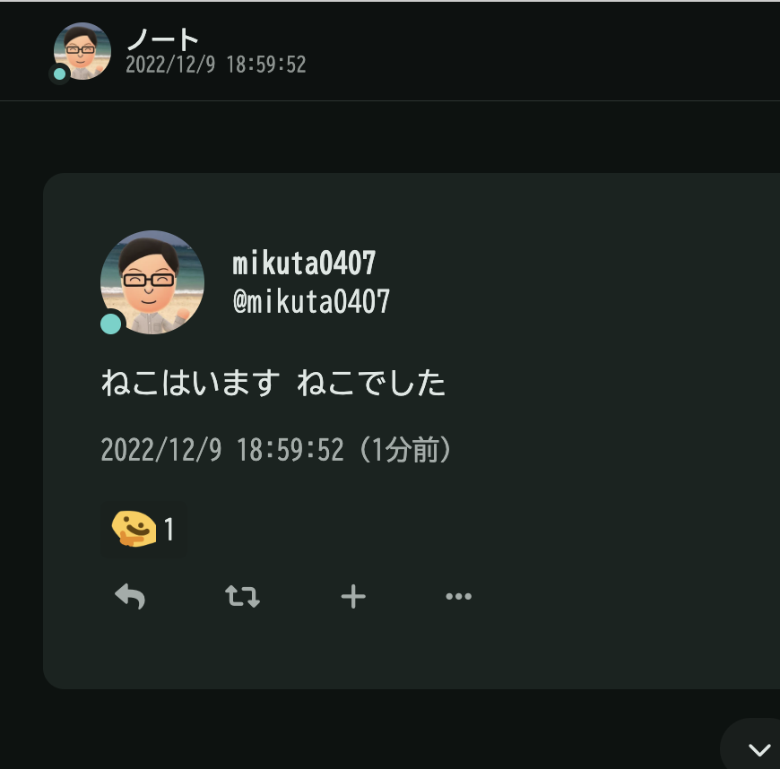
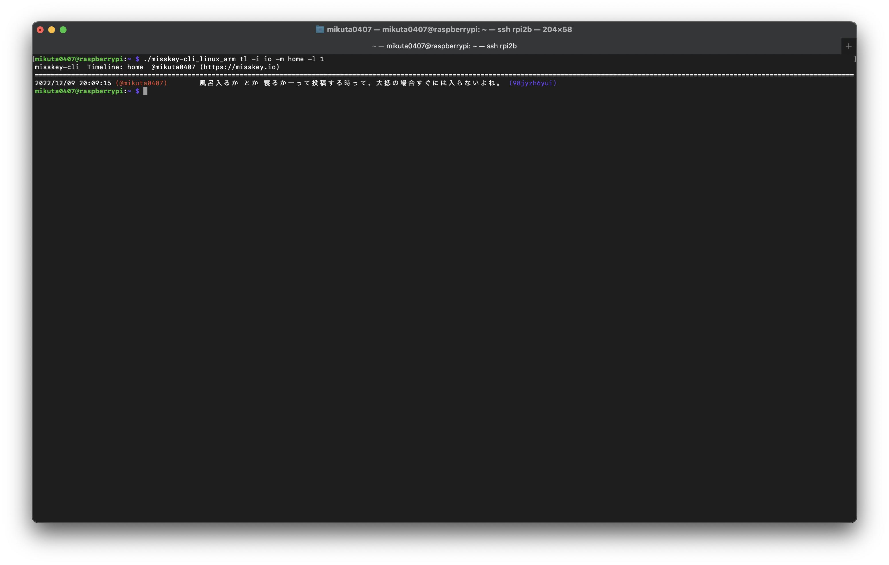

この記事は[Misskey Advent Calendar 2022](https://adventar.org/calendars/7354) 16日目の記事です。

こんにちは。たっくん(@mikuta0407)です。

GoでMisskeyのCLIクライアントを作ったので、宣伝も兼ねてアドカレに参加してみようと思います。よろしくお願いします。

---

早速ですが、こんな感じのCLIなMisskeyクライアントを作りました。


[](https://github.com/mikuta0407/misskey-cli)

[https://github.com/mikuta0407/misskey-cli](https://github.com/mikuta0407/misskey-cli)

ここで配布してます。

もし良ければ是非。Linux(amd64/aarch32/aarch64)/macOS(M1)で動作を確認しています。

MITライセンスではありますが、割と適当にお使いください。(使用ライブラリ的にMITライセンスが楽だなとなった感じです)


使い方はGitHubのREADMEにあるのである程度割愛するとして、この記事では実装方法について振り返りも兼ねて紹介しようと思います。

ちなみに、書いている最中に引用リノートの投稿/表示に対応していないことに気づきましたが、修正する時間がなかったので今後追加予定の機能ということにして……そのまま行きます。

## 動機

mattnさんの`twty` ([https://github.com/mattn/twty](https://github.com/mattn/twty)) が作業中TwitterのカモフラージュにCLIでTwitterするのに便利だったので、Misskey版っぽいのも作りたいなぁと思い、やってみました。

あと、ついでにGoを大真面目に学んでいるところでもあったので、アウトプットという意味でも何か形にしたかったので、「せっかくtwtyがGoなら、Goで作ってシングルバイナリかつマルチプラットフォームやるぞ」という気持ちもありました。

## 使ったもの

- Go言語 (1.19) 
  - 標準以外のパッケージ 
      - github.com/BurntSushi/toml
      - github.com/buger/jsonparser
      - github.com/spf13/cobra
      - golang.org/x/crypto
- Misskey API 
  - [https://misskey-hub.net/docs/api/](https://misskey-hub.net/docs/api/)

## 各実装部分

ここからは、どんな感じで実装していったのかについて、振り返っていきます。

### cobra

サブコマンドを実装するため、cobraを採用し、`tl``note``renote` の3つのサブコマンドを実装しました。

このサブコマンドの中で更にフラグを使ってモードを分けています。実際に階層を表すと(ただのヘルプの日本語訳になりそうですが)、

- `tl`: TL表示 
  - `-l`: 一度に表示する件数
  - `-m`: TLのモード(ホーム/ローカル/グローバル)
- `note`: 投稿系 
  - `-d`: 投稿削除
  - `-r`: リプライ
  - なし: 通常投稿
- `renote`: リノート 
  - 引用RTには現状対応していません。(簡単にできるんだけどコマンド体系で悩み中)
- 共通フラグ 
  - `-c`: コンフィグファイルのパス指定(オプション)
  - `-t`: インスタンス切り替え指定 こんな感じになります。

また、表示件数とTLのモードとコンフィグファイルのパスは指定されなかった場合のデフォルト値を指定している他、インスタンス切り替えに関しては(後述しますが)指定されなかった場合はコンフィグファイルの一番上のインスタンスを使うようにしています。

cobra自体の説明はここでしてもあまり意味がないため、これくらいにさせてください。

### コンフィグ周り

インスタンスの接続情報を持つコンフィグファイルはtoml形式で記述します。

(この記事を執筆している段階では、プログラム側からコンフィグファイルを生成する機能は無いので、手動で記述する必要があります。)

例: 

```toml
[[Instance]]
  host = https://misskey.io
  name = misskey.io
  token = hOgEFuGA
  username = mikuta0407
```

tomlのパースは`github.com/BurntSushi/toml`で行っています。

インスタンスの接続情報はtoml内に複数記述できるようにしているので、構造体の宣言はインスタンス情報が入った構造体(`InstanceInfo`)の配列(`Instance`)、というようにしています。

```go
type Config struct {
    Instance []InstanceInfo `toml:Instance`
}

type InstanceInfo struct {
    Host     string `toml:host validate:required` // 接続先ホスト
    Name     string `toml:name validate:required` // フレンドリ名(-iオプションで指定する文字列)
    Token    string `toml:token validate:required` // Misskeyのアクセストークン
    UserName string `toml:username validate:required` // コンソールに表示するユーザー名(本来はなくてもいいがtoml内の識別用に一応
}
```

そして、`toml.DecodeFile`でtomlファイルの内容を構造体配列に入れています。

```go
func ParseToml(fileName string) (Config, error) {
    var configs Config
    _, err := toml.DecodeFile(fileName, &configs)
    return configs, err
}
```

この後は、例えば2つめのインスタンス情報のトークンが欲しければ、

```
config.Instance[1].Token
```

のように書くことで取得できるようになります。

ちなみに、`-i`オプションでインスタンスを指定しなかった場合の挙動ですが、自動で`[0]`の内容を使うようにしています。

また、インスタンス指定があった場合は

```go
index, isExist := include(configs.Instance, instanceName) // 第1引数で渡したInstanceInfo配列から第2引数のインスタンス名が含まれている添え字を返す
instanceInfo = configs.Instance[index]
```

といったコードで、「指定されたインスタンスのフレンドリ名が含まれている添字を取得し、そこの内容を見に行く」という処理をしています。(実際は指定されたものが無かったときのエラーハンドリングもしています)

このコンフィグファイル周りの処理は、`misskey`パッケージのNewClientでクライアントインスタンス(言葉が厄介になってきた)を作成するときにtomlのパースを呼び出しつつ、インスタンス情報を確定した単一の`InstanceInfo`構造体を含むCleiint構造体を返すことで行っています。

…日本語で書くとむしろわかりにくいですね。

興味がある方は [https://github.com/mikuta0407/misskey-cli/blob/67d17a15d3bff0e7c258f42a61b5d99679e2d164/misskey/misskey.go#L18-L48](https://github.com/mikuta0407/misskey-cli/blob/67d17a15d3bff0e7c258f42a61b5d99679e2d164/misskey/misskey.go#L18-L48) を見ていただけるとわかるかと思います。

### APIのPOST

[https://github.com/mikuta0407/misskey-cli/blob/67d17a15d3bff0e7c258f42a61b5d99679e2d164/misskey/apipost.go#L11-L36](https://github.com/mikuta0407/misskey-cli/blob/67d17a15d3bff0e7c258f42a61b5d99679e2d164/misskey/apipost.go#L11-L36)

このコードの話です。

```go
func (c *Client) apiPost(jsonByte []byte, endpoint string) error {

    req, err := http.NewRequest(
        POST,
        c.InstanceInfo.Host+/api/+endpoint,
        bytes.NewBuffer(jsonByte),
    )
    if err != nil {
        return err
    }

    client := &http.Client{}
    resp, err := client.Do(req)

    c.resBuf = new(bytes.Buffer)
    if _, err = io.Copy(c.resBuf, resp.Body); err != nil {
        return err
    }

    if resp.StatusCode < 200 || resp.StatusCode > 300 {
        fmt.Println(resp.StatusCode, c.resBuf)
        os.Exit(1)
    }
    defer resp.Body.Close()
    return nil
}
```

MisskeyのAPIはPOSTにJSONのリクエストボディをくっつけてHTTPのリクエストを送ることでレスポンスをもらえます。

> HTTP APIはすべてPOSTで、リクエスト/レスポンスともにJSON形式です。

[https://misskey-hub.net/docs/api/](https://misskey-hub.net/docs/api/)

misskeyパッケージの`Client`の`apiPost`というメソッドで、引数に渡されたJSON文字列とエンドポイント先(API名?)を使ってPOSTしています。

この`apiPost`というメソッドは、`net/http`パッケージの`http.NewRequest`を使ってPOSTし、ステータスコードが200であれば返却されたレスポンスボディを`Client`構造体内の`resBuf`(`*bytes.Buffer`)に入れています。(200以外はerrorを返すので受けた側でエラーハンドリング)

例えば新規投稿では、`apiPost`メソッドにアクセストークンと投稿文字をJSONに流し込んだ`jsonByte`(json文字バイト列)と、`notes/create`という投稿用エンドポイントを`c.apiPost(jsonByte, notes/create)`として渡すことで投稿が出来ます。渡されたエンドポイントの文字列は、最初のコンフィグファイルパースのときに`Client`内`InstanceInfo.Host`に入っているMisskeyのホスト先に「`/api/`」と渡されたエンドポイント名を結合することでリクエスト先を生成しています。

アクセストークンについては、リクエストボディのJSON内では`i`というパラメータに渡すことで利用ができます。

(ちなみに、現状misskey-cliはアクセストークンの取得手段を実装していないため、tomlに記載するアクセストークンはブラウザ版から手動で取得する必要があります)

APIのドキュメントを見ると本当に色々と機能があり、眺めてみると面白いのでオススメです。

### 投稿・リプライ・リノート・削除

#### 投稿

[https://github.com/mikuta0407/misskey-cli/blob/67d17a15d3bff0e7c258f42a61b5d99679e2d164/misskey/postnotes.go#L10-L40](https://github.com/mikuta0407/misskey-cli/blob/67d17a15d3bff0e7c258f42a61b5d99679e2d164/misskey/postnotes.go#L10-L40)この関数の話です。 

```go
func (c *Client) CreateNote(text string) error {
    body := struct {
        I    string `json:i`
        Text string `json:text`
    }{
        I:    c.InstanceInfo.Token,
        Text: text,
    }

    jsonByte, err := json.Marshal(body)
    if err != nil {
        return err
    }

    if err := c.apiPost(jsonByte, notes/create); err != nil {
        return err
    }

    id, _ := jsonparser.GetString(c.resBuf.Bytes(), createdNote, id)
    text, _ = jsonparser.GetString(c.resBuf.Bytes(), createdNote, text)

    fmt.Println(Create Note: @ + c.InstanceInfo.UserName +  ( + c.InstanceInfo.Host + ))
    printLine()

    str := fmt.Sprintf(Note Success! id : %s\n\%s\, string(id), string(text))

    fmt.Println(str)

    return nil

}
```

Misskeyのノート投稿のAPI仕様は、

[https://misskey-hub.net/docs/api/endpoints/notes/create.html](https://misskey-hub.net/docs/api/endpoints/notes/create.html)にありますが、

`<host>/api/notes/create`宛に、トークンと投稿内容をリクエストボディに入れてPOSTすることで投稿ができます。

curlで投稿をしてみると、

```
curl -X POST -d '{i:hogehugaToken, text:ねこはいます ねこでした。}' https://misskey.io/api/notes/create
```

を実行すれば、



このように投稿ができます。(投稿したらすぐにスタンプが付いた。これぞMisskey)

この新規投稿に関しては、Client構造体のメソッド`CreateNote`として実装しました。

[https://github.com/mikuta0407/misskey-cli/blob/67d17a15d3bff0e7c258f42a61b5d99679e2d164/misskey/postnotes.go#L10-L40](https://github.com/mikuta0407/misskey-cli/blob/67d17a15d3bff0e7c258f42a61b5d99679e2d164/misskey/postnotes.go#L10-L40)

引数に渡されたテキストをbody用構造体にトークンとともに入れてjson.Marshalで文字バイト列`jsonByte`を作成し、先述のapiPostに`jsonByte`とエンドポイント先を渡すことで、投稿をしています。

misskey-cliで投稿をすると、以下のように投稿IDと投稿内容が表示されるようになっています。

```bash
$ ./misskey-cli note -i io 眠すぎる
misskey-cli  Create Note: @mikuta0407 (https://misskey.io)
=====================================
Note Success! id : 98jwnbd39s
眠すぎる
```

この部分は、POSTしたときに戻ってきたJSONから値を取り出しています。

戻ってくるJSONは以下のようになっています。(実装上はClient構造体内`resBuf`に入っています)

```json
{
  createdNote: {
    id: 98jwi9p10i,
    createdAt: 2022-12-09T09:59:52.981Z,
    userId: 8rhxi7gw77,
    user: {
      id: 8rhxi7gw77,
      name: null,
      username: mikuta0407,
      host: null,
      avatarUrl: https://s3.arkjp.net/misskey/thumbnail-b13bb7e7-c86b-47f4-bed7-aee75c5febf6.webp,
      avatarBlurhash: yILWR+-U7fS$xGX9s900WB9cR-xskCWBAwR*}TsmWBnPOE~CRk-pxaIVaes.Ads:xZjbNaS#r@%gkCNFWBWXi{tQ=yjZI;R*xGt6WC,
      avatarColor: null,
      emojis: [],
      onlineStatus: active,
      driveCapacityOverrideMb: null
    },
    text: ねこはいます ねこでした,
    cw: null,
    visibility: public,
    renoteCount: 0,
    repliesCount: 0,
    reactions: {},
    emojis: [],
    fileIds: [],
    files: [],
    replyId: null,
    renoteId: null
  }
}
```

この中で表示したい部分は`createNote`の中の`id`と、`createNote`の中の`text`の2つです。

Go言語で普通JSONのパースを行うときは、JSONの中身に対応した構造体を宣言してそこにパースしていきますが、Misskeyの返却APIはパラメータが多く、かつ場合によっては中身の構造が増える(特に投稿ではなくRenote/Replyで発生する)ため、PHPの`json.decode`のように動的にパースできないGo言語では実装が大変です。

そこで、JSONのバイト列からその場で欲しい値をキー名ベースで持ってきてくれる`github.com/buger/jsonparser`を使って値を取得することにしました。

```go
id, _ := jsonparser.GetString(c.resBuf.Bytes(), createdNote, id)
text, _ = jsonparser.GetString(c.resBuf.Bytes(), createdNote, text)
```

これであれば構造体をわざわざ宣言する必要がないので、JSONの構造が変わったとしても対応が可能となります。

あとは`id`と`text`を`fmt.Sprintf`等で表示すればよいので、このライブラリには大変助けれられました。

#### リプライ

[https://github.com/mikuta0407/misskey-cli/blob/67d17a15d3bff0e7c258f42a61b5d99679e2d164/misskey/postnotes.go#L42-L71](https://github.com/mikuta0407/misskey-cli/blob/67d17a15d3bff0e7c258f42a61b5d99679e2d164/misskey/postnotes.go#L42-L71)

ここの`ReplyNote`関数の話です(CreateNoteと重複する部分が多いためコード貼るのは省略)

リプライは投稿と同様に`notes/create`のAPIを使用します。

先程はリクエストボディ内はトークンと内容だけでしたが、リプライするには`replyId`を追加することでリプライが出来ます。

replyIdを追加することで、指定したノートのID(ノートのURL等で最後についている文字列。↑の投稿例だと`98jwnbd39s`がノートID)にリプライをする、指示しています。

`-r`オプションでもらったreplyIdを追加して新規投稿と同様にPOSTしているだけなので、後の解説は割愛します。

#### リノート

[https://github.com/mikuta0407/misskey-cli/blob/67d17a15d3bff0e7c258f42a61b5d99679e2d164/misskey/postnotes.go#L73-L100](https://github.com/mikuta0407/misskey-cli/blob/67d17a15d3bff0e7c258f42a61b5d99679e2d164/misskey/postnotes.go#L73-L100)

ここの`RenoteNote`関数の話です。コード貼るのは省略。

リノートも投稿・リプライと同様に`notes/create`のAPIを使用します。

リプライの時の`replyId`の代わりに`renoteId`を付与してPOSTするだけでリノートが出来ます。

現状misskey-cliでは実装できていませんが、引用リノートがMisskeyには存在します。

引用リノートをする場合は、リプライとほぼ同じようにトークン・renoteId・テキストの3つをPOSTすることで引用リノートができます。

(余談) クライアントである以上はmisskey-cliでもちゃんと追加はしたいのですが、 `misskey-cli renote 98jwnbd39s`といったようにすることでリノートをするよう実装してしまったため、引用リノートをするときはどういうコマンド/オプション体系にすればいいかを悩んでしまっています。

#### 削除

[https://github.com/mikuta0407/misskey-cli/blob/67d17a15d3bff0e7c258f42a61b5d99679e2d164/misskey/postnotes.go#L102-L127](https://github.com/mikuta0407/misskey-cli/blob/67d17a15d3bff0e7c258f42a61b5d99679e2d164/misskey/postnotes.go#L102-L127)

ここの`DeleteNote`関数の話です。

削除はエンドポイントこそ`api/notes/delete`と投稿系と異なりますが、リクエストボディ自体はほぼリノートと同様で、トークンと削除したい`noteId`を指定してPOSTすることで削除が行なえます。

(これ以上書くことがない)

### TL取得

TL取得が一番時間がかかった部分です。

[https://github.com/mikuta0407/misskey-cli/blob/main/misskey/gettimeline.go](https://github.com/mikuta0407/misskey-cli/blob/main/misskey/gettimeline.go)

このコードの話です。

タイムライン取得は、トークンと表示数をリクエストボディに入れ、エンドポイント先を指定することでローカル/グローバル/ホームのTLを指定表示件数分取得することが出来ます。

ドキュメント:

- ローカルTL: [https://misskey-hub.net/docs/api/endpoints/notes/local-timeline.html](https://misskey-hub.net/docs/api/endpoints/notes/local-timeline.html)
- グローバルTL: [https://misskey-hub.net/docs/api/endpoints/notes/global-timeline.html](https://misskey-hub.net/docs/api/endpoints/notes/global-timeline.html)
- ホームTL: [https://misskey-hub.net/docs/api/endpoints/notes/timeline.html](https://misskey-hub.net/docs/api/endpoints/notes/timeline.html)

例えば、ローカルTLの取得(最新2件)をcurlでやるとすると、

```
curl -X POST -d '{i:hogehugaToken, limit:2}' https://misskey.io/api/notes/local-timeline
```

となります。

実際にcurlで最新1件のノートを取得してみると、こんなJSONが降ってきます。(とりあえず1件)、

```json
[
  {
    id: 98iwcr1ime,
    createdAt: 2022-12-08T17:07:49.350Z,
    userId: 8rhxi7gw77,
    user: {
      id: 8rhxi7gw77,
      name: null,
      username: mikuta0407,
      host: null,
      avatarUrl: https://s3.arkjp.net/misskey/thumbnail-b13bb7e7-c86b-47f4-bed7-aee75c5febf6.webp,
      avatarBlurhash: yILWR+-U7fS$xGX9s900WB9cR-xskCWBAwR*}TsmWBnPOE~CRk-pxaIVaes.Ads:xZjbNaS#r@%gkCNFWBWXi{tQ=yjZI;R*xGt6WC,
      avatarColor: null,
      emojis: [],
      onlineStatus: online,
      driveCapacityOverrideMb: null
    },
    text: お腹空いてきちゃった・・・,
    cw: null,
    visibility: public,
    renoteCount: 0,
    repliesCount: 0,
    reactions: {},
    emojis: [],
    fileIds: [],
    files: [],
    replyId: null,
    renoteId: null
  }
]
```

こんな感じでjson配列がもらえます。この配列を`jsonparser.ArrayEach`を使って要素ごとに処理しTL表示をしています。

TLを構築する投稿のパターンは通常投稿・リプライ・リノートの3つがあります。執筆時点では引用リノートに非対応ですが(ごめんなさい)、これら3つのパターン分けは、

- `renoteId`があるか→あればリノート
- `replyId`があるか→あればリプライ投稿
- 両方無かったら→通常投稿 という分岐で行うことが出来ます。

[https://github.com/mikuta0407/misskey-cli/blob/67d17a15d3bff0e7c258f42a61b5d99679e2d164/misskey/gettimeline.go#L59-L96](https://github.com/mikuta0407/misskey-cli/blob/67d17a15d3bff0e7c258f42a61b5d99679e2d164/misskey/gettimeline.go#L59-L96)

### 通常投稿

通常投稿の場合は、上記例のパターンのJSONが降ってきます。

そして、コンソールへの表示は

```
2022/12/14 23:29:29 名前(@ID)        本文    (添付有り)(98abcdef)
```

といったようにするため、JSONの中で必要なものは - 投稿者名(`user.name`)
- 投稿者ID(`user.username`)(@hogeで始まるもの)
- 投稿者インスタンスホスト名(`user.host`)(@hoge@**misskey.io**の部分)
- 投稿時間(`createdAt`)
- 本文(`text`)
- 投稿ID(`id`)
- 猫フラグ(`user.isCat`)
- 添付ファイル情報(`files`) となります。

これらを取り出しているのが、`pickNote`関数となります。

[https://github.com/mikuta0407/misskey-cli/blob/67d17a15d3bff0e7c258f42a61b5d99679e2d164/misskey/gettimeline.go#L111-L158](https://github.com/mikuta0407/misskey-cli/blob/67d17a15d3bff0e7c258f42a61b5d99679e2d164/misskey/gettimeline.go#L111-L158)

この関数に投稿のjson配列の1要素のバイト列を渡すし、新規投稿のところでも書いた`jsonparser`を使って、json用の構造体の宣言なしに値を取り出しをしています。(`noteData`という取り出した値を入れる構造体は作っています。)

hostに記載があれば他インスタンス投稿なのでそのホスト名を表示したり、isCatのフラグがあれば名前の後に`(Cat)`を付加して猫であることをわかるようにしたり、添付ファイルが1つでもあれば`(添付あり)`と表示するなどしたりなど、簡易的な閲覧であれば十分と思われる情報量を表示しています。

```go
type noteData struct {
    offset    string
    timestamp string
    name      string
    username  string
    host      string
    text      string
    attach    string
    id        string
    isCat     bool
}

func pickNote(value []byte) (noteData, error) {
    var note noteData
    var err error
    // 投稿者
    note.name, _ = jsonparser.GetString(value, user, name)

    //投稿者ID
    note.username, err = jsonparser.GetString(value, user, username)
    if err != nil {
        return note, err
    }
    //ホスト名
    note.host, err = jsonparser.GetString(value, user, host)
    if err == nil {
        note.username = note.username + @ + note.host
    }

    // 投稿時刻
    note.timestamp, err = jsonparser.GetString(value, createdAt)
    if err != nil {
        return note, err
    }
    t, _ := time.ParseInLocation(2006-01-02T15:04:05Z, note.timestamp, time.UTC)
    note.timestamp = t.In(time.Local).Format(2006/01/02 15:04:05)

    // 本文
    note.text, _ = jsonparser.GetString(value, text)

    //投稿ID(元投稿)
    note.id, err = jsonparser.GetString(value, id)
    if err != nil {
        return note, err
    }

    //ねこかどうか
    isCat, err := jsonparser.GetBoolean(value, user, isCat)
    if isCat {
        note.name = note.name + (Cat)
    }

    // ファイルが有れば
    filesId, _, _, _ := jsonparser.Get(value, files)
    if len(filesId) != 2 {
        note.attach =    (添付有り)
    }

    return note, nil
}
```

ちなみに、名前欄を赤色にしたり、添付がある場合に緑、投稿IDを青にしているは、`\x1b[35m%s(@%s)\x1b[0m\t`といったようなエスケープシーケンスを使って、標準出力側で装飾を指定することで実装しています。(リプライの場合はピンクに)

#### リプライ

リプライがある場合は、

```
2022/12/14 23:55:06 名前(@ID@host)     リプライ元の投稿    (98xxxxxxxx)
    2022/12/14 23:56:38 名前(@ID@host)     リプライ投稿の本文    (添付有り)(98aaaaaaaa)
```

といったように表示されます。

一見リプライ元の投稿の情報を別に取りに行ってるように見えますが、実際はリプライの投稿のJSON内に`reply`という要素があり、その中に通常投稿と同じデータ構造で投稿内容が入っています。なので、

```go
replyParentValue, _, _, _ := jsonparser.Get(value, reply)
replyParent, err := pickNote(replyParentValue)
```

と書くだけで、リプライ元の投稿の情報を`pickNote`を使って持ってくることが出来るのです。

また、リプライはぶら下がっている印象があるので、`noteData`構造体にある`offset`にスペース4つをいれ、行頭に挿入することでぶら下がりを表現しています。

#### リノート

リノートの表示方法もリプライのリプライ元表示に似ています。リプライが`reply`要素に投稿が入っていたのと同様に、リノートでも`renote`要素に投稿が入っているので、`renote`要素を取り出したものを`pickNote`に渡すことで投稿内容を取得しています。

```go
renoteValue, _, _, _ := jsonparser.Get(value, renote)
note, err = pickNote(renoteValue)
```

また、リノートの場合は行頭に`[RN]`を付加することでリノートであることを表現しています。

### その他表示に関わる部分(いつかなにか改善したら追記)

#### 1行の文字数




misskey-cliでコマンドを叩くと、ヘッダ部分の「=======」の長さがコンソールの幅によって変わることがわかります。

この「=======」を表示するのは各機能の関数で`fmt.Println`内に書かれている`printLine()`という関数が表示しています。

このprintLine()は

[https://github.com/mikuta0407/misskey-cli/blob/67d17a15d3bff0e7c258f42a61b5d99679e2d164/misskey/misskey.go#L59-L70](https://github.com/mikuta0407/misskey-cli/blob/67d17a15d3bff0e7c258f42a61b5d99679e2d164/misskey/misskey.go#L59-L70)

でこのように記述しています。

```go
func printLine() {
    width, _, err := terminal.GetSize(syscall.Stdin)
    if err != nil {
        fmt.Printf(Error : %+v, err)
        os.Exit(1)
    }

    for i := 1; i <= width; i++ {
        fmt.Printf(=)
    }
    fmt.Printf(\n)
}
```

`terminal.GetSize(syscall.Stdin)`はターミナルの横幅を取得する関数です。これで貰えた幅の文字数分、「=」を表示することが出来ます。

……実はこれのせいでmisskey-cliはWindows版がありません。WSL1で動くので許して下さい……。

## まとめ

やったことをダラダラと書く記事になってしまいましたが、ここまで耐えて読んでくださった方、ありがとうございます。

初めて非身内なアドカレに参加し、あまりにも強い方々の投稿を見て焦りのような緊張を感じつつ書いていました。(その割に執筆中に未実装機能に気づくなどしていましたが・・・)

今年は色んな意味でFediverseが話題となり、Misskeyにもいろんな投稿が流れてTLが賑わっているのを楽しく見ています。今年はMisskeyでもあけおめ投稿してみようかな・・・

そしてTUI版を作ってみようかな・・・(完成するとは言ってない)

ありがとうございました!
