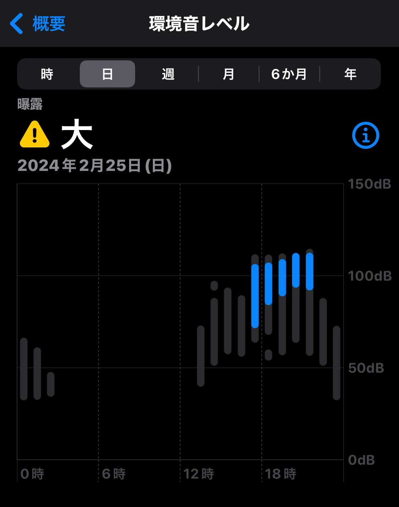
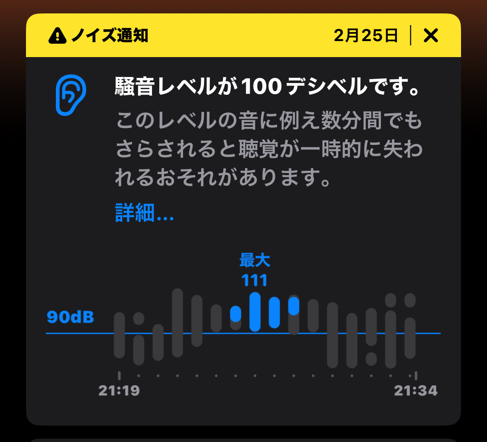

## 突然最前に突っ込まれると人は余裕を失う

こんにちは。THE IDOLM@STER MILLION LIVE! 10thLIVE TOUR Act-4 MILLION THE@TER!!!!を見にKアリーナに行ったらアリーナ最前になってしまい、見事に脳を焼かれた千早Pです。

これまでライブ現地参加ではほぼスタンド勢だったので、緊張と興奮で余力を失ったまま個別衣装でのパフォーマンスを浴びました。

感想が基本的に「すごい」しかない気はしていますが、頭が落ち着いて整理される前に感想を吐き出しておきます。語彙力も言語化力も失っています。

あえてアーカイブは見てない状態で書いています。見てしまうとそれに上書きされてしまうので。

## 一応: 筆者の属性

- アイマスへは2018年11月から飛び込む。ミリオンは2019。
- 千早P 
  - MILLION STARSは誰かが担当ということではないが、全体的に好き。
- ミリシタはとりあえず9万pt目標勢
- ミリオンの単独ライブはAct-4が初(7thRから配信を見ていた)
- 現地参加経験ライブは以下 
  - BNEFes1st Day2
  - アイマスMR Encore 亜美真美回(2/24)
  - BNEFes2nd
  - SUNRICH COLORFUL Day1 (Day2はLV……)
  - MOIW2023
  - 異次元フェス

## 最前?

ASOBITICKETは現地で発券することで席がわかります。

Day1はLEVEL7 25列でした。天空席ではあったのですが、光の海がきれいで楽しかったです。

で、Day2は、友人と連番でした。発見したときに見えた文字はアリーナ。「うおっアリーナだ!」と思って席番を見ると「4列」と書いてあります。

すごい! 前から4列目だ!

そんな気持ちでアリーナに向かう階段を降り、ゲートをくぐったところで席マップが目に入ります。主に左右方向の番号の関係を確認するために見たのですが、なにやら一番上に「4」という文字が見えます。

いや、まさかな・・・さすがに幻覚でしょ。そんな気持ちでとりあえず通路を進んでいくと、10列くらいまで行ったあたりで前方に10列分もないことがわかります。このあたりで心拍数が上がります。7、6、5・・・4が一番前だぞ!?

まさかの初のミリオン単独の現地(Day2)、それも10thツアー千秋楽で最前を引いてしまいました。

<blockquote class="twitter-tweet">
なんか最前ほぼドセンターなんだけど夢？
&mdash; たっくん (@mikuta0407) <a href="https://twitter.com/mikuta0407/status/1761658695530996196?ref_src=twsrc%5Etfw">February 25, 2024</a></blockquote>

ということで、やっていきます。

## 感想

### Rat A Tat!!!

うおお39人並んどる!!!!!!!!!!!!!!!!!!!!!!!!!!!!!!!!!!!!!

目の前にみんないる!!!!!

すごい!!すげぇよ!

壮観です。個別衣装で39人勢揃いはやっぱり壮観です。

昨日大声で叩いた扉をもう一回叩きました。やっぱりいいよねらたた。ミリアニ良かった。らたたの2番を聴くと、ミリアニ先行上映1幕のスタッフロールを思い出すんですよね。スタートにもエンディングにもなる曲、ありがとう。

### サウンド・オブ・ビギニング

はじまっちゃった。MTSのFINALE曲全部良いですよね。種ちゃんがすごい良かったです。

### Star Impression

Act-3は配信勢だったので現地生歌唱浴びれて最高でした。かっこよすぎる。今覚えてる記憶が「レベルが高い・・・!」です。ミリアニ6話の初見時の鳥肌をもう一度経験しました。かっこよかったな・・・。すごかった。

### フェスタ・イルミネーション

ｲﾙﾐﾙﾐﾙﾐﾙﾐﾙﾐﾙﾐﾙﾐﾙﾐﾙﾐﾙﾐﾙﾐﾙﾐﾙﾐﾙﾐﾙﾐﾙﾐ

ほ?

衣装も相まって、幻視が強めに効きました。

ちょっと脱線しますが、僕は「◯◯(キャラのほうの名前)が歌ってる・・・!」みたいな幻視をあまり体験したことがありません。無いわけではないのですが、そもそも現地経験が多くないのと、現地行ったとしてもこれまで基本米粒が多かったので、幻視云々までいかない、みたいな感じです。

これまで一番幻視したのは、配信で見たミリオン8th Day2の Black★Partyです。あれは茜ちゃんと麗花さんだった。

そんな中、今回は個別衣装だったのと、最前により演者さん本人を肉眼で明確に見たことが大きかったのか、Act-4のDay2ではかなり幻視が強めに発生しました(多分最前になって思考の余力が失われているのもある)。それに気づいた最初の曲がフェスタ・イルミネーションです。あれは徳川まつりでした。観客を楽しませようとする、徳川まつりをです。ミリアニ3話のバフも効いて、ただただ「すげぇ」という言葉が終わったあと漏れました。

個別衣装のパワーってすごいですね。そこに肉眼パワーが重なるとこうなるんだな・・・。

(書いてて気づいた: 強めの幻視が起きた8thのBlack★Partyもユニット別衣装でしたね。ちゃきさんとぴらみさんのパフォーマンスももちろんあった上ですが、そういうことか。)

### ファンタジスタ・カーニバル

ごめんなさいこのあとのユニゾンビートのお陰で記憶がここかなり曖昧なんですが、曲調も相まって楽しかったという記憶があります。衣装綺麗だったな。

### ユニゾン☆ビート

戸田くん!!! 戸田くん!!!! 復帰と思ったらいきなりバキバキのダンスでひっくり返ります。ありがとう。ありがとう。戸田くんの復帰のライブを見ることが出来てよかったです。

あんなにやってくると思ってなかったんだわ。

動きと感情でめちゃくちゃ印象に残っています。すごかったです。祝トレンド入り。

### MUSIC JOURNEY

僕はミリオンだと歌織さんが好きです。担当ではなくファンだと思っています。

あんまりミリシタがわかってなく、今日の連番者であるケーさんに教えてもらいながらとりあえずミリシタ2周年イベントを終えたあとに生配信番組で見たMUSIC JOURNEY。曲の良さと声の良さに衝撃を受けたのを覚えています。それをですね、生で見たんですよ。

これまでも配信等で素晴らしい歌唱は聴いていたのですが、ちょうど2月頭に「仲良クナリタイ」のイベントの現地に(ミンゴスがゲストで出るので)行っており、そこで香里さんの生歌をちゃんと知ったあとに生でMUSIC JOURNEYです。

Day1のクルリウタで、やっぱり低音すげえぇー!ってなった翌日に美しくて楽しくてカッコいい歌織さんを見ることが出来て幸せでした。

### 海風とカスタネット

海タネいいですよね。サビのコール好き。阿部里果さんの歌い方が良かった。これをフルメンバーで見れちゃったんだなぁー・・・ミリアニ本当に良かった。

このあたりで「うえしゃまかわいいですね」になっていました。(現地では一応BNEFes 1st Day2がありましたが、天空席だったのでなにもわからず)

### オレンジノキオク

正直、この曲だけは会場全体を見渡してみたかったです。落ちサビあたりからの景色みてみたかったかも。

というのは置いといて、すーじーの歌い方がすごい良かったです。種田さんのサウンドオブビギニングとは違う雰囲気も良かった。

### ABSOLUTE RUN!!!

いちぽむだぁ 衣装もいちぽむだぁ

ABSOLUTE RUN!!!はBNEFes2ndのDay1に見た記憶があります。Machicoさんがダッシュしたやつですね。

10年間を経ての安定感(僕は10年見てないですが)を堂々と見せてもらったような気持ちです。さすがの一言でした。

忘れないようにここに書きますが、Day2最後のポーズは本当に笑いました。

### catch my feeling

曲、ライブ映えしすぎる。Act-3で見たはずなのですが、現地パワーなのか、6人パワーなのか、なんかすごかった。かっこよかった・・・。 ここでもこのみさんを割と幻視しました。

### バトンタッチ

いい曲!!! いい曲なんですよ。美也のパートの歌い方もいいですよね。

あと駒形さんやっぱり強い。すごい。

### 恋愛ロードランナー

連番者も言っていましたが、うえしゃまがかわいかったです。なんというか、ずっと笑顔で動きまくってる感じ。すごい。

### パーフェクトゲーム

かっこいいですよね。安定感もすごいし、斉藤佑圭さんすごい。衣装も相まって本当にかっこよかった。

Day1のクロノレキシカも良かった。

### フローズン・ワード

ただただ圧倒された。Day1の夜想令嬢もすげぇーーってなった翌日にソロでこのパフォーマンスですよ。すげぇーー

そういえば感情とのバランスで感情寄りにしたみたいなお話されてましたね。そりゃ刺さるわけだ。

### Sing a Wing Song

瞳がSing a Wing Song。種田さんの歌唱、なんかすごい美しかったですよね。衣装と髪型も相まって、美しさがすごかった・・・。(美しいんだけど様子がおかしいんだよなぁ・・・)

### 花ざかりWeekend✿

これだけ言わせてください。 ア リ ー ナ 最 前 ぴ ら み 砲 着 弾 部

### Unknown Boxの開き方

CDリリース後から拍子変化の部分に完璧に追従してリズムを取る謎の遊びをしてたのが活きました(?)

あんな高貴って感じのダンスをミリオンで見れるとは。あとここでも感じたんですが、諏訪さんのまつり姫感、ちょっと次元違いません?

### ...In The Name Of。 ...LOVE?

Silent Jokerかと思ってたらこっちがきた。いやすごいっす。真壁瑞希だった。幻視ばっかりしてるなこいつ。(それほど個別衣装のパワーがすごい。ありがとうありがとう。)

### 教えてlast note…

...In The Name Of。 ...LOVE?の余韻に浸ってる間に始まっちゃったので冒頭の記憶が怪しいんですが、これまた力強さを感じていました。すごいよなぁ本当に皆さん

### 初恋バタフライ

わざわざガッツリ減量されてた桐谷さん。あの歌声の安定感すごいんだよなほんとに。バトンタッチでもそうだったけど。

### 恋心マスカレード

ごめんなさいこの次のdear...の衝撃で記憶が怪しいんですが、シアター通信で「野村さんの披露がすごい」みたいなお話を聞いたあとのこのライブだったので、そこを思い出しながら見ていた記憶があります。

「おーっほっほっほげほっ､ゴホゴホ！」するアイドルとは思えない世界観だしますよね千鶴さんって。

### dear...

これも強めの幻視をした曲です。このみさんだったよ。強いんだよ。全部が。さすがです。大人のこのみさんをしかと受け取りました。

### トワラー

うおおおおおおおおお生ギターしっかり見れた。戸田くんおる!!!

みんなで歌っとる!

早くBD3巻の特典映像を見せろ!!!!!!!!

### わたしは花、あなたは太陽

これまさにきれいな花といった感じの曲で良いですよね。

……。最初のRat A Tat!!!のときに正面に伊藤美来さんが居たときから気づいてはいたんですが、やっぱり瞳の輝きすごくないです?

配信で見てるときもすごかったけど、生で見てもそうなんだと気づきました。すごいですね。すごいしか言ってないかも。

あ、あとこれ来た段階で察しました。ありがとうございます。

### Dance in the Light

カッコいいって。かっこよすぎるって。

戸田くんもすごいし駒形さんもすごいし。もちろん山口さん斎藤さんもすごい。すごい。すごいんですよ。すごい以外の言葉が出ないけど。

戸田くん復帰で「曲数多くない」って聞いてたのにガッツリダンス2曲くるじゃん。どうして。

### 鳥籠スクリプチュア

頼む誓いはスクリーンに出してくれと思っていたら出なかったので焦りました。あやふやなのが悔しかったです。天空騎士団の方々、すごい。

### 瑠璃色金魚と花菖蒲

南早紀が、本当に強すぎる。強すぎませんか?

強すぎるんですよ。すごいよ。すごいって。本当にすごい。こわい。全部掴んでいく。

(あえて敬称略)

### Up!10sion♪Pleeeeeeeeease!

たのしかった。コール最高。A・R・I・S・Aも言えたし。りえしょんが歌う場にいれてよかった。

### Happy Darling

【実績解除】「応援するよ」を叫ぶ

たまたま金曜日、YouTube開いたときにファミ通のYouTubeチャンネルでやってたずっとゲの冒頭をちょっと見てたんですが、その人が目の前でめっちゃ踊ってるんですよ。なんかすごかったです。(語彙力がない)

めっちゃ飛び跳ねてる感じで、曲調とともに楽しかった・・・

### Clover Days

Clover (麻倉もも, 上田麗奈, 木戸衣吹, 雨宮天) 生でみちゃった。最前でみちゃった。Clover Days、最前で生で見ちゃった。どうしよう。どうすればいいんですかね。BCもう一回読むか。実は10巻までは買ってて11巻以降読めてなかったので今読み進めてるんですけどね。

やーClover Days見れちゃったな。

わたしは花、あなたは太陽が来たときにClover Daysは覚悟したんですが、やっぱりいざ来ると始まる前に｢ｽｩｩｩ」って息吸いますよね。

### REFRAIN REL@TION

セリフパートだめだって。破壊力。Team 8th、とてつもない安心感をもって見れますね。Act-3でも完成形レベルでやったとは思っていましたが、こうやって生で見ることが出来て幸せです。

### BORN ON DREAM! 〜HANABI☆NIGHT〜

楽しい! あとこの衣装をもう一度生で、それも最前で見れると思ってなかった。(MOIW2023で見て以来1年ぶりに見た)

……。マジで…!?もコール有りで再チャレンジしません?

なんかサンリッチを思い出しちゃった。

ついでに、線香花火団がカバーするマジで…!?も面白そうだなとか考えてました。

### 深層マーメイド

ぶったまげました。やるんだ。びっくりしちゃった。ごめんなさい浅葱色振ってました。でもころあずとMachicoの歌唱力に圧倒されてました。突然無防備状態でお出しされたので、もはやダメージすら食らっていた記憶があります(褒めてる)。

### ESPADA

センターのすーじーがかっこよすぎていた記憶があります。あと南早紀・・・ほんとにつよい・・・

### 俠気乱舞

最後の方でジュリアすごい歌い方してませんでした?

なんかすごいかっこよかったですよね。あぁいうアドリブ的要素本当に愛美さん強い気がする。

あとこの曲をあの衣装で歌う木下ひなた、面白すぎる。

ちょっと余談ですが、Day1でも思ったんですけど、僕のTL構築的に、木下ひなたが「壮瞥町のコラボでとんでもない影響を残した」という認識になっているんですよね。主にみくまりさんが震源地なんですけど。なので「壮瞥コラボですごい話題になったあのアイドルだ!!!すごい!!

こんなところで見れるんだ!」みたいな、冷静に考えれば木下ひなたはミリオンスターズだから当然なんですが、謎の錯覚を起こしてました。

### Shooting Stars

暴力みたいなものを見ました。

ｽｺﾞｲﾃﾞｽ!すごいですねほんとに・・・蒼・・・

(猫耳としっぽの衣装のまま歌う茜ちゃんって思うとちょっとおもしろかった)

### 夢にかけるRainbow

南早紀が強すぎる(n回目)

いやほんとに強い。入りのソロの段階で鳥肌なんですよ。すっげぇ遠くまで伸びる声。強い。

### 恋のLesson初級編

正直「(あれっ深層マーメイドでソロ枠消化しちゃった?)」とか(そんな訳はないんですが)ボーッと考えてたので、叫びました。

安定感がやべぇ。さすがです。高音域の伸びがすごい。

ミリアニでロケットスターを見たとき、なにかの気持ちよさに似てるなと思ったらT-SQUAREでウィンドシンセが高音できれいに伸びた音出すときの気持ちよさに近いと気づいたんですが、Machicoの声すごいよなあってなってました。みんなすごい。

### Precious Grain

これは本当に偶然なんですが、たまたまKアリーナ行く前の家でぼーっとしてる時に、静香のSnow Whiteと千早のSnow Whiteを聴き比べてて、静香の歌声って千早の優しく包むような歌い方と違って前へ前へと行くような歌い方だよなぁとか考えていて、その時改めてPrecious Grain聴いてたんですよね。それが流れてきたのでたまげました。そういうこともある。

さすがの歌唱力だなぁ・・・。

### 未来飛行

文句なしのフル尺でしたよね。ぴょんさん元気にライブ出れてほんと良かったし、10年(もう11年だけど)のタイミングで見れてよかったです。個人的にはミリオンの中で最も演者とキャラのシンクロ度が高いのは春日未来 + 山崎はるかだと思っているので(敬称略)、幻視というか、なんかすごい不思議な感覚でした。最後に全員出てきて鳥肌でした。信号機でトリに向かうセトリ、天才。

### UNION!!

ゆーにおーーーん！！！ みーりおーーーん！！！

圧巻の、壮観の、とってもすごいUNION!!。ありがとうありがとう。

### Crossing!

千早の誕生日を大声で祝ったり、ハッチポッチ2発表でクソデカい声出したりしたあとのCrossing!です。なんかね、首振り扇風機みたいな感じで首を動かして、「この風景を目に焼き付けよう」という意志でみていました。コールが気持ちいいんだこれが。今まで配信でしか見てなかったけど、サビの「いえーーーーい!」が出来てよかったです。

### Thank You!

「本当に」で止まっていつものミリオンみたいになったMCが終わり、ついに最後です。

いつも配信で見てたフリータイムのThank You!が目の前で繰り広げられています。目が足りません。視界が狭いです。助けてください。どうしようもない。助けてくれ。記憶もない。どうしよう。すごい楽しかった。

## 総括

ありがとうアイドルマスターミリオンライブ、5年くらいミリオンを追ってきた自分を誇りに思うくらい楽しかったです。

「10年のなかの何処かで出会ってくれて」といったようなことを山崎さんはおっしゃっていましたが、なんだか本当に一人も手放さない空間だなぁ、と感じたりしていました。

このブログを投稿するのは11周年目の初日です。お誕生日おめでとうございます。これからもプロデュースしていきます。

ハッチポッチ2は何がなんでもいきます。絶対に。

## その他

- うるせぇ!って怒られました。知ってる。
    
  
- ライブのペンラの電池、過去の失敗からLR44ではなくSR44を使うようにしているんですが、流石に4時間近いライブだとアンコール後が耐えられませんでした(点灯するけど如実に電圧不足を感じる光り方をする)。Day1の公演時間からDay2の長さを予測していたので、年のために持ってきていた予備のペンラを出してアンコールは乗り切りました。
  - UNIONとThank You!!だけはお守り的に持ってきた千早・春香ペンラも振った
- UO(極のほう)を3箱(75本)買ったんですが、2日合わせて70本くらい折ったみたいです。Day2も最初は緊張して折れなかったけど、途中から結構バキバキしてたらしい。
  - BNEFes2ndで自分REST@RTとキラメキラリを2本で乗り切る羽目になった経験があり、もう本数に困りたくないと思ってから、UOは残数を考えずに行けるように1日あたり40本近く持っていくようにしています。UOの余裕は心の余裕。  
  BNEFes2ndのその時の感想を繪里子さんに聞いてもらったPodcast↓

<iframe style="border-radius:12px" src="https://open.spotify.com/embed/episode/00yYkABgqyasnidwj4Uxjk?utm_source=generator" width="100%" height="352" frameBorder="0" allowfullscreen="" allow="autoplay; clipboard-write; encrypted-media; fullscreen; picture-in-picture" loading="lazy"></iframe>

---

この下に書いていたものは [Act-4感想エントリの余談というか、蛇足というか](https://blog.mikuta0407.net/posts/2024/20240227-ml-10th-act4-additional/) に移しました。1つの記事に混ぜたくなくなったので。
