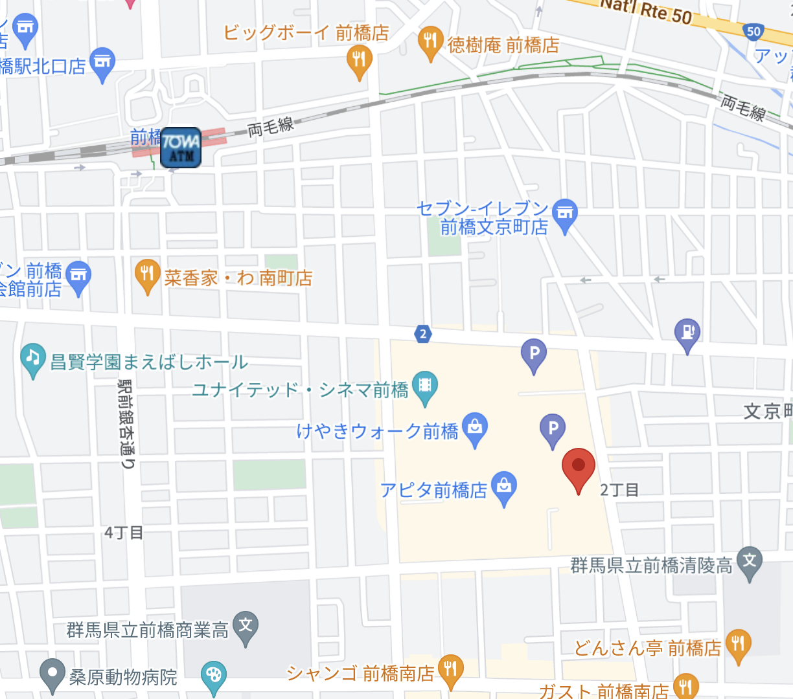
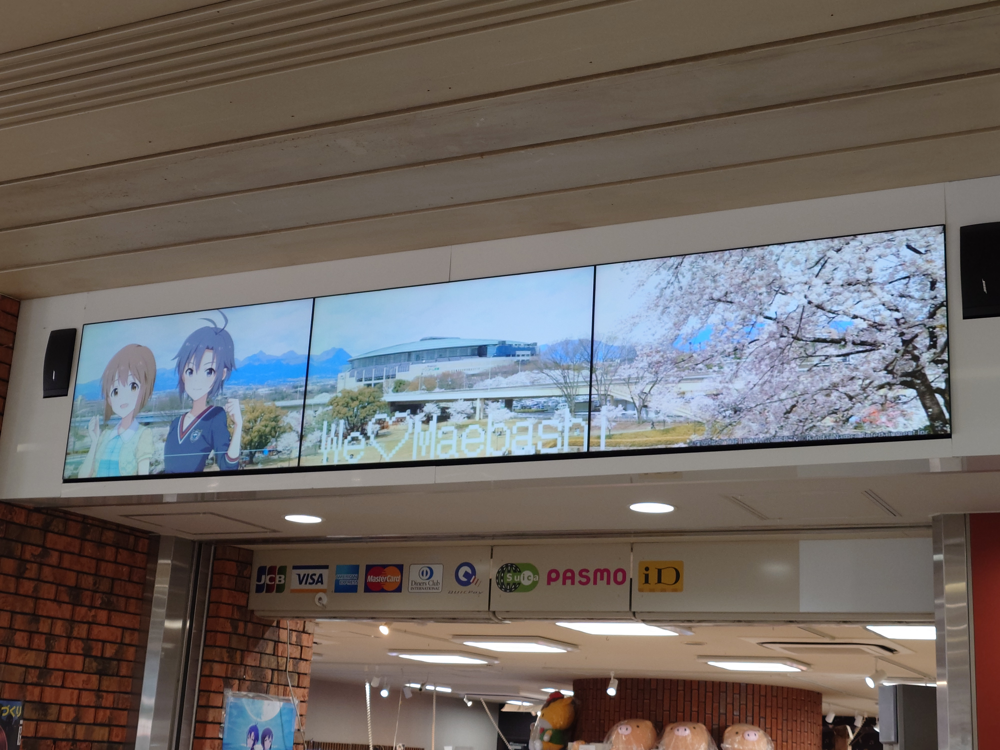

## はじめに

2024年３月16日,17日に行われた[菊地 真 ・ 萩原 雪歩 twin live “ はんげつであえたら ”](https://idolmaster-official.jp/live_event/twinlive_halfmoon/)に行ってきました。３公演終わったあとに感情がぼやけないうちに書いた感想は [「菊地 真 ・ 萩原 雪歩 twin live “ はんげつであえたら ”」の脳直感想](https://blog.mikuta0407.net/posts/2024/20240318-imas-halfmoon/) に書いてあります。

今回は遠征旅だったということもあるので、せっかくなので旅の記録を残しておこうと思います。

(実は一人旅が人生初でした)

## １日目

### 忘れ物

最寄り駅の町田駅から新宿まで移動中、とんでもない忘れ物に気づきます。

<blockquote class="twitter-tweet">
P名刺忘れた ありがとうございました…
&mdash; たっくん (@mikuta0407) <a href="https://twitter.com/mikuta0407/status/1768826048572219681?ref_src=twsrc%5Etfw">March 16, 2024</a></blockquote>

せっかくいつもより名刺交換が出来そうなイベントなのに、P名刺を忘れる大失態です。もう戻る余裕はないので、「後でコンビニで数枚でいいから刷ろう……」と考えつつ、落ち込みながら移動が始まりました。

### 東京駅

東京駅でお昼ご飯を食べてから新幹線に乗るつもりだったので、中央線を降りてさっさと移動し、グランスタ東京に向かいます。

旅の始まりの記念ということで、 [近畿大学 水産研究所はなれ グランスタ東京店](https://www.dynac-japan.com/shop/kindai_suisan/gransta_tokyo/) でまぐろの手桶寿司を頂きました。食レポが下手くそですが、本当に美味しかったです。

### 高崎へ

荷物もあったことや、できるだけ変な体力を消耗したくなかったので、埼京線は使わず上越新幹線で移動しました。とき321号です。

この新幹線の中で、パソコンを取り出して名刺データを<a href="https://myseriesprint.com/my_meishi/top">マイ名刺</a>に登録します。(AndroidアプリがXperia5Ⅴで落とせず謎)

<blockquote class="twitter-tweet">
新幹線の中でMac出して名刺データをコンビニプリントに投げられるサービスに登録した とりあえず数枚は確保できそう。実際に交換するかは別として。
&mdash; たっくん (@mikuta0407) <a href="https://twitter.com/mikuta0407/status/1768846934507491807?ref_src=twsrc%5Etfw">March 16, 2024</a></blockquote>

勢いでPCを2台持ってきていましたが、MacBook Airを持って来て大正解でした。

<blockquote class="twitter-tweet">
M1のMacBook Air、実質今のメイン機になってるしやはり持ってきて大正解だった。 とはいえCF-RZ4も持ってきてるので、何故かアイマスのライブに行くのにPCが2台ある人になってる。
&mdash; たっくん (@mikuta0407) <a href="https://twitter.com/mikuta0407/status/1768847266973110308?ref_src=twsrc%5Etfw">March 16, 2024</a></blockquote>

高崎駅につくと、高崎だるまということで駅構内(新幹線改札内)でだるまをめちゃくちゃ売っていました。

千早カラーのものを買っちゃいました。(下に写ってるものは後で書きます。)

### 前橋駅

高崎駅ではだるまを買った以外特になにもせず、そのまま両毛線に乗って目的地である前橋駅に向かいました。

まだチェックインまで1時間以上あるので、とりあえずセブンイレブンでマイ名刺に登録した名刺データを6枚分、あとハサミを確保しました。背に腹は代えられない。

### 突然のケーズデンキ

<ul>
<li>会場限定CDがある</li>
<li>USB Type-Aが挿さるCF-RZ4を持ってきている</li>
</ul>

ということを思い出した僕は、「会場限定CDを買って今日中に聴きたい!!!!」とワガママを脳内で発出させます。すかさず近くに家電量販店があるか調べると、徒歩20分くらいのところにケーズデンキがあります。

バスが有ることもよくわからない段階の僕は、「あと1時間でチェックイン」という思考だけで、とりあえず歩き始めてしまいました。

<blockquote class="twitter-tweet">
ケーズデンキ向かってる
&mdash; たっくん (@mikuta0407) <a href="https://twitter.com/mikuta0407/status/1768871805744537681?ref_src=twsrc%5Etfw">March 16, 2024</a></blockquote>

スーツケースを転がしながら20分、流石にしんどかったですが、どう見ても徒歩で来るところではないケーズデンキにたどり着き、USB-ODDを入手します。家から持ってくればよかった。

流石に帰りはバスで前橋駅まで戻りました。

前橋文学館とか行かずに、前橋に到着して(コンビニ以外で)初めて言った場所がケーズデンキ、何?

### チェックイン

ちょうど戻ってくると15時です。宿は駅目の前の[ドーミーイン前橋](https://dormy-hotels.com/dormyinn/hotels/maebashi/)です。

部屋は404でした。ちゃんと存在していてよかった。

### 前橋駅のコラボ要素

前橋駅からベイシア文化ホール最寄りの県民会館前(バス停)に向かうバスまで少しだけ時間が合ったので、名刺を刷ることで頭が一杯になっていた結果一切認知できてなかったコラボ要素を見に行きます。

けやき並木通りにはフラッグがありました。  

前橋駅内の「Vento Maebashi」では液晶パネルにコラボ画像、等身大パネルの設置がありました。  
  

### 町中のコラボ

あまり撮影できて無く、2枚ほどしかないですが、道中のお店にもポスターが掲出されており、本当にありがたい気持ちになっていました。すごい時代だ。

  

### 会場着(ベイシア文化ホール)

今回の会場であるベイシア文化ホールに無事到着です。1つ惜しかったのは、滞留する場所に車が通ることですね。こんなにも大量の人が滞留することを想定した会場のほうが珍しい(幕張メッセイベントホール……)ので仕方ないですが、壁寄りの空間を確保できない民は開場までの立ち位置が若干難しかったです。  

催し物の掲示になぜか誇らしい気持ちになりつつ、  

物販で限定CDを買います。ステッカーは「STELLA MASTER 03 そしてぼくらは旅にでる」のジャケットでした。  

そして…………

<blockquote class="twitter-tweet">
ただ単にやりたかっただけなんですが、会場で会場限定CDを取り込むRTAしてみました CDDBに情報無くてタグ付けされなかったのでまた後でホテルでゆっくり… <a href="https://t.co/fwrtPRNbTX">pic.twitter.com/fwrtPRNbTX</a>
&mdash; たっくん (@mikuta0407) <a href="https://twitter.com/mikuta0407/status/1768909035225702759?ref_src=twsrc%5Etfw">March 16, 2024</a></blockquote>

せっかくUSB-ODDを買ったのと、軽量で小さいCF-RZ4を持っていたので、現地で開封して現地で取り込むRTAをやってみました。

ツイートにもあるように、この段階ではCDDBにタグ情報がなかったのか、テザリングして試していても情報が取得できませんでした。

ただ、今思い返してみると、"パケづまり"が起きて取得ができなかった可能性は否定できません。

(現地はKDDI 4G/5Gがかなり険しく、入場待機のときからはIIJmioのデータeSIMでFOMAに落として使っていました。)

ホワイエには楽屋花が並べられていました。みなさん凝っていらっしゃる。  

学マスの入学願書が配られていたので、もらってきました。  

開場内の注意事項放送(避難誘導灯の話、禁止行為の話等)が、真・雪歩による案内でびっくりでした。大真面目モードのお二人のアナウンス、すごい良かったです。(真の声、めっちゃ聞き取りやすかった)

このあとはMOIW2023のBD宣伝で流れるCRYST@LOUDにみんなでクラップしつつ、本番のライブがありました。

当然語彙力なくなってるのでこういうツイートしか出来ません。

<blockquote class="twitter-tweet">
すっげぇライブだったな<a href="https://twitter.com/hashtag/%E7%9C%9F_%E9%9B%AA%E6%AD%A9%E3%83%84%E3%82%A4%E3%83%B3%E3%83%A9%E3%82%A4%E3%83%96%E5%8F%8B%E8%97%8D?src=hash&amp;ref_src=twsrc%5Etfw">#真_雪歩ツインライブ友藍</a>
&mdash; たっくん (@mikuta0407) <a href="https://twitter.com/mikuta0407/status/1768952929799827849?ref_src=twsrc%5Etfw">March 16, 2024</a></blockquote>

開場を出ると、真上に半月が見えました。晴れててよかった。影の王と光の王、ずっと遠くで互いを想い続けるのだろうと思うとすこし寂しくもありますね。  

### 打ち上げ

この日は、[紫電P（@sidenp）さん](https://twitter.com/sidenp)主催のPの集いがありました。

その道中に、めちゃくちゃ良い空間がありました。こういうの良いですよね。
  

打ち上げは、MRの話を濃くすることが出来て本当に良かったです。今までMRの話ができるリアルで話せる機会が無かったので……。

古参のPの方々とたくさん話せて楽しかったです。

### 宿に戻る

宿に戻ったのは0時20分ごろでした。とりあえず温泉に突っ込みます。  
大変に良い湯でしたが、翌日(当日)の予定もあるため、あまり長湯せずパッと出ました。

コーヒー牛乳飲もうとしたら現金のみだったので泣きながらカルピスアイスバー(無料)を食べました。  

この無料アイスバーがドーミーイン系の醍醐味  

とりあえず寝る前に会場限定CDのタグ付けをやり直して、自前Subsonic鯖で聴けるようにしてから就寝です。

## 2日目

### 朝ご飯

朝食付きプランで宿泊していたので、ホテルの朝食を食べました。ソースカツ丼が最高でしたね。前橋らしいものを何処かで食べようと思っていましたが、ここで回収できて良かったです。  
  

### 朝風呂

写真は一切ないですが、寝癖が終わっていたのと、せっかく温泉なので朝風呂にも入りました。最高でした。

### お土産の購入

会場に行く前、1日目に見たときには全部枯れていたチラシも入手しつつ、お土産を購入しました。

地酒飲み比べセットと、2日目夜に部屋で飲むための日本酒1本、ころとんのストラップマスコット、  

あとは写真はないですがきざみ生姜も買いました。

そして、

<blockquote class="twitter-tweet">
会場限定CD買いました！！<a href="https://twitter.com/hashtag/%E8%8F%8A%E5%9C%B0%E7%9C%9F_%E8%90%A9%E5%8E%9F%E9%9B%AA%E6%AD%A9_twinLive?src=hash&amp;ref_src=twsrc%5Etfw">#菊地真_萩原雪歩_twinLive</a> <a href="https://t.co/0dJtg3TMdh">pic.twitter.com/0dJtg3TMdh</a>
&mdash; たっくん (@mikuta0407) <a href="https://twitter.com/mikuta0407/status/1769171232426262728?ref_src=twsrc%5Etfw">March 17, 2024</a></blockquote>

ころとんのCDがあったのでジャケ買いしました。子豚ちゃんもアイドルの時代(違う)。

### 会場

まぁ適当に記念写真とりつつ。  
  

ころとんところとん。  

またもや学マスの入学願書をもらったのですが、まさかの1日目と被り。びっくりしましたよ。

<blockquote class="twitter-tweet">
まさかの2回目被り なにかを訴えかけられてる気がする <a href="https://t.co/SDULQGavIX">pic.twitter.com/SDULQGavIX</a>
&mdash; たっくん (@mikuta0407) <a href="https://twitter.com/mikuta0407/status/1769184832989618217?ref_src=twsrc%5Etfw">March 17, 2024</a></blockquote>

あとは「FOMAが通るなぁ」みたいなことをしたり。  

### 終演後・昼飯

みなさん御存知の通り悲藍はとんでもない物語だったので若干放心状態にです。いやぁ……公式がそういう話を作るのもすごいし、アンコール曲をそれにするのもエグいし。(このあたりの感想は脳直感想記事で)。

MCの中でお昼ご飯はどうするのか、という話題があったので、Twitterでみて気になってたぐるぐるソーセージ(ころとんのしっぽ)を食べることにしました。  

このあとシャツにマスタード+ケチャップを垂らしてそのままホテル戻って着替えたのは内緒です。

### 3公演目

とりあえず会場に戻り、ようやくコロトンの目線を貰える構図で撮影できました。かわいい。  

学マス入学願書は被らずゲット。よかった。  

### 終演後

<blockquote class="twitter-tweet">
ありがとうございました。本当にいいライブでした<a href="https://twitter.com/hashtag/%E8%8F%8A%E5%9C%B0%E7%9C%9F_%E8%90%A9%E5%8E%9F%E9%9B%AA%E6%AD%A9_twinLive?src=hash&amp;ref_src=twsrc%5Etfw">#菊地真_萩原雪歩_twinLive</a> <a href="https://t.co/5m808YKyC5">pic.twitter.com/5m808YKyC5</a>
&mdash; たっくん (@mikuta0407) <a href="https://twitter.com/mikuta0407/status/1769290230396580183?ref_src=twsrc%5Etfw">March 17, 2024</a></blockquote>

<blockquote class="twitter-tweet">
ああ<a href="https://twitter.com/hashtag/%E8%8F%8A%E5%9C%B0%E7%9C%9F_%E8%90%A9%E5%8E%9F%E9%9B%AA%E6%AD%A9_twinLive?src=hash&amp;ref_src=twsrc%5Etfw">#菊地真_萩原雪歩_twinLive</a> <a href="https://t.co/b0I8Uiv7qz">pic.twitter.com/b0I8Uiv7qz</a>
&mdash; たっくん (@mikuta0407) <a href="https://twitter.com/mikuta0407/status/1769290615513305426?ref_src=twsrc%5Etfw">March 17, 2024</a></blockquote>

このあとはTwitterで感想を漁ったり呟いたりしながら、前橋駅に戻るバスを待ちました。結構来なくて焦りましたが、最終的には2台まとめてきたので余裕で座ることが出来ました。

### 夕飯

19時にも近い時間で、地元の店に突撃する勇気がなかったので、1日目のケーズデンキのときに通った「けやきウォーク前橋」に言ってご飯を食べることにしました。

ただ、致命的な問題として、バスで行くことは出来ても、戻って来るバスがありません。終バスが早すぎる。

<blockquote class="twitter-tweet">
飯に迷って地元のモールに来た なおもうまともに帰れるバスはないので、戻りは徒歩です <a href="https://t.co/MyZDWGzSvd">pic.twitter.com/MyZDWGzSvd</a>
&mdash; たっくん (@mikuta0407) <a href="https://twitter.com/mikuta0407/status/1769300922826719269?ref_src=twsrc%5Etfw">March 17, 2024</a></blockquote>

ケーズデンキに行ったおかげで一応歩いて戻れることはわかっていたので良かったです。

<strong>ちなみに帰るバスが無いことに気づいたのは行きのバスに乗ったあとです。</strong>

夕飯自体は、「四六時中」のいくらがのったのを食べました。最高でした。

<blockquote class="twitter-tweet">
はんげつであえたら、お疲れ様でした <a href="https://t.co/ZeMuH6WKZp">pic.twitter.com/ZeMuH6WKZp</a>
&mdash; たっくん (@mikuta0407) <a href="https://twitter.com/mikuta0407/status/1769305080984191447?ref_src=twsrc%5Etfw">March 17, 2024</a></blockquote>

徒歩で駅まで戻ってきたあと、ベイシア文化ホール最寄りの県民会館前に向かう6番バスのりばを見て、ここが夢の空間へ向かう場所のように感じていました。9と3/4番線的な…

<blockquote class="twitter-tweet">
夢のような空間への出発地だったなあ<a href="https://twitter.com/hashtag/%E8%8F%8A%E5%9C%B0%E7%9C%9F_%E8%90%A9%E5%8E%9F%E9%9B%AA%E6%AD%A9_twinLive?src=hash&amp;ref_src=twsrc%5Etfw">#菊地真_萩原雪歩_twinLive</a> <a href="https://t.co/0qLPxJuvl3">pic.twitter.com/0qLPxJuvl3</a>
&mdash; たっくん (@mikuta0407) <a href="https://twitter.com/mikuta0407/status/1769316219113685347?ref_src=twsrc%5Etfw">March 17, 2024</a></blockquote>

### ホテル時間

ホテルに戻ったあとは、1日目より時間がたっぷりあるので温泉もゆっくり入りました。  
露天風呂では頭上に半月が見え、この日に見た悲藍と純藍の物語を思い出したり、そもそもの「はんげつであえたら」のライブを見れた事自体を思い出しながら、ゆっくりと過ごしました。

写真撮り忘れてるのが痛恨の極みですが、1日目に現金がなくて敗北したコーヒー牛乳も飲みました。やはり美味しい。これこそが温泉施設の醍醐味である。

このあとは22:30くらいまで[脳直感想記事](https://blog.mikuta0407.net/posts/2024/20240318-imas-halfmoon/)をガシガシと書きつつ、腹が少しこなれたあたりで夜鳴きそばを食べました。これがドーミーインの醍醐味。(醍醐味はたくさんあって良い)  

23時からは <a href="https://twitter.com/ehon_nakaniwa">「繪ほんの中には」</a>のイベントに向けたスペース配信があったので、それを聴きながらブログ執筆を続けました。

ある程度書き終わって、一旦公開したのが0時28分。ここで午前中に買った酒を飲んでいないことに気づきます。  
今から1瓶空けるのは危ない、ということで一口飲もうとしましたが、蓋が硬すぎて開かず断念。飲まずに寝ました。(本当に蓋が硬くて、帰宅後滑り止めマットを使ってようやく開栓できました。)

## 3日目

### 朝食

もう一度ソースカツ丼、そして2日目食べなかったカレーもいただきました。ホテルの朝食で地元らしいメニューが有るのはありたがいですね。これのおかげで名産的な食べ物に対する悔いがなくなったので。  
  

### 風呂

最後にもう一回、の気持ちで入りました。さすがに露天風呂は(土日と違って温度が下がったこともあり)寒かったですが、じっくりと温泉を堪能できました。  

### ハードオフ

前橋文学館に行くか、ハードオフに行くか、帰るか、の3択で、ハードオフを取る、ガバチャートを選びました。

なんとなく、地方(失礼)のハードオフって結構面白みがあるというふんわりとした印象があります。場所的に行ったら1時間帰りのバスが来ないので、ハードオフ・ホビーオフの品揃えに期待し突っ込んでみました。

結論から言うとあまりにもジャンクコーナーに面白みがなくて拍子抜けでした。スーファミやN64の箱付き完品がめちゃくちゃ並んでるのは面白かったですが、それ以外はなんともいえない品揃えで……。ホビーオフコーナーも棚3列くらいだった気がします。

かなりゆっくり見ても30分くらいで満足してしまい、時間と数百円をかけて来た割に収穫ゼロというのも寂しいので、3000円で売ってたMagic Mouseを買ってみました。今これを書きながら使っていますが、普通に動いているので会社に持っていきます。Lightning充電ではなく単3電池2本タイプです。

<blockquote class="twitter-tweet">
遠征先のハードオフに行って何も買わないのも寂しかったのでMagicMouse買ってみた <a href="https://t.co/MyCfEnOSef">pic.twitter.com/MyCfEnOSef</a>
&mdash; たっくん (@mikuta0407) <a href="https://twitter.com/mikuta0407/status/1769560599074349303?ref_src=twsrc%5Etfw">March 18, 2024</a></blockquote>

ただこの残り30分が辛かったです。ハードオフの周りには時間を潰せる店が一個もありません。まぁ、徒歩で来るところではないですよね。車で来るところですし。  
  

かといってハードオフの中にもう30分滞在するのは辛かったので、バス停まで行ってしばらくYouTubeみたりSS読んだりしていました。これだけは寒くて辛かった……。

### ありがとう前橋市

ホテルに荷物を預けていたので受け取りつつ、最後にフラッグの前で記念撮影しておき  ました。
  

前橋市では真と雪歩に見送ってもらえました。  

### 帰路

風が強すぎて、両毛線も上越新幹線も遅延していました。とりあえず東京までたどり着けたのでヨシ!!  

東京駅では夕飯用に駅弁屋祭で弁当を買いつつ、新宿に戻ります。

強風でいろんなものが飛んだのか、ちょっと可哀想なことになってました。

### 帰着

帰りはいつもどおりロマンスカーで町田まで。無事に事故無く戻ってくることが出来ました。  

## 〆

実は初めてだった一人旅+イベント遠征。すごい楽しかったです。ちょうど大学生で一人旅ができそうなタイミングがコロナ禍だったので経験していなかったんですよね。

イベント自体も楽しかったですし、いい旅でした。

次は4月13日に奈良で行われる今井麻美さんのライブで、また遠征です。今度は西日本か……。執筆時点では足をまだ確保していません。"発動"しないよう気をつけます。
