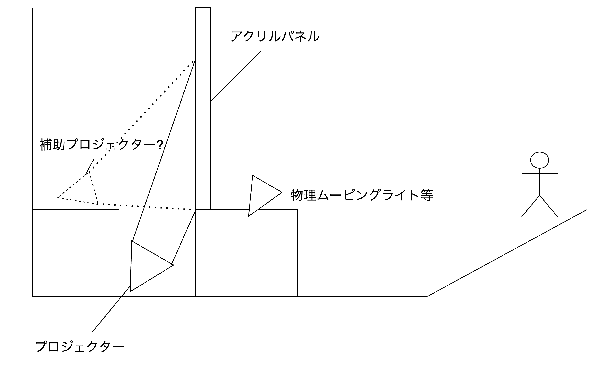
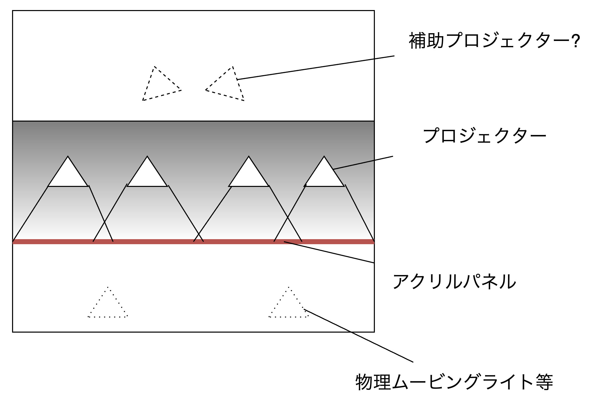

## はじめに

THE IDOLM＠STER MR ST@GE!! MUSIC♪GROOVE☆ENCORE、2020年2月に行われてから4年が経ちました。

2018年の終わりくらいからPになった僕は、2020年2月24日、チケットを譲ってくださった方々のお陰で、亜美真美回の最終日を見届けることが出来ました。当時、あまりの衝撃に、このブログで [THE IDOLM＠STER MR ST@GE!! MUSIC♪GROOVE☆ENCORE 2/24亜美真美回レポート (全体曲ネタバレあり)](https://blog.mikuta0407.net/posts/2020/20200225-imas-mr-encore-amimami/) を書きました(ブログと言うよりは、脳を焼かれた勢いで書いたなにかですが)。あの公演の衝撃は相当大きく、今でもあのDMM VR THEATERでの光景を思い出せます。

当時まだ1年4ヶ月くらいのPだった僕も、コロナ禍を経てP歴も5年を超えました。あの公演から4年間の間に、いろいろ765ASの楽曲もたくさん聴き、BNEFes2ndやSUNRICH COLORFUL、MOIW2023などのライブにも参加してきました。ですが、やはり頭の片隅に、あのMR公演のことが残り続け、SHOWROOMやアイマスチャンネルなどでのMR的要素でワクワクしながら、現地でのアイマスMRの復活をずっと心待ちにしていました。

そんな中、2023年7月に、ミリオンでDreamin’ Grooveが行われました。 当時のブログ [765 MILLIONSTARS LIVE 2023 Dreamin’ Groove 7月1日 1公演目の感想 - 平和に生きたい](https://blog.mikuta0407.net/posts/2023/20230702-765ml-mr-dg/) にも書いていますが、あの"アイマスMR"と違い、プリレンダ映像によるライブに対する不安があったものの、それを吹き飛ばしてくれたのを覚えています。

そして突然発表された「はんげつであえたら」。

前橋であること、通し券で45000円という大きな金額であること、専用の箱や神田スクエアのような(密集して錯覚させるような)サイズではなく普通のホールであるベイシア文化ホールであることなど、一瞬躊躇してしまうような要素はありましたが、Project IM@S 3.0 VISIONとなったアイマスへの信頼・期待、そしてあのアイマスMRを見た者としては、見る以外の選択肢はありません。

ちょっとは迷いましたが、通し券を申し込み、チケットを無事握ることが出来ました。

<blockquote class="twitter-tweet">
はんげつであえたら、当選しました！！！！！！！！！！！！！！！ <a href="https://t.co/zW1Sjz4JOR">pic.twitter.com/zW1Sjz4JOR</a>
&mdash; たっくん (@mikuta0407) <a href="https://twitter.com/mikuta0407/status/1730438083437592986?ref_src=twsrc%5Etfw">December 1, 2023</a></blockquote>

本当に、本当に、行けてよかった。本当に素晴らしい公演だった。すべてのスタッフの皆さんに感謝です。

以下、曲の感想と、前回・前々回の記事同様、ちょっと技術的な部分の感想です。

## 曲の感想

さて、この「はんげつであえたら」の文脈解説や考察といったところは、もうちょっと文章力や語彙力のある方々にすべてお願いするとして、脳がまだ整理されていない状態で、特に印象に残っている部分の感情を書き留めておこうと思います。

本当はもうちょっと1曲ずつ細かく書きたいのですが、さすがに3公演分すべてを書く力はないのと、曲は知っているが背景をそこまで認知できてない、みたいな曲もあるため、とりあえず語りたい優先度が高いものを書いておきます。

### 友藍

#### キミはメロディ

曲というよりは公演一発目の衝撃、という感情のほうが大きいですが、この1曲目を見た段階で、「あぁ、あのアイマスMRの世界だ」と安心しました。もう手放しにすべてを享受するモードです。

いるんですよ。真と雪歩が。4年ぶりの感覚です。ただいま、といった気持ちでした。(DGも「いる」とは思いましたが、やはり違うんですよね。この感覚。)

いいですね、やっぱり。

あ、そうそう! **マイク持って歌ってるんですよ!!!!!!!**

スタマスだとマイクを持つ演出自体はありましたが、MRでは初だったはずです。マイクを持ち続けた3公演、普段はマイクを手で持たないアイドルたちの歌唱パフォーマンスをみているだけに、"いる!!!"感強かったですね・・・

#### チェリー

これに関しては、MRだから/声優さんライブだからという区別がない話ですが、2018年終わりにシンデレラからアイマスに飛び込んでいるので、2017年のプロミでのチェリーを経験していない僕は、感無量でした。この曲を現地でみんなでコールできる場に居られた嬉しさがとんでもなかったです。みんなで一旦座って、起立からやるのも楽しかったですし、cherryのコールも楽しい。ありがとう、ありがとう。

#### First Step

雪歩のソロをじっくり噛みしめるように聴いていました。僕はアイマス2未プレイなので、正直なところ正しい曲背景を理解できていません。でも、雪歩の優しい歌い方が本当に染みる、素晴らしい歌唱でした。

#### The world is all one !!

これもMR要素との関連は薄いですが、僕はこの曲に悔しい思いがありました。2019年のバンナムフェス2ndで、最後の大トリで歌われたざわわん。当時僕はざわわんが765ASの曲であることも認知できておらず、あとから最後に歌われた意味やすごさを理解しました。いつか、いつかどこかでちゃんと知識がある状態で聴きたいと思っていたところに、この"濃い"空間で聴くことが出来たのが本当に嬉しかったです。

#### my song

巨大なため息がでたのを覚えています。  
この「友藍」では、影の王と光の王が遠く離れても互いを想い続けるという物語でしたが、その結末を聴いたあとのmy songは破壊力が凄まじいです。真の優しくも力強さのある声、雪歩の真とは違う優しさのある声のデュエットでのmy song、素晴らしかったです。

<h2>悲藍</h2>

#### relations

「助けて」から始まった、なにか不穏な空気が流れる物語の直後にrelationsはずるい。すごい。relationsを生で聴けたことにも感動しましたし、2人の歌い方がすごい良かったです。

#### inferno

まず千早Pとしてびっくりしました。サンリッチでは確かに聴いていましたが、普段は千早+雪歩の歌唱を、パート分けも少しずつ変えながら真の歌声と雪歩の歌声で聴くinferno、あまりにも新鮮で、かっこよかったです。

#### 静かな夜に願いを・・・

実は、日曜日に起きて宿を出発するまでの間に765AS曲を全曲からシャッフルして流していたのですが、そこで「静かな夜に願いを・・・」の千早Verを聴いていたですね。余計にびっくりしました。

雪歩の上に伸びる歌い方も素晴らしかったですね。

#### LOST

聴けると想ってなかったです。アイマスのバラード系曲ではトップクラスに好きな曲です。(他の曲もそうですが)2024年に現地で聴けるなんで想ってなかったので本当にびっくりしました。雪歩のソロとしての歌唱、ペンライトを振る余裕もなく、小さく揺らしながら噛みしめるように聴いていました。LOST、良いんすよね・・・(千早ソロもいいぞ)

実は初日終わりに打ち上げした方々と「悲藍ってことは別れとかだろうから(こんなことになるとはおもってなかったけど)、LOST来るんじゃないっすか」みたいな話をしていたので、本当に来てびっくりしました。

#### tear

歌がうますぎるんですよ菊地真さん。いや、友藍や迷走Mindを含めた部分でも他全部でも感じてますが、歌がうますぎる。

Act-4で南早紀さんに感じた歌唱力の圧倒を、菊地真にも感じました。本当にすごい歌唱。動きもしなやかで、美しさもありましたね。

#### Little Match Girl

悲藍だけで、「inferno」「静かな夜に願いを・・・」「LOST」「Little Match Girl」となんか異様に千早が絡む要素を接種しており、なんで?助けてほしい、という状況です。

いやぁ・・・真の歌唱力すごかったな・・・

#### キミはメロディ

文脈や考察の話を書くのは苦手なんですがこれだけは言いたい。

**もう二度とこの曲を純粋な気持ちで聴けなくなりました。謝罪しろ!!**

いや、アンコール後の物語パートの内容を見たあとにこれですよ。「このあとどうなったかという期待も込めて(うろ覚え)」じゃあないんですよ。

クルリウタを浄化できないDIAMOND DAYSとは理由が違って、曲自体が自らおかしなテンションで物語を進めていくんです。なんで?

……二人には新しい世界で幸せに過ごしてほしいですね……。

### 純藍

悲藍でよくわからない感情になったまま(ぐるぐるソーセージ食べて服にマスタードぶちかます事故は起こしながら)迎えた最終公演です。

(今度前橋遠征レポ書きますかね)

#### キミはメロディ

いや正常に聴けないですって。助けてくれ。

#### ALRIGHT*

「雪歩って言ってください」で理解し、ちょっと足を広げた立ち方で勝ちを確信したALRIGHT*です。

人生で初めてのALRIGHT*の現地を、ここで聴くことが出来て本当に良かった。コールも楽しかったです。

#### キミ＊チャンネル

真ちゃんかわいい!!!!!

本当に可愛かったですね。ジャンプとかも最高です。

#### i

ここでi??????

人生で現地で聴けると思ってなかったです。

初日打ち上げで「純藍だから愛でiとか?」みたいな話をしていましたが、フィルターかかってモッコモコのイントロから始まったときの高揚感。忘れられないですね。

#### The world is all one !!

って書きながら、ざわわんの話ではないんですが、

直前で菊地団と雪歩団に半分で分かれて、「おー!」と叫ぶ、「さっきみたいについてきてね」、いや紅白応援Vかと思うじゃないですか。みんな思ったらしい。

まぁ冷静に考えればおかしいんですけど、ﾁｮｯﾄｷﾀｲｼﾁｬｯﾀ

#### チアリングレター

菊地真、歌がうますぎる(n回目)。いや、本当にうまい。すごい。本当に。ちょっとレベルがおかしい。

じっくり浴びることが出来ました。

#### Halftone

……の前のMC、手紙を読む雪歩、良かったですね……!  
(ちゃんと手紙持っているのもすごかった)

そして一瞬手紙を戻すために舞台から消えたときに「おぉ!?」ってなったあと戻ってきて「あぁー」ってなる、面白かったです。

#### Kosmos, Cosmos

友藍の自転車であとから雪歩が参加してきたやつの逆Verですね。真の声が入ると、雪歩の息多めの歌い方だけじゃなくていつもとは違う厚さが生まれて良かったな・・・

#### VOY@GER

「輝きの先まで」でマスピか!?と構えたところでのVOY@GER。あまりにも天才です。この曲をトリに持ってきた人に酒を奢りたい。頭が良すぎる。本当に天才。聴けると本当に想ってなかった。マジですごすぎる。VOY@GERですよVOY@GER。ダンスもラップも最高。ありがとうの気持ちです。本当に天才。そんなことあるんだ。マジですげぇ。本当にありがとうです。セトリ的な衝撃という意味では3公演で1番かもしれません。ゆきまこデュオでVOY@GERという手段を思いついたの本当に天才。

#### まっすぐ

本当にEDでしたね。ずっとファンサしてくれたような記憶があります。これからもよろしくお願いします、という気持ちになりました。

公演の内容的にも明るい曲で締めるより落ち着いた曲で締めてほしいと考えていたので、まっすぐはもうドンピシャです。すごい。

ありがとう、本当にありがとう。はんげつであえたらと、アイマスMR。

## 設備的なお話とか3Dの見え方とか。

以下、ちょっとメタ的な話(というか普通に現実的な話)に突っ込みます。

### 設備

(僕はSideMのMR的ライブを知らないので、DMM VR THEATERでのアイマスMRとミリオンDGと今回のはんげつの比較しか出来ないです)

1つの大きなLEDスクリーンだったミリオンDGとは異なり、投影を使った仕組みという点でDMM VR THEATER寄りの方法でした。もちろんDMM VR THEATERはペッパーズゴーストなので今回の仕組みとも全く違いますが。

憶測ですが、今回のはんげつではこんな構成になっていたように見えました。(あくまでも客席から感じたものです)

横から見た図  

上から見た図  

仕組みとしては、巨大な透明パネル(アクリル?)に対して後ろの下(奈落的な位置)からプロジェクターで急角度でアクリルパネルに対して映像を投影することで映像を見せています。スモークのお陰で光の軌跡が見えるようになっていたのですが、向きがどう見ても奈落から上がってきていたのでこれはほぼ確実でしょう。ポリッドスクリーンのアクリルパネル版、といったところでしょうか。まぁ、サイズ的にLEDパネルを使うのは現実的ではないでしょうし。

奈落側プロジェクターは4発ありました。中央には無く、左右2発、といった感じです。この数は足元の照明の列(の再現)が出たときに4つ光源が見えたときに数えました。電球列が中央だけ無かったのは、プロジェクターがなかったからですね。

図の中で「補助プロジェクター?」と書いている部分の補足です。最初、MR ST@GEのように、アクリルパネルの後ろには物理的にライトなどの物体があると思っていました。ただ、背景設備のライトの前を真や雪歩が移動する際にちゃんと光源が透けずに隠れたのです。つまり、それらは映像上に存在しているライトであり、アクリルパネル越しに見えるものはすべて投影されている、ということです。  
投影されている、というだけなら全て奈落からの投影かと思ったのですが、立ち位置の後ろ側にある(ようにみえる)仮想ライトの光の軌跡が奈落からではなく、その位置付近から放たれていました。さすがにスモークによって現れる光の軌跡を捻じ曲げることは難しいので、ここから奈落にあるメインのプロジェクター以外のどこかにプロジェクターがある、という予想ができます。  
「ライトがちゃんと隠れる」「光の軌跡が奈落からではなく後ろから見える」「奈落中央にプロジェクターがないのに中央に立ったアイドルがきれいに見える」の3点から考えると、中央付近をカバーするプロジェクターが奈落ではなくアクリルパネルの後ろ側に2発程度あるのではないか、という想像から、「補助プロジェクター?」という表記をしました。

ここまで書いてて思い出しました。真の衣装、黒いのにちゃんと見えるんです!!! 見えるんですよ黒が。透けずに。でも、よく考えると、後ろに物体がなければ透けるものが無いので見えるのは当然なんですよね。MR ST@GEのときは後ろに物体や背景があるので、青や黒のような発光の弱い色が透けて見えてしまうことがありました。でも今回の方式であれば黒がちゃんと見えるのです。真のドレスをちゃんと黒くして、それをちゃんと見せてくれる。黒が見えるって良いですね。

まぁ、実際に設備を見ているわけでもなく、観客席から適当に想像しているだけなので、合っている保証は0%ですが、少なくとも4台以上のプロジェクターを1mmも狂わず配置していると考えると、本当に頭が下がります。アクリルパネルの運搬が云々というツイートも見かけましたが、設営スタッフの方々のとんでもない集中力によって設営されたステージ、素晴らしかったですね。

### 3Dモデルの見え方

これはなかなか興味深かったです。

まず、MR ST@GEのときはステラステージ系モデルをベースとしていたので、陰影がそこまで強くないモデルだった印象があります。全体的に照明があたっている感じですね。

そしてミリオンDGのときは、ミリシタモデルベースに対して陰影を強く出せるシェーダーを当てることで、光源の位置による陰影がはっきり出るようになりました。

ミリオンDGのときに感じたのは、照明が正面からではなく斜めや横、後ろから当たることで、陰影が強く見える瞬間、とても実在感が上がるということでした。

今回もその傾向が強かったです。はんげつで使われたモデルはおそらくはスタマス系モデルをベースとしているように見えますが、シェーダーの方向性が大きく異なり、陰影が強くでるようになっていました。一部楽曲で横方向からの照明寄りになる瞬間や、正面からの照明が弱くなった瞬間、「本当にそこにいるんじゃないか」と錯覚するレベルの見え方になり、やはり陰って本当に大切だなと実感しました。

ただ、影云々がなくてもそもそもこれまでで一番明確に実在感を強く感じられる演出だったと思っています。特に足の陰影はモデル調整者の癖が出過ぎているんじゃないかってくらい丁寧に作り込まれており、衣装のボーンの入れ方が丁寧すぎるのも相まって、首から下がとんでもない実在感だったと思っています。背景の電球列とのレイヤ感も相まって、MR ST@GEやDGとは圧倒的に進化していました。

これに対して、観測範囲では若干賛否両論的な評価になっている顔です。「のっぺりしている」という評価をざっと調べただけでも数件見つかりました。確かになにか違和感がないわけではない見た目をしています。ここで、ステージのちょっと異様な力の入れ具合の3Dモデルの出来具合や、先述した首から下の癖の詰め方を考えると、"やろうと思えばもっとのっぺり感は減らせるけど意図的にこうした"という仮説が立ちます(というか十中八九そうでしょう)。  
考えられる要因としては、もともとキャラデザやベースとなったモデルが、「極端にリアル志向なシェーディングと相性が悪い可能性」があげられます。多分、不気味の谷に突っ込むか、キグルミ感が強くなるのどちらかになってしまったのではないでしょうか。そうなってしまうのであれば、もう少し2D寄りの描き方に寄せたほうが安定する、という判断の元こうなったと考えられます。ただ、アーカイブを見ていて思うのは、そうは言ったものの、なにか上手く言語化出来ないふんわりとした違和感はなくはないですね……。でも照明の当たり方次第ではめちゃくちゃに良い。このあたりは今後のさらなる映像演出方法の進化に期待したいところです。

でも、面白いのはこのモデルを現地で見ると特に何も思わないところです。まぁ確かに言われてみれば首から下(特に足)に比べれば陰影が弱いとは思いますが、離れているからなのか、周囲が暗くてアイドルお二人が特に強く発光(投影)しているからなのか、配信で見るよりは違和感がありません。

現地での見え方と配信での見え方の両立、かなり大変だったと想像します。

## 〆

4年越しにアイマスMRを見れたこと、本当に嬉しかったです。(DGはちょっと見せ方の方向性が異なったので別物と認識してます。)

今回は真と雪歩のライブでしたが、ASの他のメンバーでもやってくれることに期待します。願わくば……はるちはですかね。僕はMR ST@GEの千早回を知らないので……。

見たいなぁ、千早のステージ。

と、今回とんでもないものを見せてもらったからこそ、次を本気で期待できるのも嬉しいです。映像演出や3D表現の技術が上がり、それをアイマス(それもASのアイドル)で体感できることが、この手の技術に(本職とは無関係ながら)多少興味がある人間としても、とても楽しみです。

このライブにおいての"アイマス最高!"こういったコールに関しては反対派ですが、こういったライブの存在を含めて、アイドルマスターってすごいなぁ、こういうのを楽しめたし、アイマスを好きになってよかったと思っています。

本当に嬉しくて楽しいライブでした。ありがとうございました。

---

翌朝追記 (技術的なお話)

こんなのが流れてきました。

<blockquote class="twitter-tweet">
はんげつであえたらday2。昼の部終了後。 機材席から現れたあずみんさんが退出列最後尾の直後に付かれて、出口のところで雪歩さんのお見送りを受けていたのを見て「？？？？？？？」となったという。（自分はその昼の部退出列のほぼ最後尾におりました）
&mdash; kwnP／くわね＠まるち (@kuwane) <a href="https://twitter.com/kuwane/status/1769490085341438151?ref_src=twsrc%5Etfw">March 17, 2024</a></blockquote>

なるほどね??

確かに [【765】ANUアイマスラジオ前橋放送局 はんげつであうなら【アイドルマスター】 - YouTube](https://www.youtube.com/watch?v=gW79CIbr1fI) では浅倉さんから「初めて雪歩の活躍を客席で見れる」といった発言がありました。とはいえ正直、お見送りに関してはリアルタイムだと思っていたので、アンコールあたりで移動されてるのかなぁ、とか考えていましたが、まさかの事実です。

お見送りに関するツイートでは、「サングラスに反応してもらえた」「うちわに反応してしてもらえた」「◯◯のグッズに反応してもらえた」といったものが多くありましたが、確かに言われてみれば内容が偏っているようにも感じなくはないです。これはつまり、事前に何パターンかのリアクションを収録しておいて、当日は腕のあるスタッフがモーションや反応を出している、ということなのでしょうか。流石にそもそもあの勢いで流れていく大量の人数や「ダーンして」のようなうちわやポーズに画像認識で捌いていくのは現実的ではありません。

……すげぇバンナム……未来研……いかにパワーと技術力で観客を楽しませられるかに全力だ……。これからもついていきます……。
