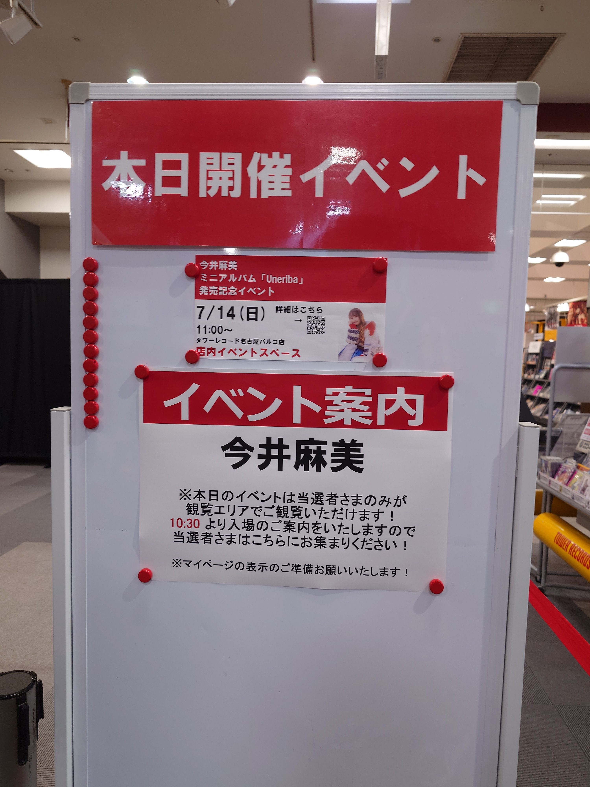

## はじめに

2024年7月13~14日に行われた<strong>今井麻美 ミニアルバム「Uneriba」発売記念ミニライブ＆トークイベント</strong> の大阪と名古屋の回に参加した旅の記録です。

[6月に鳥取に行きました](https://blog.mikuta0407.net/posts/2024/20240627-aurora-tottori_trip_memory_day1/)が、1ヶ月も経たずして再び西日本へ行きました。

## 1日目

### 新幹線

東海道新幹線に乗るなら新横浜が最寄りとなるため、実質的に新横浜駅がスタート地点です。

とりあえずお茶と2個くらいのお菓子(おしゃぶり昆布くらい)を買ってホームに上がると、これが目に入ってしまいました。


発車までまだ時間があったので、入線してきたら買うか、といった気持ちで待ちます。

ぼんやり待っていると、のぞみ303号が無事入線してきました。ポッピングシャワーを買って乗車です。

<blockquote class="twitter-tweet"><p lang="ja" dir="ltr">旅のスタートです <a href="https://t.co/MXvPQaoewH">pic.twitter.com/MXvPQaoewH</a></p>&mdash; たっくん (@mikuta0407) <a href="https://twitter.com/mikuta0407/status/1811901880362209665?ref_src=twsrc%5Etfw">July 12, 2024</a></blockquote> <script async src="https://platform.twitter.com/widgets.js" charset="utf-8"></script>

美味しく頂いたあと、買ったお菓子でも食べながら、ダウンロードしておいた動画でも見ようかと思っていましたが、あまりにも眠くなってきたので爆睡しました。一応名古屋で一瞬起きたのは覚えています。

京都で目が覚めましたが、本当に特にツイートすることもなく、上のアイスのツイートの次がこれでした。

<blockquote class="twitter-tweet"><p lang="zxx" dir="ltr"><a href="https://t.co/VXWstsmLb5">pic.twitter.com/VXWstsmLb5</a></p>&mdash; たっくん (@mikuta0407) <a href="https://twitter.com/mikuta0407/status/1811934773100838945?ref_src=twsrc%5Etfw">July 13, 2024</a></blockquote> <script async src="https://platform.twitter.com/widgets.js" charset="utf-8"></script>

### なんばの地へ

新幹線を降りて、御堂筋線でなんば駅へ向かいます。


連休初日ということもあってか、かなり混んでいました。潰されない程度の混雑。

<blockquote class="twitter-tweet"><p lang="zxx" dir="ltr"><a href="https://t.co/rq1QnScour">pic.twitter.com/rq1QnScour</a></p>&mdash; たっくん (@mikuta0407) <a href="https://twitter.com/mikuta0407/status/1811944184124961026?ref_src=twsrc%5Etfw">July 13, 2024</a></blockquote> <script async src="https://platform.twitter.com/widgets.js" charset="utf-8"></script>

無事に着きました。

リリイベの集合が12:30、なんば駅に着いたのが11時過ぎなので、約1時間半ほどあります。とはいえ10時を超えて店も開き始める時間なので、日本橋オタロード方面へ向かい、適当に店を回ってみることにしました。

なんば駅から日本橋オタロードへは10分少し歩く必要があるので、とりあえず移動を開始します。

### 初のアケマス

歩いている最中に、[ツアマスのロケテスト](https://bandainamco-am.co.jp/am/vg/idolmaster-tours/secondlocationtest/)のことを思い出します。

ちょうど11日から15日がnamco大阪日本橋店での開催でした。10時より前に整理券の配布があるので参加はできませんが、筐体はひと目見てみようということで、道中にあるnamco大阪日本橋店に寄ってみました。無事に筐体に出会う事ができてよかったです。

<blockquote class="twitter-tweet"><p lang="ja" dir="ltr">うおぉーツアマスだ(整理券はないので見に来ただけ) <a href="https://t.co/kDitPjg5h8">pic.twitter.com/kDitPjg5h8</a></p>&mdash; たっくん (@mikuta0407) <a href="https://twitter.com/mikuta0407/status/1811947230708007034?ref_src=twsrc%5Etfw">July 13, 2024</a></blockquote> <script async src="https://platform.twitter.com/widgets.js" charset="utf-8"></script>

namco大阪日本橋といえば、アケマスが設置されている場所でもあります。僕自身、中野のnamcoにはいったことがなく、アケマスは未体験でした。せっかく時間もありましたし、遊んでいる人もいなかったので、ここで初のアケマスプレイをしてみることに。

うおおアケマスですよ、アケマス!


<details>
<summary>アケマスのプレイ画像はここに折りたたみで入れました。クリック/タップで展開</summary>

感動のスタート  


社長!  


まぁ、千早を選びますよね。  


初手でこれ、さすがですね。  


一応は信頼を得られるっぽい。  


すみませんでした……  


すみませんでした……2  


すみませんでした……3  


あっ良かったです。17年後にオケコンで歌われますよ。


レッスン2回の後、無事にオーディション合格しました。  


</details>

1プレイして、念願のアケマスのカードをゲットしました。嬉しいですね。ユニットカードの方はもうちょっとタイミング選べばよかったような、これで良かったような。  


右側の筐体は素晴らしいメッセージとともに置かれていました。


2005年のアーケードゲームと、2024年の新作のロケテスト広告の並び、すごい。  


1Fのアイマスショップでミリシタ7thイラストの千早のアクスタも買い、最初期の千早と最新の千早でツーショットしてみました。  


### イベント

アケマスをしたあとはPCコンフルやイオシスを軽く見つつ、会場であるゲーマーズに到着です。


時間になり、列形成が始まり、地下に向かう通路で待機が始まりました。その通路にあるカプセルトイの壁面に[手のひらネットワーク機器２](https://tarlin-capsule.jp/product/377)が販売されていて感動しました。店頭に実際にあるのは初めて見た……。(回しませんでしたが。)


イベント関連の画像は当然無いので、1部と2部の感想を(この記事の趣旨ではないので)簡単にまとめておきます。

- 初のリリイベ、大変に楽しかった
- あの雰囲気は楽しい
- 曲について改めて1曲1曲お話が聴けて嬉しい
- GreigeとUneribaのCD音源ベースの歌唱はAURORAツアーの中であったが、アリウムのCD音源歌唱は初、かつ現実のラプソディは初生歌唱、聴けて嬉しい
- 現実のラプソディ、CDで聴いたときから生歌唱映えしそうだなと思っていたが、やはりめちゃくちゃ良い
- アリウム、良い。
- 自由である
- 2部の開始前がとにかく自由である

リリイベの内容とは別で気になったのが、ミキサーとPCの台でした。

会場の中央列付近の右壁に音楽プロデューサーの濱田さんの場所があり、会場のミキサーやその他の音響機器が固まっているラックと、その上のMacBook Proが置いてありました。  
MacBook ProではLogic Proが立ち上がっていたような覚えがありますが、特に気になったのはMacBook Proからの配線です。白いUSB Type-Cケーブル1本のみが下の方に繋がっていました。  
あの手の音響機器についての知識がなにもないのですが、今ってUSB-PDによる給電とオーディオIFへの接続が1本になってるんですかね? 便利な時代ですね……。  
本当は終演後隣にいらっしゃった濱田さんに聞いてみたいところではありましたが、流石に聞きにくかったのでそのまま退場しました。  
(ちなみに濱田さんが座っていた椅子の足元には、会場備え付けのNTTのONUとBuffaloの家庭用Wi-Fiルータが置いてありました。椅子の足と光ファイバーが近い位置にあり、ちょっとヒヤヒヤするなど。)

<blockquote class="twitter-tweet"><p lang="ja" dir="ltr">楽しいリリイベでした<a href="https://twitter.com/hashtag/Uneriba?src=hash&amp;ref_src=twsrc%5Etfw">#Uneriba</a> <a href="https://t.co/yzYPSU7sSP">pic.twitter.com/yzYPSU7sSP</a></p>&mdash; たっくん (@mikuta0407) <a href="https://twitter.com/mikuta0407/status/1812026402130264289?ref_src=twsrc%5Etfw">July 13, 2024</a></blockquote> <script async src="https://platform.twitter.com/widgets.js" charset="utf-8"></script>  
(このサイン付きCDは持参してきたやつです。)

ゲーマーズ店舗内の新譜コーナーにちゃんとしっかりコーナーがあって嬉しかったですね。

  


### 呑み

終演後は店の前でミン族の方々としばらく歓談し(途中でびっくりすることが起きましたが)、夕飯へ向かうことになりました。

流石に10人が突発で入れる店になかなか出会えず、約1時間ほどなんばの街を彷徨った結果、[肉食堂・肉酒場 1129 ](https://nambacity.com/shopresearch/374)へ入ることになりました。

写真がゼロですが、ハイボールや日本酒の出汁割りがのめて美味しかったです。

### サイン巡り

このまま宿のある名古屋に向かっても良かったのですが、食事中に公式のツイートで麻美さんがアニメイトやソフマップへサインをして回っていることがわかったので、サイン見るために店を巡るグループに参加しました。

アニメイト  
  
上から書き直されている模様  


ソフマップ  


そしてついでにnamco大阪日本橋に戻ってアケマスの筐体に描かれたサイン


なんとリリイベをやったゲーマーズのコーナーにはサインが有りませんでした……。

このあと御堂筋線の途中まで、ご一緒した方々と移動しました。AURORAツアーの話や、ほかにも色々とお話できて楽しかったです。色々聞かせていただけてありがたい限り。

### 大阪→名古屋

本当はひのとりのプレミアムシートで大阪→名古屋をする予定でしたが、時間的な問題(所要時間と発車時刻)で新幹線で向かうことにしました。いつか再チャレンジしたい。

まずは御堂筋線で新大阪へ。  


なんかエスカレーターに誰かの悲しみがありました。  


そして一人で二次会。1時間弱の移動ですし、あとは寝るだけなので。  
  


名古屋からホテルのある金山駅までは中央本線で向かいます。このあたりの雰囲気は普段慣れているJR東日本とは雰囲気が違いますね。やはり別の都市に来たんだなぁ、といった気持ちになります。


金山駅に着きましたが、もう22時を超えているというのにもかかわらず、昼間か?っていうくらい人が多かったです。何事ですか?  
  
  
  

ホテルに移動する道中でいい感じのところがあったので撮りましたが、酔ってるせいか今見ると下手ですね。  


ちなみに、新幹線の途中から、麻美さんが出演されるなりカルというラジオを聞きながら移動していました。  
<blockquote class="twitter-tweet"><p lang="ja" dir="ltr">本日は夜10時から <a href="https://twitter.com/hashtag/%E3%81%AA%E3%82%8A%E3%82%AB%E3%83%AB?src=hash&amp;ref_src=twsrc%5Etfw">#なりカル</a> 放送です！<a href="https://twitter.com/hashtag/%E4%BB%8A%E4%BA%95%E9%BA%BB%E7%BE%8E?src=hash&amp;ref_src=twsrc%5Etfw">#今井麻美</a> さんのスペシャルインタビューありますよー！今夜もよろしくお願いします！（顧問） <a href="https://twitter.com/hashtag/%E3%83%9F%E3%83%B3%E3%82%B4%E3%82%B9?src=hash&amp;ref_src=twsrc%5Etfw">#ミンゴス</a></p>&mdash; なりカル！ (@naricul) <a href="https://twitter.com/naricul/status/1812066262912307449?ref_src=twsrc%5Etfw">July 13, 2024</a></blockquote> <script async src="https://platform.twitter.com/widgets.js" charset="utf-8"></script>

リリイベ中に出た話も出てきて、後夜祭みたいな雰囲気でTLを眺められました。

### 宿へ

金山駅からは線路の都合上若干遠回りでないと行けないので、わかってはいたけど思ったより歩き、無事に東横INN 名古屋金山に到着です。  


22時を超えているのですが、チェックインの列がめちゃくちゃに混んでいてびっくりしました。夕方のチェックインラッシュか?と勘違いするくらい人が多かったです。なんかイベントあったんですかね(調べてない)。

<blockquote class="twitter-tweet"><p lang="ja" dir="ltr">本日のお宿 <a href="https://t.co/sVppg5hK8B">pic.twitter.com/sVppg5hK8B</a></p>&mdash; たっくん (@mikuta0407) <a href="https://twitter.com/mikuta0407/status/1812120803103912355?ref_src=twsrc%5Etfw">July 13, 2024</a></blockquote> <script async src="https://platform.twitter.com/widgets.js" charset="utf-8"></script>

東横INN、実は初めて泊まったんですが、Wi-Fiってどこもこうなんですかね? 部屋ごとにAPが建立されてて驚きました。povo2.0の無制限課金してたので5GHz帯テザリングして足回り確保しましたが……。  


このあとはシャワー入って、適当にテレビにながら日付が変わる前には寝ていました。

## 2日目

### 起床〜会場

朝ご飯はいつもそこまで食べないのに、鳥取と同じく朝食を食べすぎました。人は愚か。


<blockquote class="twitter-tweet"><p lang="ja" dir="ltr">朝飯食いすぎ</p>&mdash; たっくん (@mikuta0407) <a href="https://twitter.com/mikuta0407/status/1812271964008174007?ref_src=twsrc%5Etfw">July 13, 2024</a></blockquote> <script async src="https://platform.twitter.com/widgets.js" charset="utf-8"></script>

金山駅への移動中、思ったより雨に降られてしまいましたが、鳥取のときに比べればなんともありません。  
<blockquote class="twitter-tweet"><p lang="ja" dir="ltr">移動開始 <a href="https://t.co/HB8p3EKuZb">pic.twitter.com/HB8p3EKuZb</a></p>&mdash; たっくん (@mikuta0407) <a href="https://twitter.com/mikuta0407/status/1812284137421910123?ref_src=twsrc%5Etfw">July 14, 2024</a></blockquote> <script async src="https://platform.twitter.com/widgets.js" charset="utf-8"></script>

manacaも買いました。奈良のときにはICOCAを買ったのでその流れです。地域ごとの交通系ICカードを集めていきたいですね。
<blockquote class="twitter-tweet"><p lang="ja" dir="ltr">manaca買った <a href="https://t.co/4KZOYGSWcZ">pic.twitter.com/4KZOYGSWcZ</a></p>&mdash; たっくん (@mikuta0407) <a href="https://twitter.com/mikuta0407/status/1812288634164510986?ref_src=twsrc%5Etfw">July 14, 2024</a></blockquote> <script async src="https://platform.twitter.com/widgets.js" charset="utf-8"></script>


無事にパルコに着きました

<blockquote class="twitter-tweet"><p lang="ja" dir="ltr">湿度がやばすぎるのでパルコの中でもう待機してよう…<br>適当に店を回る… <a href="https://t.co/WrMr3o5YSt">pic.twitter.com/WrMr3o5YSt</a></p>&mdash; たっくん (@mikuta0407) <a href="https://twitter.com/mikuta0407/status/1812290993519198689?ref_src=twsrc%5Etfw">July 14, 2024</a></blockquote> <script async src="https://platform.twitter.com/widgets.js" charset="utf-8"></script>

……が、ここで失敗をします。すぐに会場であるタワーレコードに行けば良いものを、「あまり会場で待つのも良くないのかもしれない」と思ってアニメイトで過ごします。その結果としてリハーサルを見逃しました。悔しい。せっかく開店と同時にパルコに入ったのに。

<blockquote class="twitter-tweet"><p lang="ja" dir="ltr">リハ見れるタイミングで建物いたのに変な待機しないほうがいいかとアニメイトいたの失策</p>&mdash; たっくん (@mikuta0407) <a href="https://twitter.com/mikuta0407/status/1812295577088221475?ref_src=twsrc%5Etfw">July 14, 2024</a></blockquote> <script async src="https://platform.twitter.com/widgets.js" charset="utf-8"></script>

### イベント

会場内を普通に歩く麻美さんを数度目撃してびっくりしながら無事に入場し、1時間のリリイベを楽しみました。スタンディングなので正直疲れはしましたが、大阪よりも近い距離で見ることが出来たり、じゃんけんで最後まで残ったり(負けちゃった)、部分的にお話できたりと、やはり大変に楽しかったです。もう知らない人生には戻れない。

  


### きしめんを食べに

12時過ぎということもあり、ミン族の方々8人で集まってご飯いくことになりました。名古屋在住の方(ふっちーさん)の先導のもと、まずはきしめんを食べに行きます。

地図で見ると思ったより歩きましたね。


道中、中部電力MIRAI TOWERの足元にゴジラがいました。

  


そこまで日差しがなかったのが幸いでしたが、約20分ほど歩き、星が丘製麺所という店に着きました。

美味しいきしめんでした。冷たいやつです。

  
  


### モンブランを食べに

次の目的地はモンブランのお店です。

大須の方まで歩きます。(今考えるとなかなかの距離歩いたな)


<blockquote class="twitter-tweet"><p lang="und" dir="ltr">C#++ <a href="https://t.co/0yQ3PBMVLA">pic.twitter.com/0yQ3PBMVLA</a></p>&mdash; たっくん (@mikuta0407) <a href="https://twitter.com/mikuta0407/status/1812370084486385918?ref_src=twsrc%5Etfw">July 14, 2024</a></blockquote> <script async src="https://platform.twitter.com/widgets.js" charset="utf-8"></script>

途中グループ間ではぐれたりしましたが、無事に店に着きました。

ただ、大きくない店ですぐに8人は無理、ということで16時に予約をしていただき、その間近くに入れる店を求め歩き回りました。

道案内していただきながら、最終的にコメダ珈琲に入ります。蒸し暑さのなかで入店して飲んだアイスコーヒー、美味しかった……。


16時を過ぎ、結構雨が降ってきましたが、本来の目的の店、[栗りん](https://kurin.gensg.jp/)へ到着します。

メニューはこんな感じ。かき氷がすごいと聞いていたのでかき氷を食べる気満々だったのですが、直前のアイスコーヒーと雨で若干冷えたので、通常メニューの"黄金モンブラン"をいただくことにしました。  
  


そしてでてきたものがこちら。もう良くわかんない。すごいの一言です。

<blockquote class="twitter-tweet"><p lang="ja" dir="ltr">ﾜｧ…ﾜｧ…ﾜｧ…!! <a href="https://t.co/6yxsVpwOJP">pic.twitter.com/6yxsVpwOJP</a></p>&mdash; たっくん (@mikuta0407) <a href="https://twitter.com/mikuta0407/status/1812390286053769503?ref_src=twsrc%5Etfw">July 14, 2024</a></blockquote> <script async src="https://platform.twitter.com/widgets.js" charset="utf-8"></script>

<blockquote class="twitter-tweet"><p lang="zxx" dir="ltr"><a href="https://t.co/Ej6DKNCVca">pic.twitter.com/Ej6DKNCVca</a></p>&mdash; たっくん (@mikuta0407) <a href="https://twitter.com/mikuta0407/status/1812390348699939139?ref_src=twsrc%5Etfw">July 14, 2024</a></blockquote> <script async src="https://platform.twitter.com/widgets.js" charset="utf-8"></script>

<blockquote class="twitter-tweet"><p lang="ja" dir="ltr">美味いです <a href="https://t.co/vDEZYWVAlf">pic.twitter.com/vDEZYWVAlf</a></p>&mdash; たっくん (@mikuta0407) <a href="https://twitter.com/mikuta0407/status/1812390647741174142?ref_src=twsrc%5Etfw">July 14, 2024</a></blockquote> <script async src="https://platform.twitter.com/widgets.js" charset="utf-8"></script>

<blockquote class="twitter-tweet"><p lang="ja" dir="ltr">ミンゴス…なんかとんでもないモンブランだよ… <a href="https://t.co/bSDenhgX7P">pic.twitter.com/bSDenhgX7P</a></p>&mdash; たっくん (@mikuta0407) <a href="https://twitter.com/mikuta0407/status/1812393390576992304?ref_src=twsrc%5Etfw">July 14, 2024</a></blockquote> <script async src="https://platform.twitter.com/widgets.js" charset="utf-8"></script>

<blockquote class="twitter-tweet"><p lang="ja" dir="ltr">一人で行ってたらこんな店来ないって</p>&mdash; たっくん (@mikuta0407) <a href="https://twitter.com/mikuta0407/status/1812391149866483945?ref_src=twsrc%5Etfw">July 14, 2024</a></blockquote> <script async src="https://platform.twitter.com/widgets.js" charset="utf-8"></script>

もう一度行きたい。ちなみにどうやら東京にもあるらしいです。

### 帰路

大須の「金の玉」を見たりしながら、
<blockquote class="twitter-tweet"><p lang="zxx" dir="ltr"><a href="https://t.co/Vmjbajuq2l">pic.twitter.com/Vmjbajuq2l</a></p>&mdash; たっくん (@mikuta0407) <a href="https://twitter.com/mikuta0407/status/1812405403398918382?ref_src=twsrc%5Etfw">July 14, 2024</a></blockquote> <script async src="https://platform.twitter.com/widgets.js" charset="utf-8"></script>

ふっちーさんの運転で名古屋駅まで送っていただきました。アルトワークス、いい車。

帰りは奈良の旅のときもやりましたが、勢いでグリーン車課金です。

<blockquote class="twitter-tweet"><p lang="ja" dir="ltr">楽しかったリリイベの2日間でした<br>最後はグリーン車突っ込んでみましたが、こういうことをするから金が貯まらない。 <a href="https://t.co/PTaJhCOtjV">pic.twitter.com/PTaJhCOtjV</a></p>&mdash; たっくん (@mikuta0407) <a href="https://twitter.com/mikuta0407/status/1812418879454650513?ref_src=twsrc%5Etfw">July 14, 2024</a></blockquote> <script async src="https://platform.twitter.com/widgets.js" charset="utf-8"></script>

まぁ、呑みますよね。

<blockquote class="twitter-tweet"><p lang="zxx" dir="ltr"><a href="https://t.co/FjUrZlmI8U">pic.twitter.com/FjUrZlmI8U</a></p>&mdash; たっくん (@mikuta0407) <a href="https://twitter.com/mikuta0407/status/1812419713806598267?ref_src=twsrc%5Etfw">July 14, 2024</a></blockquote> <script async src="https://platform.twitter.com/widgets.js" charset="utf-8"></script>

このあと車内で22ツイートしてます。

<blockquote class="twitter-tweet"><p lang="ja" dir="ltr">if is酔い &amp;&amp; !眠い {<br> 饒舌 = true<br>}<br>の実感</p>&mdash; たっくん (@mikuta0407) <a href="https://twitter.com/mikuta0407/status/1812427370575573155?ref_src=twsrc%5Etfw">July 14, 2024</a></blockquote> <script async src="https://platform.twitter.com/widgets.js" charset="utf-8"></script>

↑これ、今考えると変数宣言がクソですね。

```go
if is酔い && is眠い {
    is饒舌 = true
}
```

これでいい。

あとは、新幹線内のモバイルネットワークの辛さによって、QUICの使用を体感できて面白かったです。

<blockquote class="twitter-tweet"><p lang="ja" dir="ltr">おーQUIC <a href="https://t.co/gHeym2aak8">pic.twitter.com/gHeym2aak8</a></p>&mdash; たっくん (@mikuta0407) <a href="https://twitter.com/mikuta0407/status/1812431571858952362?ref_src=twsrc%5Etfw">July 14, 2024</a></blockquote> <script async src="https://platform.twitter.com/widgets.js" charset="utf-8"></script>

2日を振り返りながら話を思い出したり。

<blockquote class="twitter-tweet"><p lang="ja" dir="ltr">昨日AURORAの話をして、上野公演でのrinascita1話だけで使われて、朗読2話に合わない理由についてものすごい納得のいく解釈を得たの良かったな<br><br>あの物語においてあの歌詞はアリストフェアリーとして地球への扉に向かうアネシスの決意の歌という解釈、腑に落ちすぎている。</p>&mdash; たっくん (@mikuta0407) <a href="https://twitter.com/mikuta0407/status/1812435553985642760?ref_src=twsrc%5Etfw">July 14, 2024</a></blockquote> <script async src="https://platform.twitter.com/widgets.js" charset="utf-8"></script>

### 帰宅

帰宅後は詩趣ミンゴスの出演の配信だったり、もとラジを聴いたり、また詩趣ミンゴスの出演の配信があったり、[繪ほんの中には 第94回](https://www.youtube.com/watch?v=qsMtN4lelVU)を聞いて怖くなったりと忙しい就寝前の時間を過ごしながら、無事に2日のリリイベの旅を終えました。

## 〆

アケマス、リリイベ2回、呑み、サイン巡り、名古屋への移動、リリイベ、きしめん、モンブランとめちゃくちゃ濃密な2日間でした。

こんなに色んなところ行ったり食べたり話したりする人生になるとは思ってなかったですが、また次の機会も楽しみです。

<blockquote class="twitter-tweet"><p lang="ja" dir="ltr">正直なところ職場や中高大の人たち以外でこんなにたくさん話す人ができるなんて思わんかったのよな去年まで</p>&mdash; たっくん (@mikuta0407) <a href="https://twitter.com/mikuta0407/status/1812098920950145422?ref_src=twsrc%5Etfw">July 13, 2024</a></blockquote> <script async src="https://platform.twitter.com/widgets.js" charset="utf-8"></script>

次に遠征があるとすれば、8/24の[961 PRODUCTION presents 『Re:FLAME』](https://idolmaster-official.jp/live_event/re/) のDay1公演ですね。当たってくれ。25日に東京のイベントもあるので日帰り京都ですが。

今回も楽しいイベント遠征でした!

## その他

今回、7/8に届いたXperia 10 Ⅵをメインに使う旅でした。(カメラとPASMOはXperia 5 Ⅴ。)

単純に10系のほうがバッテリーが持つのでそうしていたのですが、バッテリーの持ち方がかなり化け物でした。1日目、朝7時くらいから使い始め、日中もまぁまぁそれなりに使い、夜22時になってまだ36%も残っています。すごい。

<blockquote class="twitter-tweet"><p lang="ja" dir="ltr">Xperia10Ⅵ、バッテリーの持ち方がバケモン<br><br>1日割りとかなりガッツリ使ってモバブいらん <a href="https://t.co/sakRna0K4a">pic.twitter.com/sakRna0K4a</a></p>&mdash; たっくん (@mikuta0407) <a href="https://twitter.com/mikuta0407/status/1812111049480651017?ref_src=twsrc%5Etfw">July 13, 2024</a></blockquote> <script async src="https://platform.twitter.com/widgets.js" charset="utf-8"></script>

また、Snapdragon 695(Xperia 10 Ⅳ)は「普通に使えるけど"ミドルだなぁ"という感触が残る速度」でしたが、Snapdragon 6 Gen 1は「ゲームしないなら十分でしょこれ」となる速度です。もともとAQUOS sense 8の評判でSD6Gen1がかなり良さそうなことは知っていましたが、実際使うとこんな良いもんなんですね。

軽さや端末の値段もあって5Ⅴより気軽に使えるので、今はPASMOを移管しようか悩んでいます。
