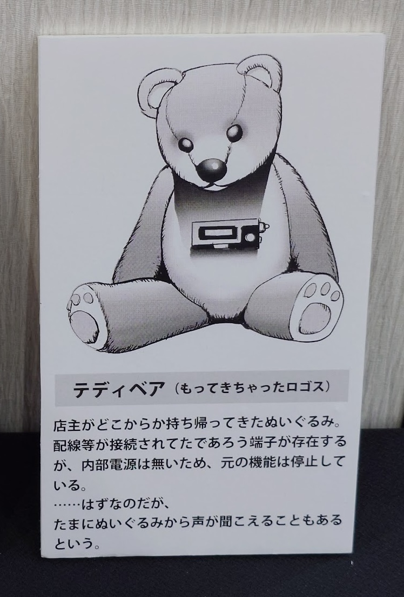

2024年9月13日~14日に開催された朗読ショウ「パレード・ホライゾン」に行ってきました。

どんな内容か…という話は割愛し、備忘録的に、各話の感想を書き出しておきます。

レポにするとか、ちゃんとした感想文にするとかではなく、感情を忘れないように置いておくような記事です。

最近しずかなインターネットも始めたのですが、まぁこっちでいいでしょう。

<blockquote class="twitter-tweet">
📣朗読ショウ「パレード・ホライゾン」まとめ📣  「“いわく”から始まる不思議なストーリー」  をコンセプトとして 選りすぐりの怪奇譚を豪華俳優陣と 豪華脚本家陣にてお届けする  ＜虚構と現実＞が入り乱れる新体験朗読ショウ！ それが……  👻朗読ショウ「パレード・ホライゾン」🧟… <a href="https://t.co/qKmqqP00Jp">pic.twitter.com/qKmqqP00Jp</a>
&mdash; パレード・ホライゾン-PARADE HORIZONS- (@PARADE_HORIZONS) <a href="https://twitter.com/PARADE_HORIZONS/status/1823269236871237769?ref_src=twsrc%5Etfw">August 13, 2024</a></blockquote> 

<blockquote class="twitter-tweet">
🎟️プレイガイド先行(抽選）２次🎫  引き続きプレイガイド先行(抽選）２次🎫 の受付は行われております！👻  お申し込みがまだだよ！という方🙋 初めて#パレードホライゾン を知った方🙋‍♀️  是非、＜虚構と現実＞が入り乱れる♻️ 新体験朗読イベント🎭へお越しください…！… <a href="https://t.co/KMF1BNmP6C">pic.twitter.com/KMF1BNmP6C</a>
&mdash; パレード・ホライゾン-PARADE HORIZONS- (@PARADE_HORIZONS) <a href="https://twitter.com/PARADE_HORIZONS/status/1821063825950724403?ref_src=twsrc%5Etfw">August 7, 2024</a></blockquote> 

この1枚目の内容の通り、怖い話も笑える話も感動する話もある、すこしふしぎな世界でした。

記憶が薄れないうちに、箇条書きで感想を書いておきます。抜けまくっている気もします。

## 呪いの◯◯◯ビデオ

- 途中で気づく、◯◯◯の内容
- 良いんだけど、良いんだけども、本当にこれで良かったんですか? まぁ良いのか。
- 田丸役の山本さんの演技がめちゃくちゃ良い
- 感想の語り合いが最も難しい話である
- 高山田の結末について議論
  - 良かったシーンは言ってるので、実は死んでないのでは? (というか死んでないってアフタートークで言っちゃった)
  - 死んでないと仮定すれば、あのシーンによって呪いは解除されていて、荒羽木は単純に「電話に出なかった」とかで勘違いしてしまった?
    - この場合、最後の店のシーンは高山田が普通に買いに来た
  - 死んでいると仮定すると、高山田はあの開示ではだめだった(良かったとは言ってるが、というやつ)
    - 高山田はあの呪いのシーンを実は見ていないのでは?
    - 荒羽木は呪いのシーンについて話しているものの、一緒に見ているシーンで高山田は番組についてしか話していない。
    - つまり高山田は既に何かが起きていた?
    - 最後に出てくる店のシーンはテープの中とかに取り込まれてしまった高山田的な…?
- それとは別に、今井麻美さんのキャラが良かった
  - 「名字で呼んでください」「鈴木くん」のあとの「はい。」がめちゃくちゃ好きです。
  - 特に千秋楽では「やりやがったぞ」というレベルのアドリブ。いいぞ。あれこそアドリブなんですよ。(何目線?)
- 野暮なことにツッコミを入れると…
  - 福利厚生で連休に有給?

## そして惨劇は怒らない
- BANBANBAN山本さんがハマり役すぎる
- 初回を見て「これは全力で笑って良いところだ」とわかった
- ナイフと斧と強アルカリ性の薬品、なんで3人も需要があるんだよ
- 霊能師の女の演技が毎回結構変わって面白かった
- サイコな男の演技も毎回違って面白かった
- 全く話聞いてなかった感じの荒羽木、呪いの◯◯◯ビデオでは有能だったのにどうした。呪われました?

## 大鏡
- 初回のとき
  - 依存の話で病んでいく話なのかなとは思ったが、思っていたより怖かった
  - みきの動機が優しい子過ぎる
  - レオンによって本当の会話を見せられたときにゾワッとした
    - 麻美さんの恐ろしい演技も……
    - 嘘だ!!!の叫びが、良いです。
  - スカートの血についてみきは実際には反応していたのだろうか
  - 殴っていたと思ったら実際は刺していたの怖すぎる
  - 三上が可哀想で可哀想で
  - 血まみれメアリーの演技が狂気過ぎて良い
  - 2人取り込まれたあと、ずっと存在を確認し合っているのが怖い
  - 星のブランコの捉え方が変わってしまいました。
    - はんげつであえたらのキミチャンネルみたいな……
- 2回目
  - 鏡に向かうまでのシーンを見る段階で辛くて辛くて
  - 物語で2回目を見るときに最初からここまで辛い気持ちになったのは初めてかも知れない
    - 救いがないから……

## コトリバコ7
- レオンについてよく知ることが出来たので2日目の大鏡の理解が深まった。初回の大鏡ではレオンが謎すぎたので。
- 大鏡とともに救いがない
- レオン、根はいい子なんだろうなぁ
- 映像内のブブカ・咲の叫びシーンの声が結構好きです。
- 2回目ではブブカ・咲の一つ一つの叫び方が牙抜かれた状態で恐怖で声出てる感じになってて面白かった
- ユキは風呂出た後見ていたんだろうな……お母さんが刺されるところを……
- ジョンはどこにいたんだ? 事件後どっかいって、警察の捜査が終わった後戻ってきた?
- 屋根裏にたくさんある霊…入居初日に屋根裏を見つけてしまうユキ……
- 怖くてストーリーについて考えくなくなってきたので終わります。

## 終幕のデイジー
- コンチについてしっかり触れられると思ってなくてびっくりした
- ヒナギクの演技がめちゃくちゃに良いです。ばあちゃんと呼ばれるくらいの"現実世界の"人だけど見た目は若い、という部分が完璧に表現されている
  - ひまわり畑のシーンの破壊力ですよ
- コンチかわいい
- 外道屋が電話している相手は誰だ? ロゴスか?
  - 最後の方のシーンで現実世界に外道屋がいるし、ロゴスが存在する空間にも外道屋がいるので、ロゴスと外道屋は内通が可能なはず
  - 「最果てか」「連れて行くのもありかも」といった台詞があるので、外道屋は仮想現実であることを認知している
- コンチが仮想現実内で「腐れ外道」の妖怪と表現している人物と、ロゴスの空間でも同一人物として接しているので、度々現れる"不審者"と、ミナモが消えるシーンにあらわれている人物と、コンチを迎えに来ている外道屋のは同一人物と考えて良さそう。
- Ten Little Indiansが使われる意味を理解したときの恐ろしさですよ、恐ろしさ。
  - 原案の方の「[最後の最後に流れたのは何故なのか？](https://x.com/KO_1LOW/status/1835700654368801210)」についてはまだ理解しきれてないです。
- 2日目の「コンチ 負けないで…」の聞こえ方解釈について考えています。
- タロウは本当にタロウという名前だったのか?
  - どうしてヒナギクは仮想現実には存在していないタロウの写真(だっけ?)を仮想現実に持ち込めたのか。
  - コンチはタロウの姿に化けることが出来たので、タロウの姿がわかるものを最後のロットの仮想現実に持ち込めているのは事実のはず。
- なんでコンチは現実世界にこれた?
  - 21gの質量を持った変異種と表現されていた
  - 途中に挟まった、"最終ロットに向かう前の空間"と思われるシーンにおいて、別の仮想現実にいたっぽいきつねの男の子をヒナギクが別の世界に連れて行ったことで、現実世界を経由したから、現実世界側に存在ができるようになってしまった?
- 語彙力がないのですが、ヒナギクとコンチの最後の別れに関してはあまりにも良すぎるんです。みんな見てほしかった。
- Moon Riverの最中のコンチとヒナギク、感情を破壊してくる……
- あとロゴスと分かれる前後のあたりでIRODORIのピアノアレンジが入っていることに気づいたときの鳥肌はすごかったです。この世はイロドリ溢れる。それを、まだ見るべきものがたくさんあるコンチに対しても語っているようで……
- 結局のところ…
  - こうやってコンチと外道屋が出会い、過去に戻って、前述の4つのお話を含めた現代の話があり、そこから物凄い時が経過して、人類が滅ぶという話なんですよね?
  - 他の4つの話が終幕のデイジーというめちゃくちゃでかい話の上に乗ってるように感じるようになっており……
  - うまく言葉にできない
- ロゴス
  - ロゴス、ロゴスがね、ロゴスなんです(?)
  - まぁ、麻美さんのファンなのでここが長くなりますね。
  - 最初の公演で、麻美さんが「ロゴスの気持ちで見ていた」と仰っていましたが、2回目以降見ていると、麻美さんはずっと表情で、"仮想現実にいる、愛するヒナギクと、自らが生み出してヒナギクとともに育てているコンチをずっと見ているロゴス"の演技をされているんです。子供たちが楽しそうに話しているところや、ヒナギクとコンチが楽しそうに話しているところでは物凄い優しい笑顔で見守り、ヒナギクが苦しそうなところでは胸に手を当てて辛そうな表情になり、虹の話になるとゆっくり遠くを見る。助けてください。
  - Moon Riverもとんでもないです。
    - これを歌ってほしいことがオファーのきっかけだったと話されていましたが、天才ですね。
    - 麻美さんが英詩を歌うということも美しくて素晴らしいのですが、それ以上に歌詞の内容が、既に旅立ったロゴスとして歌唱していると捉えると、感情の破壊力がすごいです。先に虹の向こうで待っているんですね…ロゴスは…
    - 旅立った先でヒナギクとロゴスは幸せになってほしい。
  - ロゴスがシャットダウンするシーンのあとにヒナギクが改めてロゴスに感謝するシーンで、「ありがとう、ロゴス」に対し、こちらが浄化されて消滅しそうなくらいの慈愛に満ちた笑顔で頷くんです。
    - もっといえば、3回目のときは比較的大きめに頷き、4回目は「お疲れ様でした」と言わんばかりの雰囲気で小さく頷くんです。すごいですね。
  - そして3回目の公演ではそのまま始まるMoeMiさんのエンディング曲「いのちのいろ」の最初の部分を(声無しで)一緒に歌ってるのです。もうね、だめです。ロゴス……
- 特典のミュージックカードのアートワークがロゴスなのなんか怖いです。
- もってきちゃったロゴスってなんだよ 外道屋よ、ロゴスをそんな気軽に持ってくるんじゃない。
  - ……たまに聞こえる声ってロゴスの声なのかな……
  - 

## 曲について

うまいこと解釈しきれていないのが、IRODORIの歌詞です。

まずはパンフレットにも記載されている謎の言葉。気づいたらまた書きます。

後は最後。「パレットのど真ん中 鮮やかな色たちが まるでオブジェのように無機質に笑いかけてる」

明るい歌い方や曲調、鮮やかな色たちという言葉に対して、「まるでオブジェのように無機質に笑いかけてる」という言葉に繋がることが合わなすぎてこわいんです。

これ以上頭が回ってないのでだれか解釈の手助けをしてほしいです……

## 〆
素晴らしい作品に出会うことが出来ました。本当に素晴らしい公演でした。あの雰囲気は生でしか感じられないので、再演も期待したいくらいです。

考察や感想について、なにか思いついたらまた追記します。
