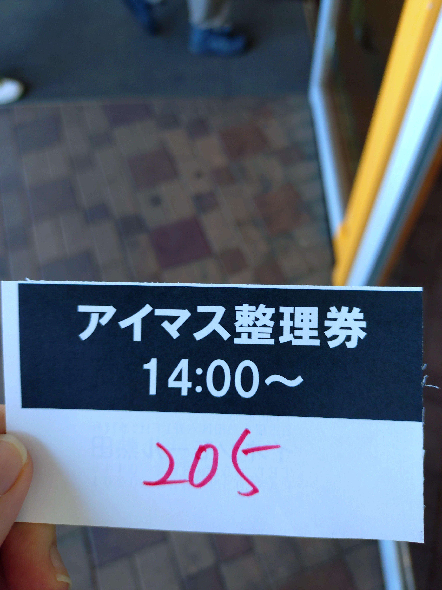
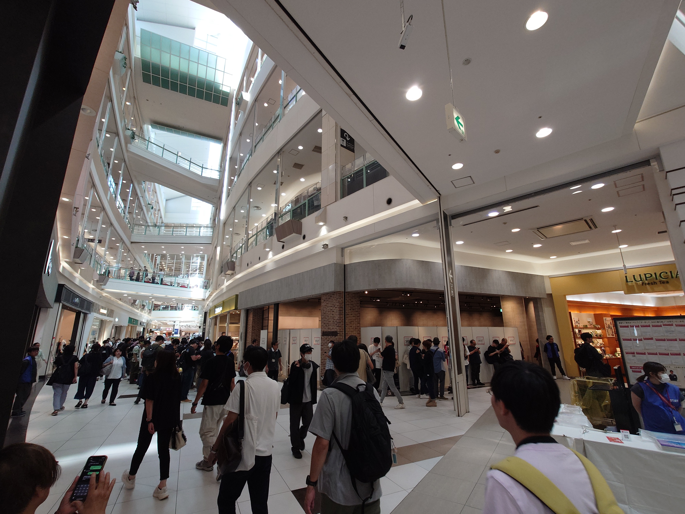
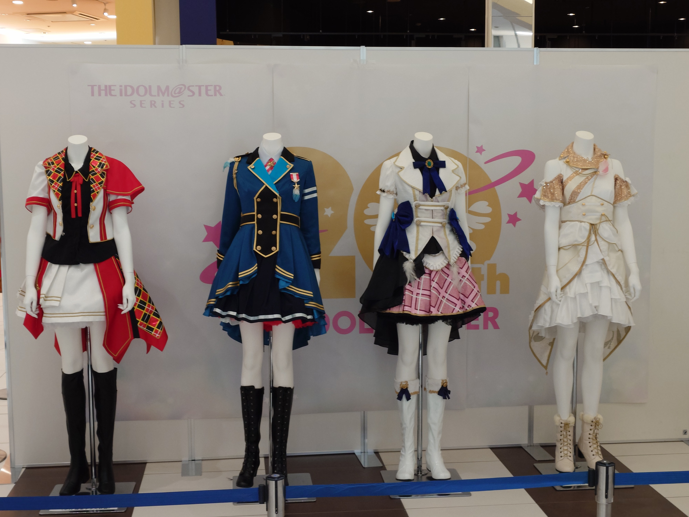

本記事は写真(画像)を大量に含みます。ご注意ください。

## はじめに

2024年9月23日に開催された<strong>[『アイマス、アイに行きマス！ in 熱田』](https://idolmaster-official.jp/news/01_12733)</strong>に参加した旅の記録です。

中村繪里子さんが登壇されるということで、弾丸日帰り名古屋の旅を決行し、どうにかトークイベントを見ることができた旅でした。

あまり旅の記録として書くことは多くないのでブログとして残すか悩んだのですが、あくまでも自分の記録としてなので、他よりあっさりめですが書き残しておきます。

## 不安の中の出発

このイベント、いろいろな方が書かれているのであまり触れませんが、相当の人数が押し寄せたため、色々混乱があるうイベントでした。朝の段階で相当の人数が並んでいる情報が流れてきたりと、見ることが叶うのかわからない状態だったので、「行ってみてだめだったらそれもまた思い出」というかなりハードルを下げた気持ちで向かうことに。

<blockquote class="twitter-tweet">
さて、TLを見ると明らかに無理そうですが立ち見を期待して名古屋に行こうと思います <a href="https://t.co/OlnHFeuME3">pic.twitter.com/OlnHFeuME3</a>
&mdash; たっくん (@mikuta0407) <a href="https://twitter.com/mikuta0407/status/1837976683162603737?ref_src=twsrc%5Etfw">September 22, 2024</a></blockquote> 

<blockquote class="twitter-tweet">
正直交通費を無駄にする覚悟だな。
&mdash; たっくん (@mikuta0407) <a href="https://twitter.com/mikuta0407/status/1837977255047581794?ref_src=twsrc%5Etfw">September 22, 2024</a></blockquote> 

<blockquote class="twitter-tweet">
2部ならちょい期待できるかな…どうだろう…
&mdash; たっくん (@mikuta0407) <a href="https://twitter.com/mikuta0407/status/1837977599110533455?ref_src=twsrc%5Etfw">September 22, 2024</a></blockquote> 

<blockquote class="twitter-tweet">
まぁ、こういう経験も楽しいか。
&mdash; たっくん (@mikuta0407) <a href="https://twitter.com/mikuta0407/status/1837985753961496583?ref_src=twsrc%5Etfw">September 22, 2024</a></blockquote> 

そんな中、立ち見すら待機列ができているという情報を得て、完全に諦めモードに。

<blockquote class="twitter-tweet">
立ち見待機列生まれてるの終わりでは…
&mdash; たっくん (@mikuta0407) <a href="https://twitter.com/mikuta0407/status/1837998795990389084?ref_src=twsrc%5Etfw">September 22, 2024</a></blockquote> 

## 2ヶ月ぶりの金山駅

見られるかわからん、という状況の中、とりあえず電車を乗り継いで最寄り駅である金山駅に到着です。

<blockquote class="twitter-tweet">
まさか2ヶ月後に同じ地に来るとは思ってませんでした。 <a href="https://t.co/nw2nO5paHN">https://t.co/nw2nO5paHN</a> <a href="https://t.co/DT74eRAsLr">pic.twitter.com/DT74eRAsLr</a>
&mdash; たっくん (@mikuta0407) <a href="https://twitter.com/mikuta0407/status/1838005137547387172?ref_src=twsrc%5Etfw">September 22, 2024</a></blockquote> 

金山駅は[Uneribaのリリースイベント](https://blog.mikuta0407.net/posts/2024/20240715-uneriba-release-event_trip_memory/)の際の宿の場所で、まさか2ヶ月後にもう一度来ることになるとは思わず面白かったです。

## とりあえず現地着

とりあえず快晴の中、イベント開催地であるイオンモール熱田に到着です。
<blockquote class="twitter-tweet">
おそようございます <a href="https://t.co/iI0JANbbdj">pic.twitter.com/iI0JANbbdj</a>
&mdash; たっくん (@mikuta0407) <a href="https://twitter.com/mikuta0407/status/1838008048780275855?ref_src=twsrc%5Etfw">September 23, 2024</a></blockquote> 

完全にアイマスPの頭で来ているので、こんな発言も出ています。

<blockquote class="twitter-tweet">
屋上プロデューサー <a href="https://t.co/Lu47LI01zg">pic.twitter.com/Lu47LI01zg</a>
&mdash; たっくん (@mikuta0407) <a href="https://twitter.com/mikuta0407/status/1838008834448900237?ref_src=twsrc%5Etfw">September 23, 2024</a></blockquote> 

## 整理券入手

アナウンス周りのゴタゴタはあえて触れませんが、列形成時間までの間、20thの展示が部分的に開放されていたので見ていました。

<blockquote class="twitter-tweet">
TLで見た光景だ <a href="https://t.co/wW3TCAFTKq">pic.twitter.com/wW3TCAFTKq</a>
&mdash; たっくん (@mikuta0407) <a href="https://twitter.com/mikuta0407/status/1838009269415039421?ref_src=twsrc%5Etfw">September 23, 2024</a></blockquote> 

その後繪里子さんのファンの方々とも合流しつつ、待機列関連で本当に、本当にとにかく諸々色々ろありつつ……危険なこともありつつ……

どうにか2部の立ち見の整理券を入手します。

見れないかと思いながら新幹線に乗っていたので、もう言うことはありません。本当に良かった。

## サインを見る

落ち着いたので展示をもう一度見に行くと、なんと繪里子さんのサインが。嬉しい言葉が書かれていますね。

<blockquote class="twitter-tweet">
繪里子さんのサインです <a href="https://t.co/pIeqOpgz08">pic.twitter.com/pIeqOpgz08</a>
&mdash; たっくん (@mikuta0407) <a href="https://twitter.com/mikuta0407/status/1838022198038323309?ref_src=twsrc%5Etfw">September 23, 2024</a></blockquote> 

## 少し時間を潰す

ガチャガチャのコーナーがあったので眺めたり、スタバがあったので入ったり。1部が始まるまでの時間をほどほどに過ごしました。

金山駅に着いてから一切座っていなかったので、座ってゆっくりできたことが結構助かりました。

<blockquote class="twitter-tweet">
スタバに来てみました。座れてお得 <a href="https://t.co/zKw63XFza4">pic.twitter.com/zKw63XFza4</a>
&mdash; たっくん (@mikuta0407) <a href="https://twitter.com/mikuta0407/status/1838031060602634629?ref_src=twsrc%5Etfw">September 23, 2024</a></blockquote> 

スタバでは持ってきていたCF-RZ4で[コミケの原稿](https://swsd.booth.pm/items/6436728)を進めたり。

<blockquote class="twitter-tweet">
スタバレッツ  RZ4いいんだけどやっぱりRZ8欲しくなるなぁ <a href="https://t.co/sEqEY5XjzD">pic.twitter.com/sEqEY5XjzD</a>
&mdash; たっくん (@mikuta0407) <a href="https://twitter.com/mikuta0407/status/1838040142268997935?ref_src=twsrc%5Etfw">September 23, 2024</a></blockquote> 

ガチャガチャコーナーでお迎えした子を開封したり。

<blockquote class="twitter-tweet">
ところでとても可愛かったのでお迎えしてみました <a href="https://t.co/8EzCQ5gIfY">pic.twitter.com/8EzCQ5gIfY</a>
&mdash; たっくん (@mikuta0407) <a href="https://twitter.com/mikuta0407/status/1838041693578563738?ref_src=twsrc%5Etfw">September 23, 2024</a></blockquote> 

ノベルティ配布等もあったので、あまり長居はしませんでしたが、ほどほどに休むことができました。

## 1部の音漏れを楽しんでみる

一応、音漏れ勢として1部を聞いてみようとしてみます。

が、壁や諸々であまり声がちゃんと聞こえず。仕方ない。そんな中でも関根瞳さんの濁音は貫通してきました。

<blockquote class="twitter-tweet">
すごい濁音が聞こえる<a href="https://twitter.com/hashtag/%E3%82%A2%E3%82%A4%E3%81%AB%E8%A1%8C%E3%81%8D%E3%83%9E%E3%82%B9%E7%86%B1%E7%94%B0?src=hash&amp;ref_src=twsrc%5Etfw">#アイに行きマス熱田</a>
&mdash; たっくん (@mikuta0407) <a href="https://twitter.com/mikuta0407/status/1838059909558001778?ref_src=twsrc%5Etfw">September 23, 2024</a></blockquote> 

とりあえず聞こえないながらにボーっとしながら、展示等を追加で見ていきます。

## 2部立ち見

2部立ち見はうまいこと入場でき、前から4列目になりました。ありがたい。繪里子さんが見られる。

とはいえ肩がけにRZ4を入れた状態で立ちっぱなしで動いたりしてるせいで、徐々に肩が死に始めてきます。自分が情けない。

<blockquote class="twitter-tweet">
肩がけにちょっと詰め込んでるせいで肩が死に始めてきた 軟弱
&mdash; たっくん (@mikuta0407) <a href="https://twitter.com/mikuta0407/status/1838068967581364293?ref_src=twsrc%5Etfw">September 23, 2024</a></blockquote> 

<blockquote class="twitter-tweet">
足が終わり始めてきたので、観光したかったけどトークショー終わったら帰ります… またきしめん食べに来たいな…
&mdash; たっくん (@mikuta0407) <a href="https://twitter.com/mikuta0407/status/1838077935028511068?ref_src=twsrc%5Etfw">September 23, 2024</a></blockquote> 

無事にトークイベントを見ることができて、本当に良かった。

<blockquote class="twitter-tweet">
いいトークイベントだった 踵が死んでる
&mdash; たっくん (@mikuta0407) <a href="https://twitter.com/mikuta0407/status/1838094989672538384?ref_src=twsrc%5Etfw">September 23, 2024</a></blockquote> 

## ひつまぶし

繪里子さんファンの方々との食事会は体力的に辞退してしまったのですが、待機していたりしている間に名古屋駅のエスカという商業施設でご飯が食べられるという情報を教えていただいたので、行ってみることに。

<blockquote class="twitter-tweet">
アラート鳴りそうな名前だな <a href="https://t.co/Xfl2YOTFOH">pic.twitter.com/Xfl2YOTFOH</a>
&mdash; たっくん (@mikuta0407) <a href="https://twitter.com/mikuta0407/status/1838106075196985356?ref_src=twsrc%5Etfw">September 23, 2024</a></blockquote> 

一通り店を眺めてみて、名古屋らしいご飯で悩んだ結果……

<blockquote class="twitter-tweet">
ひつまぶしですよ！ ひつまぶし <a href="https://t.co/SXMQVRplqS">pic.twitter.com/SXMQVRplqS</a>
&mdash; たっくん (@mikuta0407) <a href="https://twitter.com/mikuta0407/status/1838115965906854151?ref_src=twsrc%5Etfw">September 23, 2024</a></blockquote> 

行っちゃいました。ひつまぶし。最高に美味しかったです。

## 〆

軽装で、移動時間だけで見れば家から幕張行くのと大差ない時間で名古屋まで行って、トークイベント見てひつまぶしを食べて帰る。とても充実した1日でした。流石にかかった費用はそれなりですが、こういった経験も楽しいですね。アイマス20thの施策の初回にも立ち会うことができて嬉しかったです。

アイマス20thも楽しんでいくぞぉ〜
