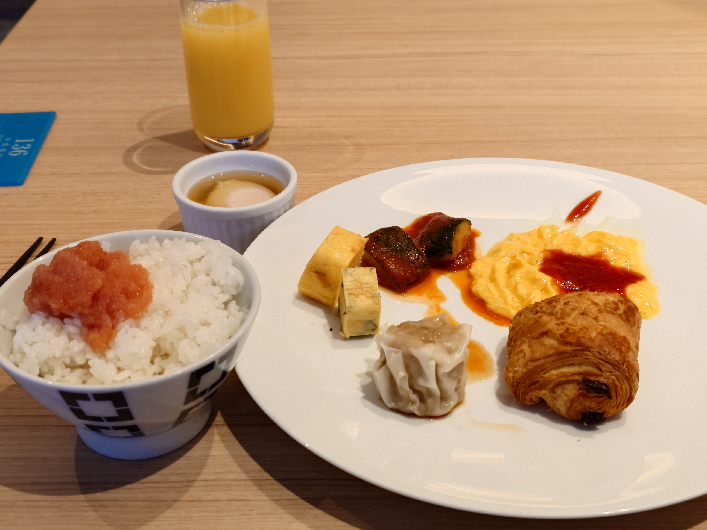
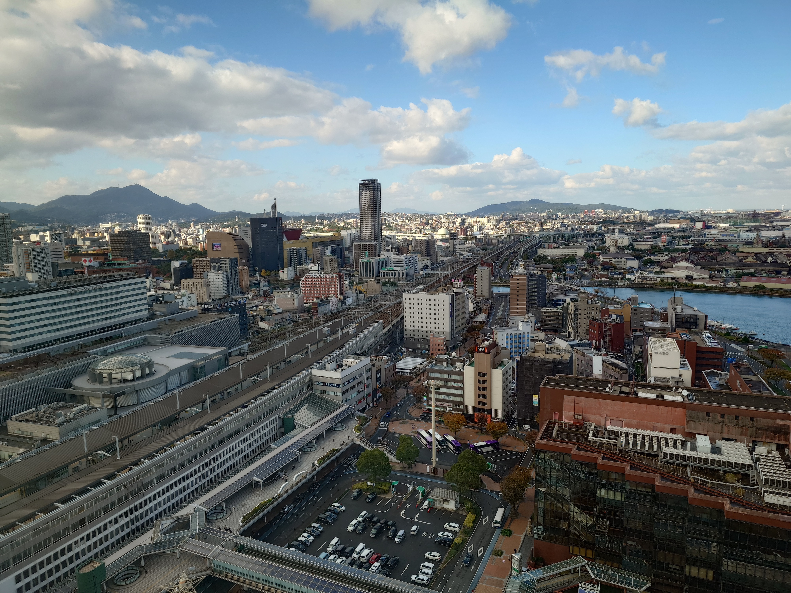
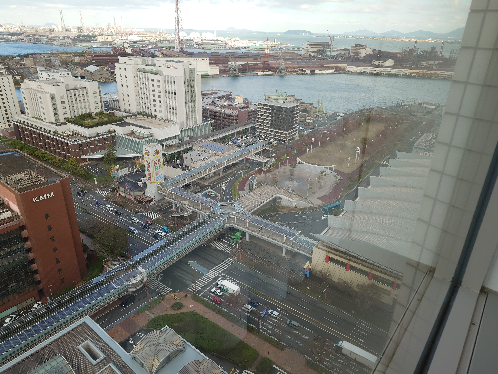
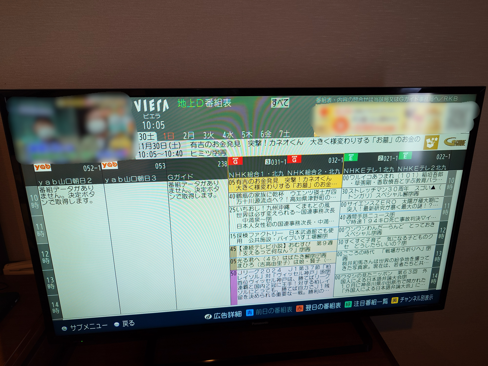
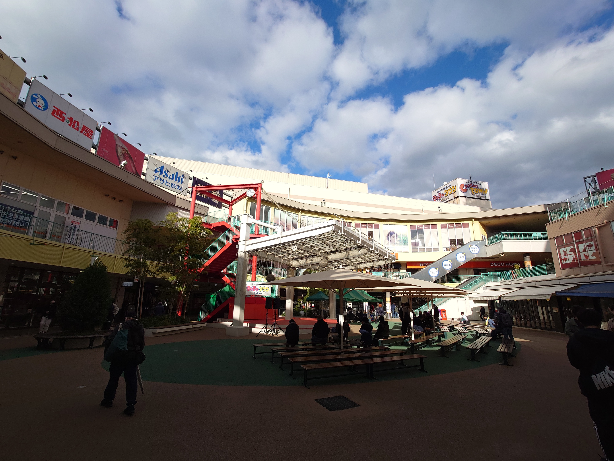
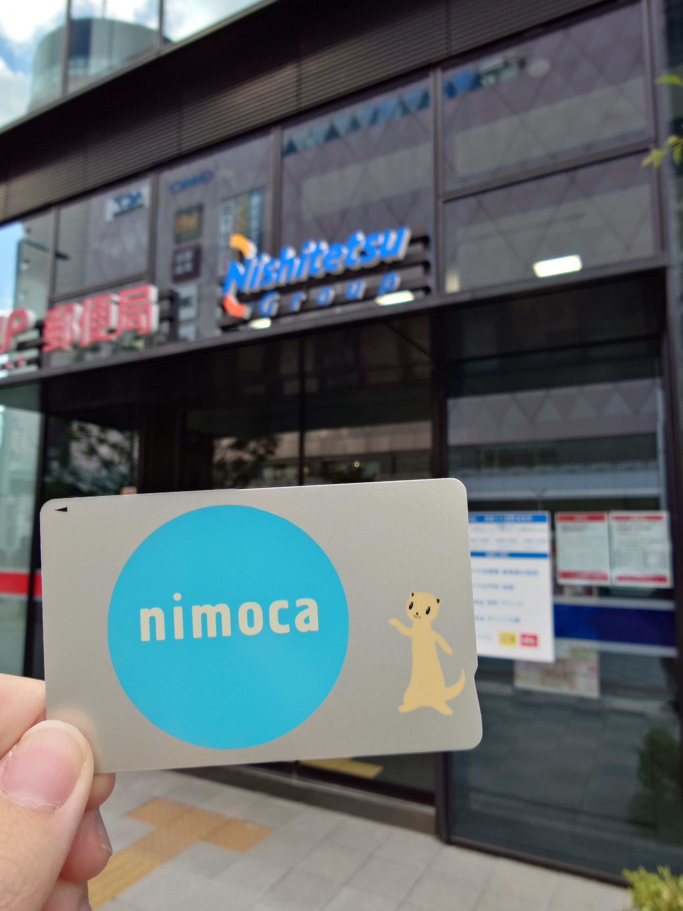
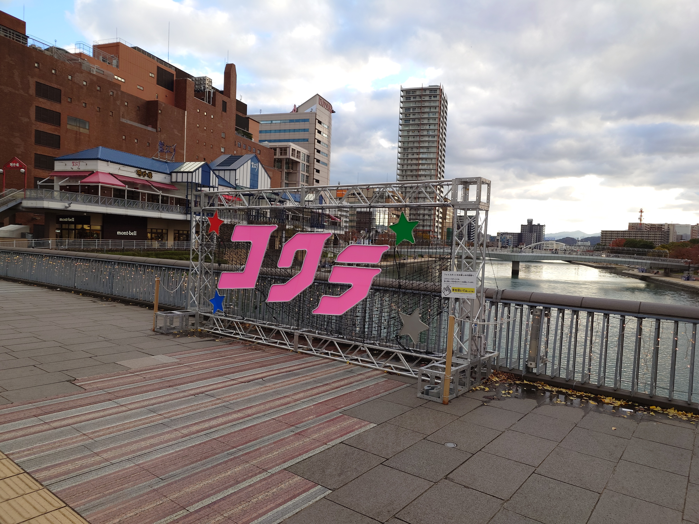
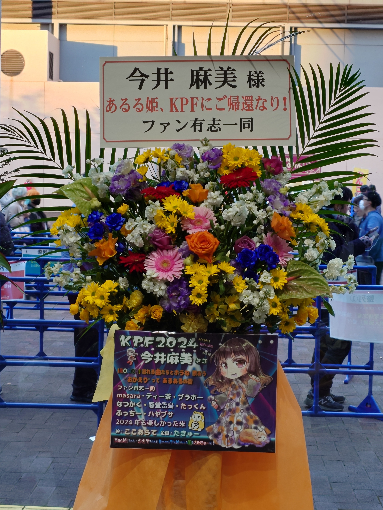
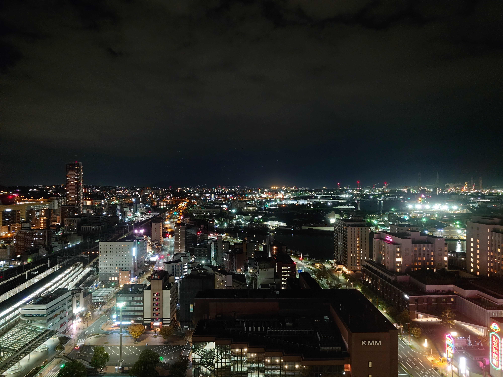

本記事は写真(画像)を大量に含みます。ご注意ください。

## はじめに

2024年11月30日〜12月1日に開催された<strong>北九州ポップカルチャーフェスティバル2024</strong>に参加した旅の記録です。

今回はその2日目の記録です。

[Day1の記事はここ](https://blog.mikuta0407.net/posts/2025/20250115-kpf2024_trip_memory_day1/)  
[Day3の記事はここ](https://blog.mikuta0407.net/posts/2025/20250115-kpf2024_trip_memory_day3/)

## 2日目

この日はKPFの1日目、「KPF2024 LIVE STAGE」のある、この旅のメインイベントと言っても良いステージがある日です。ステージ自体は18:20(それより前にリハーサルがあるけど)なので、それまでの時間は自由に過ごしていました。

### 朝食

まずは朝食です。「福岡といえば」的な明太子を朝からいただいて満足でした。

### 部屋からの景色

朝食をいただいたあと一旦部屋に戻ってきたので、カーテンを開けて外を見てみました。小倉城……自体は見えないですが、その周辺の木々やリバーウォークが見える、とてもいい景色です。

この反対側を見ると、KPFの会場の一つでもある西日本総合展示場新館が見えます。すごい場所にありますねこのホテル。

### 余談: テレビ

NHK Gが031、NHK Eが021で「おぉーー」っなって撮った写真です。

### OPを見に会場へ

オープニングが11:20からあるので、見に行きます。

<blockquote class="twitter-tweet">
改めておはようございます <a href="https://t.co/1GdKCFGITS">pic.twitter.com/1GdKCFGITS</a>
&mdash; たっくん (@mikuta0407) <a href="https://twitter.com/mikuta0407/status/1862682054242308600?ref_src=twsrc%5Etfw">November 30, 2024</a></blockquote> 

<blockquote class="twitter-tweet">
オープニングを見てみる <a href="https://t.co/MmarXnCSzS">pic.twitter.com/MmarXnCSzS</a>
&mdash; たっくん (@mikuta0407) <a href="https://twitter.com/mikuta0407/status/1862682630921363711?ref_src=twsrc%5Etfw">November 30, 2024</a></blockquote> 

入口には協賛したフラスタも設置されていたのですが、周囲に人がいたのと、光の都合でうまく撮れなかったので午後に再チャレンジすることに。

オープニングは立ち見で参加しましたが、メガモッツさんの司会で進むステージが面白く、これは良いイベントだなぁと確信しながら3人娘がKAETTEKITA Vol.3まで見ていました。

### 展示場ウロウロ①

展示場はステージだけでなく展示エリアもありました。とりあえずざっくり周り、どんな物があるかを眺めながら、このあとの動きを考えたりしていました。

なおケータイオタク的にはこんな気付きも。

<blockquote class="twitter-tweet">
展示場内、楽天がauローミング含めて一切入ってなくて凄い
&mdash; たっくん (@mikuta0407) <a href="https://twitter.com/mikuta0407/status/1862713919523233880?ref_src=twsrc%5Etfw">November 30, 2024</a></blockquote> 

この日はD/K/Rの3キャリア系(回線が3つとは言ってない)で行っていたので、一番通っていたD網に感謝しながら通信をしていました。(外は440-11が吹いていました。中が全くだめだった。)

いいちこのブースでは試飲ができたので、気になった西の星ソーダをいただきました。美味しかったです。

<blockquote class="twitter-tweet">
西の星ソーダでした <a href="https://t.co/X8yBfURv7E">pic.twitter.com/X8yBfURv7E</a>
&mdash; たっくん (@mikuta0407) <a href="https://twitter.com/mikuta0407/status/1862725477997453729?ref_src=twsrc%5Etfw">November 30, 2024</a></blockquote> 

### 周辺施設散策

せっかくなので小倉駅周辺を少し散策してみることに。とりあえず駅に戻ると、

<blockquote class="twitter-tweet">
ストリートピアノで旅立ちの日にを弾いてる人がいて卒業式になってる
&mdash; たっくん (@mikuta0407) <a href="https://twitter.com/mikuta0407/status/1862727033438249388?ref_src=twsrc%5Etfw">November 30, 2024</a></blockquote> 

なんで旅立ちの日にを……?

さてどこに行こうか、と考えた結果、とりあえず駅前にあるじゃんぱらに行ってみることに。悲しき習性ですね。

<blockquote class="twitter-tweet">
KYF39が3kで売ってて血迷うところだった
&mdash; たっくん (@mikuta0407) <a href="https://twitter.com/mikuta0407/status/1862728567966375978?ref_src=twsrc%5Etfw">November 30, 2024</a></blockquote> 

KYF42なら欲しかったですがKYF39は今買うにはちょっと古いですし、血迷わなくてよかったです。他にもSB版Xperia 5 Ⅳが5万なのにSIMフリー版Xperia 5 Ⅴが10.3万で売っていて、2024年末に改正が行われる(行われた)「電気通信事業法第27条の3等の運用に関するガイドライン」について考えるなど……。

次に、KAETTEKITAで話がでていたチャチャタウンに行ってみることにしました。

で、まぁBOOK OFFがあるので当然突っ込んでしまうんですが、正直家電系は面白さ虚無でした。びっくりするくらい。ただ、ホビー系コーナーのミニカーコーナーに、異様にディーラーで貰えるミニカーが置いてあったり、アニメ系グッズもそれなりに豊富だったりと、なかなかおもしろい店舗でした。

<blockquote class="twitter-tweet">
家電系は実質虚無だったけどグッズ系はなかなかの規模だった <a href="https://t.co/WHQIws2sJM">pic.twitter.com/WHQIws2sJM</a>
&mdash; たっくん (@mikuta0407) <a href="https://twitter.com/mikuta0407/status/1862734599304225117?ref_src=twsrc%5Etfw">November 30, 2024</a></blockquote> 

### nimoca購入

チャチャタウンから小倉駅に戻ってきたあとは、昨日SUGOCAを買って終わっていたご当地交通系ICカード集めの続きをします。駅前の西鉄バスの営業所に行き、無事無記名nimocaをゲットです。

これでSUGOCA、mono SUGOCA、nimocaが揃いました。6千円かかるんだよなぁこれだけで……(一部チャージされてるとはいえ)。

### 小倉城散策2

ライブまでもうちょっと時間があるのと、1日目の小倉城は曇りで、青空の小倉城をみてみたくなったので小倉城へ再び行くことにしました。

<blockquote class="twitter-tweet">
んー 荷物置いてもう一回小倉城行ってみるか 青空で撮りたい。
&mdash; たっくん (@mikuta0407) <a href="https://twitter.com/mikuta0407/status/1862742564396572940?ref_src=twsrc%5Etfw">November 30, 2024</a></blockquote> 

向かっている間にどんどん曇ってきてしまい、正直思っていたような写真は取れませんでしたが、どうにかギリギリ青空と共に撮影ができました。

<blockquote class="twitter-tweet">
多少の青空で撮影出来たぞ <a href="https://t.co/c6cZmK9dNL">pic.twitter.com/c6cZmK9dNL</a>
&mdash; たっくん (@mikuta0407) <a href="https://twitter.com/mikuta0407/status/1862753280310628848?ref_src=twsrc%5Etfw">November 30, 2024</a></blockquote> 

帰りは歩いて小倉駅まで向かうことに。なんかおもしろいものが置いてありました。

### ライブイベントとフラスタ

小倉城から帰って来るとちょうどいい感じの時間になったので、一旦部屋に戻って荷物整理をしていよいよライブへ出発。まずは会場入口の空間にあるフラスタを撮影です。

<blockquote class="twitter-tweet">
今回の旅のメインイベント
&mdash; たっくん (@mikuta0407) <a href="https://twitter.com/mikuta0407/status/1862781814714339615?ref_src=twsrc%5Etfw">November 30, 2024</a></blockquote> 

イベントは大変楽しかったです。麻美さんのところだけに言及すると、公開リハーサルでは音の調整をその場で見ることができたり、本番はダブルアンコール(?)になったり、楽しいステージでした。

どんなイベントだったかは、 [そうだ！ミンゴスライブ&イベントに行こう！その9](https://lattelattei.booth.pm/items/6030406) に詳しくレポが書かれています。詳細な記憶に感謝。

ちなみに、アリウムが本当に良かったです。あれはすごかった。

<blockquote class="twitter-tweet">
アリウムが驚くほど良かった
&mdash; たっくん (@mikuta0407) <a href="https://twitter.com/mikuta0407/status/1862845836637749610?ref_src=twsrc%5Etfw">November 30, 2024</a></blockquote> 

<blockquote class="twitter-tweet">
とんでもない集中力のWorld-Lineと、感情が乗りすぎてるアリウム、最高だったな…
&mdash; たっくん (@mikuta0407) <a href="https://twitter.com/mikuta0407/status/1862881241294590340?ref_src=twsrc%5Etfw">November 30, 2024</a></blockquote> 

ちなみに、展示場ということもあって、客席としてもなかなか険しめの音響でした。打ち込み系の激しい音などは目を細めて歯を食いしばって耐えるレベルのビリビリ加減で割れてしまったり……。初めてライブ用耳栓の購入を検討したくなりました。会場音響って難しいですね。

### 資さんうどん

終演後はミン族の方々に連れて行っていただき、資さんうどんに行きました。思ったよりごぼう天が重かったですが、美味しいうどんでした。次行くときはおはぎも食べたい。

<blockquote class="twitter-tweet">
人生初の資さんうどんをしていました <a href="https://t.co/QRyOrQpbWG">pic.twitter.com/QRyOrQpbWG</a>
&mdash; たっくん (@mikuta0407) <a href="https://twitter.com/mikuta0407/status/1862881996252578189?ref_src=twsrc%5Etfw">November 30, 2024</a></blockquote> 

### 夜の小倉

資さんうどんからホテルまでは歩きで、途中で小倉城前を通りました。城の前が普通に道路的になっているのは面白いものです。夜のライトアップでも美しかったです。

<blockquote class="twitter-tweet">
これは夜の小倉城 <a href="https://t.co/FXLAEf3km8">pic.twitter.com/FXLAEf3km8</a>
&mdash; たっくん (@mikuta0407) <a href="https://twitter.com/mikuta0407/status/1862882044034048380?ref_src=twsrc%5Etfw">November 30, 2024</a></blockquote> 

その後、ホテルではナイトスクープの再放送をぼーっと眺めたりしながら就寝です。

こんな感じで、2日目は動き回りながら小倉とKPFを楽しみました。

[Day3に続く](https://blog.mikuta0407.net/posts/2025/20250115-kpf2024_trip_memory_day3/)
