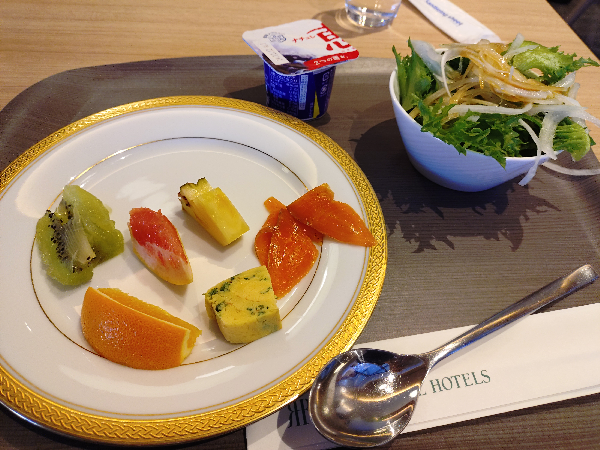
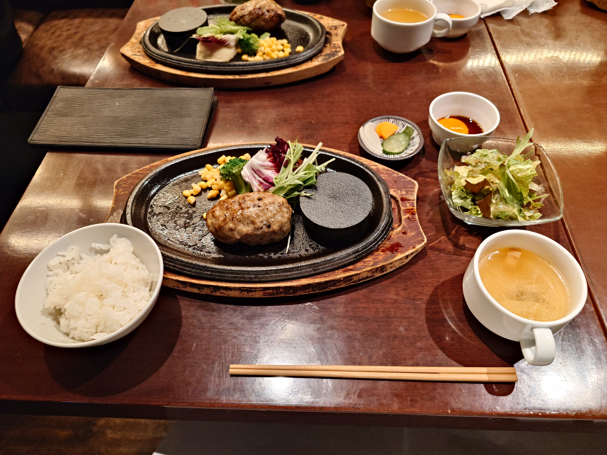

本記事は写真(画像)を大量に含みます。ご注意ください。

## はじめに

2024年11月30日〜12月1日に開催された<strong>北九州ポップカルチャーフェスティバル2024</strong>に参加した旅の記録です。

今回はその3日目の記録です。

[Day1の記事はここ](https://blog.mikuta0407.net/posts/2025/20250115-kpf2024_trip_memory_day1/)  
[Day2の記事はここ](https://blog.mikuta0407.net/posts/2025/20250115-kpf2024_trip_memory_day2/)

## 3日目

いよいよ最終日です。

### 朝食

朝食は、2日目の朝食べることができなかったフルーツ等やサラダを中心に食べました。

### ステージ鑑賞1

この日は、元々チケット(着席エリアの券)の抽選が終わったあとに発表された「[BS11「アニゲー☆イレブン！」 KPF専用ガールズトークスペシャルステージ](https://www.ktqpopfes.jp/2024/event/detail.php?id=434)がありました。抽選を申し込んでいないステージに麻美さんが出る、ということで、最初は立ち見も考えていましたが、幸いなことにTwitter(現X)を掘っていると譲ってくださる方がいらっしゃいました。そしてありがたいことに最右ブロック最前。いい場所で見ることができて感謝です。

ちなみに、朝食→チケット受け取り→部屋に戻り整理→チェックアウトという慌ただしい動きがありました。ちょっと大変だった。

ステージは濃い話が飛び出し、とても楽しかったです。(この記事はレポではないため詳細は省きますが、こちらも[そうだ！ミンゴスライブ&イベントに行こう！その9](https://lattelattei.booth.pm/items/6030406) に詳しくレポが書かれています。あるあるとクイズ、面白かったな。)

### しゃかりきチャレンジ

イベント終了後は知り合いと合流し、しゃかりきチャレンジという、長机の端からコインを弾くチキンレース的なものに挑戦しました。残念ながら止まらず落ちてしまった……。

<blockquote class="twitter-tweet">
まっすぐ行ったが止まらなかった 結構悔しい<a href="https://twitter.com/hashtag/KPF2024?src=hash&amp;ref_src=twsrc%5Etfw">#KPF2024</a> <a href="https://t.co/0rJG6AANzU">pic.twitter.com/0rJG6AANzU</a>
&mdash; たっくん (@mikuta0407) <a href="https://twitter.com/mikuta0407/status/1863063697486491720?ref_src=twsrc%5Etfw">December 1, 2024</a></blockquote> 

### 昼食 at バンケット

以前今井麻美さんが食べたことを報告されていた、「バンケット」というステーキ・ハンバーグのお店にそのまま移動しました。到着時は13時を超えていたのですが、数組待ちの状態で外で待つほど人気のお店でした。

お肉の味はもちろんのこと、ソースも美味しく、また来てみたいお店の一つとなりました。

### ステージ鑑賞2

KPFのステージには、「シークレットステージ」がありました。これを見るため、再び展示場へ戻り見てみることに。

そこに現れたのは田中m……湖稀まぢかさん。圧倒的な歌声と面白さでした。「皺皺に輝け!」、いい歌だったなぁ…

<blockquote class="twitter-tweet">
KPFのシークレットステージ想定の斜め上が来て手叩いて笑ってる
&mdash; たっくん (@mikuta0407) <a href="https://twitter.com/mikuta0407/status/1863110695824593049?ref_src=twsrc%5Etfw">December 1, 2024</a></blockquote> 

<blockquote class="twitter-tweet">
鳥の鳴き声講座ってなんだよｗ
&mdash; たっくん (@mikuta0407) <a href="https://twitter.com/mikuta0407/status/1863111643233931340?ref_src=twsrc%5Etfw">December 1, 2024</a></blockquote> 

### 帰り支度

新幹線の時間も近づいてきたので、知り合いに挨拶しつつ展示場から離脱します。ホテルに戻って荷物を受け取り、駅前の店でお土産をいくつか買って戻ることに。

ちなみにこのとき買ったお土産と同じものが、先日ヴイアライブの灯里愛夏さんが上水流宇宙さんに渡したお土産となっていて吹き出しました。

<blockquote class="twitter-tweet">
愛夏が福岡のお土産くれました〜❤️‍🔥 明太子！！！苺！！！どっちも大好き🫶  美味しくいただきますね〜！<a href="https://twitter.com/hashtag/%E3%83%B4%E3%82%A4%E3%82%A2%E3%83%A9?src=hash&amp;ref_src=twsrc%5Etfw">#ヴイアラ</a> <a href="https://t.co/Z6360qZTtJ">pic.twitter.com/Z6360qZTtJ</a>
&mdash; 上水流宇宙🈁ヴイアラ (@KamizuruCosmo) <a href="https://twitter.com/KamizuruCosmo/status/1876525563319611463?ref_src=twsrc%5Etfw">January 7, 2025</a></blockquote> 

ちなみにお酒は、お土産コーナーで買うと高いという情報をもらっていたので事前に駅の下のスーパーで買っていました。ありがたい。

そして新幹線改札に入場です。

<blockquote class="twitter-tweet">
次回は食べてみたい明太フランス <a href="https://t.co/79muT3qvSP">pic.twitter.com/79muT3qvSP</a>
&mdash; たっくん (@mikuta0407) <a href="https://twitter.com/mikuta0407/status/1863125108363329591?ref_src=twsrc%5Etfw">December 1, 2024</a></blockquote> 

### 帰り道

新幹線に乗ったあとは、とりあえず〆のツイートをします。

<blockquote class="twitter-tweet">
新幹線発車したので4時間半の旅開始です。  初九州、初KPF、ほんとに良かった また来年も来れると良いなぁ。 それでは。 <a href="https://t.co/tJbdRP8X9i">pic.twitter.com/tJbdRP8X9i</a>
&mdash; たっくん (@mikuta0407) <a href="https://twitter.com/mikuta0407/status/1863132514770116868?ref_src=twsrc%5Etfw">December 1, 2024</a></blockquote> 

ですが、山陽新幹線はまったくパケットが通らず、しばらく悪戦苦闘していました。ピクトは立っているのに通らないので、Twitterアプリも謎の挙動を起こすこともあり、端末の再起動等したり…。

<blockquote class="twitter-tweet">
締めツイートしたいのに送信できないので再起動している
&mdash; たっくん (@mikuta0407) <a href="https://twitter.com/mikuta0407/status/1863131520619483424?ref_src=twsrc%5Etfw">December 1, 2024</a></blockquote> 

東海道新幹線がむしろ異常であるという知見を得ることができました。

<blockquote class="twitter-tweet">
こんなにモバイル通信険しいのか山陽新幹線
&mdash; たっくん (@mikuta0407) <a href="https://twitter.com/mikuta0407/status/1863133006573240515?ref_src=twsrc%5Etfw">December 1, 2024</a></blockquote> 

そして**翌週来ることが決定している新山口駅**を通過し、新横浜へと向かいます。

<blockquote class="twitter-tweet">
なぜか来週来る駅 <a href="https://t.co/vVUP7hwVD8">pic.twitter.com/vVUP7hwVD8</a>
&mdash; たっくん (@mikuta0407) <a href="https://twitter.com/mikuta0407/status/1863134118076379607?ref_src=twsrc%5Etfw">December 1, 2024</a></blockquote> 

本当に新大阪までパケットが通らず、自分としたことがオフライン環境をまともに整えていなかったため若干虚無の時間を過ごしていました。

<blockquote class="twitter-tweet">
iPadにKindle入れてなかったのに気づいてかなしい  モバイル通信が思ったより険しいのを知らなかった…(行きは寝てた)(宗教上の理由で公衆無線LANを原則使わない)
&mdash; たっくん (@mikuta0407) <a href="https://twitter.com/mikuta0407/status/1863148595786236007?ref_src=twsrc%5Etfw">December 1, 2024</a></blockquote> 

なお曲は聴けていました。

<blockquote class="twitter-tweet">
Kindleはダウンロード済み少なかったが、今井麻美楽曲を全部キャッシュさせてた過去の自分を褒めている
&mdash; たっくん (@mikuta0407) <a href="https://twitter.com/mikuta0407/status/1863160696671998088?ref_src=twsrc%5Etfw">December 1, 2024</a></blockquote> 

そしてもう一つ知見。

<blockquote class="twitter-tweet">
知見: 起きたまま4時間新幹線に乗ると、流石に尻がきつい
&mdash; たっくん (@mikuta0407) <a href="https://twitter.com/mikuta0407/status/1863181273742880855?ref_src=twsrc%5Etfw">December 1, 2024</a></blockquote> 

新山口駅の帰りはグリーン車にしようと心に決めた瞬間でした。

痛みを我慢しつつ無事に新横浜に到着。

<blockquote class="twitter-tweet">
着いた…… <a href="https://t.co/YL4ioja0cc">pic.twitter.com/YL4ioja0cc</a>
&mdash; たっくん (@mikuta0407) <a href="https://twitter.com/mikuta0407/status/1863195291488600220?ref_src=twsrc%5Etfw">December 1, 2024</a></blockquote> 

面白いことに、JR東日本の空間に入ると「帰ってきた」感じになってなんだか安心しますね。不思議だ。

<blockquote class="twitter-tweet">
ということでただいまJRE <a href="https://t.co/ChZEk3ju8U">pic.twitter.com/ChZEk3ju8U</a>
&mdash; たっくん (@mikuta0407) <a href="https://twitter.com/mikuta0407/status/1863196496826646921?ref_src=twsrc%5Etfw">December 1, 2024</a></blockquote> 

このあとは自宅最寄り駅である町田駅に向かい、自宅に向かいます。ちなみに自宅まで移動中の最後に聴いた曲は、11月17日に行われたえりぽんツアーの帰りのバスで流れて、「旅の最後に聴くのに最高だ」と知った「前向きで行こう♪」でした。

<blockquote class="twitter-tweet">
旅の最後の曲は、 この前のえりぽんツアーの最後に聴いてとても似合っていたこの曲 <a href="https://t.co/h88mPgDcL4">pic.twitter.com/h88mPgDcL4</a>
&mdash; たっくん (@mikuta0407) <a href="https://twitter.com/mikuta0407/status/1863204241810280817?ref_src=twsrc%5Etfw">December 1, 2024</a></blockquote> 

<blockquote class="twitter-tweet">
帰宅！ 初九州初KPF最高でした。  ご飯等ご一緒できた方々もありがとうございました。 また来週もよろしくお願いしますー <a href="https://t.co/Ym7QhJJfsB">pic.twitter.com/Ym7QhJJfsB</a>
&mdash; たっくん (@mikuta0407) <a href="https://twitter.com/mikuta0407/status/1863206972402901186?ref_src=twsrc%5Etfw">December 1, 2024</a></blockquote> 

### 夕飯

夕飯を何にしようか考えましたが、お土産のつもりで小倉駅のスーパーで買った西日本向けどん兵衛を食べました。美味しかったです。

<blockquote class="twitter-tweet">
夕飯取りそこねているので、お土産のつもりで買ったどん兵衛を食べる <a href="https://t.co/EsfKNfnBOt">pic.twitter.com/EsfKNfnBOt</a>
&mdash; たっくん (@mikuta0407) <a href="https://twitter.com/mikuta0407/status/1863209554093527303?ref_src=twsrc%5Etfw">December 1, 2024</a></blockquote> 

<blockquote class="twitter-tweet">
<a href="https://t.co/tAcQWaWqfA">pic.twitter.com/tAcQWaWqfA</a>
&mdash; たっくん (@mikuta0407) <a href="https://twitter.com/mikuta0407/status/1863211679552766121?ref_src=twsrc%5Etfw">December 1, 2024</a></blockquote> 

## 〆

初九州、初小倉、初KPF。素晴らしい旅となりました。また行きたいです。次は小倉城以外も回りたいな。いい旅ができました。色々情報を事前に教えてくださった方々にも感謝ですね。

あと、本当にアリウム良かったんです。あれはすごかったんです。もう一度聴きたい。できないけど。

<blockquote class="twitter-tweet">
アリウムの歌い方もう一回見させてくれになってる。 CD音源や品川やリリイベの歌い方に親しんでる状態での昨日のアリウムは打撃力が高い
&mdash; たっくん (@mikuta0407) <a href="https://twitter.com/mikuta0407/status/1863218950873677951?ref_src=twsrc%5Etfw">December 1, 2024</a></blockquote> 
