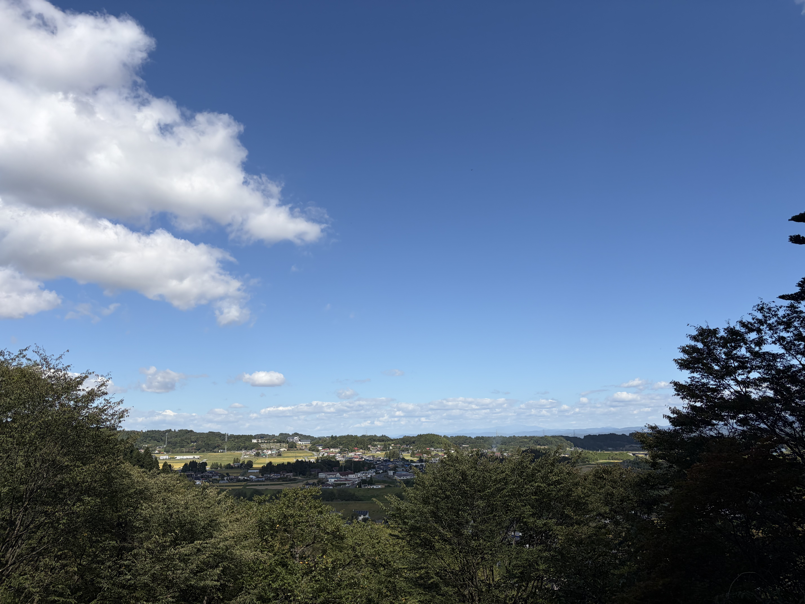
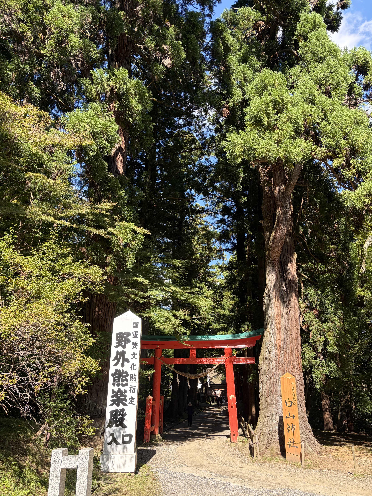
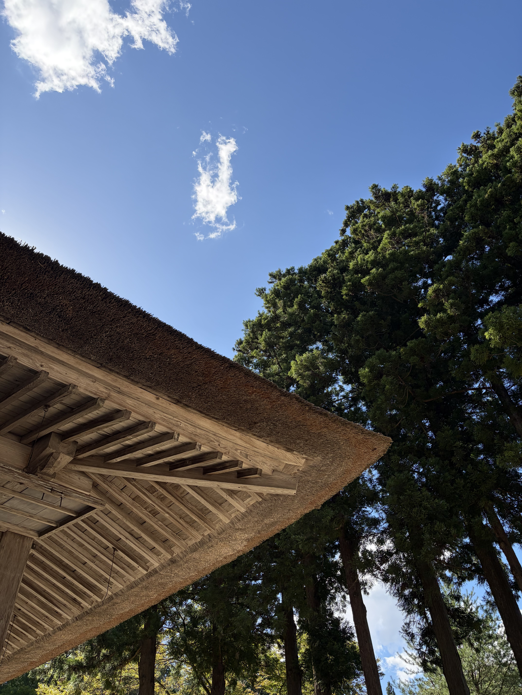
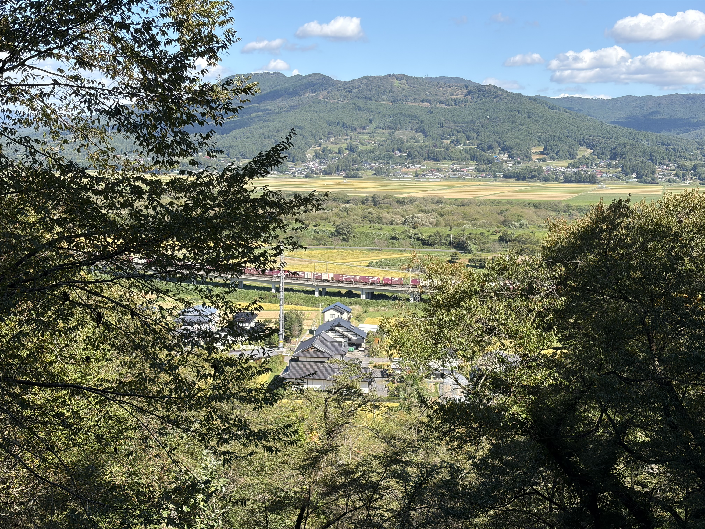
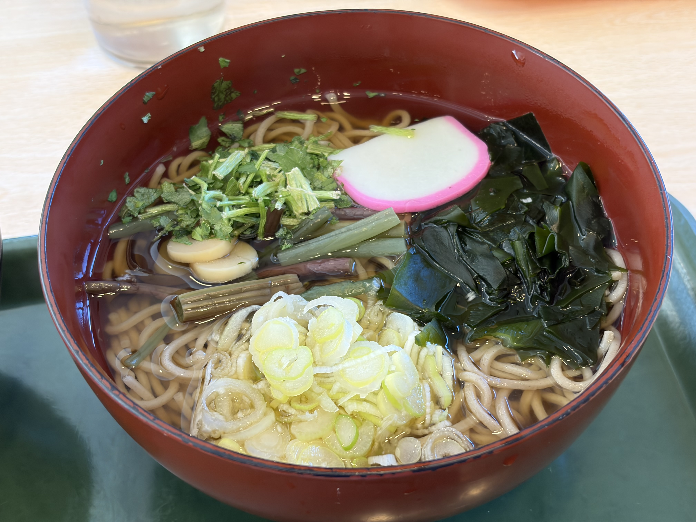
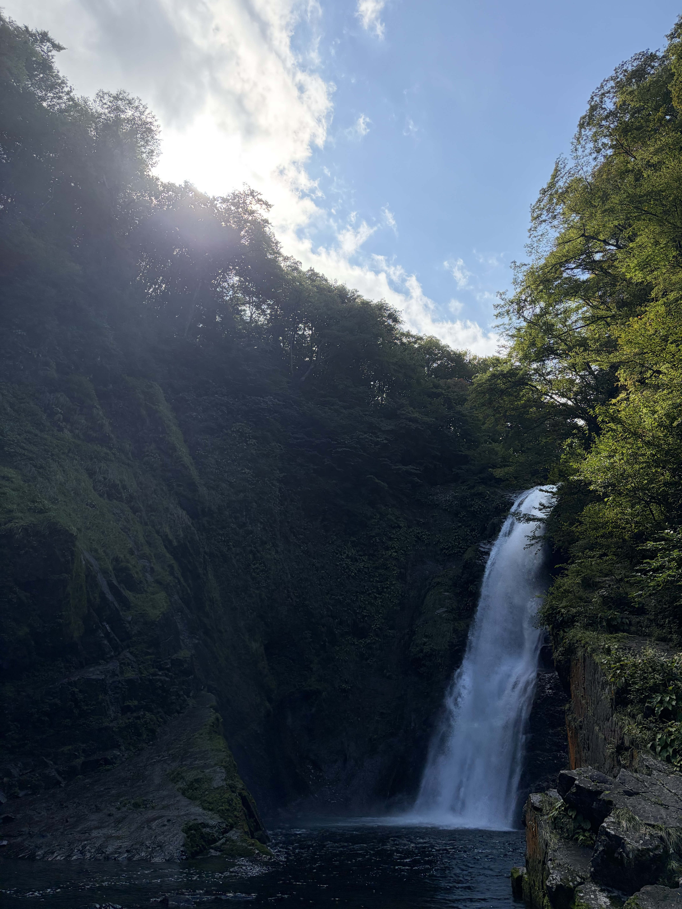
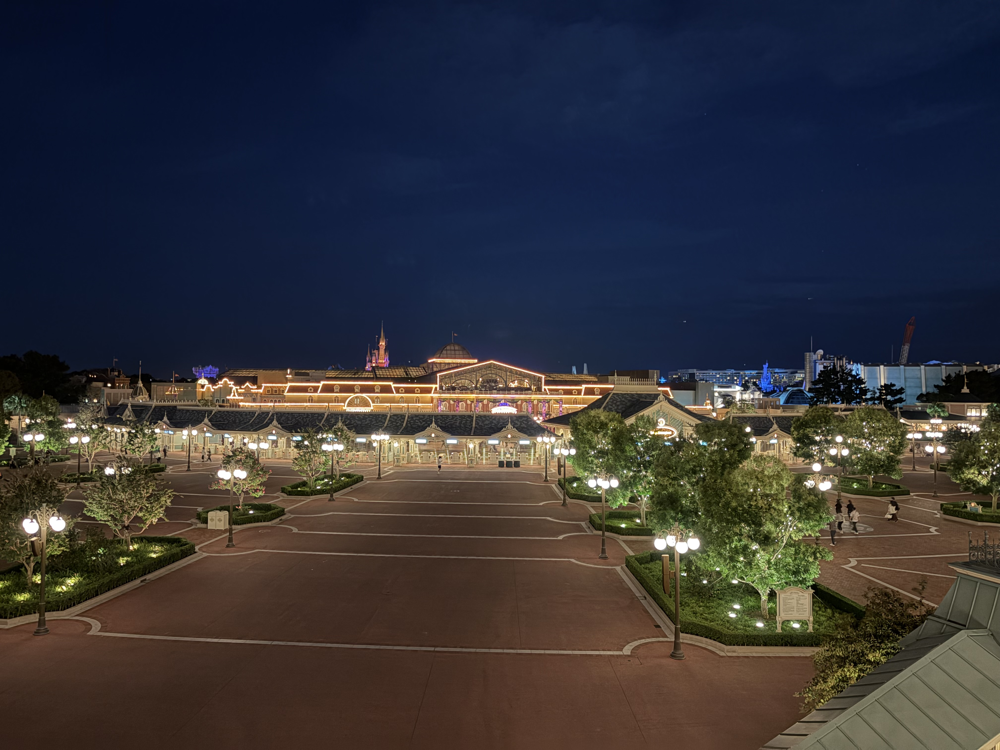

<blockquote class="twitter-tweet">
うおおおおおおおおおおおおおおおおおおおお <a href="https://t.co/vYAXqIiKHR">pic.twitter.com/vYAXqIiKHR</a>
&mdash; たっくん (@mikuta0407) <a href="https://twitter.com/mikuta0407/status/1968816849459499047?ref_src=twsrc%5Etfw">September 18, 2025</a></blockquote> 

<blockquote class="twitter-tweet">
iPhone Airですよ！iPhone Air！！！！！ <a href="https://t.co/PGzJz4B75A">pic.twitter.com/PGzJz4B75A</a>
&mdash; たっくん (@mikuta0407) <a href="https://twitter.com/mikuta0407/status/1968817250262994974?ref_src=twsrc%5Etfw">September 18, 2025</a></blockquote> 

ということで、iPhone Airを買いました。

## iPhone Airを買った理由

### 久しぶりにワクワクしたiPhone

単純に言えばメイン機の更改です。

もともと、普段のスマホの構成は以下でした。

- iPhone 13 mini
  - メイン機
  - メイン回線のSIMの挿入先
  - Apple Watchペアリング先
  - 銀行系アプリの認証、メインのPASMO等
- Xperia 5 Ⅴ
  - カメラ機
  - 8Gen2で遊ぶ機
- Xperia 10 Ⅵ
  - バッテリー優先機
  - セカンダリ電話番号機

このうち、結局iOSがメインになっている状況での13miniは発売から4年経過しており(購入からは3年半)、流石にもう変えて良いのではないかと。iOS26 betaで遊んでいても、(バッテリーを純正交換した上で)無視できない発熱がありました。まだ元気に動きますし、速度も気になりませんが、まぁ、そろそろ一線を退いてもらってもいいかなと。

13miniのサイズは後継が存在せず、Xperia10もⅦで70mmを超えた今、もう70mm未満のちゃんとしたスマホは絶望的です。いい加減諦めなければなりません。とはいえ、諸事情でiPhone 12無印を別件で持ち歩き、しばらく使ったことがある身としては、「あのサイズと重さは辛い」という確定した感想もあります。

さてどうするか。

ここで登場したのがiPhone Airでした。

正直大きいです。大きいのはわかっています。でも、久しぶりにiPhoneにワクワクを感じました。Dynamic Islandという進化や、細かいブラッシュアップはあれど、iPhone Xの衝撃から9年。順当な進化をし続けたiPhoneに、ようやく未来的なワクワクを感じることができました。

まぁ、Galaxyを含めて薄型スマホは他社も力を入れ始めてるので、別にAppleだけがやっている未来ではないのですが、メインをiOSにしている以上はiPhoneの進化は嬉しいわけです。

これは買うぞ、という気持ちになりながらApple Eventを見ていました。

### でも懸念点もあった

カメラバンプ部分にすべてが詰め込まれたAirは、ネットニュースでも書かれているようにいくつか懸念点がありました。

- カメラが単眼
- モノラルスピーカー
- 詰め込みすぎによる発熱
- バッテリー
- DP Alt非対応

ただ、これらは割と楽観的に見ていました。なぜなら、

- カメラが単眼
  - Xperia 5 Ⅴを常に持ち歩いているので、超広角が欲しければそちらがある
- モノラルスピーカー
  - 普段イヤホンしか使わない。
  - 家で使うにしても音が聞こえれば良い
  - 車はFMトランスミッター+Xperia
- 詰め込みすぎによる発熱
  - どうしようもなかったら返品すれば良い
- バッテリー
  - 複数台あるので気にならない
  - そもそも13miniよりはるかに持つ
- DP Alt非対応
  - 有線で画面出力をしたいタイミングがない

といった感じで回避策があるからです。

13miniからの移行として画面サイズと言う問題はありましたが、大学生時代に6sPlusをメインにしてみていた時期があり、あれよりは小さいと気づいたので受け入れられるかもしれません。そして僕は「大きい端末は使わなくなる」という傾向があるのですが、今回は160g台と、Xperia10Ⅵとほぼ同等の重さです。もしかしたら小型に縛られていた僕でも行けるかもしれない。そんな淡い期待を込めて、突っ込むことにしました。

## 余談① eSIM

eSIMのみというのは正直ちょっと微妙な気持ちもあります。

これまで、コミケや旅行のような、長時間外に出るときには、メインのSIMをバッテリーが長時間持つXperia 10 Ⅵに差し替えたり、2025年夏で外にいるときはTORQUE 5Gに入れ替えたりといったことをしており、それが気軽にできなくなるのは運用上の大きな懸念です。

今この記事を書いているときも、実はメインのSIMはまだiPhone 13 miniに入っています(代わりにIIJmioのタイプAのeSIMを入れています)。eSIMに移行できていません。いくら再発行できるといっても、いくら別のSIMで通信ができると言っても、メインの電話番号をeSIMにするのはいざというときの怖さがあります。どうしましょうね。解決策はまだ見えていません。どうしよう。

## 予約

9/12 21:00。決戦のとき。事前に構成を保存させていたので、後はポチるだけです。

PCとiPhone両方を用意し、戦いました。

結論から言えばiPhoneのApple Storeアプリから行ったらすんなり買えました。

構成は、スカイブルー + 1TBです。

これまで13miniは512GBで、そんなに使い切っていないのですが、これからどんな使い方をするかわからないことや、Macでも2TBではなく1TBを選んだのを後悔していることを考え、最大容量に行きました。

お値段229,800円。ぐえぇ。

そこに純正ケースもつけちゃってますし、Apple Event見終わったら手が滑り倒してAirPods Pro3も買ってます。たすけてください。

## 受取

予約がうまく行ったので、08:15という早い時間に受け取ることができました。これは嬉しい。

<blockquote class="twitter-tweet">
うおおおおおおおおおおおおおおおおおおおお <a href="https://t.co/vYAXqIiKHR">pic.twitter.com/vYAXqIiKHR</a>
&mdash; たっくん (@mikuta0407) <a href="https://twitter.com/mikuta0407/status/1968816849459499047?ref_src=twsrc%5Etfw">September 18, 2025</a></blockquote> 

本体の箱がとても薄いのも印象的です。

<blockquote class="twitter-tweet">
iPhone Airの箱、ケースかと思うくらい薄い (一番右側がiPhone Air) <a href="https://t.co/MCCVvBZFkB">pic.twitter.com/MCCVvBZFkB</a>
&mdash; たっくん (@mikuta0407) <a href="https://twitter.com/mikuta0407/status/1968817822223544734?ref_src=twsrc%5Etfw">September 18, 2025</a></blockquote> 

## 開封

とにかく薄い。軽い。すごい。

<blockquote class="twitter-tweet">
iPhone6の時の衝撃くらいの薄さですよこれ <a href="https://t.co/l0hDaBmfL2">pic.twitter.com/l0hDaBmfL2</a>
&mdash; たっくん (@mikuta0407) <a href="https://twitter.com/mikuta0407/status/1968827787508109550?ref_src=twsrc%5Etfw">September 19, 2025</a></blockquote> 

思っていた通り、本当にワクワクする筐体に出会えました。

## 使い始めてから数日の感想

### 筐体

さすがに大きいです。13miniからの移行だからそれはそう。

でも、薄いんです。軽いんです。これはすばらしい。片手で使えないので、吊り革につかまっているときの電車の中や布団の中では悩ましいですが、割と受け入れられています。軽さって正義なんだなぁ。

なお、布団の中では13miniや、もともと宅内機になっているSE2を使ったりしています。あれ?

### 画面

綺麗です。13miniでも不満はありませんでしたし、Xperia 5 Ⅴで120Hzモニタを経験していましたが、やはりProMotionは嬉しいところです。

Xperiaだと常時120Hzなのでどうしてもバッテリーが気になりますが、ProMotionは可変なのであまりバッテリーを考えなくて良いのが嬉しいところです。

輝度も高く、外でも綺麗で見やすいのは思ったよりも良かったです。

### 不満点

iPhone Airを見に来る人に見せるときや、充電するときに気になるのは側面が光沢加工なことです。

指紋が目立つので、ケースに入れるときにしっかりと拭き取ってから入れたくなりますが、これがまた面倒。

そして充電するときは端子の周囲に傷がつかないように挿したいので神経を使います。これは光沢である必要はなかったんじゃないかなぁ。

## 一週間使った感想

購入から一週間後の金曜日まで、日常使いした感想です。

### カメラ

メインカメラに関しては言うことありません。iPhoneのカメラとして普通です。ちゃんとしてる。

思ったより超広角がないの不便かもしれないなとはなりました。普通に使いすぎて無自覚に近かったのですが、メモ的に撮影するときも、あまり後ろに下がれない状況で画角を確保するときに使っていたようです。まぁでもそれは仕方ない。

カメラコントロールに関しては初でしたが、うーーん、最初は面白いと思うものの、全く使わないですね。

半押しできるので、それこそXperiaのような半押しでのAFロックをしたいのですが、AFロックに割り当てたとしてもなんか違うんです。うーん。うーーーん。

フロントカメラの画角は面白いです。縦向きでも横向きが取れる(?)のは結構便利かも? ほぼ自撮りをしないのですがね…。

### スピーカー

スピーカーがモノラルなことですが、まぁ気になりません。普段使わないので。使うにしてもそれなりに鳴れば良いレベルですし。あとiPad miniあるし。

### 発熱

結構重要なポイントですが、全然気になりませんでした。

初期設定後にアプリを一気にインストールしていると確かにバンプ部分が熱くなります。でも持つ部分(バッテリーの部分)は熱くならないので、特に気にならないんです。

そしてゲーム(ミリシタ程度ですが)をするにしても、あんまり発熱しません。A19 Proが強い。

iPhone Airの発熱に関しては何も問題に思う必要はなさそうです。

### バッテリー

13miniが弱いので、1日充電せずに持ってる段階で何も言うことはありません。

ただ、後述しますがこの薄さならAnkerの薄型のMagSafe向けバッテリーは持っていても良いかもしれないです。しんどさがない。

### 通信系

C1XやN1がどんなものかと思っていましたが、特になにもないです。本当になにもないです。

### アクションボタン

これはAirに限った話ではないですが、初めてサイレントスイッチではなくアクションボタンが搭載された機種を使ったので、というところです。

……Vol+と間違えて押すんですよね。慣れの問題だといいのですが、どうやっても間違えて押すことがある。どうしようかなぁ。

## 旅行に持っていってみた

いつか旅の記録ブログとして書きたいと思っていますが、宮城・岩手に1泊2日の旅行に行ってきました。

そこでの使った感想です。

### バッテリー

流石に通勤時間+αみたいな使い方しかしない日常と違って、新幹線や車での移動中にも使ったり、カメラのために頻繁に使う、となると流石にバッテリーが怪しくなります。これはXperia 10 Ⅵには勝てません。

とはいえApple純正のMagSafeバッテリーはお高い。そして普通のモバイルバッテリーにケーブルつけるのも邪魔。

ということで、 [Anker Nano Power Bank (5000mAh, MagGo, Slim)](https://www.ankerjapan.com/products/a1665) を買ってみました。iPhone Air向けに作ったんじゃないかと言われているこの商品。日本では黒しか買えないようで残念です。

当然くっつけてつかうと重くはなりますが、"充電中である"という前提であれば許容できる重さ・厚さになります。

朝満充電で出発し、午後に30%切ったくらいからこれで80%くらいまで復活させ、あとは寝ている間にケーブルで充電。とても楽でした。

### 画面

輝度が高いのがかなり良く、天気のいい外でも撮影しやすかったり、連絡取るときの視認性が良かったのは想定外に良かったです。

### カメラ 作例

「Xperia 5 Ⅴを持っていれば良い!」と言っていたのに肝心のXperia 5 Ⅴを忘れたので、結果としてほぼiPhone Airで戦いました。(一部超広角したいときは13miniを利用してた)

作例としてはこんな感じです。現代の標準的なスマホカメラとしては申し分ないです。

この旅行とは別ですが、購入直後の週末にTDRに寄った(インパはしてない)ので、そこで撮った夜景も置いておきます。肉眼で見るよりは青っぽくなってる印象です。このあたりはXperiaのほうが強いかも?

## まとめ

でかいスマホ、心配でしたが、軽くて薄いおかげで使えています。

久しぶりにワクワクしたiPhone、買って正解でした。
